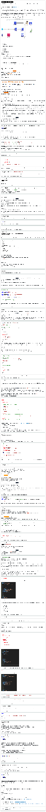

# Lab 6: Serverless CI/CD on AWS | Self-Paced Labs

Created: 2023-10-08 04:52:03 -0600

Modified: 2023-10-08 10:58:39 -0600

---

Clipped from: <https://labs.skillbuilder.aws/sa/lab/arn%3Aaws%3Alearningcontent%3Aus-east-1%3A470679935125%3Ablueprintversion%2FILT-TF-200-SVDVSS-1%2Flab-6-CICD%3A1.3.6-7453ffde/en-US>

© 2023 Amazon Web Services, Inc. or its affiliates. All rights reserved. This work may not be reproduced or redistributed, in whole or in part, without prior written permission from Amazon Web Services, Inc. Commercial copying, lending, or selling is prohibited. All trademarks are the property of their owners.

Note: Do not include any personal, identifying, or confidential information into the lab environment. Information entered may be visible to others.

Corrections, feedback, or other questions? Contact us at *[AWS Training and Certification](https://support.aws.amazon.com/#/contacts/aws-training).*

## Overview

Now you have a fully functional serverless application that allows users to sign in, save bookmarks for their own use, and submit bookmarks to be shared in the team knowledge base. Several tasks happen in parallel when a new bookmark is submitted for the knowledge base: The submitter's entry is entered into a contest, notifications are sent, and an automated publishing workflow is initiated. You have also incorporated logging and tracing, which will give you operational visibility into the production application. Finally, you incorporated security at all layers to protect your application.

As you have learned, a key part of developing serverless applications is to use your visibility into how the application is used in production to determine where to make future modifications. You should continue to monitor the production application to understand access patterns, resolve operational errors, and iteratively optimize your application to minimize costs and continually improve the user experience. Because your application uses small decoupled components, you can more easily modify components independently.

To support these types of small, frequent updates, you would like to automate the build and deployment processes so that the development team continues to focus on developing the application. In this lab, you learn how to set up a continuous integration and continuous delivery (CI/CD) pipeline and do canary deployments on AWS.

The following diagram shows the architecture components that have been or will be deployed in this lab.

{width="13.083333333333334in" height="8.739583333333334in"}

This lab uses the following services:

- AWS Serverless Application Model (AWS SAM)
- AWS Cloud9
- Amazon DynamoDB
- Amazon EventBridge
- Amazon Simple Notification Service (Amazon SNS)
- AWS Step Functions
- AWS CodeCommit
- AWS CodePipeline
- AWS CodeBuild
- AWS CodeDeploy
- AWS Cloud Development Kit (AWS CDK)

**Objectives**

After completing this lab, you will be able to:

- Create a CodeCommit repository and a CI/CD pipeline
- Use AWS SAM to define the resources that your application needs and the AWS CDK to define the resources for the deployment infrastructure
- Implement canary deployments using AWS SAM
- Monitor your canary deployment with CodeDeploy

**Prerequisites**

This lab requires:

- Access to a notebook computer with Wi-Fi and Microsoft Windows, macOS, or Linux (Ubuntu, SUSE, or Red Hat)
- For Microsoft Windows users, administrator access to the computer
- An internet browser such as Chrome, Firefox, or Internet Explorer 9 (previous versions of Internet Explorer are not supported)
- A text editor

**Note** The lab environment is not accessible using an iPad or tablet device, but you can use these devices to access the lab guide.

**Duration**

This lab requires approximately **90 minutes** to complete.

## Start lab

1.  To launch the lab, at the top of the page, choose Start lab.

You must wait for the provisioned AWS services to be ready before you can continue.

1.  To open the lab, choose Open Console.

You are automatically signed in to the AWS Management Console in a new web browser tab.

**Do not change the Region unless instructed.**

### Common sign-in errors

#### *Error: You must first sign out*

{width="13.083333333333334in" height="2.8333333333333335in"}

If you see the message, **You must first log out before logging into a different AWS account:**

- Choose the **click here** link.
- Close your **Amazon Web Services Sign In** web browser tab and return to your initial lab page.
- Choose Open Console again.

#### *Error: Choosing Start Lab has no effect*

In some cases, certain pop-up or script blocker web browser extensions might prevent the **Start Lab** button from working as intended. If you experience an issue starting the lab:

- Add the lab domain name to your pop-up or script blocker's allow list or turn it off.
- Refresh the page and try again.

## Task 1: Understanding key services and setting up the project

In this task, you look at the different services that you use in this lab. You then download the application code using the AWS Cloud9 integrated development environment (IDE), unzip the bookmark application, and inspect the source code in the AWS Cloud9 IDE.

- **AWS CodeCommit** is a fully managed source control service that hosts secure Git-based repositories. The service makes it easy for teams to collaborate on code in a secure and highly scalable ecosystem. CodeCommit eliminates the need to operate your own source control system or worry about scaling its infrastructure. You can use CodeCommit to securely store anything from source code to binaries, and the service works seamlessly with your existing Git tools.
- **AWS CodePipeline** is a fully managed continuous delivery service that helps you automate your release pipelines for fast and reliable application and infrastructure updates. CodePipeline automates the build, test, and deploy phases of your release process every time there is a code change based on the release model that you define. This enables you to rapidly and reliably deliver features and updates. You can easily integrate CodePipeline with third-party services such as GitHub or with your own custom plugin. With CodePipeline, you pay for only what you use. There are no upfront fees or long-term commitments.
- **AWS CodeBuild** is a fully managed continuous integration service that compiles source code, runs tests, and produces software packages that are ready to deploy. With CodeBuild, you don't need to provision, manage, or scale your own build servers. CodeBuild scales continuously and processes multiple builds concurrently, so your builds are not left waiting in a queue. You can get started quickly by using prepackaged build environments, or you can create custom build environments that use your own build tools. With CodeBuild, you are charged by the minute for the compute resources that you use.
- **AWS CodeDeploy** is a fully managed deployment service that automates software deployments to a variety of compute services such as Amazon Elastic Compute Cloud (Amazon EC2), AWS Fargate, AWS Lambda, and your on-premises servers. CodeDeploy makes it easier for you to rapidly release new features, helps you avoid downtime during application deployment, and handles the complexity of updating your applications. You can use CodeDeploy to automate software deployments, which eliminates the need for error-prone manual operations. The service scales to match your deployment needs.

### Set up the application using AWS Cloud9

1.  At the top of the AWS Management Console, to the right of the Services menu, in the search bar, search for

Cloud9

and then choose that service from the list.

2.  Next to the **BookmarkAppDevEnv** environment listing, choose **Open** .

Within a few seconds, the AWS Cloud9 environment launches.

**Note** If the browser is running in an incognito session, a pop-up window with an error message will be displayed when the Cloud9 instance is opened. Choose the **OK** button to continue. Browser in a non incognito mode is recommended.

1.  In the AWS Cloud9 terminal, run the following commands to download the application code, unzip the contents, and add more space:

wget <https://us-west-2-tcprod.s3-us-west-2.amazonaws.com/courses/ILT-TF-200-SVDVSS/v1.3.6.prod-35d9cd4e/lab-6-CICD/scripts/app-code.zip>
unzip app-code.zip
cd app-code
chmod +x resize.sh
bash resize.sh 20

### Inspect the source code in AWS Cloud9

1.  In the left navigation pane of the AWS Cloud9 terminal, choose the arrow next to the **app-code** folder to expand it.
2.  In the **app-code** folder, choose the arrow next to the **backend** folder to expand it.

Inspect the Lambda functions and the AWS SAM template that has been created.

1.  In the **backend** folder, open the **template.yaml** file.

In the **Parameters** section toward the end of the file, the parameters *LAMBDA_ROLE_ARN* and *STEP_FUNCTIONS_ROLE_ARN* should be replaced with the actual values.

1.  In the AWS Cloud9 terminal, run the following commands to replace the values:

cd backend
export LAMBDA_ROLE_ARN=$(aws iam list-roles --query "Roles[?contains(RoleName, 'LambdaDeployment')].Arn" --output text)
sed -Ei "s|<LAMBDA_ROLE_ARN>|${LAMBDA_ROLE_ARN}|g" template.yaml
export STEP_FUNCTIONS_ROLE_ARN=$(aws iam list-roles --query "Roles[?contains(RoleName, 'StateMachine')].Arn" --output text)
sed -Ei "s|<STEP_FUNCTIONS_ROLE_ARN>|${STEP_FUNCTIONS_ROLE_ARN}|g" template.yaml
cd ..

**Note** The **template.yaml** file also contains **${AWS::AccountId}**. Do not replace this value with the **AWS Account** information. The **LambdaDeploymentRole** is used when the AWS SAM template is automatically deployed through the CI/CD process.

## Task 2: Checking the application source code in to the CodeCommit repo

In this task, you create a repository (repo) and check in the source code. You could use any source repo (for example, GitHub), but for this lab, use CodeCommit.

1.  In the AWS Cloud9 terminal, run the following command to create a new CodeCommit repository:

aws codecommit create-repository --repository-name app-code

The terminal displays the following output:

{
"repositoryMetadata": {
"accountId": "${AccountId}",
"repositoryId": "xxxxxxx",
"repositoryName": "app-code",
"lastModifiedDate": 1603210225.175,
"creationDate": 1603210225.175,
"cloneUrlHttp": " <https://git-codecommit.us-west-2.amazonaws.com/v1/repos/app-code>",
"cloneUrlSsh": "ssh://git-codecommit.us-west-2.amazonaws.com/v1/repos/app-code",
"Arn": "arn:aws:codecommit:us-west-2:${AccountId}:app-code"
}
}

CodeCommit supports AWS Identity and Access Management (IAM) authentication, and because you are running this from an AWS Cloud9 workspace, you can leverage the fact that your terminal is already pre-authenticated with valid AWS credentials.

1.  In the AWS Cloud9 terminal, run the following commands:

git config --global credential.helper '!aws codecommit credential-helper $@'
git config --global credential.UseHttpPath true

**Note** These commands specify the use of the Git credential helper with the AWS credential profile and enable the Git credential helper to send the path to repositories. The credential helper uses the default AWS credential profile or the Amazon EC2 instance role.

1.  In the AWS Cloud9 terminal, run the following commands to do an initial commit of the code:

cd ~/environment/app-code
git init
git checkout -b main
git add .
git commit -m "Initial commit"

### Push the code

1.  In the AWS Cloud9 terminal, run the following commands to fetch the *AWS_REGION* and substitute it in the git command.

sudo yum -y install jq
echo export AWS_REGION=$(curl -s 169.254.169.254/latest/dynamic/instance-identity/document | jq -r '.region') >> ~/environment/app-code/labVariables
source ~/environment/app-code/labVariables
git remote add origin

**Note** This code adds your CodeCommit repository URL as a remote on your local git project.

1.  To push the code to CodeCommit, run the following command:

git push -u origin main

### Verify in CodeCommit

1.  At the top of the AWS Management Console, to the right of the Services menu, in the search bar, search for

CodeCommit

and then choose that service from the list.

2.  In the CodeCommit console, under **Repositories**, choose the **app-code** repository to view its contents.

## Task 3: Building the CI/CD pipeline

In this task, you learn how to automate the bookmark application build process and deployment by creating a pipeline using CodePipeline.

### Introducing the AWS CDK

You use the AWS CDK as the pipeline vending mechanism in this lab. The AWS CDK is a software development framework for defining cloud infrastructure in code and provisioning it through AWS CloudFormation.

You can describe your infrastructure by writing code in TypeScript, C#, Python, or Java. Your code is then synthesized into CloudFormation templates and, by using the AWS CDK CLI, can then be deployed into your AWS environment.

### Understand how AWS SAM and the AWS CDK work together

Serverless developers use the AWS SAM framework to define their applications, the AWS SAM CLI to build and deploy them, and the AWS CDK to provision any infrastructure-related resources, such as the CI/CD pipeline. All of these tools share one underlying service: CloudFormation.

1.  In the AWS Cloud9 terminal, run the following commands to uninstall any older versions of the AWS CDK and install the latest version:

npm uninstall -g aws-cdk
npm install -g aws-cdk@latest --force

1.  Run the following commands to create a folder outside of the **app-code** directory where the **pipeline** code will reside:

cd ~/environment
mkdir pipeline
cd pipeline

1.  Run the following command to initialize a new AWS CDK project within the **pipeline** folder:

npx <aws-cdk@1.x> init app --language typescript

Press **enter** to answer any prompts about whether to continue.

1.  Run the following commands to install the AWS CDK modules that are used to build the pipeline:

git checkout -b main
npm install --save @aws-cdk/aws-codedeploy @aws-cdk/aws-codebuild
npm install --save @aws-cdk/aws-codecommit @aws-cdk/aws-codepipeline-actions
npm install --save @aws-cdk/aws-s3

### Project structure

After a few seconds, the project should have the following structure, which shows only the most relevant files and folders. Within the AWS CDK project, the main file that you interact with is **pipeline-stack.ts**.

app-code # SAM application root
├── backend
├── src # Lambda functions
└──template.yaml # SAM template
└── test
├── fake-bookmark.js # Lambda code
├── simple-get.yaml
├── simple-post.yaml
pipeline # CDK project root
└── bin
└── pipeline.ts # Entry point for CDK project
└── lib
└── pipeline-stack.ts # Pipeline definition
├── cdk.json
├── jest.config.js
├── package.json
└── tsconfig.json

1.  In the AWS Cloud9 IDE, choose the arrow next to the **pipeline** folder to open it, and then choose the arrow next to the **bin** folder to open it.
2.  In the **bin** folder, open the **pipeline.ts** file.

This file is the entry point to the AWS CDK project.

1.  In the **pipeline.ts** file, find the code on line 7 that reads **(app, 'PipelineStack');** and replace *PipelineStack* with the following:

bookmark-app-cicd

**Note** Leave other instances of *PipelineStack* as is in the **pipeline.ts** file.

1.  Choose **File > Save** to save your changes to the **pipeline.ts** file.

### Pipeline as code

1.  In your AWS Cloud9 workspace, under the **pipeline** folder, choose the arrow next to the **lib** folder to open it.
2.  In the **lib** folder, open the **pipeline-stack.ts** file.

**Note** You will add code to this file later to build the CI/CD pipeline.

1.  In the AWS Cloud9 terminal, run the following commands to build the AWS CDK project:

cd ~/environment/pipeline
npm run build

1.  Run the following command to deploy the pipeline project by using the AWS CDK CLI:

cdk deploy

A new cloud stack has been created in your account: **bookmark-app-cicd**.

1.  At the top of the AWS Management Console, to the right of the Services menu, in the search bar, search for

CloudFormation

and then choose that service from the list.

2.  Verify that the new **bookmark-app-cicd** cloud stack is deployed without any errors.

## Task 4: Creating stages

In this task, you build the artifacts bucket and add the source stage, build stage, and deploy stage to your pipeline.

### Artifacts bucket

Each CodePipeline needs an artifacts bucket, also known as an artifact store. CodePipeline uses this bucket to pass artifacts to the downstream jobs, and it's also where AWS SAM uploads the artifacts during the build process.

1.  In the AWS Cloud9 workspace, find the **pipeline-stack.ts** file that you opened earlier, and replace the entire code snippet in the file with the following code:

// lib/pipeline-stack.ts

import * as cdk from '@aws-cdk/core';
import s3 = require('@aws-cdk/aws-s3');
import codecommit = require('@aws-cdk/aws-codecommit');
import codepipeline = require('@aws-cdk/aws-codepipeline');
import codepipeline_actions = require('@aws-cdk/aws-codepipeline-actions');
import codebuild = require('@aws-cdk/aws-codebuild');

export class PipelineStack extends cdk.Stack {
constructor(scope: cdk.Construct, id: string, props?: cdk.StackProps) {
super(scope, id, props);

// The code that defines your stack goes here
const artifactsBucket = new s3.Bucket(this, "ArtifactsBucket");
}
}

**Note** This code creates the artifacts bucket. To correct the indentation in the file, inside the Cloud 9 IDE, select **Edit > Code Formatting > Apply Code Formatting**, or use the keyboard shortcut CTRL + SHIFT + B.

1.  Save the file.
2.  In the AWS Cloud9 terminal, run the following commands to build and deploy the project:

npm run build
cdk deploy

**Note** If you get a build error, make sure that all of the @aws-cdk dependencies in the **package.json** file have the same version number. If not, fix the version numbers, delete the node_modules, and run npm install.

1.  At the top of the AWS Management Console, to the right of the Services menu, in the search bar, search for

CloudFormation

and then choose that service from the list.

2.  Verify the updated **bookmark-app-cicd** cloud stack. The stack will have a status of **UPDATE_COMPLETE**. An Amazon Simple Storage Service (Amazon S3) bucket has been created.

### Source stage

The source stage is the first step of any CI/CD pipeline, and it represents your source code. This stage is in charge of initiating the pipeline based on new code changes (that is, Git push or pull requests). In this section of the lab, use CodeCommit as the source provider, but CodePipeline also supports Amazon S3, GitHub, and Amazon Elastic Container Registry (Amazon ECR) as source providers.

1.  In the **pipeline-stack.ts** file, append the following code snippet after your bucket definition at line 16 inside the constructor:

// Import existing CodeCommit app-code repository
const codeRepo = codecommit.Repository.fromRepositoryName(
this,
'AppRepository', // Logical name within CloudFormation
'app-code' // Repository name
);

// Pipeline creation starts
const pipeline = new codepipeline.Pipeline(this, 'Pipeline', {
artifactBucket: artifactsBucket
});

// Declare source code as an artifact
const sourceOutput = new codepipeline.Artifact();

// Add source stage to pipeline
pipeline.addStage({
stageName: 'Source',
actions: [
new codepipeline_actions.CodeCommitSourceAction({
actionName: 'CodeCommit_Source',
repository: codeRepo,
output: sourceOutput,
branch: 'main',
}),
],
});

**Note** Because you already created the CodeCommit repository, you do not need to create a new one; rather, you need to import it using the repository name. To correct the indentation in the file, inside the Cloud 9 IDE, select **Edit > Code Formatting > Apply Code Formatting**, or use the keyboard shortcut CTRL + SHIFT + B.

Also notice how a **sourceOutput** object is defined as a pipeline artifact. This is necessary for any files that you want CodePipeline to pass to downstream stages. In this case, the source code should be passed to the build stage.

1.  Save the file.

### Build stage

The build stage is where AWS SAM builds and packages your serverless application. Use CodeBuild as the build provider for your pipeline.

CodeBuild is a great option because you pay for only the time when your build is running, which makes it cost-effective compared to running a dedicated build server 24 hours a day. The service is also container based, which means that you can bring your own Docker container image where your build runs or use a managed image that CodeBuild provides.

1.  In the **pipeline-stack.ts** file, append the following code snippet after the source stage definition in the constructor at line 43 to add a build stage to the file:

// Declare build output as artifacts
const buildOutput = new codepipeline.Artifact();

// Declare a new CodeBuild project
const buildProject = new codebuild.PipelineProject(this, 'Build', {
environment: { buildImage: codebuild.LinuxBuildImage.AMAZON_LINUX_2_2 },
environmentVariables: {
'PACKAGE_BUCKET': {
value: artifactsBucket.bucketName
}
}
});

// Add the build stage to our pipeline
pipeline.addStage({
stageName: 'Build',
actions: [
new codepipeline_actions.CodeBuildAction({
actionName: 'Build',
project: buildProject,
input: sourceOutput,
outputs: [buildOutput],
}),
],
});

**Note** To correct the indentation in the file, inside the Cloud 9 IDE, select **Edit > Code Formatting > Apply Code Formatting**, or use the keyboard shortcut CTRL + SHIFT + B.

1.  Save the file.
2.  In the AWS Cloud9 terminal, run the following commands to deploy the pipeline:

npm run build
cdk deploy

**Note** The CLI will ask you to confirm the changes before deploying. This occurs because you are giving admin permissions to the IAM role that deploys the application. This is generally not a bad practice because only CloudFormation---not a user---can assume this role. However, if your organization has a stricter security posture, you may want to consider creating a custom IAM deployment role with a fine-grained policy.

1.  When the message **Do you wish to deploy these changes (y/n)?** appears, enter **y** and press ENTER.

**Note** Wait for the above step to complete, before proceeding to the next step. This might take couple of minutes.

1.  At the top of the AWS Management Console, to the right of the Services menu, in the search bar, search for

CodePipeline

and then choose that service from the list.

2.  Choose the newly created pipeline with **bookmark** in the name.

The build step should have failed. This is expected because you haven't specified what commands to run during the build yet, so CodeBuild doesn't know how to build the serverless application.

To fix this issue, you need to build the **buildspec** file. A **buildspec** file is a series of commands in YAML format that CodeBuild runs to build your application. This file is placed in the root folder of an AWS SAM application, and CodeBuild automatically finds it and runs it during build time.

1.  In the AWS Cloud9 workspace, to create the **buildspec** file, open the context (right-click) menu for the **app-code** folder, and select **New File**. Name the file as

buildspec.yml

.

**Note** The extension of the file can be either .yml or .yaml, and CodeBuild finds it either way.

1.  Copy and paste the following content into the **buildspec.yml** file:

# ~/environment/app-code/buildspec.yml

version: 0.2
phases:
install:
runtime-versions:
nodejs: 12
commands:
# Install packages or any pre-reqs in this phase.
# Upgrading SAM CLI to latest version
- pip3 install --upgrade aws-sam-cli
- sam --version

build:
commands:
# Use Build phase to build your artifacts (compile, etc.)
- cd backend
- sam build

post_build:
commands:
# Use Post-Build for notifications, git tags, upload artifacts to S3
- cd ..
- sam package --template backend/template.yaml --s3-bucket $PACKAGE_BUCKET --output-template-file packaged.yaml

artifacts:
discard-paths: yes
files:
# List of local artifacts that will be passed down the pipeline
- packaged.yaml

1.  Save the file.

**Note** Take a moment to understand the structure of the file. For more information, see [Build Specification Reference for CodeBuild](https://docs.aws.amazon.com/codebuild/latest/userguide/build-spec-ref.html) for more information.

Examine the commands in the **buildspec.yml** file:

- The sam build command is used to build the AWS SAM app.
- The sam build command iterates through the functions in the application, looking for the manifest file (such as **requirements.txt** or **package.json**) that contains the dependencies and automatically creates deployment artifacts.
- The sam package command packages an AWS SAM application.
- The sam package command creates a ZIP file of your code and dependencies, and uploads it to Amazon S3.
- The sam package command then returns a copy of your AWS SAM template, replacing references to local artifacts with the Amazon S3 location where the command uploaded the artifacts.

1.  In the AWS Cloud9 terminal, run the following commands to commit your changes and push them to the repository:

cd ~/environment/app-code
git add .
git commit -m "Added buildspec.yml"
git push

### Deploy stage

The deploy stage is where your AWS SAM application and all of its resources are created in an AWS account. The most common way to do this is by using CloudFormation ChangeSets to deploy. This means that this stage has two actions: CreateChangeSet and Deploy.

1.  In the **pipeline-stack.ts** file, append the following code snippet after the build stage definition in the constructor at line 68 to add a deploy stage to the file:

// Deploy stage
pipeline.addStage({
stageName: 'Dev',
actions: [
new codepipeline_actions.CloudFormationCreateReplaceChangeSetAction({
actionName: 'CreateChangeSet',
templatePath: buildOutput.atPath("packaged.yaml"),
stackName: 'bookmark-app',
adminPermissions: true,
changeSetName: 'bookmark-app-dev-changeset',
runOrder: 1
}),
new codepipeline_actions.CloudFormationExecuteChangeSetAction({
actionName: 'Deploy',
stackName: 'bookmark-app',
changeSetName: 'bookmark-app-dev-changeset',
runOrder: 2
}),
],
});

**Note** To correct the indentation in the file in the following steps, inside the Cloud 9 IDE, select **Edit > Code Formatting > Apply Code Formatting**, or use the keyboard shortcut CTRL + SHIFT + B.

1.  Save the file.
2.  In the AWS Cloud9 terminal, run the following commands from within the pipeline directory:

cd ~/environment/pipeline
npm run build
cdk deploy

**Note** The CLI asks you to confirm the changes before deploying because you are giving admin permissions to the IAM role that deploys the application.

1.  When the message **Do you wish to deploy these changes (y/n)?** appears, enter **y** and press ENTER.

**Note** Wait for the above step to complete, before proceeding to the next step. This might take couple of minutes.

1.  Navigate to the CodePipeline console, and refresh the page.
2.  Choose the pipeline with **bookmark** in the name.

The deploy stage has been added; however, it is currently grayed out because it hasn't been initiated.

1.  Choose Release Change

**Note** This initiates a new run of the pipeline.

1.  In the pop-up window, choose Release

The pipeline runs each stage. After it finishes, all stages will be green. See **Succeeded** in the **Deploy** stage.

Congratulations! You have created a CI/CD pipeline for a serverless application.

**Note** It takes several minutes for the pipeline to run.

1.  At the top of the AWS Management Console, to the right of the Services menu, in the search bar, search for

CloudFormation

and then choose that service from the list.

2.  Choose the **Resources** tab to verify the new cloud stack, named **bookmark-app**.

This tab lists all of the resources created that are defined in the AWS SAM template.

## Task 5: Updating a Lambda function to test the automated deployment

In this task, you start by using Artillery, which is a load testing and functionality tool. You run the **simple-post.yaml** file from the test folder under **app-code** in AWS Cloud9. This adds bookmarks by invoking the **createBookmark** function.
1.  In the AWS Cloud9 workspace, choose the arrow next to the **app-code** folder to expand it, if it is not already expanded.
2.  Choose the arrow next to the **test** folder to expand it.

**Note** The AWS Cloud9 workspace contains two **test** folders. Expand the **test** folder that is a subfolder of **app-code** and not the **test** folder that is a subfolder of the **pipeline** folder.

1.  In the **app-code > test** folder, open the **simple-post.yaml** file.
2.  In the AWS Cloud9 terminal, run the following script to replace the **API_GATEWAY_URL** in the **simple-post.yaml** file.

cd ~/environment/app-code/test
echo export API_GATEWAY_ID=$(aws apigateway get-rest-apis --query 'items[?name==`Bookmark App`].id' --output text) >> ~/environment/app-code/labVariables
source ~/environment/app-code/labVariables
echo export API_GATEWAY_URL=https://${API_GATEWAY_ID}.execute-api.${AWS_REGION}.amazonaws.com/dev >> ~/environment/app-code/labVariables
source ~/environment/app-code/labVariables
sed -Ei "s|<API_GATEWAY_URL>|${API_GATEWAY_URL}|g" simple-post.yaml
cd ..

**Note** The script is running the AWS CLI command to get the API Gateway ID and the AWS region to construct the API Gateway URL. This URL is then substituted in the placeholder <API_GATEWAY_URL> in the **simple-post.yaml** file.

1.  In the AWS Cloud9 terminal, run the following code to install Artillery and Faker and launch the **simple-post.yaml** script:

cd ../app-code/test
npm install artillery -g
npm install <faker@5.5.3>
artillery run simple-post.yaml

The **simple-post.yaml** script runs for 30 seconds, adding data through the API and then invoking the **createBookmark** function.

1.  At the top of the AWS Management Console, to the right of the Services menu, in the search bar, search for

DynamoDB

and then choose that service from the list.

2.  In the left navigation pane, choose **Tables**.
3.  Choose the **bookmarksTable**.
4.  Choose **Explore table items** at the top-right corner of the page.

You see the list of items added to the **bookmarksTable** by the artillery run.

1.  In the AWS Cloud9 terminal, run the following commands to retrieve the bookmark details of an item from the **bookmarksTable** and to substitute it in the curl command.

source ~/environment/app-code/labVariables
echo export ID=$(aws dynamodb scan --table-name bookmarksTable --query Items[0].id --output text) >> ~/environment/app-code/labVariables
source ~/environment/app-code/labVariables
curl ${API_GATEWAY_URL}/bookmarks/${ID}

**Note** The *API_GATEWAY_URL* value has been fetched in the above steps and stored in the *labVariables* file. The *labVariables* file contains all of the values fetched so far using the AWS CLI commands.

**Note** The bookmark details are retrieved for the provided ID.

Now, update the **getBookmark** Lambda function and observe how the function is automatically deployed with the pipeline.

1.  In the AWS Cloud9 workspace, under the **backend** folder, expand the **src** folder.
2.  In the **src** folder, expand the **getBookmark** folder, and open the **index.js** file.
3.  In the **index.js** file, replace the **return** block in the function with the following code snippet:

return {
statusCode: 200,
headers: {"Access-Control-Allow-Origin": '*'},
body: JSON.stringify([('Successfully retrieved bookmark '),results.Item])
};

1.  Save the file.
2.  In the AWS Cloud9 terminal, run the following commands to check in the changes you made in the previous steps:

cd ~/environment/app-code
git add .
git commit -m "updated getBookmark function"
git push

The pipeline should automatically begin the build process and deploy the AWS SAM template with the changes.

1.  Navigate to the **CodePipeline** console to observe the build process.

Make sure that the deployment is completed successfully before moving on to the next step.

1.  At the top of the AWS Management Console, to the right of the Services menu, in the search bar, search for

Lambda

and then choose that service from the list.

2.  In the search field, enter

getBookmark

and choose the function with **getBookmark** in the name.

View the function code to review the updates that have been deployed.

1.  In the AWS Cloud9 workspace, run the following curl command again to test the changes.

source ~/environment/app-code/labVariables
curl ${API_GATEWAY_URL}/bookmarks/${ID}

**Note** The bookmark details are retrieved for the provided bookmark ID, along with the updated text **Successfully retrieved bookmark**.

The changes that you made were automatically deployed using the CI/CD pipeline.

## Task 6: Understanding canary deployments and how to implement them

In this task, you learn about canary deployments and how they play an important role in rolling out changes to production.

A canary deployment is a technique that reduces the risk of deploying a new version of an application by slowly rolling out the changes to a small subset of users before rolling the new version out to the entire customer base. Using blue/green and canary deployments is well established as a best practice for reducing the risk of software deployments. In traditional applications, you slowly and incrementally update the servers in your fleet while simultaneously verifying application health. However, these concepts don't map directly to a serverless world. You can't incrementally deploy your software across a fleet of servers when there are no servers.

However, a couple of services and features make this possible.

### Lambda versions and aliases

Lambda allows you to publish multiple versions of the same function. Each version has its own code and associated dependencies, and its own function settings (such as memory allocation, timeout, and environment variables). You can then refer to a given version by using a Lambda alias. An alias is a name that can be pointed to a given version of a Lambda function.

1.  In the AWS Cloud9 workspace, under the **backend** folder, open the **template.yaml** file.
2.  In the **template.yaml** file, find the line that reads *Role: !Ref LambdaDeploymentRole* (line 117). This line is in the **getBookmark** function under the **Properties** section.
3.  Add the following lines after the **Role: !Ref LambdaDeploymentRole** line:

AutoPublishAlias: live
DeploymentPreference:
Type: Canary10Percent5Minutes

**Note** The indentation for the code snippet above should appear as follows when pasted into the **template.yaml** file:

{width="9.25in" height="10.125in"}

1.  Save the file.

### Deployment preference types

Use the *Canary10Percent5Minutes* strategy for this lab, which means that traffic is shifted in two increments. In the first increment, only 10 percent of the traffic is shifted to the new Lambda version, and after 5 minutes, the remaining 90 percent is shifted. You can choose other deployment strategies in CodeDeploy, such as the following:

- Canary10Percent30Minutes
- Canary10Percent5Minutes
- Canary10Percent10Minutes
- Canary10Percent15Minutes
- Linear10PercentEvery10Minutes
- Linear10PercentEvery1Minute
- Linear10PercentEvery2Minutes
- Linear10PercentEvery3Minutes
- AllAtOnce

The *Linear* strategy means that traffic is shifted in equal increments with an equal time interval between each increment.

1.  In the AWS Cloud9 terminal, run the following commands to validate the AWS SAM template:

cd ~/environment/app-code/backend
sam validate

If the template is correct, a line appears that says the **template.yaml** file is a valid AWS SAM template. If an error appears, then you likely have an indentation issue on the .yaml file.

1.  In the AWS Cloud9 terminal, run the following commands from the root directory of the **app-code** project to push the changes:

cd ~/environment/app-code
git add .
git commit -m "Canary deployments with SAM"
git push

Canary deployments are considerably more successful if the code is monitored during the deployment. You can configure CodeDeploy to automatically roll back the deployment if a specified Amazon CloudWatch metric has breached the alarm threshold. Common metrics to monitor are Lambda invocation errors or invocation duration (latency).

1.  In the AWS Cloud9 workspace, in the **template.yaml** file, add the following code snippet at line 131 after the line that reads **FinTag: getBookmark**. This line is at the end of the **getBookmark** function definition.

The following code defines a CloudWatch alarm.

CanaryErrorsAlarm:
Type: AWS::CloudWatch::Alarm
Properties:
AlarmDescription: Lambda function canary errors
ComparisonOperator: GreaterThanThreshold
EvaluationPeriods: 2
MetricName: Errors
Namespace: AWS/Lambda
Period: 60
Statistic: Sum
Threshold: 0
Dimensions:
- Name: Resource
Value: "getBookmark:live"
- Name: FunctionName
Value: !Ref getBookmark
- Name: ExecutedVersion
Value: !GetAtt getBookmark.Version.Version

**Note** It is important to maintain the indentation when inserting the new code. The indentation should look like the following under the **getBookmark** function definition:

{width="11.583333333333334in" height="10.708333333333334in"}

1.  In the **template.yaml** file, copy and paste the following lines at line 121 under the **DeploymentPreference** section of the **getBookmark** function definition:

Alarms:
- !Ref CanaryErrorsAlarm

**Note** It is important to maintain the indentation when inserting the new lines. The indentation should align with the **DeploymentPreference** section as follows:

{width="10.0625in" height="10.604166666666666in"}

1.  In the **template.yaml** file, in the **api** section, find the following **uri** at line 46 for the **/bookmarks/{id}** get method:

uri: !Sub arn:aws:apigateway:${AWS::Region}:lambda:path/2015-03-31/functions/${getBookmark.Arn}/invocations

1.  Change that **uri** to the following:

uri: !Sub arn:aws:apigateway:${AWS::Region}:lambda:path/2015-03-31/functions/${getBookmark.Arn}:live/invocations

**Note** This update ensures that API Gateway can correctly return the version of the **getBookmark** Lambda function that is being invoked.

1.  Save the file.
2.  In the AWS Cloud9 terminal, run the following commands to validate the AWS SAM template:

cd ~/environment/app-code/backend
sam validate

If the template is correct, a line appears that says the **template.yaml** file is a valid AWS SAM template. If an error appears, then you likely have an indentation issue on the .yaml file.

1.  In the AWS Cloud9 workspace, in the **getBookmark** folder, open the **index.js** file.
2.  In the **index.js** file, replace the **return** block in the function with the following code to create a new version:

return {
statusCode: 200,
headers: {"Access-Control-Allow-Origin": '*'},
body: JSON.stringify(['Successfully retrieved bookmark using the new version' , results.Item])
};

1.  Save the file.
2.  In the AWS Cloud9 terminal, run the following commands to push the changes:

cd ~/environment/app-code
git add .
git commit -m "Added CloudWatch alarm to monitor the canary"
git push

1.  Navigate to the browser tab with the CodePipeline console, and wait for the pipeline to get to the deployment stage (Deploy).

When the Deploy stage is **In Progress**, in the left navigation pane, choose **CodeDeploy** and open it in a new tab. You can watch the deployment progress here.

1.  In the left navigation pane, select the arrow next to **Deploy**, and choose **Deployments**.
2.  Choose the **Deployment id** to review the details.

The deployment status shows that 10 percent of the traffic has been shifted to the new version of the Lambda function (the canary). CodeDeploy holds the remaining percent until the specified time interval has elapsed. In this case, the specified interval is 5 minutes.

1.  In the AWS Cloud9 terminal, run the following script to test the Lambda version invocation:

source ~/environment/app-code/labVariables
counter=1
while [ $counter -le 120 ]
do
curl ${API_GATEWAY_URL}/bookmarks/${ID}
sleep 1
((counter++))
printf "n"
done

**Note** The difference in the return statement value during the deployment process indicates that the different versions of the Lambda function are being invoked.

Wait 5 minutes until the remaining traffic is shifted to the new version. You can verify this shift by checking the **Deployment** details in the CodeDeploy console.

1.  After the traffic has shifted to the new version, go to the AWS Cloud9 workspace, and run the script again to see only the new version of the Lambda function being invoked.

### Rollbacks

Monitoring the health of your canary allows CodeDeploy to make a decision about whether a rollback is needed or not. If any of the specified CloudWatch alarms gets to ALARM status, CodeDeploy rolls back the deployment automatically.

Next, you break the Lambda function on purpose so that the **CanaryErrorsAlarm** alarm is invoked during deployment.

1.  In the AWS Cloud9 workspace, in the **getBookmark** folder, open the **index.js** file.
2.  Replace the entire function code with the following code to create an error on every invocation:

const AWS = require('aws-sdk');
var dynamodb = new AWS.DynamoDB()

exports.handler = async message => {
throw new Error("this will cause a deployment rollback");
}

1.  Save the file.
2.  In the AWS Cloud9 terminal, run the following commands to push the changes:

git add .
git commit -m "Breaking the lambda function on purpose"
git push

In the CodePipeline console, wait for the pipeline to reach the deployment phase (Deploy). It should turn blue when it begins.

While the deployment is running, you need to generate traffic to the new Lambda function to make it fail and invoke the CloudWatch alarm. In a real production environment, your users would likely generate organic traffic to the canary function, so you might not need to do this.

1.  In the AWS Cloud9 terminal, run the following script to test the canary deployment:

source ~/environment/app-code/labVariables
counter=1
while [ $counter -le 120 ]
do
curl ${API_GATEWAY_URL}/bookmarks/${ID}
sleep 1
((counter++))
printf "n"
done

**Note** During deployment, only 10 percent of the traffic is routed to the new version, so the Lambda function is invoked many times by looping it. One out of 10 invocations should invoke the new broken Lambda function, which is what you want to do to cause a rollback.

1.  Navigate to the CodeDeploy console, and choose the **Deployment** that is **In progress** to view its details.

After a few minutes, CodeDeploy detects that the **CanaryErrorsAlarm** alarm has been invoked, and CodeDeploy starts rolling back the deployment.

## Conclusion

Congratulations! You have successfully:

- Created a CodeCommit repository and a CI/CD pipeline
- Used AWS SAM to define the resources that your application needs and the AWS CDK to define the resources for the deployment infrastructure
- Implemented canary deployments using AWS SAM
- Monitored your canary deployment with CodeDeploy

## End lab

Follow these steps to close the console and end your lab.

1.  Return to the **AWS Management Console**.
2.  At the upper-right corner of the page, choose **AWSLabsUser**, and then choose **Sign out**.
3.  Choose End lab and then confirm that you want to end your lab. For more information about AWS Training and Certification, see *<https://aws.amazon.com/training/>.*

*Your feedback is welcome and appreciated.*
*If you would like to share any feedback, suggestions, or corrections, please provide the details in our [AWS Training and Certification Contact Form](https://support.aws.amazon.com/#/contacts/aws-training).*

## Additional resources

- For more information about CI/CD, see <https://aws.amazon.com/getting-started/projects/set-up-ci-cd-pipeline/>.
- For more information about the AWS CDK, see <https://docs.aws.amazon.com/cdk/latest/guide/getting_started.html>.
- For more information about a canary-based deployment using Lambda, see <https://docs.aws.amazon.com/prescriptive-guidance/latest/patterns/perform-a-canary-based-deployment-using-the-blue-green-strategy-and-aws-lambda.html>

{width="0.84375in" height="13.083333333333334in"}

