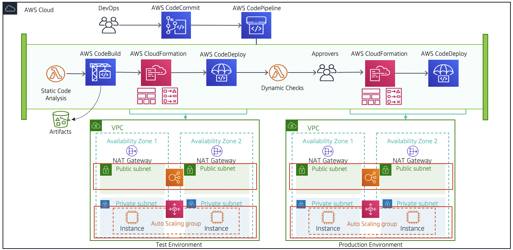
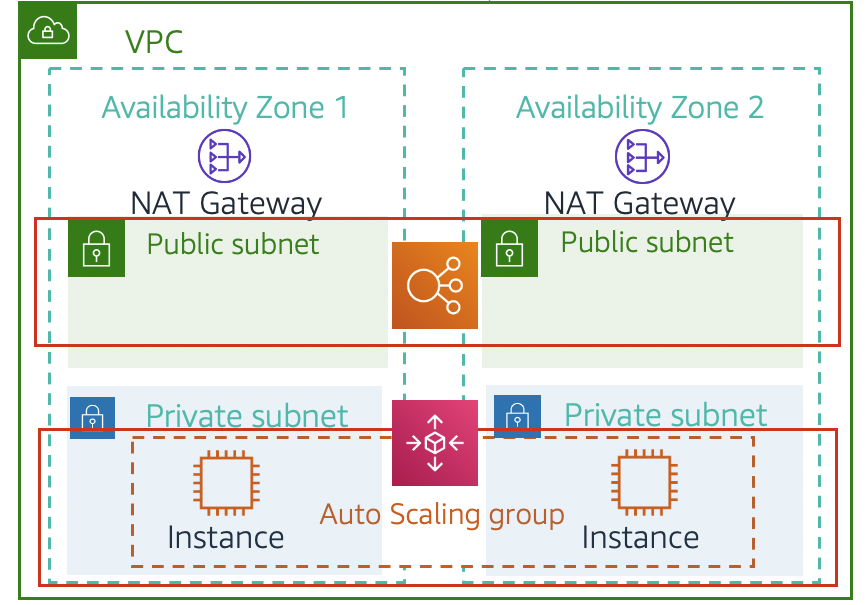
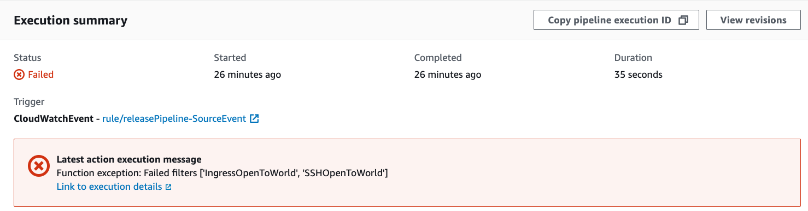
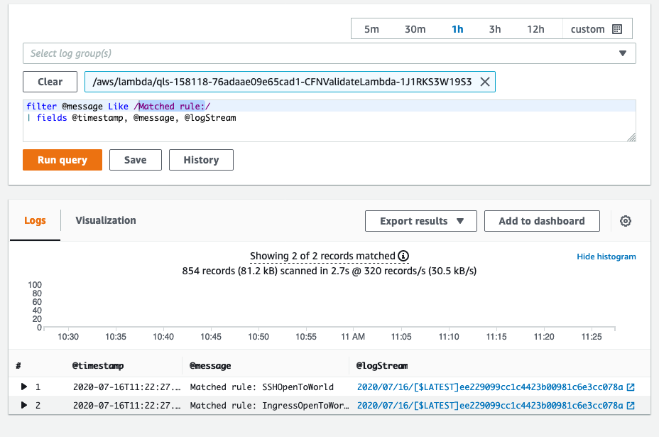
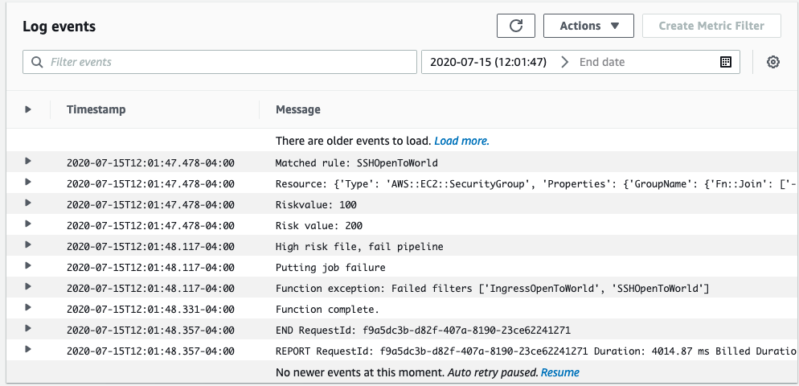
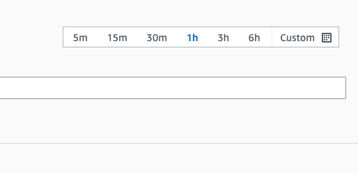
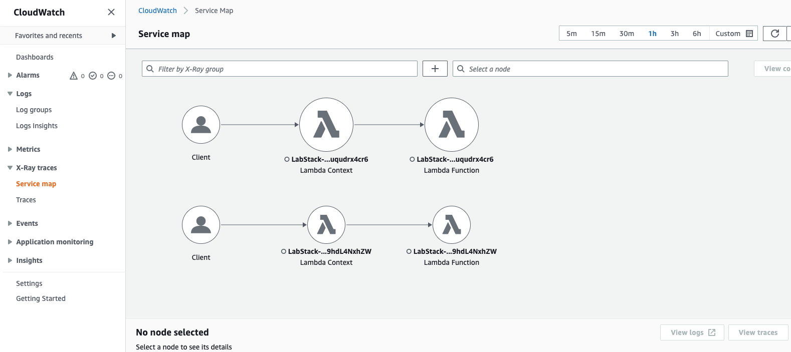

# Lab 6: Using AWS DevOps tools for CI/CD pipeline automations | Self-Paced Labs

---

Clipped from: <https://labs.skillbuilder.aws/sa/lab/arn%3Aaws%3Alearningcontent%3Aus-east-1%3A470679935125%3Ablueprintversion%2FILT-TF-200-DEVOPS-3%2Flab-6-DevOpsTools%3A3.4.6-c8c84145/en-US/216be875-5650-4bee-975b-e85d4b826416::ofjR3XN8meQ8afGnLXRsgw>

# Lab 6: Using AWS DevOps Tools for CI/CD Pipeline Automations

© 2023 Amazon Web Services, Inc. or its affiliates. All rights reserved. This work may not be reproduced or redistributed, in whole or in part, without prior written permission from Amazon Web Services, Inc. Commercial copying, lending, or selling is prohibited. All trademarks are the property of their owners.

Note: Do not include any personal, identifying, or confidential information into the lab environment. Information entered may be visible to others.

Corrections, feedback, or other questions? Contact us at *[AWS Training and Certification](https://support.aws.amazon.com/#/contacts/aws-training).*

## Lab overview

In this lab, you troubleshoot failed pipelines in AWS CodePipeline. You adjust environment configurations using tools from the suite of AWS services.

This lab provides you with an AWS CloudFormation template to build a release pipeline. The release pipeline uses AWS CodePipeline to integrate other AWS Dev tools to perform code builds, automate testing, and automate infrastructure creation. You also use the release pipeline to start gated code deployments from test environments to production environments by using approval actions.

Suppose you are working as an engineering member of a DevOps team. Things are progressing rapidly at the company, and there are not enough resources to allow engineers to inspect each application pipeline daily. You are tasked with building and automating one of the web application production-release pipelines that is on AWS. In addition to the code necessary to build a demo calculator web application, you are provided with several existing AWS resources:

- *AWS CloudFormation* uses one template to build a release pipeline, while other templates are responsible for building the Multi-AZ cloud infrastructure used for web application deployment.
- *AWS CodeCommit* hosts the repository where the web application code is stored.
- *AWS Lambda* defines functions that are used to test the pipeline.

Developers on your DevOps team produced these resources, but the release pipeline that you were asked to work on fails at the build stage. You repair and automate the release pipeline further so that future engineers can deploy changes faster.

### Objectives

By the end of this lab, you will be able to do the following:

- Understand the architecture of a release pipeline.
- Perform basic troubleshooting of failed stages in AWS CodePipeline by locating, analyzing logs, and applying fixes as needed.
- Adjust the configurations of an AWS infrastructure based on test results from the pipeline.
- Validate and manually approve a change between stage transitions of a pipeline.
- Add new actions to an existing AWS CodePipeline stage.
- Examine the AWS X-Ray console for trace events from an AWS Lambda function.

### Technical knowledge prerequisites

- Basic knowledge of AWS CloudFormation.
- Basic knowledge of AWS CodePipeline.
- Basic knowledge of AWS CodeBuild.
- Awareness of AWS CodeCommit.
- Basic use of AWS Cloud9 IDE.
- Basic use of AWS X-Ray.

### Duration

This lab requires *120* minutes to complete.

### Icon key

Various icons are used throughout this lab to call attention to different types of instructions and notes. The following list explains the purpose for each icon:

- **Additional information:** Where to find more information.
- **Note:** A hint, tip, or important guidance.
- **Expected output:** A sample output that you can use to verify the output of a command or edited file.
- **Consider:** A moment to pause to consider how you might apply a concept in your own environment or to initiate a conversation about the topic at hand.
- **Command:** A command that you must run.

## Start lab

1.  To launch the lab, at the top of the page, choose Start lab.

You must wait for the provisioned AWS services to be ready before you can continue.

1.  To open the lab, choose Open Console.

You are automatically signed in to the AWS Management Console in a new web browser tab.

**Do not change the Region unless instructed.**

### Common sign-in errors

#### *Error: You must first sign out*

If you see the message, **You must first log out before logging into a different AWS account:**

- Choose the **click here** link.
- Close your **Amazon Web Services Sign In** web browser tab and return to your initial lab page.
- Choose Open Console again.

#### *Error: Choosing Start Lab has no effect*

In some cases, certain pop-up or script blocker web browser extensions might prevent the **Start Lab** button from working as intended. If you experience an issue starting the lab:

- Add the lab domain name to your pop-up or script blocker's allow list or turn it off.
- Refresh the page and try again.

### Lab environment

*The images depicts how the pipeline format consists of stages, with each stage made up of different action types. An action type consists of an action category and provider type. Valid action categories in CodePipeline include: approval, build, deploy, invoke, source, and test.*

### AWS Services Not Used in This Lab

AWS services that are not used in this lab are deactivated in the lab environment. In addition, the capabilities of the services used in this lab are limited to what the lab requires. Expect errors when accessing other services or performing actions beyond those provided in this lab guide.

## Task 1: Examining the architecture of the release pipeline

In this task, you examine the architecture of the release pipeline and its stages to gain a deeper understanding of the environment you are working in. In later tasks, you build this release pipeline in AWS CodePipeline using AWS CloudFormation.

### Task 1.1: Review each stage of the release pipeline

1.  Re-examine the architecture diagram shown above to gain a visual understanding of your entire release pipeline. Reference this diagram as necessary when you are completing tasks. The pipeline format consists of stages, with each stage made up of different action types. An action type consists of an action category and provider type. Valid action categories in CodePipeline include: *approval*, *build*, *deploy*, *invoke*, *source*, and *test*. Review each stage of the pipeline to understand the actions performed at each stage.

*Source stage*

The first stage of the release pipeline is called the *Source* stage. This stage is always first. It defines the source for the release pipeline, and is started each time someone pushes code to an AWS CodeCommit repository. AWS CodePipeline and AWS CodeCommit services communicate with one another, using configurable Amazon CloudWatch Events, when any change is made to the source.

An AWS CodeCommit repository has already been created, and the code for the demo calculator web application has already been uploaded into the AWS CodeCommit repository for you.

*Static_Check stage*

After CodePipeline detects a new commit made to the CodeCommit repository specified in the *Source* stage, the pipeline begins the second stage called the *Static_Check* stage. In the *Static_Check* stage, a static analysis of the code is performed using an AWS Lambda function named *CFNValidateLambda*. The Lambda function uses regular expression language to find patterns and identify security group policy violations, then Lambda fails the pipeline and includes details of the violation. These details can be displayed in CodePipeline or the Lambda function's logs.

*Build stage*

When the application code passes the Lambda test in the *Static_Check* stage, the pipeline workflow transitions to next stage in the pipeline called the *Build* stage. The pipeline actions in the *Build* stage are performed with AWS CodeBuild.

*AWS CodeBuild* is a fully-managed continuous integration service that compiles source code, runs tests, and produces software packages. With CodeBuild, you do not need to provision, manage, and scale your own build servers. CodeBuild scales continuously and processes multiple builds concurrently, so your builds are not left waiting in a queue. You can get started quickly by using prepackaged build environments, or you can create custom build environments that use your own build tools.

Learn more details about [how CodeBuild works](https://docs.aws.amazon.com/codebuild/latest/userguide/concepts.html#concepts-how-it-works) from the AWS documentation.

*Build specification files*, commonly referred to as *build spec* files, are YAML formatted files used by AWS CodeBuild to define the commands and settings for build projects. The name of the build spec file used in the *Build* stage is called *build-with-cache.yml*.

Learn more details about the [syntax of build spec files](https://docs.aws.amazon.com/codebuild/latest/userguide/build-spec-ref.html) from the AWS documentation.

**Note:** When examining the release pipeline initially built from the CloudFormation template provided, you find that pipeline workflows fail at the *Build* stage. You remedy this in a later task.

Artifacts from the build process are stored in an Amazon S3 bucket that you choose.

*Test_Stack stage*

The next stage in the release pipeline is the *Test_Stack* stage. In this stage, the release pipeline starts the creation of an interim test environment using AWS CloudFormation. Resources in the test stack and their configuration are defined in a CloudFormation template file provided to you.

**Note:** It is best practice to design test environments that match your production environments as much as possible. Removing as many environmental differences as you can, makes your testing more accurate.

Refer to the following picture as well as the release pipeline [architecture picture](https://labs.skillbuilder.aws/sa/lab/arn:aws:learningcontent:us-east-1:470679935125:blueprintversion/ILT-TF-200-DEVOPS-3/lab-6-DevOpsTools:3.4.6-c8c84145/en-US/216be875-5650-4bee-975b-e85d4b826416::ofjR3XN8meQ8afGnLXRsgw#architecture_slide) in previous tasks. The test environment consists of a VPC with EC2 web server instances in private subnets. Network traffic is directed across multiple Availability Zones in the same AWS region by using a load balancer. The load balancer is public-facing. This test environment architecture is also used for the production environment.

*Test_Stack stage*

*Image highlights the public subnets in AZ1 and AZ2 along with the EC2 instances in private subnets.*

When CloudFormation has successfully created the test environment stack, the final action in the *Test_Stack* stage uses AWS CodeDeploy to deploy the web application into the test environment.

*Service_Status stage*

You need to make sure that the test web application that was deployed by CodePipeline loads successfully before asking for approval to move to production. At first, you check this manually. You then add the *Service_Status* stage to automate that test. Using outputs from your *Test_Stack* stage, you pass the URL of the load balancer to a Lambda function that evaluates the status code returned. If the Lambda function receives a 200 status code, it notifies CodePipeline that it was successful.

*Approval stage*

The next stage in the release pipeline is the *Approval* stage. The *Approval* stage is a method for gatekeeping code between your test and production environments. The *Approval* stage is *not* meant as a place for code reviews. The purpose of the *Approval* stage is to keep code deployments from moving to the production environments before they are ready. When all the testing and changes are complete in the test environment, and the code is operating as intended, completing the approval action allows the changes to be deployed into a production environment.

A select group of approval users can complete this approval action. Or, if sufficient testing is in place at the approval stage of the release pipeline, the actions can be completed through automated approval processes.

For this lab, the *Approval* stage of the pipeline is used to confirm the deletion of the interim test environment stack, which was created in the earlier *Test_Stack* stage of the release pipeline. The *Approval* stage also initiates the provision of a new, similar environment for production usage.

*Prod_Stack stage*

The final stage of the release pipeline is the production stage called *Prod_Stack* stage. With the approval action completed, the release pipeline begins workflows to create the production environment.

In this stage, the release pipeline causes AWS CloudFormation to create the production environment. Similar to the *Test_Stack* stage, the *Prod_Stack* stage resources in the production stack and their configuration are defined in a CloudFormation template provided to you.

Refer to the [architecture diagram](https://labs.skillbuilder.aws/sa/lab/arn:aws:learningcontent:us-east-1:470679935125:blueprintversion/ILT-TF-200-DEVOPS-3/lab-6-DevOpsTools:3.4.6-c8c84145/en-US/216be875-5650-4bee-975b-e85d4b826416::ofjR3XN8meQ8afGnLXRsgw#architecture_slide) and note that the architecture for the production environment looks the same as the test environment. However, the two environments *and* the core resources within each of the environments are distinct from one another.

When CloudFormation has successfully created the production environment stack, the final action in the *Prod_Stack* stage uses AWS CodeDeploy to deploy the web application code into the production environment.

After examining the various stages of the release pipeline, it should be evident that the purpose of a pipeline is to coordinate many AWS services in a custom way---through pipeline stages---to reduce human error in processes while also speeding up development cycles. When a pipeline is fully automated and functional, DevOps engineers gain a valuable mechanism for automated, tested, and consistent releases of code to production.

Congratulations! You have examined the architecture of the release pipeline and its stages to gain a deeper understanding of the environment you are working in.

## Task 2: Building the pipeline

In this task, you use *AWS CloudFormation* to build a release pipeline in *AWS CodePipeline*, as described in the previous task.

1.  At the top of the AWS Management Console, in the search bar, search for and choose

CloudFormation

in a new browser tab.

2.  On the navigation pane, choose **Stacks**.
3.  Choose **Create stack** from the drop-down menu and then choose With new resources (standard) .

The browser takes you to the *Specify template* page. This is the first page of the *Create stack* wizard for creating a CloudFormation stack.

1.  In the **Prerequisite - Prepare template** section:

- For **Prepare template**, select **Template is ready**

1.  In the **Specify template** section:

- For **Template source**, select **Amazon S3 URL**

1.  From the information pane to the left of these instructions, locate and copy the value of the variable **TemplateURL**.

- For **Amazon S3 URL**, enter the value of the variable **TemplateURL** you copied.

1.  Choose Next .
2.  On the **specify stack details** page, in the **Stack name** section:

- For **Stack name**, enter

releasePipeline

.

**Note:** You do not need to configure anything on the *Configure stack options* page of the *Create stack* wizard.

1.  Choose Next .
2.  Review the settings for the pipeline, and verify that they are correct.
3.  Choose Submit .

**Note:** After approximately 1 minute, the status for *releasePipeline* stack on the CloudFormation dashboard changes to CREATE_COMPLETE, meaning CloudFormation has finished and the pipeline is ready to use.

Congratulations! You have just created a release pipeline using CloudFormation.

## Task 3: Fixing the Build stage

In this task, you investigate why the *Build* stage is broken and fix it. Troubleshooting a problem largely consists of working backwards through the most recent events to find out the *who*, *what*, *when*, *where*, and *why*. Then you take corrective action based on the information gathered. Reading logs for errors and details is often the best source for gathering troubleshooting information. AWS CodeBuild logs can be stored in Amazon CloudWatch log groups, stored in a specified S3 bucket, or they can be stored in *CloudWatch* and *S3*.

### Task 3.1: Navigating the build stage logs

In this task, you learn how to view the logs for the CodePipeline build stage and relevant data used for troubleshooting errors.

1.  From the CloudFormation Management Console, use the AWS search bar to search for and choose

CodePipeline

in a new browser tab.

2.  In the **Name** field, choose the **releasePipeline** text link.

**Note:** This opens a detailed view of the pipeline, including the state of each action in each stage of the pipeline. Wait for the current run to fail.

1.  Locate the **Build** stage of the lab release pipeline.
2.  From the **Build** stage, choose the link for the **Pipeline execution ID**.
3.  From the **Latest action execution message** dialog box, choose the text link reading, **Link to execution details** .

The CodeBuild page shows what happened during the stage's action. You can locate logs for the build here.

At the top of the page, a section contains the metadata status of the build. In your case, the status shows as *Failed*. This section also details the *start* and *end* timestamps of the build, in addition to the *initiator* where the build was authorized from.

1.  On the **CodeBuild** console page, explore the tabs to familiarize yourself with the various artifacts.

- *Build logs* tab

Provides the latest log entries. By default, a log entry displays the most recent line entries of the build log file. This is what you need for most troubleshooting. However, if you need a full log entry, you can view the full logs in CloudWatch by choosing *View entire log*. Entries are timestamped, indicate what ran, and where it ran. The *Tail logs* feature is not needed for your lab. By choosing this button, you can continue to output the latest log entry to the web console while the build stage is running.

- *Phase details* tab

Provides general details on whether certain individual phases of the overall build succeed or fail, how long each phase took to complete, and a timestamp of when each phase occurred. For this lab, you should find that the *BUILD* phase failed.

- *Reports* tab

Displays reports generated by functional or integration tests. The reports can be formatted in JUnit XML or Cucumber JSON. For the lab, the tab output is blank because no test reports are generated as part of the lab.

- *Environment variables* tab

Displays the variables that were used as input for the build. This tab is blank in your lab, because the Build stage is not configured to use environment variables. Environment build variables can be useful to set more specific builds for your code in the release pipeline. That is, your real-world release pipeline is more robust. If want to configure your build to use only a certain AWS Region or image by default, then you can use environment variables to configure such settings.

- *Build details* tab

Gives a breakdown of the following:

- Infrastructure that was used for the build.
- Location of the build artifacts.
- Where build logs were stored.
- The name of the buildspec file that was used for the build.

**Note:** For debugging your lab, the most useful tab is the *Build logs* tab.

### Task 3.2: Reading the build logs

In this task, you begin the troubleshooting process by reviewing the details in the build logs to learn the root cause for the error.

1.  On the *Build logs* tab, to investigate when and where the error in the build stage occurred, scroll to the end of the log to locate the latest error entry.

**Expected output:**

******************************
**** This is OUTPUT ONLY. ****
******************************

npm ERR! Test failed. See above for more details.

[Container] 2022/09/13 17:26:49 Command did not exit successfully npm test exit status 1
[Container] 2022/09/13 17:26:49 Phase complete: BUILD State: FAILED
[Container] 2022/09/13 17:26:49 Phase context status code: COMMAND_EXECUTION_ERROR Message: Error while executing command: npm test. Reason: exit status 1

The entry indicates that the error occurred during the *build phase*, and the error was encountered while *performing a test*.

1.  To locate log entries detailing the cause of the error, scroll above the error message in the logs, as described in the previous step.

**Expected output:**

******************************
**** This is OUTPUT ONLY. ****
******************************

1) Calculator Tests
Multiply Tests
returns 0 * 4 = 0:

AssertionError [ERR_ASSERTION]: 4 == 0
+ expected - actual

-4
+0

at Context.<anonymous> (test/calculator_spec.js:37:11)

From the information that you have gathered from the logs so far, you can determine the following:

- The test is written in *Node.js*.
- The error type is an *Assertion Error*.
- The error is occurring in the *Multiply Tests* section within the *Calculator tests*.

For more information about assertion errors, visit [assert_class_assert_assertionerror](https://nodejs.org/api/assert.html#assert_class_assert_assertionerror).

Another way to phrase what the Assertion Error in the log is saying is, *The expected output of the test and the actual output from the test when it ran, are not equivalent to each other*.

The *last line* in the above section of logs is important to your troubleshooting process. It details the *file path* of the test code definitions, the *file name*, and the *line number* in the file where the assertion error was encountered.

1.  Scroll up further in the logs to identify the tests that ran during the build and the results of the individual tests. You also find out which tests passed and which ones failed.

Seven tests passed and one test failed (the final multiplication test). The test that failed has 1 next to it instead of a check mark (✓). For the failed test, the value 4 that was returned after running the test is not equal to the expected value of 0, an expected value that is defined in the test. Based on this information and what was learned in the previous step, you must correct the test that is run during the build.

**Expected output:**

******************************
**** This is OUTPUT ONLY. ****
******************************

Calculator Tests
Addition Tests
✓ returns 1 + 1 = 2
✓ returns 1 + -1 = 0
Subtraction Tests
✓ returns 2 - 1 = 1
✓ returns 1 - -1 = 2
Multiply Tests
✓ returns 2 * 2 = 4
1) returns 0 * 4 = 0

Calculator service
✓ it should connect to the redis cache
✓ it should add two numbers

7 passing (21ms)
1 failing

From reading a few log entries, you have learned the following specific details:

- *Who caused the error:* Calculator multiplication tests returned an error during the build process.
- *What the type of error was:* Assertion Error in Node.js.
- *When in the build process the error occurred:* During the build phase (timestamps are available, if needed).
- *Where the error occurred in the test code:* The file path and file name of the test definitions is test/calculator_spec.js. The line number and character location is 37:11.
- *Why this error occurred:* The root cause of the error was a mismatch between the value returned from the test and the expected value defined for the test.
- *How this error occurred:* Likely a human error, such as a typo, occurred when creating the test code.

### Task 3.3: Fixing the error in the test code

You located and read the build logs. Using the information learned from reading the logs, you can continue to diagnose for identifying the root cause. In this case, the root cause case happens to be an incorrect operator usage in the *calculator.js* file. In this task, you fix this code error.

1.  Open the **Cloud9** environment by copying the **URL** value to the left of these instructions for the heading reading **Cloud9Environment** and pasting it into a new browser tab.

**Note:** When the IDE is first launched, the CodeCommit repository is cloned into it. It should take no more than 30 seconds before the terminal pane is ready to use.

1.  Choose **File** > **Close File**.
2.  If prompted, from the message dialog box, choose **Close**.

**Note:** This should close any open terminal windows in the IDE, leaving only the *immediate terminal* pane open at the bottom.

1.  Change the terminal's working directory to the one containing the local repo files by running the following command:

cd ~/environment/Lab6/

**Expected output:**

*None, unless there is an error.*

1.  In the file explorer pane, locate the **calculator.js** file in the **Lab6** directory.
2.  Open the context menu for **calculator.js** file and choose **Open**. This file contains the test code.
3.  Go to line **10** in the document, and change **return a + b;** to

return a * b;

.

4.  Save the changes to the **calculator.js** file and then close the file as this is the only edit needed.
5.  In the terminal pane, **commit the changes** to the repository by running the following commands.

git add --all
git commit -m 'Correcting the multiplication error in the application.'

**Expected output:**

******************************
**** This is OUTPUT ONLY. ****
******************************

[main 0294ea4] Correcting the multiplication error in the application.
Committer: EC2 Default User [<ec2-user@ip-10-192-9-122.us-west-2.compute.internal](mailto:%3cec2-user@ip-10-192-9-122.us-west-2.compute.internal)>
Your name and email address were configured automatically based
on your username and hostname. Please check that they are accurate.
You can suppress this message by setting them explicitly:

git config --global user.name "Your Name"
git config --global user.email <you@example.com>

After doing this, you may fix the identity used for this commit with:

git commit --amend --reset-author

1 file changed, 1 insertion(+), 1 deletion(-)

**Note:** You are the only developer working on the code base, so there are no other changes to pull from the remote repository.

1.  In the terminal pane, **push the changes** from your local repository to the remote repository by running the following command.

git push

**Expected output:**

******************************
**** This is OUTPUT ONLY. ****
******************************

Enumerating objects: 5, done.
Counting objects: 100% (5/5), done.
Compressing objects: 100% (3/3), done.
Writing objects: 100% (3/3), 345 bytes | 345.00 KiB/s, done.
Total 3 (delta 2), reused 0 (delta 0), pack-reused 0
To <https://git-codecommit.us-west-2.amazonaws.com/v1/repos/Lab-6>
e13a816..0294ea4 main -> main

Return to the *CodePipeline console* and perform a build of the code base with the new changes.

1.  Switch to the **CodePipeline - AWS Developer Tools** browser tab, leaving the IDE open for future use.
2.  Choose the **Pipelines** bread crumb from the top of the page.
3.  In the **Name** field, choose the **releasePipeline** text link.

**Note:** This opens a detailed view of the pipeline, including the state of each action, at each stage of the pipeline.

In the *Source* stage of the *releasePipeline*, Amazon CloudWatch Events communicates with AWS CodePipeline that a new code change is submitted to the main branch of the *Lab6* code repo in AWS CodeCommit. The pipeline begins its workflow automatically.

**Note:**

- You can always force a pipeline to run new workflows by choosing Release change .
- Then, from the *Release change* message dialog box, choose the Release button.

As you can see, the *Static_Check* failed. You address this in the next task.

Congratulations! You have you investigated why the *Build* stage is broken and fixed it. This update reveals another issue to troubleshoot.

## Task 4: Fixing the Lambda Static check

Now, the pipeline workflow at the *Static_Check* stage fails. The pipeline actions in the *Static_Check* stage invoke an AWS Lambda function.

**Consider:** You may be wondering why this didn't fail the first time the pipeline ran. The code is intentionally written to not process any rules the first time in order to change the order of your troubleshooting. By instructing you to fix the build stage first, you can examine the Lambda function logs while you wait for the initial test environment deployment.

*AWS Lambda* is a compute service that lets you run code without provisioning or managing servers. You can create Lambda functions and add them as actions in your pipelines.

For this lab, a Lambda function called *CFNValidateLambda* was created to test whether the calculator application uses allowed security rules such as: security group ports, protocols, allowed IP addresses, etc.

In this task, you learn why the AWS Lambda test in the *Static_Check* stage is failing and fix the code using the AWS Cloud9 IDE. Similar to the previous task where you examined CodeBuild logs, you find more details about the error that occurred in the *Static_Check* stage of the pipeline by reviewing log files in *CloudWatch*.

### Task 4.1: Fix the CloudFormation template

In this task, you correct the issue with the CloudFormation template after learning the root cause by reviewing the *CloudWatch logs*.

1.  From the **CodePipeline Management Console** choose the text link for **Pipeline execution ID** in the **Static_Check** stage.

The *Action execution failed* message dialog box displays the error returned from the Lambda *CFNValidateLambda* function. The reason for the failure is that the function found global access to the *SSH network ingress ports* as shown below.

*Image represents the error encountered from the Lambda function named CFNValidateLambda because their is global access to the ssh network ingress port.*

1.  Return to the **Lab6 - AWS Cloud9** web browser tab.
2.  Expand the **Lab6/cloudformation** directory in the explorer pane.
3.  Open the context menu for the **application.json** file and choose **Open**.
4.  Under the **Resources** section of the CloudFormation template, locate the **EC2 Security Group** resource named **TestSecurityGroup**.

Under the properties section of the *TestSecurityGroup* resource, note that the *SecurityGroupIngress* is configured to allow access to network port 22 from any CIDR block, 0.0.0.0/0

For the CloudFormation template to pass the Lambda function's test, you need to restrict port 22 to an appropriate *private* CIDR block IP address within your fictional company, rather than allowing the network port to be open to the world.

1.  On Line 47, change **"CidrIp": "0.0.0.0/0"** so that the value is your own private IP address instead. Be sure to enclose the key and value in quotation marks. (You won't be accessing this over ssh so the ip cidr block doesn't have to really be yours but be sure to include the trailing **/32** at the end.)

**Example:** On line 47, change *"CidrIp": "0.0.0.0/0"* to

"CidrIp": "192.168.132.123/32"

If you need help identifying your public IP address use the following link: [checkip.amazonaws.com](https://checkip.amazonaws.com/)

1.  Save the changes to the **application.json** file and close it as not additional changes are needed.
2.  **Command:** Commit the changes to the repository by running the following commands:

cd ~/environment/Lab6
git add --all
git commit -m 'updating TestSecurityGroup ingress rule from public to private address.'

**Expected output:**

******************************
**** This is OUTPUT ONLY. ****
******************************

[main a95939b] updating TestSecurityGroup ingress rule from public to private address.
Committer: EC2 Default User [<ec2-user@ip-10-192-9-122.us-west-2.compute.internal](mailto:%3cec2-user@ip-10-192-9-122.us-west-2.compute.internal)>
Your name and email address were configured automatically based
on your username and hostname. Please check that they are accurate.
You can suppress this message by setting them explicitly:

git config --global user.name "Your Name"
git config --global user.email <you@example.com>

After doing this, you may fix the identity used for this commit with:

git commit --amend --reset-author

1 file changed, 1 insertion(+), 1 deletion(-)

**Note:** You are the only developer working on the code base, so there are no other changes to pull from the remote repository.

1.  **Push the changes** from your local repository to the remote repository:

git push

**Expected output:**

******************************
**** This is OUTPUT ONLY. ****
******************************

Enumerating objects: 7, done.
Counting objects: 100% (7/7), done.
Compressing objects: 100% (3/3), done.
Writing objects: 100% (4/4), 441 bytes | 441.00 KiB/s, done.
Total 4 (delta 2), reused 0 (delta 0), pack-reused 0
To <https://git-codecommit.us-west-2.amazonaws.com/v1/repos/Lab-6>
0294ea4..a95939b main -> main

1.  Switch to the **CodePipeline - AWS Developer Tools** browser tab.
2.  Choose the **Pipelines** bread crumb from the top of the page.
3.  In the **Name** field, choose the **releasePipeline** text link.

In the *Source* stage of the *releasePipeline*, Amazon CloudWatch Events communicates with AWS CodePipeline that a new code change is submitted to the main branch of the *Lab6* code repo in AWS CodeCommit. The pipeline begins its workflow automatically.

**Note:**

- You can always force a pipeline to run new workflows by choosing Release change .
- Then, from the Release change message dialog box, choose the Release button.

The pipeline workflow starts. This time, the pipeline workflow should proceed past the both the *Build* stage, and the *Static_Check* stage. Then, the pipeline builds the test environment itself, with the latest commit of the web application code deployed to it.

**Note:** This process takes approximately *5 minutes* to deploy all resources in the CloudFormation stacks. While this is processing, you can *continue* on to the next task.

### Task 4.2: Examine CloudWatch logs and verify the reason for the failed AWS Lambda function CFNValidateLambda

While you wait for the *Test* environment to be deployed, examine the logs from the Lambda function ran in the *Static_Check* stage. There could be many log streams available for your Lambda function so you want to first use AWS CloudWatch Insights to find where your function found code that would increase risk.

1.  From the CodePipeline Management Console, use the AWS search bar to search for and choose

CloudWatch

in a new browser tab.

2.  In the left navigation pane, expand the **Logs** drop-down menu and choose **Logs Insights**.
3.  For the **Select log group(s)** drop-down menu, select the log group that contains the text string **CFNValidateLambda**.
4.  In the query editor, replace the default query with the following code

filter @message Like /Matched rule:/
| fields @timestamp, @message, @logStream

1.  Choose Run query .

**Expected output:** Your CloudWatch Insights screen should be similar to the screenshot below.

*The image reflects what is expected in the CloudWatch insights screen after the previous step which includes to log entries.*

1.  Choose the **Log Stream** text link beside the result with **Matched rule: SSHOpenToWorld**.

**Note:** If you don't see a result with **Matched rule: SSHOpenToWorld**, wait 1 minute and run the query again.

This opens up another web browser tab to show the log stream. At the top of the *Log events* window you should see the *Matched rule: SSHOpenToWorld* entry and the timestamp should match the timestamp shown in the CloudWatch Insights results.

*In the image above, you can easily see what rule was matched and what resource from the CloudFormation template that matched the rule.*

On the line that states *There are older events to load*, you can click *Load more* to pull in more entries from the lambda function.

1.  Choose **Load more** until you see the **START RequestId**.

*Image show example of the START RequestId in the CloudWatch log for the Lambda function.*

The developer of this function chose to write the entire event to the logs for troubleshooting purposes. You can review the log entries to see what CodePipeline passes to the Lambda function when it invokes it.

Congratulations! You have you learned why the AWS Lambda test in the *Static_Check* stage failed and updated the code for the security group in the CloudFormation template. Then using the AWS Cloud9 IDE, you updated the CloudFormation stack with the updated file.

## Task 5: Validating in the Test Environment

In previous tasks, you identified what was blocking the builds in the release pipeline, and then applied the necessary fixes. In this task, you confirm that your application is successfully deployed. Your pipeline uses these deployment action providers - AWS CloudFormation for deploying immutable infrastructure, and AWS CodeDeploy for deploying applications.

You confirm that the application works as intended in a test environment. You make any necessary changes to prepare for publishing the code to a production environment.

1.  Switch back to the **CloudFormation - Stack releasePipeline** browser tab.

**Note:** If the was closed, follow the steps below to open the CloudFormation management console.

- From the CloudWatch Management Console, use the AWS search bar to search for and choose

CloudFormation

in a new browser tab.

1.  From the list of CloudFormation stacks, under the **Stack name** column, choose the **Stack name** that contains the string **test-stack**.
2.  If it has not completed already, watch the stack creation process until the status changes to **CREATE_COMPLETE**.
3.  Choose the **Outputs** tab.
4.  On the **Outputs** tab, locate the key called **Url** and copy the Elastic Load Balancing (ELB) DNS address.
5.  In a new browser tab, paste the **ELB DNS URL**.

A simple calculator web application is displayed.

**Note:** If you receive an *HTML error code 502*, the load balancer has not finished its service health checks. Wait one minute, and then refresh the web page.

**Expected output:**

*Image shows an example of what the Simple Calculator Service application looks like on a web page. It shows an image of calculator and text reading, "Simple Calculator Service". Below that, it has one input field followed by a drop-down menu for +, -, *, and / symbols to calculate with. This is followed by a second input field. Depending on the numbers you enter it will calculate the appropriate value based on the Arithmetic operator chosen.*

1.  Test some basic functionality of the calculator web application.

Congratulations! You have validated the test environment.

## Task 6: Automating the testing of the test environment

In a previous task, you manually validated and tested that the web application site was responsive. In this task, you use an AWS Lambda function in the release pipeline to automate the validation step for the test environment.

With CodePipeline, you can export the Outputs of your CloudFormation stack to be used as variables in actions that occur later in the pipeline. Variables allow you to configure your pipeline actions with values that are determined at the time of the action performed.

### Task 6.1: Add a new stage to the existing release pipeline

For this task, you use the *CodePipeline console* to configure the *DeployChangeSet* action in the *Test_Stack* stage to *export* it's CloudFormation *outputs* as *variables*. You then add a new stage in the release pipeline and add an action in that stage.

1.  Switch back to the **CodePipeline - AWS Developer Tools** browser tab.
2.  You should be on the *releasePipeline* console page. If not, complete the following steps.

- Choose the **Pipelines** bread crumb.
- In the **Name** field, choose the **releasePipeline**.

**Note:** This opens a detailed view of the pipeline, including the state of each action in each stage of the pipeline. (Your pipeline should currently be in-progress waiting for a manual approval.)

1.  On the pipeline details page, choose Edit .
2.  Locate the **Edit: Test_Stack** stage of the pipeline.
3.  Choose Edit stage .
4.  For the **DeployChangeSet** action, choose the edit icon to edit this action.

To ensure that variables can be uniquely referenced, they must be assigned to a namespace. After you have a set of variables assigned to a namespace, they can be referenced in an action configuration by using the namespace and variable key with the following syntax: *#{namespace.variable_key}*.

1.  For the **Variable namespace *- optional*** text field, enter

TestStackOutput

2.  Choose Done .
3.  Choose Done on the **Edit: Test_Stack** Stage card.
4.  Choose the + Add stage after the **Edit: Test_Stack** stage to add a new pipeline stage.
5.  In the **Add stage** pop-up window for **stage name**, enter

Service_Status

.

6.  Choose Add stage .
7.  In the **Edit: Service_Status** stage, choose + Add action group .
8.  On the **Edit action** page:

- For **Action name** enter

Test_Status

- For **Action provider** choose **AWS Lambda**
- For **Region**, keep the default value. It should be the same AWS Region where your lab was launched or the same AWS Region as your pipeline.
- For **Function name**, choose the function name that contains the string **servicestatus**.
- For **User parameters** *- optional*, enter

#{TestStackOutput.Url}

1.  Choose Done .
2.  Choose Done on the **Edit: Service_Status** Stage card.
3.  At the top of the **Editing: releasePipeline** page, choose Save .
4.  In the **Save pipeline changes** dialog window, select the check box reading, **No resource updates needed for this source action change**.
5.  Choose Save .

**Expected output:**

*Success*

*Pipeline was saved successfully.*

### Task 6.2: Test the new stage

To test the new pipeline stage with the Lambda function, release the most recent change through the pipeline.

1.  On the **releasePipeline** details page, choose Release change .
2.  From the **Release change** pop-up window, choose the Release .

**Expected output:**

*Success*

*The most recent change will re-run through the pipeline. It might take a few moments for the status of the run to show in the pipeline view.*

The release pipeline starts a new workflow. This time the workflow initiates the *Test_Status* stage that you added in a previous task. It takes about 5 minutes for the pipeline workflow to process until the new stage.

The pipeline should wait for the *approval* action you complete that in the next task.

Congratulations! You used the CodePipeline console to configure the DeployChangeSet action in the Test_Stack stage to export it's CloudFormation outputs as variables. You then added a new stage in the release pipeline and added an action in that stage and tested the new stage.

## Task 7: Approving the deletion of the Test environment and build the Production environment

In this task, you approve the pipeline to continue to provision and deploy the changes to the production environment.

The approval stage is considered as a *gate-keeping mechanism* between your *test* and *production* environments. After all the testing and changes are complete in the test environment and the code is operating as intended, an approval check is required to push the changes into a critical or production environment. This approval can be completed manually by a select group of approvers, or it can be automated if sufficient testing is in place at the approval stage.

1.  On the **CodePipeline console**, locate the **Approval** stage of the pipeline.

**Note:** It should have a status of *Pending*.

1.  In the **Purge_Test** action, choose Review .
2.  In the **Review** window, you can enter approval review comments, such as why you are approving the test build for release to a production environment, and then choose Approve .

**Expected output:**

*Action Purge_Test was approved*

The pipeline performs actions with CloudFormation to *delete* the test environment stack. Next, it builds the production environment stack with the latest commit of the web application code deployed to it.

1.  **Continue** to the next task while the production environment builds.

Congratulations! You have approved the *Purge_Test* stage. CloudFormation is deleting the *test environment* and then creates the *production environment*.

## Task 8: Examining AWS Lambda functions with AWS X-Ray

It is useful to configure *AWS X-Ray* in addition to *CloudWatch metrics* for Lambda functions.

AWS X-Ray logs metadata from AWS Lambda and any upstream or downstream services that make up your application. X-Ray uses this metadata to generate a detailed service graph that illustrates *performance bottlenecks*, *latency spikes*, and *other issues*.

Using the AWS X-Ray *Service Map* feature to examine an AWS Lambda function, you can zoom in and view a visual representation of the request. This visual representation covers the time from when an event source initiates a Lambda function until the function completes the run.

In this task, you examine the *AWS X-Ray dashboard* to review one of the Lambda functions used in this lab.

### Task 8.1: Navigate to the X-Ray Traces for a specific AWS Lambda function

Use AWS X-Ray to trace one of your AWS Lambda functions.

1.  Switch back to the **CloudWatch** browser tab. If the CloudWatch browser tab is closed, use the AWS search bar to search for and choose

CloudWatch

in a new browser tab.

2.  In the left navigation pane, expand the **X-Ray traces** drop-down menu and choose **Traces**.

**Note:** You can also access X-Ray traces from the monitor tab of the Lambda function.

1.  In the traces page, at the top-right of the page, choose **1h** to expand the time window searched to one hour.

*The image is an example of how to expand the time frame of the Traces search.*

The traces of the actions completed by your web application in the last hour is displayed.

You can use the search bar to display a service map or traces for a service, trace ID, or filter expression.

Learn more from [Searching for Traces in the AWS X-Ray Console with Filter Expressions](https://docs.aws.amazon.com/xray/latest/devguide/xray-console-filters.html?icmpid=docs_xray_console).

1.  Scroll down further on the page to the **Traces** section and choose one of the available traces by choosing the trace id.

It displays additional details about the trace of that particular function's run.

*The page appears similar to the example image above showing the trace details in milliseconds from the CloudWatch X-Ray console.*

1.  From the traces details page, choose the **Invocation** step.

In the **Segment details: Invocation** window on the right, the *Overview* tab displays information regarding *start time*, *end time*, *duration time*, and if there was an **error**.

The *Resources* tab displays the *Amazon Resource Name (ARN)* of the Lambda function that was used for this trace.

### Task 8.2: Explore AWS X-Ray Service map

In this task, explore the *Service map* feature of AWS X-Ray.

1.  In left the navigation pane, choose **Service map**.

The AWS X-Ray service map traces requests that your applications serve. It is a visual representation of the JSON service graph that AWS X-Ray generates from the trace data your applications generate. The service maps shows information about the Lambda function and all of the downstream services of the application request. This is useful for identifying where errors, unsuccessful requests, and high latency are occurring.

1.  In the **Service map** page, at the top-right of the page, choose **1h** to expand the time window to one hour.

A service map of the actions completed by your web application in the last hour is displayed.

*The image shows an example of the Service map displayed in the AWS X-Ray console. It shows two clients and traces shown in milliseconds.*

A service map of the actions completed by your web application in the last hour is displayed.

Choosing any of the items in the *Service map* displays more Service details.

Congratulations! You have reviewed the service map feature in the X-Ray console learn more about service calls.

## Task 9: Verify the application deployment to Production environment

In this task, you verify that the *releasePipeline* stages resulted in the following outcomes:

**Verify:**

- Test environment was deleted to avoid the unnecessary resource consumption.
- CloudFormation provisioned the Production environment.
- CodeDeploy deployed the web application to Production environment.

1.  Switch back to the **CloudFormation - Stack Lab6-test-stack** browser tab.
2.  Choose the **Stacks** bread crumb to return the full list of stacks.

**Note:** Remember that the purpose of the test environment is to test changes and functionality of a commit before pushing the changes to production. Before creating the production environment stack and after the approval is given, one of the pipeline actions was to delete the test environment stack.

You should no longer see a stack that contains the string *test-stack*. You should see one that contains *prod-stack* instead.

**Note:** If your list of stacks does not show these updates, choose the refresh button.

1.  Choose the stack text link that contains the string **prod-stack** in the name.
2.  Wait until the status for Prod environment stack in CloudFormation is **CREATE_COMPLETE**.

Take a moment to review the [CodePipeline best practices](https://docs.aws.amazon.com/codepipeline/latest/userguide/best-practices.html) while waiting for the production environment to build.

1.  To determine whether the production environment is working, locate the **Url** key on the **Outputs** tab and copy the value of the production environment's Elastic Load Balancer (ELB) DNS address to the clipboard.
2.  In a new browser tab, paste the **URL** you copied from the previous step into the address bar.

**Expected output:**

*A simple calculator web application is displayed.*

**Note:** If you receive an *HTML error code 502*, the load balancer has not finished its service health checks. Wait one minute, and then refresh the web page.

Congratulations! You have verified that the Test environment was deleted, the Production environment was created by CloudFormation, and that CodeDeploy deployed the web application to Production environment.

## Summary

Congratulations! You now know about how to use AWS DevOps tools to orchestrate the application deployments and integrate with AWS Lambda to automate the manual tasks to add speed to your release cycles. You successfully:

- Understood the architecture of a release pipeline.
- Performed basic troubleshooting of failed stages in AWS CodePipeline by locating, analyzing logs, and applying fixes as needed.
- Adjusted the configurations of an AWS infrastructure based on test results from the pipeline.
- Validated and manually approved a change between stage transitions of a pipeline.
- Added new actions to an existing AWS CodePipeline stage.
- Examined the AWS X-Ray console for trace events from an AWS Lambda function.

## Optional Task 10: Deploying a code change to the web application using the release pipeline

**Note:** This next task is an optional task. Feel free to complete based on your availability. If you choose not to, then you can skip and consider the lab completed.

Applying what you have learned, you can make your real-world pipeline even more robust. For example, you could create a new AWS Lambda function to test whether any CloudFormation templates include secret and access keys. Add the Lambda function as a new static check to the release pipeline. Next, stop the pipeline if code fails your Lambda function test.

In this task, you commit a new change to the web application code and observe the release pipeline functionality from start to finish.

### Task 10.1: Commit a change to the web application code

In this task, you use the AWS Cloud9 IDE to make a simple change the calculator web application.

1.  Return to the **AWS Cloud9** web browser tab.

**Note:** If the browser tab for the AWS Cloud9 IDE was closed, you can open it by copying the value for *Cloud9Environment* to the left of these instructions and paste it in a new browser tab.

1.  In the file explorer pane, expand the **Lab6** directory, and locate the **index.html** file.
2.  Open the context menu for the **index.html** file and choose **Open**.
3.  In the **index.html** file, go to **line 9**, and change **background-color:white;** to

background-color:orange;

4.  Save the changes to the **index.html** file and close the file.
5.  **Command:** Use the terminal window to commit the changes to the repository by running the following commands:

cd ~/environment/Lab6
git add --all
git commit -m 'Updated bg color.'

**Expected output:**

******************************
**** This is OUTPUT ONLY. ****
******************************

[main 85f08f0] Updated bg color.
Committer: EC2 Default User [<ec2-user@ip-10-192-12-236.us-west-2.compute.internal](mailto:%3cec2-user@ip-10-192-12-236.us-west-2.compute.internal)>
Your name and email address were configured automatically based
on your username and hostname. Please check that they are accurate.
You can suppress this message by setting them explicitly:

git config --global user.name "Your Name"
git config --global user.email <you@example.com>

After doing this, you may fix the identity used for this commit with:

git commit --amend --reset-author

1 file changed, 1 insertion(+), 1 deletion(-)

**Note:** You are the only developer working on the code base, so there are no other changes to pull from the remote repository.

1.  **Command:** Push the changes from your local repository to the remote repository with the command below:

git push

**Expected output:**

******************************
**** This is OUTPUT ONLY. ****
******************************

Enumerating objects: 5, done.
Counting objects: 100% (5/5), done.
Compressing objects: 100% (3/3), done.
Writing objects: 100% (3/3), 333 bytes | 333.00 KiB/s, done.
Total 3 (delta 2), reused 0 (delta 0), pack-reused 0
To <https://git-codecommit.us-west-2.amazonaws.com/v1/repos/Lab-6>
998c487..85f08f0 main -> main

### Task 10.2: Validate changes in the Test environment stack

The push of a new code commit to the source initiates a new pipeline workflow. A new test environment stack is created. In this task, you validate that the application is deployed in a test stack.

1.  Switch back to the **CodePipeline - AWS Developer Tools** browser tab.
2.  From the **Name** field, choose the **releasePipeline**.
3.  Observe that a new pipeline workflow begins after the code commit was pushed in the previous task. When new release pipeline workflows run for the **Test_Stack** stage, a new test environment is built. The stack outputs are exported to the **TestStackOutput** namespace so that the **Service_Status** stage can test the new environment.
4.  Wait for your pipeline to be **Waiting for Approval** in the **Approval** stage. Manually check the test environment by viewing the output variables that where used by the **Service_Status** page.
5.  In the left navigation pane, choose **History** under **Pipeline CodePipeline**, **Pipelines**.
6.  Choose the latest **Execution ID** that is **in progress**.
7.  Choose **DeployChangeSet**, under **Actions**.
8.  At the bottom of that page you should see the **Output variables** card.
9.  In a new tab, paste the **value** of the **URL** variable and go there.

The calculator web application deployed to the test environment is displayed.

The grey background reflects the most recent code commit that you pushed. It is different from the white background, which is deployed on the current production environment.

### Task 10.3: Approve the change to be released to prod

1.  Switch back to the **CodePipeline** browser tab.
2.  Choose the (menu icon) to open the left navigation pane.
3.  In the left navigation pane, choose **Pipeline** under **Pipeline > CodePipeline > Pipelines**.
4.  Locate the **Approval** stage of the pipeline.
5.  In the **Purge_Test** action, choose Review .
6.  In the **Review** window, you can enter approval review comments, such as why you are approving the test build for release to a production environment, and then choose Approve .

**Expected output:**

*Action Purge_Test was approved*

With the manual approval given, the test environment is deleted and a new production environment is built with the latest code changes deployed to it.

**Note:** Wait for the pipeline to complete all the actions and stages to have a Succeeded status and then continue to the next task.

### Task 10.4: Test the new production environment

1.  Switch to the **CloudFormation** browser tab.
2.  Choose the **Stack name** that contains the string **prod-stack**.
3.  On the **prod-stack** CloudFormation stack page, choose the **Outputs** tab, and choose the URL value from the **Url** key.

**Expected output:**

*The image displays the calculator web application with the latest background code change to orange that was deployed to the production environment.*

That concludes this lab.

## End lab

Follow these steps to close the console and end your lab.

1.  Return to the **AWS Management Console**.
2.  At the upper-right corner of the page, choose **AWSLabsUser**, and then choose **Sign out**.
3.  Choose End lab and then confirm that you want to end your lab.

## Additional Resources

For more information about AWS Training and Certification, see *<https://aws.amazon.com/training/>.*

*Your feedback is welcome and appreciated.*
*If you would like to share any feedback, suggestions, or corrections, please provide the details in our [AWS Training and Certification Contact Form](https://support.aws.amazon.com/#/contacts/aws-training).*

