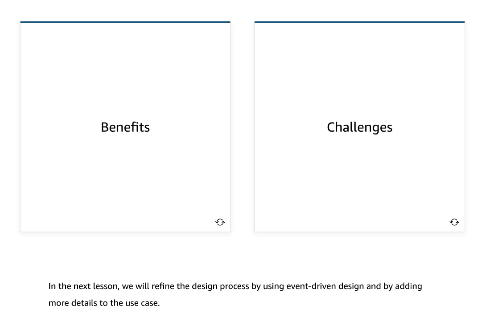

# 2

Created: 2023-09-14 20:24:33 -0600

Modified: 2023-09-14 20:24:36 -0600

---

Summary

The module discusses the transition from traditional monolithic architectures to serverless architectures by using the analogy of a food truck (monolith) versus a sit-down diner (serverless). It highlights the benefits and challenges of moving to a distributed serverless model, including the use of purpose-built data stores and the need to optimize for different access and query patterns.

Facts

- The analogy of a food truck (monolithic) versus a sit-down diner (serverless) is used to illustrate the shift from traditional to serverless architectures.
- In a food truck, one entity handles all tasks, while in a sit-down diner, specialized roles exist for various tasks.
- Serverless architecture involves decomposing applications into smaller, interconnected components, akin to the diner's specialized roles.
- Benefits of serverless include the use of purpose-built data stores, such as NoSQL databases, in-memory caches, and time series data, based on specific data requirements.
- Serverless architectures allow optimization for different access and query patterns, offering choices like relational databases and in-memory caches to cater to various needs.
- Scalability is improved in serverless as databases can be scaled independently, based on load and location.
- Challenges include dealing with eventual consistency in distributed systems, distributed transactions, and handling partial completions in multi-service workflows.
- ETL (Extract, Transform, Load) processes may be required to manage redundant data storage in multiple locations to meet specific application requirements.

{width="5.0in" height="2.9097222222222223in"}

![Distributed services mean distributed data A key benefit of distributed data is being able to choose a purpose-built data store that makes sense for the service instead of settling for one do-it-all database. This lets you match each data store to the access and query patterns to optimize for that pattern. It also lets you scale database choices independently rather than buy capacity for the most demanding component. The challenge is that now you don't have one database to read from and write to; you have a lot of distributed stores to deal with and must find ways to share data as needed. This means you have to accept eventual consistency. To learn more about benefits and challenges, choose each card below ](../../../media/AWS-Developing-Serverless-Solutions-on-AWS-Module-1-2-image2.png){width="5.0in" height="2.736111111111111in"}

{width="5.0in" height="3.3680555555555554in"}

{width="5.0in" height="3.263888888888889in"}

