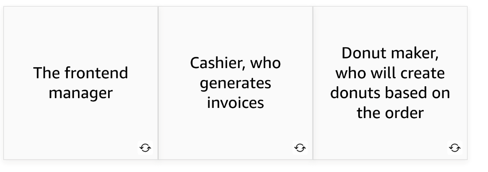
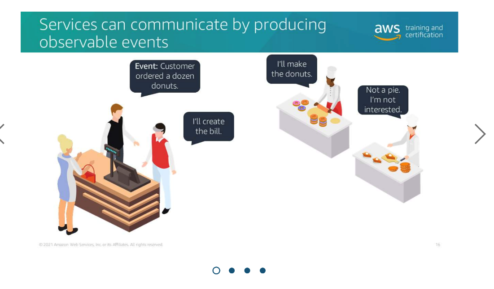
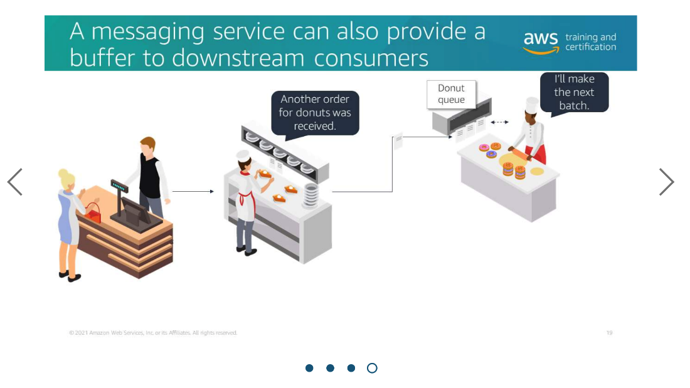

---

Summary

The module discusses event-driven design in serverless architectures, emphasizing the use of events to facilitate communication between different services or components within an application. It explores the benefits of event-driven design, including asynchronous processing, decoupling of services, and scalability.

Facts

- Event-driven design is a common pattern used in serverless architectures to enable communication between various components or services.
- The analogy of a sit-down diner with different roles and events is used to illustrate event-driven design.
- In event-driven architecture, events represent something that has occurred, such as a customer order or a specific action in the system.
- Services communicate by producing and consuming events, and event producers use messaging services to share events with interested consumers.
- Event-driven architecture allows for asynchronous processing, meaning actions are triggered by events without the need for immediate responses.
- Events can be used to share information across services, and services can subscribe to specific events they are interested in.
- New services can be added without modifying existing services by subscribing them to relevant events.
- Messaging services can provide a buffer, allowing for scalability and efficient processing of events, especially when dealing with resource-intensive tasks.
- Event-driven design promotes loose coupling between services, making it easier to adapt and extend applications.

![In this lesson, you learn the process of event-driven design in the context of a donut store. Prepare the order. Prepare the bill. 0K, I'll prepare the order. OK, here's the bill. Scenario Consider a scenario of donut store. There are two components here: the frontend and the backend. The frontend manager receives input from a customer. The manager then asks the baker to prepare the order and also asks the cashier to prepare the bill. The control flow starts from the executive, who invokes the functionality of baker and cashier. The executive then receives the deliverables from the baker and cashier and delivers it to the customer. ](../../../media/AWS-Developing-Serverless-Solutions-on-AWS-Module-1-3-image1.png)

![API-driven architecture A common way of making components of an application work together is through an API-driven, request-response architecture, where you have requests and responses. API contract between Order and Donut APIs Request: Donuts The producer service needs to know how to interact with each consumer. order API Response: Invoice Donut API Request Create Invoice Invoice API API contract between Order and Invoice APIs The frontend manager, which is the Order API, sends a request to the Invoice API and the Donut API. The APIs respond appropriately with the invoice for the order and the prepared donuts, respectively. The APIs provide the contract between the product and the consumer of the service. This establishes how the producer communicates with the consumer, what information will be passed between them, and what to do if the consumer doesn't respond as expected. Even if each of the consumer service has a really well- built API, the order service is still responsible for talking to each of them. ](../../../media/AWS-Developing-Serverless-Solutions-on-AWS-Module-1-3-image4.png)

![The communication between the services can be synchronous or asynchronous. To learn more about each type of communication, choose the appropriate tab. SYNCHRONOUS COMMUNICATION ASYNCHRONOUS COMMUNICATION In synchronous communication, the client makes a request to Service A. Service A calls Service B, but then Service A waits for Service B to respond before it continues on and eventually responds to the client. Example: When the order service sends a request to the Invoice API, the invoice service creates the invoice and immediately responds with the completed invoice for the customer. The order service doesn't continue until the invoice service completes its work and returns the response. ](../../../media/AWS-Developing-Serverless-Solutions-on-AWS-Module-1-3-image5.png)

![SYNCHRONOUS COMMUNICATION ASYNCHRONOUS COMMUNICATION In asynchronous communication, event-driven architecture, there is no response path. The service surfaces the event and then immediately moves forward. The tradeoff here is that there's no direct channel for Service B to pass information back to Service A, besides confirming it received the event. But, in many cases, you don't need that explicit coupling between the request and response channels. Example: When the order service requests donuts from the Donut API, the API doesn't reply with the completed donuts. There are downstream steps that have to happen to retrieve the donuts from the shelf, or perhaps make the donuts to fulfill the order. The order service doesn't have to wait for those steps to continue with its next order. Note that the order service probably receives an acknowledgement from the donut service right away, with some identifier that it can use in the order process to be able to check when the donuts are ready. The work that completes the order is happening asynchronously, and doesn't prevent the order service from moving on to the next order. ](../../../media/AWS-Developing-Serverless-Solutions-on-AWS-Module-1-3-image6.png)

![Event-driven architecture Event-driven architecture can allow you to decouple your services, which increases developer velocity, and can make it easier for you to debug applications. It also can help remove the bottleneck that occurs when features expand across different teams, which means that teams can progress more independently. An event represents a change in state, or an update. For example: an item is placed in a shopping cart, a file is uploaded to a storage system, or an order becomes ready to ship. Events can either carry the state (such as the item name, price, or quantity in an order) or contain identifiers (for example, "order #8942 was shipped") needed to look up related information. ](../../../media/AWS-Developing-Serverless-Solutions-on-AWS-Module-1-3-image8.png)

![A messaging service can also provide a buffer to downstream consumers. An example of this is a queue or stream that stores events that the consumer can pick up at their own pace. For example, the donut service might have its own order queue that collects the incoming order events from the kitchen manager, and the donut maker then picks them up in controlled batches. So far, you have learned about various aspects of event-driven design. The next lesson covers AWS services to implement the design. aws 02023, Amazon Web Services, Inc. or its affiliates. All rights reserved. ](../../../media/AWS-Developing-Serverless-Solutions-on-AWS-Module-1-3-image13.png)

