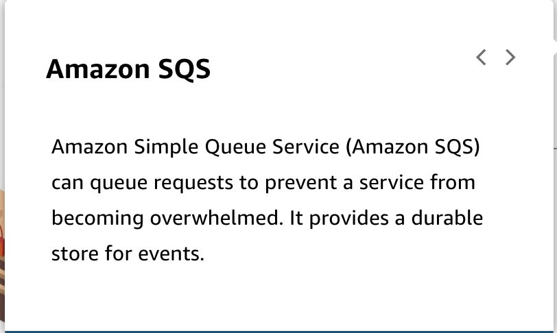

---

Summary

This module provides a brief introduction to various AWS services that can be used to build a serverless architecture. It emphasizes best practices for serverless applications, including decoupled event-driven patterns, serverless compute using AWS Lambda, purpose-built serverless data stores, managed services for service integrations, deployment frameworks for infrastructure as code, and creating asynchronous workflows through event routing systems, queues, and streams.

Facts

- The module introduces key AWS services for building serverless architectures.
- API Gateway is used to host REST APIs and route requests to AWS Lambda for serverless compute.
- EventBridge is discussed as a platform for writing events that are delivered to multiple subscribers, facilitating event-driven communication.
- Amazon SQS (Simple Queue Service) is a queue service for writing and consuming messages, providing a way to manage message-based communication.
- SNS (Simple Notification Service) is mentioned for notifications, enabling multiple subscribers to receive messages via topics.
- Kinesis is introduced as a service for ingesting high volumes of data with low latency, useful for streaming data.
- Best practices for serverless applications include using decoupled event-driven patterns for integration, leveraging AWS Lambda for serverless compute, selecting purpose-built serverless data stores, using managed services for service integrations, adopting deployment frameworks for infrastructure as code, and creating asynchronous workflows through event routing systems, queues, and streams.
- Asynchronous workflows in an event-driven architecture involve events triggering processing in multiple services without the need for immediate request-response interactions.
- 

- 

- 

- 

- 

- 
- 

