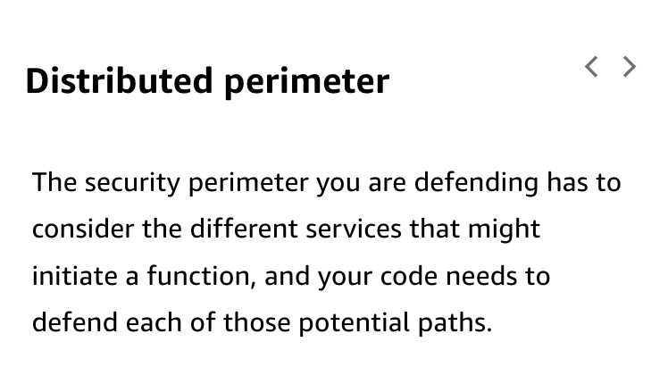

# 33

Created: 2023-09-27 21:50:41 -0600

Modified: 2023-10-22 17:27:58 -0600

---

Summary

This module provides an overview of security considerations and best practices when building serverless applications, highlighting the importance of various security features, techniques, and AWS services.

Facts

- Security is crucial in both IT and cloud environments, especially in serverless applications.
- Serverless security considerations differ from traditional computing environments.
- The module will cover:
  - Different security threats prevalent in the digital realm.
  - Application of security best practices for serverless platforms.
  - Security implementation at all application layers, not just the boundary.
  - Features of identity and access control for APIs and invoking Lambda functions.
  - Importance of data protection, focusing on encryption and its various types.
  - Attack protection, including defense against DDOS and SQL injections.
  - Significance of auditing, tracing, and automation for monitoring security events.
- Emphasizes the principle of least privilege, ensuring entities only have necessary permissions.
- Importance of securing data in transit (over networks) and at rest (in storage).
- Code should be security-conscious, preventing vulnerabilities like SQL injection.
- AWS services like CloudTrail, CloudWatch, and others assist in environment monitoring and auditing.
- Serverless environments, e.g., AWS Lambda, are ephemeral, providing security advantages but also challenges in terms of data persistence.
- Serverless applications present a distributed perimeter, differing from traditional hardened network perimeters.
- Individual serverless services have unique security configurations.
- Security tools traditionally used in persistent servers, such as agents, are not applicable in ephemeral serverless environments.
- Upcoming discussions will delve into:
  - Security application at all layers.
  - Robust identity access controls.
  - Data protection during transit and storage.
  - Minimizing potential attack surfaces.
  - Mitigating DDOS attacks.
  - Inspection and protection mechanisms.
  - Enhancing auditing and traceability.
  - Automation of security practices.

{width="5.0in" height="2.3958333333333335in"}

{width="4.0in" height="3.3229166666666665in"}

{width="5.0in" height="2.8645833333333335in"}

{width="5.0in" height="3.875in"}

{width="5.0in" height="2.3333333333333335in"}

{width="5.0in" height="2.6041666666666665in"}

![Security threats and design principles To learn more about security threats and security design principles, expand each of the two categories. OWASP Top 10 Security Threats 1. Injection (code) 2. Broken authentication (identity and access) 3. Sensitive data exposure (data) 4. XML external entities (XXE) (code) 5. Broken access control (identity and access) 6. Security misconfiguration (logging and monitoring) 7. Cross-site scripting (XSS) (code) 8. Insecure desterilization (code) 9. Using components with known vulnerabilities (code and infrastructure) 10. Insufficient logging and monitoring (logging and monitoring) ](../../../media/AWS-Developing-Serverless-Solutions-on-AWS-Module-10-33-image7.png){width="5.0in" height="4.083333333333333in"}

{width="5.0in" height="2.7708333333333335in"}

{width="5.0in" height="3.0416666666666665in"}

