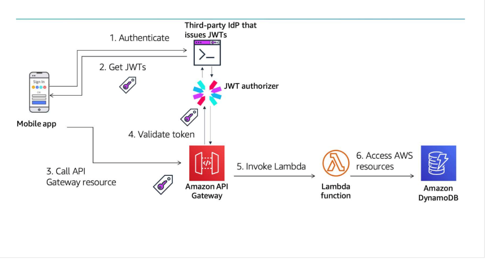
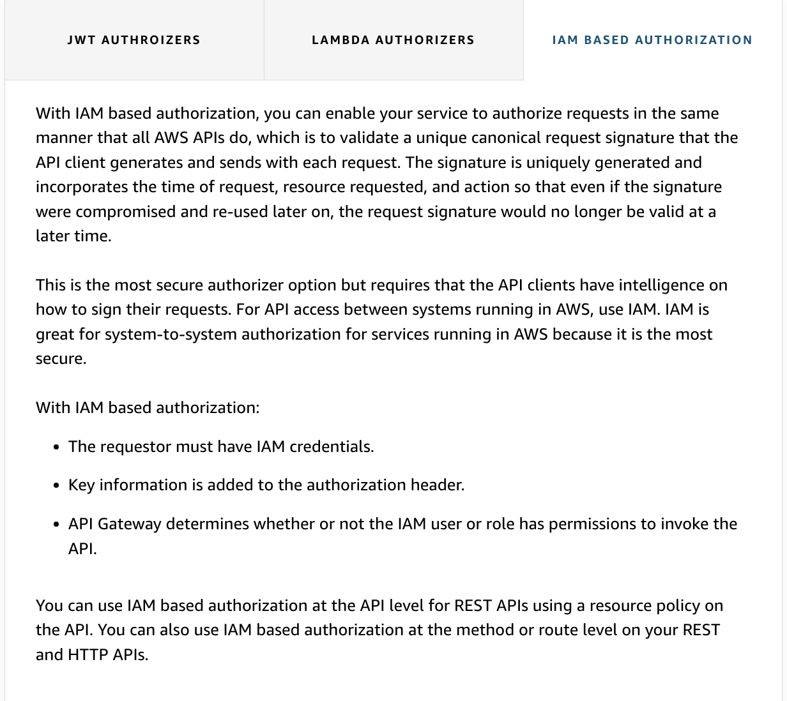
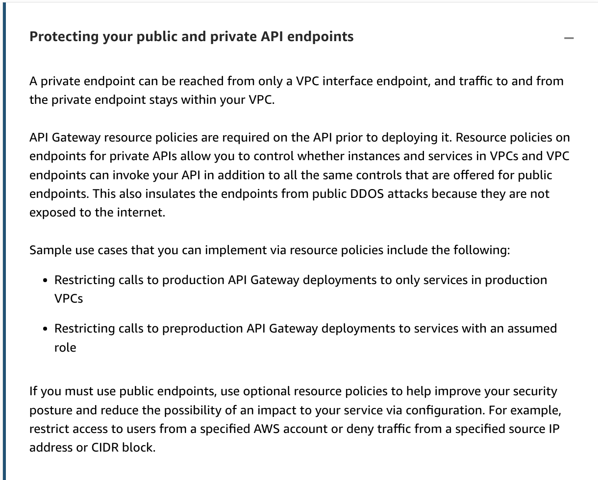
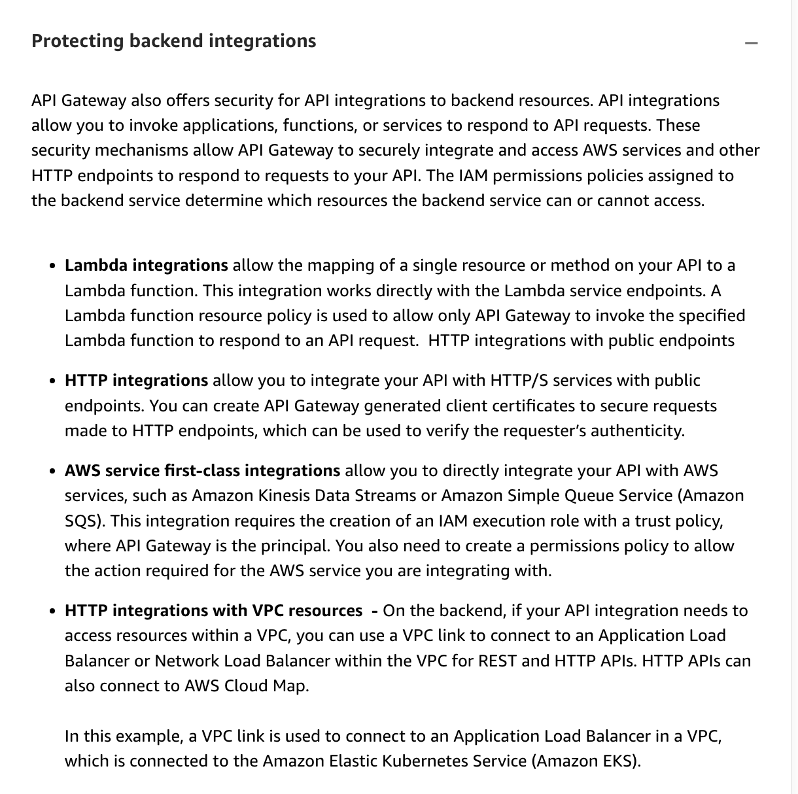
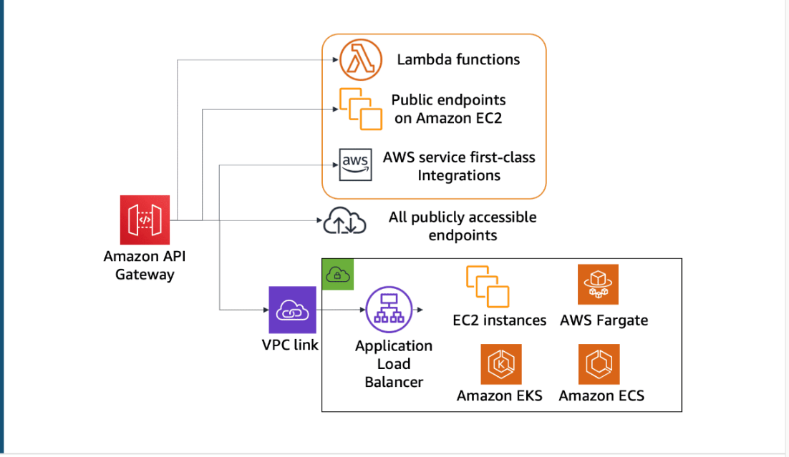
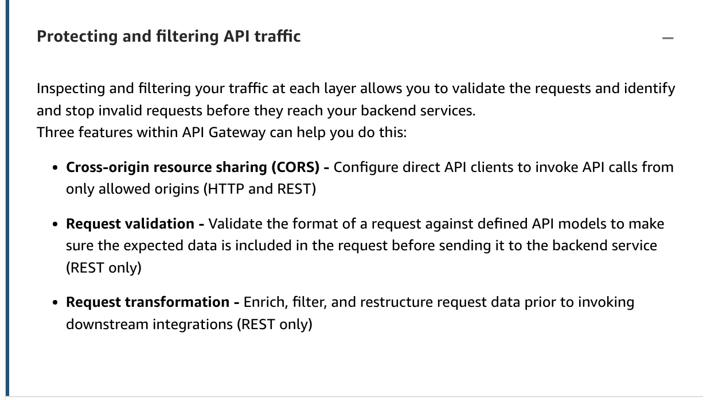

# 35

Created: 2023-09-28 12:00:38 -0600

Modified: 2023-10-22 17:28:08 -0600

---

Summary

API Gateway offers a comprehensive suite of security features, including various types of authorizers, mutual TLS, and integrations with other AWS services, to ensure secure access and protection against potential threats.

Facts

- API Gateway provides mechanisms to control access to APIs.
- There are different types of authorizers for API Gateway:
  - JWT Authorizers, which support Cognito and Cognito user pools for REST APIs.
  - Lambda authorizers allow custom code for authorization.
  - IAM-based authorization uses role-based access with Signature Version 4.
- Mutual TLS (mTLS) in API Gateway ensures both client and server prove their identities.
- JWT authorization for HTTP API involves third-party identity providers like Amazon or Google.
- ![There are two primary aspects of application security around API Gateway - Controlling access to APIs and Protection to APIs after access is granted. Controlling access to APIs The first step to preventing unwanted access is implementing Amazon Cognito or another third- party provider for authentication in front of your APIs. Additionally, you need to secure your APIs to prevent unauthorized users from interacting with them. AWS Identity and Access Management (IAM) plays an important role in controlling access and authorization among your components. IAM administrators control who can be authenticated (logged in) and authorized (have permissions) to use Amazon API Gateway resources. API Gateway integrates with IAM for a number of purposes. ](../../../media/AWS-Developing-Serverless-Solutions-on-AWS-Module-10-35-image1.png){width="5.0in" height="2.951388888888889in"}
- 

{width="5.0in" height="5.319444444444445in"}

{width="5.0in" height="2.673611111111111in"}

- Lambda authorizers return an IAM permission after validating identity.

{width="5.0in" height="4.326388888888889in"}

{width="5.0in" height="2.75in"}

- IAM-based authentication can be applied directly on the resource policy.

{width="5.0in" height="4.451388888888889in"}

{width="5.0in" height="2.0625in"}

- API Gateway can create private endpoints for REST APIs only reachable from within a VPC.

{width="5.0in" height="4.5625in"}

- API Gateway communicates over HTTPS, but sensitive data should still be encrypted client-side.
- Logs and API definitions in API Gateway can be encrypted.
- API Gateway can integrate with resources within a VPC using a VPC link.

{width="5.0in" height="4.013888888888889in"}

{width="5.0in" height="2.8680555555555554in"}

{width="5.0in" height="4.965277777777778in"}

{width="5.0in" height="2.9097222222222223in"}

- To protect against rate-based attacks, API Gateway uses the token bucket algorithm.
- ![Protecting from a rate-based attack using API rate limiting The scaling module talks a bit more about API Gateway throttling, but it also applies to securing your APIs. In particular, the API Gateway burst capacity prevents your API from being overwhelmed by too many requests. API Gateway throttles requests to your API using the token bucket algorithm. A token in this case counts as a request, and the burst is the maximum bucket size. At a high level, requests come in to the bucket and are fulfilled at a steady rate. If the rate at which the bucket is being filled causes the bucket to fill up and exceed the burst value, a 429 Too Many Requests error is returned. API Gateway sets a quota on a steady-state rate and a burst of request submissions against all APIs in your account. You cannot control the burst capacity, but you can request a modification to the account quota. You can also configure throttling options for your APIs to restrict the volume of requests ](../../../media/AWS-Developing-Serverless-Solutions-on-AWS-Module-10-35-image13.png){width="5.0in" height="3.1527777777777777in"}

- Throttling can be set by stage, route, method, or client.
- API Gateway supports API keys and usage plans to set quotas and limits for clients.
- Cross-origin resource sharing (CORS) can be set up to allow requests only from specific domains.
- Request transformation and validation are available for REST APIs using models and Velocity Template Language (VTL).
- {width="5.0in" height="2.8541666666666665in"}

- {width="5.0in" height="2.75in"}
- CloudFront, AWS WAF, and AWS Shield offer additional layers of protection before traffic reaches API Gateway.
- AWS Shield provides protection against common DDOS attacks, with an advanced version available for enhanced support.

![Protecting from malicious access before they reach API Gateway The AWS Shield Standard service is automatically available to AWS resources and protects them from common network, and transport layer DDOS attacks. Note that AWS Shield Advanced provides higher levels of protection against attacks that target applications running on Amazon EC2, Elastic Load Balancing, Amazon CloudFront, AWS Global Accelerator, and Amazon Route 53 and includes proactive event response and specialized support. AWS WAF includes Shield Standard protection by default. AWS WAF is a web application firewall that helps protect your web applications or APIs against common web exploits. You can deploy AWS WAF on CloudFront as part of your content delivery network (CDN) solution or on API Gateway for your APIs. You can use managed rules, which are preconfigured sets of rules. The managed rules for AWS WAF address issues like the OWASP Top 10 security risks. These rules are regularly updated. With AWS WAF, you can create security rules that block common attack patterns, such as SQL injection or cross-site scripting, and rules that filter out specific traffic patterns that you define. CloudFront and Route 53 provide comprehensive availability protection against all known layer 3 and 4 attacks. CloudFront distributes traffic across multiple edge locations and filters requests to make sure that only valid requests are forwarded to API Gateway. When integrating CloudFront with Regional API endpoints, CloudFront also supports geoblocking, which you can use to prevent requests from being served from particular geographic locations. You can configure API Gateway to accept requests only from CloudFront and use origin access identity (OAI) with Amazon S3 to allow bucket access only through CloudFront. ](../../../media/AWS-Developing-Serverless-Solutions-on-AWS-Module-10-35-image16.png){width="5.0in" height="4.104166666666667in"}

{width="5.0in" height="2.3194444444444446in"}

