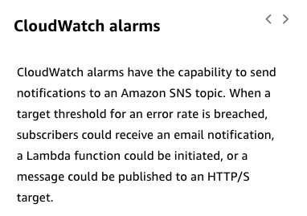

# 38

Created: 2023-09-29 16:34:17 -0600

Modified: 2023-10-22 17:30:38 -0600

---

Summary

To ensure robust security in serverless architectures, it's essential to monitor, alert, and audit actions in real-time, integrate log and metric collections, and leverage AWS services like CloudTrail, AWS Config, and WAF for auditing, traceability, and automation.

Facts

- Monitoring, alerting, and auditing actions in real-time is a best practice.
- CloudTrail captures API activity within an AWS account, providing a detailed event history.
  - It can track events on resources in an S3 bucket and detect unusual API call patterns using CloudTrail Insights.
- AWS Config audits account resources, evaluates compliance against configuration standards, and can take remediation actions.
  - It answers questions about resource modifications, compliance, and resource relationships.
- WAF can automatically block high-volume traffic from specific IP addresses.
- EventBridge captures AWS service events, allowing for automation of security analysis.

CloudWatch alarms can send notifications (e.g., texts or emails) when specific error rate thresholds are breached.

- Ephemeral environments in serverless architectures necessitate persistent logging for investigation.
- A distributed perimeter requires security application at all layers.
- Implementing a strong identity and access foundation, using the principle of least privilege, is crucial.
- Data should be protected both in transit and at rest.
- Protecting against attacks using services like Shield or WAF and safeguarding code against vulnerabilities like SQL injection is essential.
- Automating security best practices using services like AWS Config is recommended.
- ![Auditing and traceability CloudTrail and AWS Config CloudTrail is enabled when you create an account. When activity occurs in your AWS account, that activity is recorded in a CloudTrail event, and you can see recent events in the event history. The CloudTrail event history provides a viewable, searchable, and downloadable record of recent CloudTrail events. Details of API actions include the identity of the requestor, time of the API call, request parameters, and response elements returned by the service. Use this history to gain visibility into actions taken in your AWS account in the AWS Management Console, AWS SDKs, command line tools, and other AWS services. A trail is a configuration that delivers CloudTrail events to an Amazon SS bucket, CloudWatch Logs, and CloudWatch Events. Create your own trail to maintain a longer history of events. Trails track events performed on or within resources in your AWS account and write them to an Amazon SS bucket. For example, a trail captures modifications to your API Gateway APIs. Optionally, add data events to track Amazon SS object-level API activity (for example, a user uploads to the bucket) or Lambda invoke API operations on Lambda functions in the account. ](../../../media/AWS-Developing-Serverless-Solutions-on-AWS-Module-10-38-image1.png){width="10.083333333333334in" height="7.583333333333333in"}

- ![Configure AWS CloudTrail Insights to help you identify and respond to unusual activity associated with write API calls. CloudTrail Insights tracks normal patterns of API call volume and generates insights when the volume pattern is abnormal. AWS Config provides a normalized snapshot of how your resources are configured and lets you create rules that enforce the compliant state of those resources. An AWS Config rule represents desired configuration settings for specific AWS resources or for an entire AWS account. If resources violate a rule, AWS Config flags this as noncompliant and notifies you through Amazon Simple Notification Service (Amazon SNS). AWS Config provides customizable, predefined rules to help you get started. You might also want AWS Config rules that help standardize how your developers write Lambda functions. You might have rules based on runtime environment, handler name, code size, memory allocation, timeout settings, concurrency settings, or execution role. ](../../../media/AWS-Developing-Serverless-Solutions-on-AWS-Module-10-38-image2.png){width="10.083333333333334in" height="6.90625in"}

- ![Security automation examples Following are some of the services, that can work together to provide automated security checks and remediation. To learn more, choose each hotspot. AW AF Automatically block IP addresses that are sending requests over a specified threshold. AW onfig Enforce that API Gateway APIs must be private. Cloud il and EventBridge Initiate a Lambda function when an API is created, updated, or deleted. O Clou atch alarms Send a CloudWatch email when a target error rate threshold is breached. That wraps the module on serverless application security. There is a Knowledge Check following the module. ](../../../media/AWS-Developing-Serverless-Solutions-on-AWS-Module-10-38-image3.png){width="10.083333333333334in" height="7.416666666666667in"}

- {width="7.833333333333333in" height="7.8125in"}

- ![AWS Config AWS Config provides a set of AWS managed rules to evaluate whether your AWS resources comply with common best practices. You can write custom rules. These rules can identify whether a resource is compliant or not. You can manually or automatically remediate noncompliant resources. For example, it would be possible to enforce that APIs defined in API Gateway must be private. Any attempt to change to a Regional or edge API could invoke a function to update the API back to a private endpoint. ](../../../media/AWS-Developing-Serverless-Solutions-on-AWS-Module-10-38-image5.png){width="8.041666666666666in" height="8.1875in"}

- {width="8.104166666666666in" height="8.104166666666666in"}

- {width="8.041666666666666in" height="5.6875in"}

![CloudTrail • Answers the questions: Which resources were modified? Who modified the resources? • When were they modified? • Records IAM user, IAM role, and AWS service API activity in your account • Provides full details about the API action Tracks events performed on or within resources and writes to an Amazon S3 bucket • Tracks normal patterns of API call volume and generates insights (AWS CloudTrail Insights) AWS Config • • Answers the questions: • Does this modification comply with our rules? • How do these resources relate to other resources? Provides a normalized snapshot of how your resources are configured; lets you create rules that enforce the compliant state of those resources Can flag and notify when resources violate a rule Includes prebuilt remediation actions Lets you standardize development practices ](../../../media/AWS-Developing-Serverless-Solutions-on-AWS-Module-10-38-image8.png){width="10.083333333333334in" height="4.0in"}

