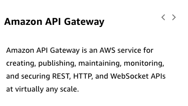
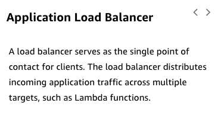
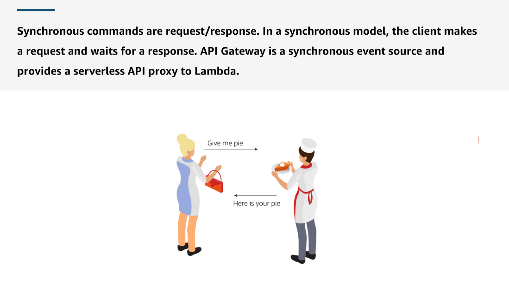
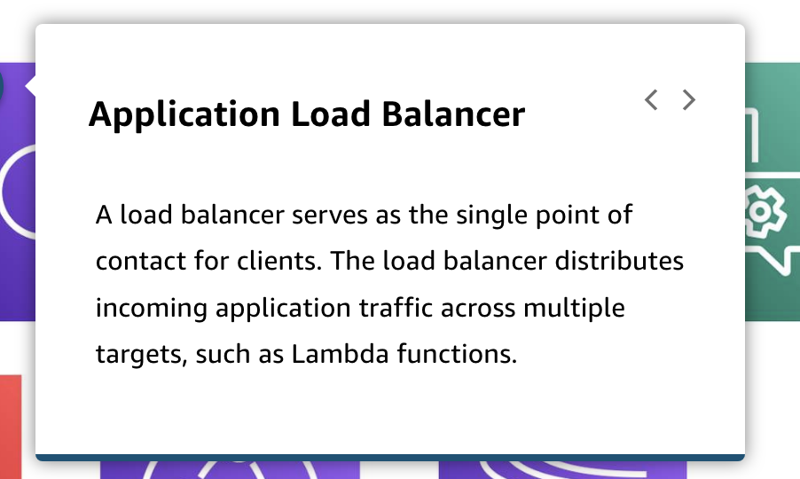
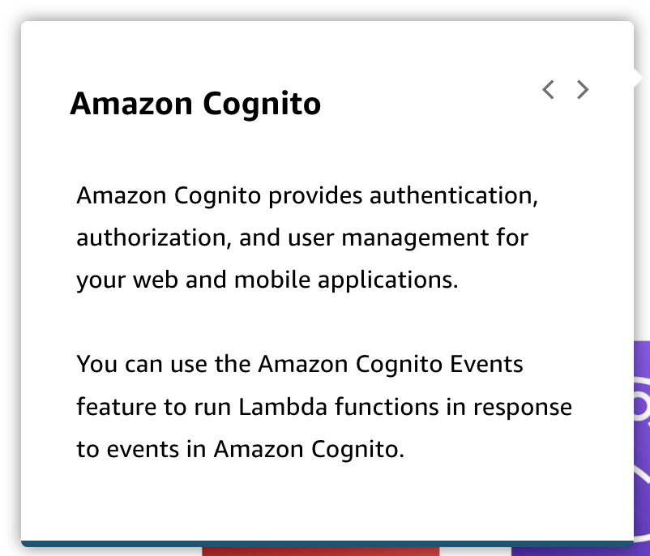

# 5

Created: 2023-09-14 21:10:40 -0600

Modified: 2023-10-22 17:25:11 -0600

---

Summary

In module two, "API-Driven Development and Synchronous Event Sources," the focus is on Amazon API Gateway and its role as the front door for hosting APIs in a serverless architecture. The module covers synchronous event sources, request-response models, types of APIs hosted with API Gateway, its use in proxying AWS Lambda, and the introduction of GraphQL APIs using AWS App Sync.

Facts

- Module two centers on Amazon API Gateway in the context of serverless development.
- It delves into the concept of synchronous event sources, which follow a request-response model where a client sends a request and waits for a response.
- Synchronous event sources involve clients waiting for backend processing before receiving a response.
- The module highlights Amazon API Gateway's role as the front door for hosting APIs in a serverless architecture.
- It discusses the various types of APIs that can be hosted using API Gateway.
- AWS Lambda is a primary use case for API Gateway, as it can proxy many AWS services and endpoints.
- GraphQL APIs are introduced in the module through the service AWS App Sync, expanding the discussion on API-driven development and event handling in serverless architectures.

{width="3.9027777777777777in" height="2.2222222222222223in"}

{width="3.9166666666666665in" height="2.0972222222222223in"}

{width="3.638888888888889in" height="2.9097222222222223in"}

{width="5.0in" height="2.9097222222222223in"}

![Distributed services mean distributed data A key benefit of distributed data is being able to choose a purpose-built data store that makes sense for the service instead of settling for one do-it-all database. This lets you match each data store to the access and query patterns to optimize for that pattern. It also lets you scale database choices independently rather than buy capacity for the most demanding component. The challenge is that now you don't have one database to read from and write to; you have a lot of distributed stores to deal with and must find ways to share data as needed. This means you have to accept eventual consistency. To learn more about benefits and challenges, choose each card below ](../../../media/AWS-Developing-Serverless-Solutions-on-AWS-Module-2-5-image5.png){width="5.0in" height="2.736111111111111in"}

{width="5.0in" height="3.3680555555555554in"}

{width="5.0in" height="3.263888888888889in"}

{width="5.0in" height="2.8125in"}

![Synchronous commands are a relatively simple interaction common to create, read, update, and delete (CRUD) API actions. The advantage of this approach is the immediate response to your API call. You can also use the API to control aspects of the request and response. Examples are validating characteristics of the request before the consumer processes it or reformatting the response before passing it to the client. The disadvantage is that if something goes wrong or takes a long time downstream, the whole process is held up. Managing synchronous event sources Synchronous invocations from event sources are the most straightforward way to invoke microservices in a serverless application. The business logic of the microservices is widely implemented as Lambda functions on AWS infrastructure. Synchronous invocations are well suited for short-lived Lambda functions. Although Lambda functions can run for up to 15 minutes, synchronous callers might have shorter timeouts. The following AWS services can synchronously invoke a Lambda function (microservice) in a serverless environment. ](../../../media/AWS-Developing-Serverless-Solutions-on-AWS-Module-2-5-image9.png){width="5.0in" height="4.291666666666667in"}

{width="5.0in" height="3.7222222222222223in"}

{width="5.0in" height="2.9930555555555554in"}

{width="5.0in" height="2.9930555555555554in"}

{width="5.0in" height="4.270833333333333in"}

{width="5.0in" height="5.3125in"}

{width="5.0in" height="4.118055555555555in"}

{width="5.0in" height="4.131944444444445in"}

{width="5.0in" height="4.236111111111111in"}

