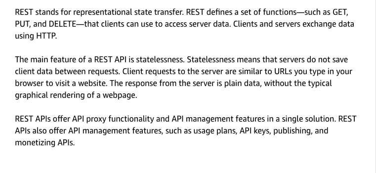
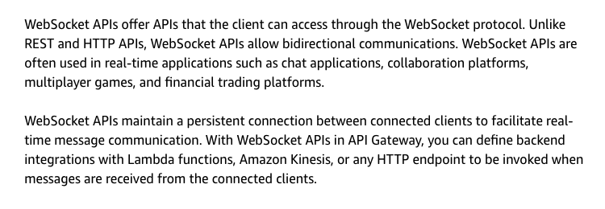
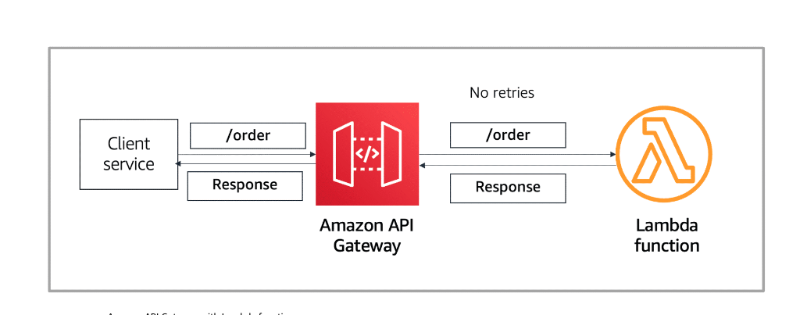
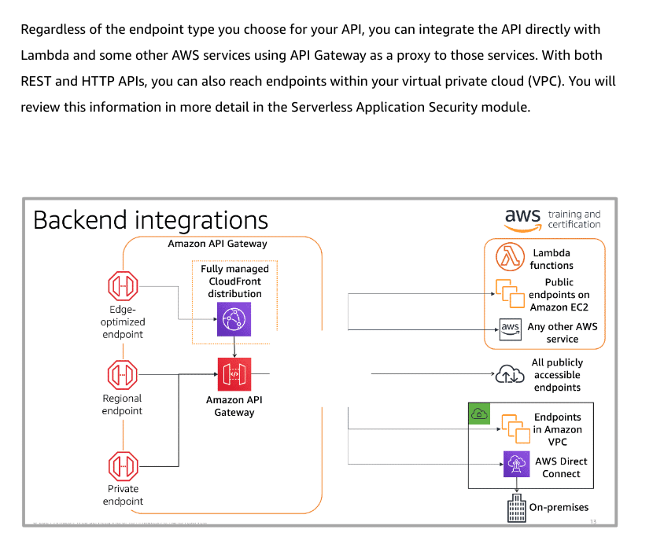

# 6

Created: 2023-09-15 20:01:57 -0600

Modified: 2023-10-22 17:25:13 -0600

---

Summary

API Gateway is a crucial component for managing synchronous event sources. It acts as the front door for applications, allowing integration with various backend services, such as AWS Lambda, and offers features like stage deployment, SDK generation, and support for OpenAPI 3.0 definitions. There are different API types, including REST, WebSocket, and HTTP APIs, each with distinct use cases. Endpoint types include edge-optimized, regional, and private, depending on user base and security requirements.

Facts

- API Gateway serves as the entry point for applications, simplifying API creation and management.
- It supports various API types, including REST, WebSocket, and HTTP APIs, each suited for specific use cases.
- Stage deployment allows hosting multiple API versions concurrently, facilitating canary deployments.
- SDK generation simplifies API invocation from client code.
- API Gateway supports OpenAPI 3.0 definitions for documentation and import/export.
- It can integrate with AWS services, acting as a proxy for services like DynamoDB.
- Custom integrations and simple proxies are possible, with HTTP APIs designed for speed and cost optimization.
- Security features include role-based access for Lambda function invocation, eliminating the need for Signature Version 4 authorization.
- Endpoint types include edge-optimized (global), regional (for specific regions), and private (REST APIs only, for VPC communication).
- {width="5.0in" height="2.888888888888889in"}

- {width="5.0in" height="4.791666666666667in"}

- {width="5.0in" height="2.2916666666666665in"}

- {width="5.0in" height="2.423611111111111in"}

- {width="5.0in" height="1.7291666666666667in"}
- Backend integrations can involve AWS Lambda, EC2 endpoints, various AWS services, publicly accessible endpoints, or private endpoints via VPC interface endpoints.

Regenerate

![API Gateway reduces the complexity of aws and building and maintaining APIs Developer features • create REST or websocket APIS Host multiple versions of an API • Generate SDKS for your APIS • Import/export Swagger or OpenAPl definitions • Integrate with other AWS services and backend4 • Create proxy or custom integrations Security and scale features Invoke Lambda without writing your Signature Version 4 authorization • Select the endpoint type that best matches your expected access patterns • Authorize access to your APIs • Throttle requests • Perform canary deployments • Integrate with AWS WAF ](../../../media/AWS-Developing-Serverless-Solutions-on-AWS-Module-2-6-image6.png){width="5.0in" height="2.7083333333333335in"}

{width="5.0in" height="1.9444444444444444in"}

****

![API Gateway has rich integration with AWS Lambda. In a synchronous invocation, the Lambda service sends the event directly to the function and then sends the response back to the invoker. API Gateway invokes Lambda functions synchronously and has a built-in timeout of 30 seconds. If the Lambda service cannot successfully invoke the function in 30 seconds, or if the function runs but generates an error, the error is returned to the API and the calling client. There are no retries built in, and the requesting event must wait for the response. This means it's the developer's job to write any error handling into the producer service or client that's making the request. To invoke a function synchronously with the AWS CLI, use the invoke command with the RequestResponse invoke type. ](../../../media/AWS-Developing-Serverless-Solutions-on-AWS-Module-2-6-image8.png){width="5.0in" height="2.423611111111111in"}

![Endpoint types An API endpoint is a point of communication among the components of an application. It is a hostname for an API in API Gateway that is deployed to a specific Region. There are three types of endpoints that can communicate with an API Gateway: Edge-optimized endpoints, Regional endpoints, and private endpoints. To learn more, choose each hotspot. Endpoint types Amazon API Gateway Fully managed CloudFront distribution API Gateway cache Amazon API Gateway Amazon CloudWatch monitoring aws training and -7 certification ** REST only Mobile clients Websites Services Customer- managed CloudFront distribution Applications and services in the same AWS Region Applications and services in Amazon VPC VPC interface endpoint Edge-optimized endpoint Regional endpoint +0 private endpoint ](../../../media/AWS-Developing-Serverless-Solutions-on-AWS-Module-2-6-image9.png){width="5.0in" height="4.25in"}

{width="3.7916666666666665in" height="3.1041666666666665in"}

{width="3.6597222222222223in" height="3.7569444444444446in"}

{width="3.7291666666666665in" height="2.5972222222222223in"}

{width="3.951388888888889in" height="2.951388888888889in"}

{width="5.0in" height="4.173611111111111in"}

Private is rest only

