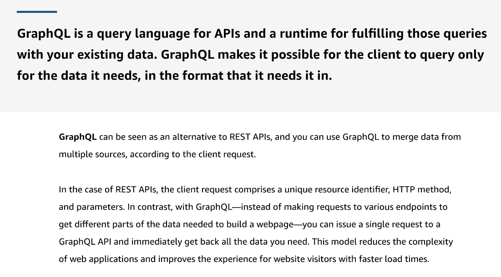
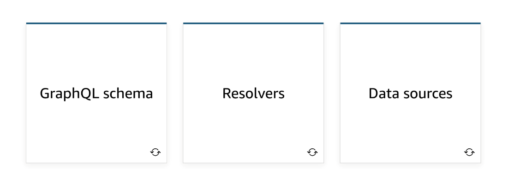
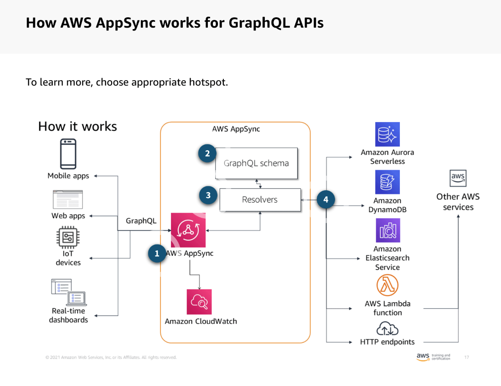
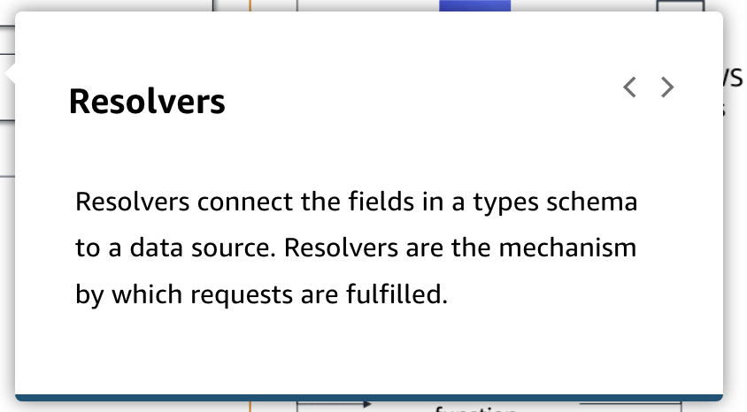
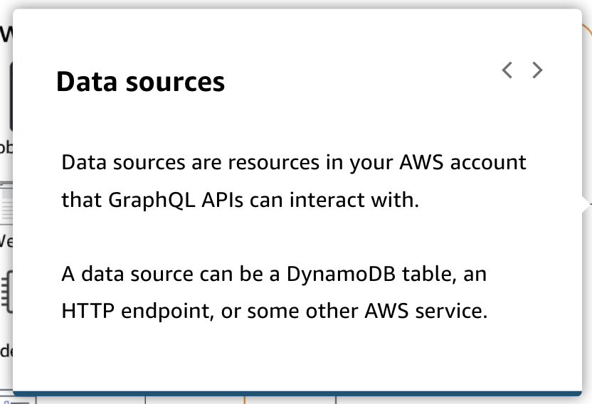
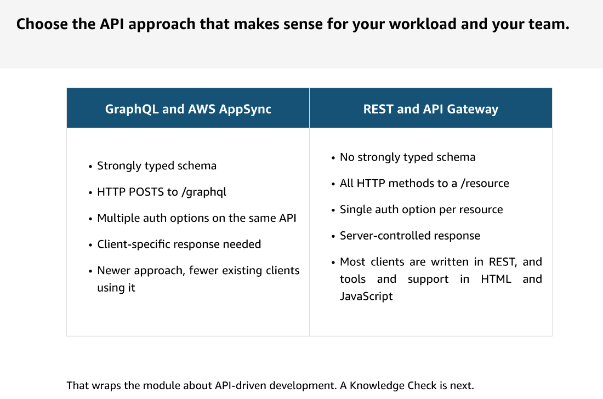
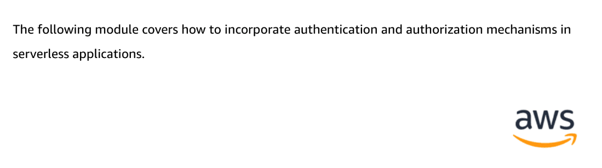

---

Summary

- GraphQL and AWS AppSync offer a more efficient way to retrieve data compared to traditional REST APIs by allowing clients to request multiple data types in a single query.
- GraphQL uses a predefined schema to specify the data that can be requested and the operations that can be performed.
- Resolvers in GraphQL determine where the requested data is sourced from.
- GraphQL provides a more strongly typed schema compared to API Gateway.
- GraphQL uses HTTP POST for queries, while API Gateway uses HTTP methods for resource routes.
- GraphQL allows for multiple authorization options on the same API, whereas API Gateway supports only one per resource.
- API Gateway can invoke Lambda functions synchronously and requires manual retry handling.
- API Gateway supports REST APIs, including HTTP APIs and WebSocket APIs, and can proxy requests to AWS services.
- GraphQL APIs are a newer technology that can consolidate multiple requests into one, making them suitable for specific use cases.

Facts

- GraphQL and AWS AppSync provide a more efficient alternative to REST APIs by allowing clients to request diverse data types in a single query.
- GraphQL uses predefined schemas to specify allowable data requests and operations.
- Resolvers in GraphQL locate and facilitate communication with the data sources.
- GraphQL enforces a strongly typed schema, unlike API Gateway.
- GraphQL uses HTTP POST for queries, whereas API Gateway relies on HTTP methods for routing.
- GraphQL offers multiple authorization options on a single API, whereas API Gateway supports only one per resource.
- API Gateway can invoke Lambda functions synchronously and requires manual retry implementation.
- API Gateway supports various REST APIs, including HTTP APIs and WebSocket APIs, and can proxy requests to AWS services.
- GraphQL APIs are newer and can consolidate multiple requests into one, making them suitable for specific use cases.

![REST API With a REST API, you might need to make multiple sequential calls to get the data that you need. In this example, you have a travel site, where users can select destinations and get details about the destination to help them make decisions about where to go. Typically with REST, each distinct type of information to be returned is handled by its own resource that you need to call. To fulfill this request, you need three different calls: the first to retrieve details about the selected destination, the second to get the weather for the destination, and the third to get the list of things to do associated with that destination. ](../../../media/AWS-Developing-Serverless-Solutions-on-AWS-Module-2-7-image11.png)

