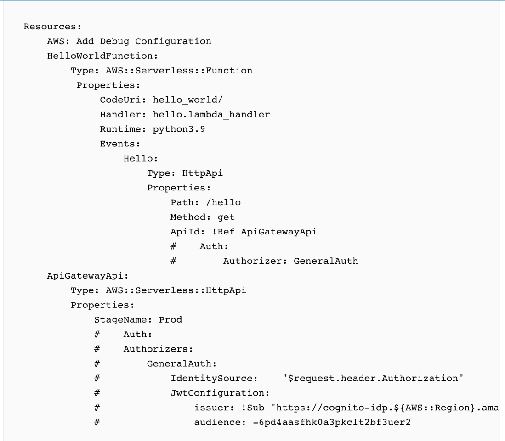
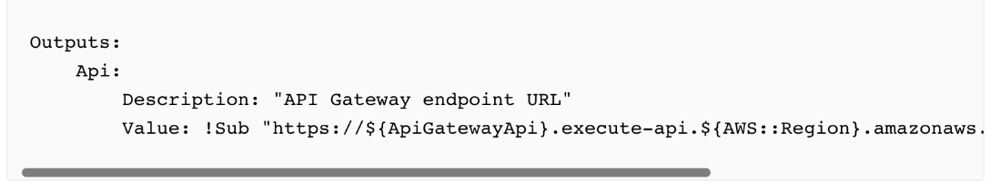
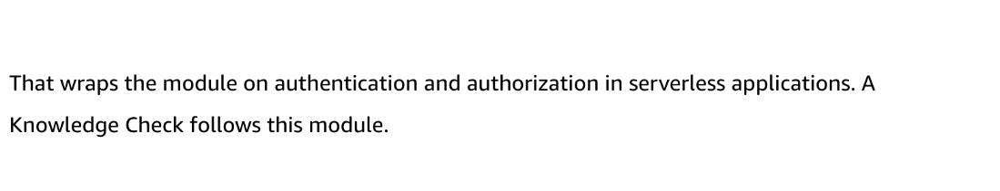

# 10.3.2

Created: 2023-09-23 11:02:41 -0600

Modified: 2023-10-22 17:25:31 -0600

---

Summary

The speaker discusses creating an authorizer for API Gateway hosted APIs using Amazon Cognito and a SAM template, demonstrating the process of setting up, testing, and authenticating API requests with JWT tokens obtained from Cognito.

Facts

- A SAM template on the speaker's laptop has created an API, consisting of a Lambda function called "Hello World function" and an HTTP API with a stage called "prod".
- The API, when curled, returns the string "hello" unauthenticated.
- Amazon Cognito is configured to host sign-in and sign-up screens for the application.
- Upon signing in, Cognito verifies the account and returns an ID token and an access token.

from jwt.io

- The access token, a JWT token, contains information about the identity returned from Cognito, including the issuer, client ID, type of token, scopes attached, and expiry dates.
- The speaker plans to use this access token to authenticate against the API by sending it to API Gateway.
- The SAM template is configured to create an authorizer in API Gateway, defining the identity source as the "authorization header" and specifying JWT configuration, including the issuer and the audience.
- API Gateway verifies tokens based on the specified claims and uses a public key from a well-known location to verify the signature on the token.
- After deploying the updated SAM template, the API Gateway has the newly defined authorizer, "GeneralAuth", associated with the "/hello" route.
- Attempts to curl the route without passing the authorization header now result in an "unauthorized" response.
- The access token from Cognito is stored in an environment variable and passed along in an authorization header to authorize the request to the "/hello" route, successfully returning the response from the Lambda function.
- The process involved updating the API Gateway API to have a JWT authorizer and associating it with the "/hello" route, then using a sample application to sign in using Cognito and authorize the request with the received access token.

{width="5.0in" height="2.5208333333333335in"}

{width="5.0in" height="2.3819444444444446in"}

{width="5.0in" height="2.3958333333333335in"}

{width="5.0in" height="1.9652777777777777in"}

{width="5.0in" height="4.368055555555555in"}

{width="5.0in" height="0.9583333333333334in"}

{width="5.0in" height="3.8125in"}

{width="5.0in" height="0.9583333333333334in"}

