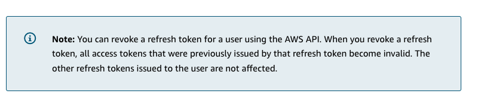

# 10

Created: 2023-09-22 17:38:08 -0600

Modified: 2023-10-22 17:25:26 -0600

---

Summary

Amazon Cognito is a versatile and scalable service that simplifies user authentication and authorization in serverless architecture, offering features like user pools, federated identities, and integration with API Gateway, and supporting various identity providers and security protocols.

Facts

- Amazon Cognito reduces the complexities of user authentication and authorization, offering a standards-based platform using OIDC, Open ID Connect, and OAuth 2 standards.
- Cognito can host sign-in and sign-up screens, eliminating the need for developers to code these screens.
- It supports federated sign-in through social (Facebook, Google, Amazon) and enterprise identities (SAML active directory-type authentication).
- Cognito can be configured as an Identity Provider (IdP) for a JWT authorizer, allowing API Gateway to accept tokens from Cognito as a form of authentication.
- It is a fully managed service, scalable up to hundreds of millions of users, and supports multi-factor authentication and advanced security features like risk-based adaptive authentication.

- ![Amazon Cognito reduces complexities aws training and -y certification of authenticating and authorizing users Developer features Security and scale features • Standards-based (OIDC and OAuth Fully managed service scalable to 1 OOS 2.0) authentication • Sign-in and sign-up with a customizable UI • Federated sign-in through third- party social or enterprise identity providers y Can be configured as an IdP for a JWT authorizer of millions of users Supports multi- r authentication • Advanced secul -h risk-based adaptive authentication Prevents the use of compromised credentials ](../../../media/AWS-Developing-Serverless-Solutions-on-AWS-Module-3-10-image1.png){width="5.0in" height="2.4583333333333335in"}

- Cognito user pools act as identity providers and profile management, hosting databases of users and supporting federation with third-party IdPs.
- Cognito federated identities create unique identities and return AWS credentials, allowing access to AWS resources based on attached policies.
- User pools return three types of JWT tokens upon successful authentication: identity token, access token, and refresh token.
  - Access tokens are used to authorize API calls and can include custom scopes.
  - Refresh tokens can be submitted back to Cognito to obtain new access tokens upon expiry.
- API Gateway can integrate with Cognito, verifying tokens and signatures and allowing or denying requests based on the verification.
- Cognito federated identities can exchange user pool tokens for temporary AWS credentials, allowing IAM authentication when talking to API Gateway or other AWS services.
- Cognito supports exchanging identities from social providers for AWS credentials, exemplifying federation.
- API Gateway offers three options for authentication and authorization: JWT-based authorizers, custom authorizers inside of Lambda, and IAM authentication using AWS credentials.
- Amazon Cognito user pools can host sign-up and sign-in options or use Cognito APIs for the same, while federated identities are used to exchange an identity for AWS credentials

![Authentication and Authorization Using Amazon Cognito The two main components of authentication and authorization in Amazon Cognito are user pools and identity pools. User pools are user directories that provide sign-up and sign-in options for your application users. You can use identity pools to grant access to other AWS services to your users. You can use identity pools and user pools separately or together. To learn more about user pools and identity pools, choose the appropriate tab. USER POOLS IDENTITY POOLS A user pool is a user directory in Amazon Cognito. With a user pool, your users can sign in to your web or mobile application through Amazon Cognito, or federate through a third-party identity provider (IdP). Whether your users sign in directly or through a third party, all members of the user pool have a directory profile that you can access through an SDK. User pools provide: Sign-up and sign-in services. A built-in, customizable web UI to sign in users. • Social sign-in with Facebook, Google, Login with Amazon, and Sign in with Apple, and through SAML and OIDC identity providers from your user pool. User directory management and user profiles. • Security features such as multi-factor authentication (MFA), checks for compromised credentials, account takeover protection, and phone and email verification. • Customized workflows and user migration through AWS Lambda triggers. ](../../../media/AWS-Developing-Serverless-Solutions-on-AWS-Module-3-10-image2.png){width="5.0in" height="5.291666666666667in"}

![USER POOLS IDENTITY POOLS With an identity pool, your users can obtain temporary AWS credentials to access AWS services, such as Amazon SS and DynamoDB. Identity pools support anonymous guest users, as well as the following identity providers that you can use to authenticate users for identity pools: Amazon Cognito user pools • Social sign-in with Facebook, Google, Login with Amazon, and Sign in with Apple OpenlD Connect (01 DC) providers SAML identity providers Developer authenticated identities ](../../../media/AWS-Developing-Serverless-Solutions-on-AWS-Module-3-10-image3.png){width="5.0in" height="2.8958333333333335in"}

![Tokens used for authentication Amazon Cognito authenticates users and grants access to resources with tokens. Tokens have claims, which are pieces of information about the user. There are three types of tokens: ID tokens, access tokens, and refresh tokens. To learn more about each type of token, choose each flashcard. The ID token contains claims about the identity of the authenticated user, such as name and email address. The access token contains claims about the authenticated user, a list of the user's groups, and a list of scopes. You can use the refresh token to retrieve new ID and access tokens. ](../../../media/AWS-Developing-Serverless-Solutions-on-AWS-Module-3-10-image4.png){width="5.0in" height="3.1666666666666665in"}

{width="5.0in" height="1.09375in"}

![Authorization flow for a REST API using Amazon Cognito user pools 1. Authenticate 2. Get JWTs Mobile app 3. Call API Gateway resource Amazon Cognito user pools 4. Validate ID token Amazon API Gateway 5. Invoke Lambda Lambda function 6. Access AWS resources Amazon DynamoDB The following steps implement an authorization flow that uses Amazon Cognito user pools: 1. The client first authenticates with the user pool. 2. The client gets three JWTs in return. 3. The client passes the ID and access token in the header as part of the call to API Gateway. 4. API Gateway validates the token. 5. API Gateway invokes the resource that it integrates with on the backend (in this example, a Lambda function). 6. The Lambda function accesses other AWS resources. ](../../../media/AWS-Developing-Serverless-Solutions-on-AWS-Module-3-10-image6.png){width="5.0in" height="4.385416666666667in"}

![Granting IAM permissions with Amazon Cognito Federated Identities Federated identities (also called identity pools) create unique identities for users and federate them with identity providers, but do not act as an identity provider. 1. Authenticate 2. Get JWTs 00 3. Request AWS credentials 5. Provide temporary credentials Mobile app 6. Sign the payload CO 7. Call API Gateway resource Amazon API Gateway Amazon Cognito user pools 4. Validat%öl ID token S/ Amazon Cognito e federated identities 8. Check IAM policy 9. Invoke Lambda AWS IAM 10. Access AWS resources Lambda Amazon DynamoDB function ](../../../media/AWS-Developing-Serverless-Solutions-on-AWS-Module-3-10-image7.png){width="5.0in" height="3.3125in"}

![The following steps implement an authorization flow that uses Amazon Cognito identity pools: 1. The client authenticates with an Amazon Cognito user pool. 2. The clients gets JWTs from the Amazon Cognito user pool. 3. The client uses those tokens to request temporary AWS credentials. 4. Amazon Cognito federated identities validate the ID token. 5. Amazon Cognito federated identities return temporary credentials. 6. The client uses these credentials to sign the payload. 7. The client calls the API with the signed payload. 8. API Gateway checks the IAM policy associated with the temporary credentials and allows the actions that the policy provides. 9. API Gateway invokes the Lambda function based on permissions provided in the IAM policy. ](../../../media/AWS-Developing-Serverless-Solutions-on-AWS-Module-3-10-image8.png){width="5.0in" height="3.1354166666666665in"}

![Amazon Cognito provides authentication, authorization, and user management for your web and mobile applications. Your users can sign in directly with a username and password, or through a third party (such as Facebool<, Amazon, Google, or Apple). Amazon Cognito provides an identity store that scales to millions of users, supports social and enterprise identity federation, and offers advanced security features to protect your consumers and business. Built on open identity standards, Amazon Cognito supports various compliance regulations and integrates with frontend and backend development resources. ](../../../media/AWS-Developing-Serverless-Solutions-on-AWS-Module-3-10-image9.png){width="5.0in" height="2.40625in"}

![Features Amazon Cognito offers features for application developers and for implementing security and scale in your applications. To learn more about the features, expand each of the following categories. Developer features • Supports authentication based on the standards Open ID Connection (OIDC) and OAuth2.O • Sign-in and sign-up functions with customizable user interface • Federated sign-in through third-party social or enterprise identity providers • Can be configured as an identity provider for a JSON Web Token authorizer ](../../../media/AWS-Developing-Serverless-Solutions-on-AWS-Module-3-10-image10.png){width="5.0in" height="3.3125in"}

{width="5.0in" height="2.0729166666666665in"}

