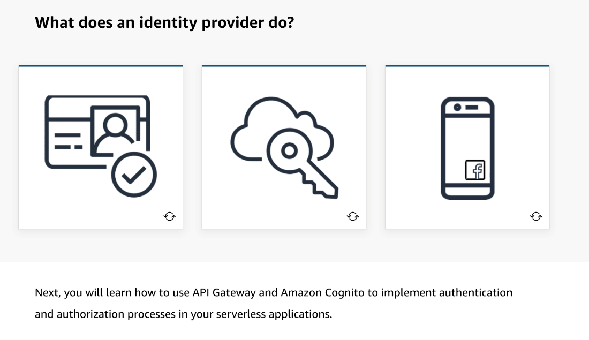

# 8

Created: 2023-09-22 16:27:58 -0600

Modified: 2023-10-22 17:25:20 -0600

---

Summary

- This module discusses authentication and authorization options, focusing on API Gateway authorizers and serverless authentication using Amazon Cognito.
- Authentication involves verifying a user's identity, while authorization defines what actions a user is allowed to perform.

Facts

- Authentication is the process of verifying a user's identity, such as through a username and password.
- Authorization determines the actions a user can perform with their authenticated identity.
- An identity provider (IDP) is responsible for creating and maintaining user identities and may store additional attributes related to user permissions.
- Identity providers facilitate single sign-on (SSO) and federated logins, allowing users to use their identity across multiple applications.
- Federated identities enable users to log in using social identity providers like Facebook, Amazon, or Google, with the blog or application communicating with the social identity provider to verify the user's identity.
- Using federated identities can offload user management and authentication responsibilities to a trusted identity provider.
- Amazon Cognito is introduced as a service that can act as an identity provider, and the module will cover how to use Cognito for authentication and authorization.
- {width="5.0in" height="3.625in"}

- {width="5.0in" height="2.888888888888889in"}

- {width="5.0in" height="2.875in"}
- 

