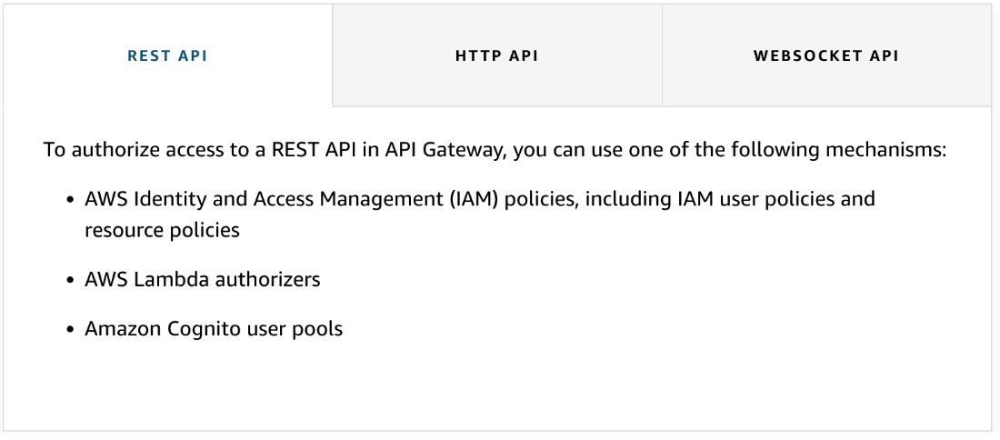
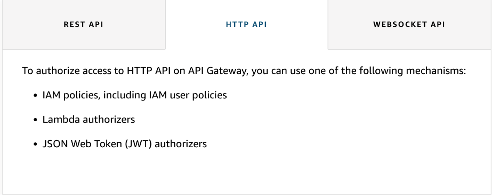
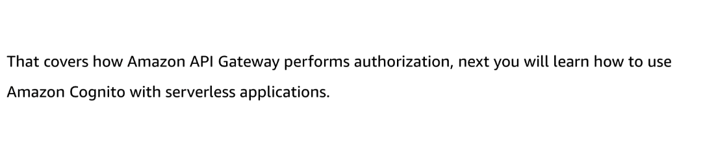

# 9

Created: 2023-09-22 16:28:37 -0600

Modified: 2023-10-22 17:25:24 -0600

---

Summary

API Gateway offers multiple options for authentication and authorization, including JWT tokens, IAM permissions, and Lambda authorizers, each catering to different API types and use cases.

Facts

- API Gateway serves as the entry point to applications, necessitating robust authentication and authorization.
- API Gateway supports JWT tokens, which are OIDC standard for claims, for both HTTP and REST APIs.
  - JWT tokens contain claims, pieces of user information, encoded in base64.
  - HTTP API natively supports JWT tokens, verifying the signature and expected claims.
  - REST APIs can integrate with Cognito Usables, which return a JWT token upon successful authentication.
- IAM permissions are another option for authentication and authorization.
  - Requests to API Gateway can be signed with a SigV4 signature, a method used by AWS APIs.
  - IAM permissions can be applied at the route level for HTTP API or down to the method level for REST API.
- Lambda authorizer is the final option, allowing for custom authorization when other options are unsuitable.
  - Lambda authorizer is used when tokens like SAML are used for authentication.
  - It involves writing code to perform authorization, returning a policy that allows or denies access based on identity.
- API Gateway's authentication and authorization methods can be observed and debugged using the AWS CLI with a debug flag, revealing the signature passed to AWS services.

{width="10.083333333333334in" height="4.489583333333333in"}

{width="10.083333333333334in" height="4.052083333333333in"}

{width="10.083333333333334in" height="3.9895833333333335in"}

{width="10.083333333333334in" height="7.34375in"}

{width="10.083333333333334in" height="5.875in"}

{width="10.083333333333334in" height="5.84375in"}

![Mechanisms used for authorization You can use the following mechanisms to implement authorization in serverless applications. To learn more expand each of the following four mechanisms. Standard IAM roles and policies Standard IAM roles and policies offer flexible and robust access controls that you can apply to an entire API or individual methods. You can use IAM roles and policies to control who can create, invoke, and manage your APIs. • Resource policies let you create resource-based policies to allow or deny access to your APIs and methods from specified source IP addresses or virtual private cloud (VPC) endpoints. • IAM tags can be used together with IAM policies to control access. ](../../../media/AWS-Developing-Serverless-Solutions-on-AWS-Module-3-9-image7.png){width="10.083333333333334in" height="6.895833333333333in"}

{width="10.083333333333334in" height="3.3958333333333335in"}

{width="10.083333333333334in" height="5.40625in"}

{width="10.083333333333334in" height="8.197916666666666in"}

{width="10.083333333333334in" height="2.21875in"}

