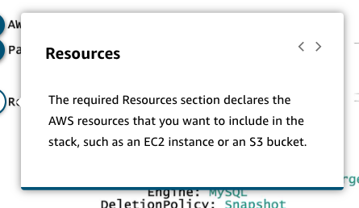

# 12 CloudFormation

Created: 2023-09-23 15:32:39 -0600

Modified: 2023-10-29 09:53:50 -0600

---

Summary

CloudFormation is a robust AWS service providing a language to declare infrastructure using YAML or JSON, allowing users to automate the provisioning and management of AWS resources, configurations, and solutions, and enabling the deployment of complex architectures, efficient updates, and resource management across multiple AWS accounts and regions, all while maintaining uniformity and reducing the risk of manual errors.

Facts

- CloudFormation allows users to declare infrastructure using YAML or JSON, specifying resources like EC2, load balancers, and RDS databases along with their properties.
- It not only aids in the initial provisioning of resources but also assists in managing ongoing updates intelligently, modifying only the resources that need updates based on modifications in the CloudFormation template.
- CloudFormation has intrinsic functions and features like "depends on" to define complex architectures and manage dependencies between resources.
- Users can create internal maps and parameters in templates to handle different configurations, like different AMIs in different regions, making CloudFormation highly versatile.
- CloudFormation enables users to manage and delete applications efficiently, and it can detect drift, allowing visibility into manual changes made post-deployment for compliance reasons.
- It supports version control, allowing users to treat infrastructure as code, with the possibility to organize resources into different templates for different layers or applications.
- CloudFormation pulls templates out of S3 buckets and can be integrated with CI/CD pipelines for automatic deployment.
- Resources created with CloudFormation are called a stack, and users can create stack sets to deploy one template across multiple AWS accounts or regions.
- It eliminates the need for manual point-and-click configurations (click ops), promoting automation (DevOps) and reducing the risk of manual errors.
- Examples of CloudFormation templates include specifying resources like a DynamoDB instance, with configurations like storage allocation, instance class, and engine, and properties like DeletionPolicy to manage resource behavior during deletion.
- Parameters and mappings in CloudFormation allow users to input specific values or choose configurations based on predefined options, enhancing the flexibility and adaptability of the templates.

![AWS CloudFormation is a service that helps you model and set up your AWS resources so that you can spend less time managing those resources and more time focusing on your applications that run in AWS. You create a template that describes all the AWS resources that you want (such as Amazon EC2 instances or Amazon RDS DB instances), and CloudFormation takes care of provisioning and configuring those resources for you. You don't need to individually create and configure AWS resources and figure out what's dependent on what. CloudFormation handles those tasks. ](../../../media/AWS-Developing-Serverless-Solutions-on-AWS-Module-4-12-CloudFormation-image1.png){width="5.0in" height="2.1875in"}

{width="5.0in" height="2.7395833333333335in"}

![When you use CloudFormation, you manage related resources as a single unit called a stack. You create, update, and delete a collection of resources by creating, updating, and deleting stacks. All the resources in a stack are defined by the stack's CloudFormation template. Suppose you created a template that includes an Auto Scaling group, Elastic Load Balancing load balancer, and an RDS database instance. To create those resources, you create a stack by submitting the template that you created, and CloudFormation provisions all those resources for you. CloudFormation StackSets extends the capability of stacks by enabling you to create, update, or delete stacks across multiple accounts and AWS Regions with a single operation. ](../../../media/AWS-Developing-Serverless-Solutions-on-AWS-Module-4-12-CloudFormation-image3.png){width="5.0in" height="2.1666666666666665in"}

![CloudFormation Template A CloudFormation template is a JSON or YAML formatted text file. You can save these files with any extension, such as .json, .yaml, .template, or .txt. CloudFormation uses these templates as blueprints for building your AWS resources. Following is an example of a CloudFormation template that's used to create a database instance. To learn more about each element of the CloudFormation template, choose the hotspot. AWSTemp1 ate FormatVe r s i on : parameters: DatabaseName: Stri ng TYPe : Resources: MYDatabase : 2010-09-09 AWS: :RDS: :DB1nstance Type : properti es : ! Ref DatabaseName DBName : Al 1 ocatedstorage : DBInstanceC1 ass: db .m5 . large Engi ne: MYSQL Deletionpolicy: snapshot Parameters are input variables that you can specify during provisioning. Resources are a list of the resources that compose your infrastructure stack with their corresponding configuration. ](../../../media/AWS-Developing-Serverless-Solutions-on-AWS-Module-4-12-CloudFormation-image4.png){width="5.0in" height="3.71875in"}

{width="4.5in" height="3.0729166666666665in"}

{width="4.5625in" height="3.0729166666666665in"}

{width="4.625in" height="2.6875in"}

