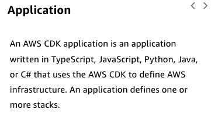
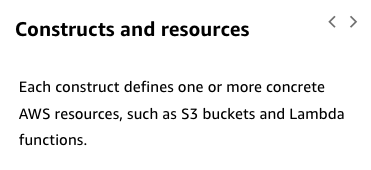
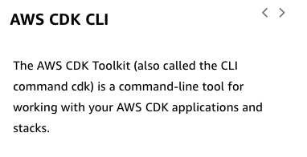
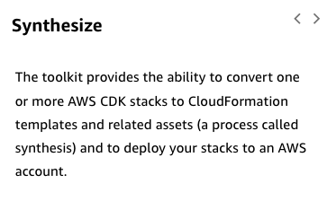
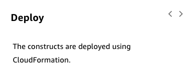
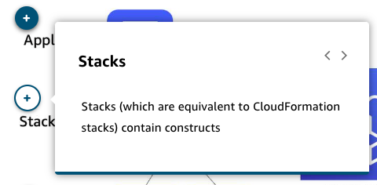
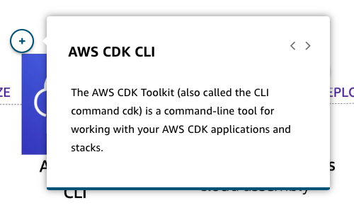

# 13 CDK

Created: 2023-09-23 15:41:13 -0600

Modified: 2023-10-29 10:15:21 -0600

---

Summary

The AWS Cloud Development Kit (CDK) is an abstraction over CloudFormation, allowing developers to define resources using familiar programming languages, enhancing ease of use, code reuse, and the implementation of AWS best practices through the use of constructs at different levels, which represent various AWS resources and patterns.

Facts

- The AWS Cloud Development Kit (CDK) is an abstraction over CloudFormation, allowing developers to define AWS resources using programming languages like Python, TypeScript, or Java.
- CDK enables the imperative definition of resources, with the underlying provisioning still handled by CloudFormation.
- In CDK, developers create "constructs," which are the building blocks for creating applications and represent different AWS resources.
- Constructs in CDK come in three levels:
  - Level 1 (L1) constructs represent individual CloudFormation resources like S3 buckets, DynamoDB tables, and Lambda functions.
  - Level 2 (L2) constructs provide defaults and glue code, eliminating the need for developers to write such details in CloudFormation templates, thus accelerating development.
  - Level 3 (L3) constructs describe more complex patterns like load-balanced EC2 instance applications, allowing developers to implement entire patterns with a single construct, promoting code reuse and adherence to AWS best practices.
- Developers use constructs in their source code to define AWS resources, referred to as "stacks" in CloudFormation.
- The CDK synthesizes the written code into a CloudFormation template using the AWS CLI, which CloudFormation then uses to deploy the resources.
- CDK facilitates the creation of complex AWS solutions, such as an Application Load Balanced Fargate Service, by allowing developers to use high-level constructs instead of manually building out each component, thus simplifying the process and saving time.
- The use of constructs in CDK enables developers to follow AWS best practices and helps in code reuse across different applications using similar patterns.
- The CDK documentation provides examples of higher-level constructs, like patterns for Amazon Elastic Container Service (ECS) using AWS Fargate, illustrating how developers can specify various service parameters and configurations within the construct.

{width="10.083333333333334in" height="4.875in"}

{width="7.854166666666667in" height="4.375in"}

{width="7.770833333333333in" height="3.125in"}

{width="7.8125in" height="3.625in"}

{width="8.041666666666666in" height="4.166666666666667in"}

{width="7.854166666666667in" height="4.75in"}

{width="7.958333333333333in" height="3.375in"}

![Constructs Constructs are the basic building blocks of an application built using AWS CDK. A construct can be an AWS resource, a worker queue or a dashboard. The AWS CDK includes a collection of constructs, known as AWS Construct Library. The constructs are abstracted at three levels, referred to as Ll constructs, L2 cosntructs and L3 constructs. To learn more expand each of the following three categories. Ll constructs Ll constructs, are the resources directly available in AWS CloudFormation, such as S3 bucket, EC2 instance and so on. When you use Ll constructs, you must explicitly configure all the resource properties. L2 constructs L2 constructs also represent AWS resources, but with a higher-level, intent-based API. They provide similar functionality, but incorporate the defaults, boilerplate, and glue logic. L3 constructs L3 constructs are also referred to as patterns. These constructs are designed to help you complete common tasks in AWS, often involving multiple kinds of resources. ](../../../media/AWS-Developing-Serverless-Solutions-on-AWS-Module-4-13-CDK-image8.png){width="10.083333333333334in" height="11.135416666666666in"}

{width="10.083333333333334in" height="4.5in"}

{width="10.083333333333334in" height="5.458333333333333in"}

{width="10.083333333333334in" height="6.697916666666667in"}

{width="10.083333333333334in" height="5.0in"}

{width="10.083333333333334in" height="5.604166666666667in"}

{width="10.083333333333334in" height="5.885416666666667in"}

{width="10.083333333333334in" height="6.989583333333333in"}

{width="10.083333333333334in" height="5.729166666666667in"}

