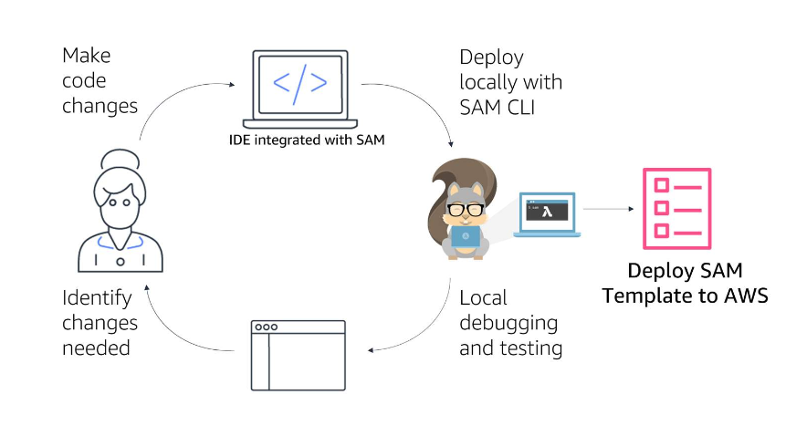

# 14 SAM 

---

Summary

The AWS Serverless Application Model (SAM) is an extension of AWS CloudFormation, designed to streamline the process of developing serverless applications by offering simplified syntax for defining resources and a command-line interface (CLI) for local development, testing, and deployment of serverless applications, ultimately enhancing the efficiency and speed of serverless development.

Facts

- AWS SAM is an extension of CloudFormation, optimized for serverless applications, allowing developers to create templates in YAML or JSON.
- SAM provides shorthand syntax to easily express serverless components like Lambda functions, API Gateway, DynamoDB tables, and step functions, facilitating quicker serverless application development.
- SAM CLI is a component of SAM that aids in local development, deployment, and logging of serverless applications, enhancing the development process.
- SAM CLI allows developers to initialize projects, invoke APIs and Lambda functions locally, and generate sample events for testing, mimicking Lambda's invocation environment locally.
- SAM templates have a Transform section to inform CloudFormation that it is a SAM template, and a Resources section where AWS resources like Lambda functions and DynamoDB tables are defined.
- SAM allows for the definition of triggers for Lambda functions, such as an API, and can generate unique names for resources if not provided.
- Policies related to the execution role for Lambda functions can be set up in SAM to allow specific interactions with other AWS resources, like reading from a DynamoDB table.
- SAM CLI can tail production logs, allowing developers to view logs directly in their IDEs, saving time during debugging.
- Once the code and template are ready and locally tested, developers can use sam deploy to deploy resources using CloudFormation.
- SAM facilitates a tight feedback loop, allowing developers to make and test changes quickly before deploying them to the cloud.

![AWS SAM The AWS Serverless Application Model (AWS SAM) is an open source framework for building serverless applications. It provides shorthand syntax to express functions, APIs, databases, and event source mappings. You define the application you want with just a few lines per resource and model it using YAML. AWS SAM provides shorthand syntax to express functions, APIs, databases, and event source mappings. During deployment, SAM transforms and expands the SAM syntax into AWS CloudFormation syntax. Then, CloudFormation provisions your resources with reliable deployment capabilities. ](../../../media/AWS-Developing-Serverless-Solutions-on-AWS-Module-4-14-SAM-image1.png)

![Example SAM Template ' 2010-09-09 ' AWSTemp1 ate FormatVers i on : Transform: ' AWS: : ess-2016-10-31 Descri pti on: AWS Server less Specification template descri bes your function. Resources : exampl eTab1e: AWS: : Serverless : : Simpl Type : exampl eFn: AWS: :Server1ess : : Function Type : properti es : Handl er: exampl eFn/i ndex . handl er Runti me : node4s12.x Descri ption: Memo rySi ze : 512 Ti meout: 15 Events : Hel 1 oworld: Type: API properti : path: /hello Method: get policies # Give just CRUD permissions to - DynamoDBCrudp01i cy: Tabl eName: ! Ref exampl eTab1e one table The Transform declaration tells CloudFormation this is an AWS SAM template. AWS::Serverless::SimpleTable tells CloudFormation to create a DynamoDB table. AWS::Serverless::Function tells CloudFormation to create a function With the properties listed. Events Type: API tells CloudFormation to create an API Gateway API and associates the Lambda function to the [hello resource. Policies: tells CloudFormation to give the Lambda function's execution role the IAM permissions expressed in this policy. ](../../../media/AWS-Developing-Serverless-Solutions-on-AWS-Module-4-14-SAM-image2.png)

![CloudFormation transforms the AWS SAM template into a CloudFormation template and builds your stack on deploy AWS SAM CLI The SAM Command Line Interface (CLI) lets you locally build, test, and debug serverless applications defined by AWS SAM templates. SAM CLI provides a Lambda-like execution environment locally and helps you catch issues upfront. You can also use the SAM CLI to deploy your applications to AWS, or create secure continuous integration and deployment (CI/CD) pipelines that follow best practices and integrate with AWS' native and third party CI/CD systems. ](../../../media/AWS-Developing-Serverless-Solutions-on-AWS-Module-4-14-SAM-image3.png)

![With serverless, you no longer hand off a compiled binary for deployment to multiple servers. Instead, you need to tell Lambda where to get your function code, you need to set up the other resources required by your application (APIs, tables, etc.), and you need to ensure that the correct permissions are set between the services that make up your application. You need to package your functions and resources and then deploy them into the cloud without connecting to any servers. Deployment frameworks make this much easier. ](../../../media/AWS-Developing-Serverless-Solutions-on-AWS-Module-4-14-SAM-image5.png)

