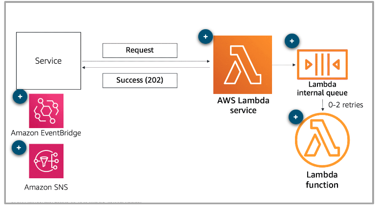
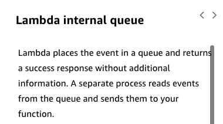

---

Summary

This module explores the utilization of Amazon EventBridge and Amazon SNS to decouple components and relay messages within applications, focusing on asynchronous event sources for Lambda, where immediate responses are not required, and contrasting the use cases for Amazon EventBridge and Amazon SNS.

Facts

- Amazon EventBridge and Amazon SNS are explored as means to decouple components and facilitate message relay within applications.
- EventBridge serves as an asynchronous event source where buses are created, and events are written to those buses.
- Amazon SNS, or Simple Notification Service, is another asynchronous event source, allowing various types of subscribers for an SNS topic.
- Asynchronous event sources are likened to a diner analogy where a request like "give me a pie" is made, and the response isn't immediately waited upon; it's more of an announcement of a need.
- Lambda can queue requests in an internal queue for asynchronous invocation, allowing services to integrate and call Lambda asynchronously.
- The client can know of a status through three different ways: polling, where the client checks in at regular intervals; through a webhook, where the client supplies a location for the results; and via a websocket, maintaining an open connection to send back updates and completion status.
- In asynchronous invocation for Lambda, the actual processing or invocation occurs asynchronously, post the receipt of a success message.
- The module contrasts the use of Amazon EventBridge and Amazon SNS, exploring their application in different scenarios and their role in asynchronous communication within applications.
- The asynchronous communication is not about waiting for a request-response but about sending out asynchronous messages and receiving another asynchronous message once the task is completed.

![The advantage of asynchronous processing is that you reduce the dependencies on downstream activities, and this reduction improves responsiveness back to the client. This means you don't have to put logic into your code to deal with long wait times or to handle errors that might occur downstream. After your client has successfully handed off the request, you can move on. In the diner example, an asynchronous event might be the customer ordering a slice of pie that the downstream service needs to prepare. The counter attendant acknowledges the order, generates an order number, and then tells the downstream services to make the pie that's associated with that order number. When the pie is ready, a downstream method delivers the pie or lets the customer know that the order is ready, but it does not come back through the same channel. Asynchronous event processing with AWS Lambda Lambda has built-in support for asynchronous events. In an asynchronous invocation, Lambda puts the event in its own internal event queue and returns a success response to the client. A separate internal process within the Lambda service reads events from the queue and sends them to your function. To learn more about each service, choose appropriate hotspot. ](../../../media/AWS-Developing-Serverless-Solutions-on-AWS-Module-5-16-image8.png)![Getting client status In asynchronous communications, it's important that the client has a way to know when the downstream task is done so that it can complete the appropriate next steps. There are three common patterns the client might use to get the status of the asynchronous transaction illustrated here. Flip the card to learn more. The client polls for the status of the event (that is, the customer checks for their order at the bakery counter every few minutes). The client uses a webhook to get notified when the event is complete (that is, the bakery gives the customer a device that vibrates when their order is ready). The client uses WebSockets to open a two-way connection so that the results can be delivered directly to the client (that is, the waiter brings the customer's order). So far, you have learned about asynchronous event processing in serverless applications by using AWS Lambda. In the following lessons, you will learn how to configure asynchronous event sources by using AWS services. ](../../../media/AWS-Developing-Serverless-Solutions-on-AWS-Module-5-16-image9.png)

