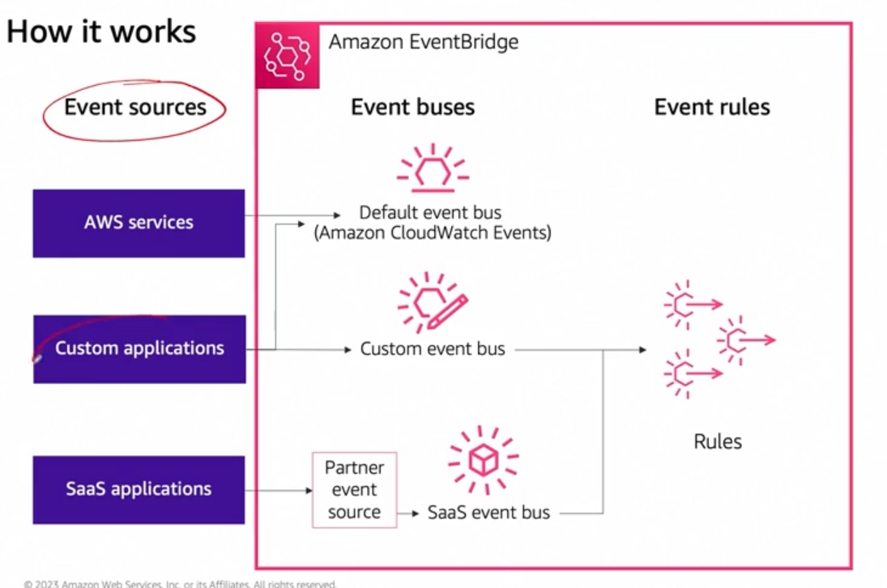

# 17

Created: 2023-09-23 20:49:43 -0600

Modified: 2023-10-22 17:25:52 -0600

---

Summary

This module delves into the functionalities and features of Amazon EventBridge, focusing on its developer, security, and scale features, and how it can be utilized to construct event-driven applications, ensuring secure and scalable service with near real-time streaming of system events.

Facts

- EventBridge allows events to be written to a bus from various sources including user applications, AWS services, and SaaS applications, such as Zendesk.
- It offers event scheduling using cron-like syntax, allowing the creation of events at specified intervals or times.
- EventBridge is fully managed and scalable, aiming to minimize latency to react swiftly to events occurring within applications.
- It integrates with CloudWatch metrics and IAM, allowing users to monitor performance and set resource policies respectively.
- EventBridge provides a secure environment as SaaS integrated application events travel over the AWS internal network, ensuring compliance.
- The resources created with EventBridge include event sources, which can be AWS services, custom event buses for user applications, and SaaS applications.
- Event buses are locations where events are written, with a default event bus present in every account for AWS service events, and the ability to create additional custom event buses.
- Rules in EventBridge define the events of interest and can be configured with a target specifying where the event should be delivered.
- EventBridge allows the definition of rules for applications based on the source and additional details of the events, enabling the filtering of events to specific targets.
- Targets can be AWS services like Lambda or CloudWatch logs, or even a bus inside another AWS account, facilitating inter-account communication and logging for debugging purposes.
- EventBridge offers an event archive feature, allowing the replay of archived messages to the bus they were created on, aiding in debugging.
- Schema discovery in EventBridge defines the shape of data and allows validation and code generation to create events matching the schema, which can be switched on to monitor messages in the bus and derive schema information or can be populated manually.

![Developer features Security and scale features • • • • • Sources including your own applications, AWS services, or SaaS applications Routing rules to filter events Event scheduling Large number of targets Schema registry/discovery to define event structures • • Fully managed and scalable Near-real-time stream of system events regarding AWS resources Integrated CloudWatch metrics Integrated IAM support including resource policies SaaS-integrated application events travel over the AWS internal network ](../../../media/AWS-Developing-Serverless-Solutions-on-AWS-Module-5-17-image1.png){width="5.0in" height="1.8541666666666667in"}

{width="5.0in" height="3.3125in"}

![Amazon EventBridge is a service that supports serverless applications. It uses events to connect application components together, making it easier for you to build scalable, event-driven applications. Use it to route events from sources such as homegrown applications, AWS services, and third-party software to consumer applications across your organization. EventBridge provides a consistent way to ingest, filter, transform, and deliver events so you can build new applications quickly. To get started, you can choose an event source on the EventBridge console. You can then select a target from AWS services, including AWS Lambda, Amazon Simple Notification Service (Amazon SNS), and Amazon Kinesis Data Firehose. EventBridge will automatically deliver the events in near real- time. ](../../../media/AWS-Developing-Serverless-Solutions-on-AWS-Module-5-17-image3.png){width="5.0in" height="2.9583333333333335in"}

{width="5.0in" height="3.40625in"}

{width="5.0in" height="2.34375in"}

![Amazon EventBridge workflow terminology There are three components in an EventBridge workflow - Event, Target and Rule. To learn more, expand each of the following three components. Event An event indicates a change in an environment, such as an AWS environment, an AWS Partner SaaS service or application, or one of your applications or services. Target A target is a resource or endpoint that EventBridge sends an event to when the event matches the event pattern defined for a rule. The rule processes the event data and sends the pertinent information to the target. To deliver event data to a target, EventBridge needs permission to access the target resource. You can define up to five targets for each rule. ](../../../media/AWS-Developing-Serverless-Solutions-on-AWS-Module-5-17-image6.png){width="5.0in" height="4.479166666666667in"}

{width="5.0in" height="1.84375in"}

{width="5.0in" height="2.3958333333333335in"}

![Step 1 Event received from event source Event sources Event structure AWS services Custom applications SaaS applications . Amazon EventBridge Event buses Default event bus (Amazon CloudWatch Events) Custom event bus partner SaaS event bus source List Of supported SaaS integrations Event rules Event pattern Rules All events that come to EventBridge are associated with an event bus. Rules are tied to a single event bus, so they can only be applied to events on that event bus. Your account has a default event bus that receives events from AWS services, and you can create custom event buses to send or receive events from a different account or Region. ](../../../media/AWS-Developing-Serverless-Solutions-on-AWS-Module-5-17-image9.png){width="5.0in" height="4.635416666666667in"}

![Event definition Example event: "detail-type": "Order Created", "aws.partner/example.can/orders", "detail": { "orderld": "987654321", "departnpnt": "'billing", "creator " user12345" Step 2 Example rule: "source": ["mvs.partner/exarvle.can/orders"] Example rule: "detail": { "department": ["billing", "fulfillrpnt"] The event always includes a detail type, a source, and details about the event. You can create filters based on each of these components. In this example, the first rule is looking for matches in the source field, and the second is looking for a specific element within the detail section of the event. The first is a match because it matches the source. The second is a match because it matches one of the departments in the detail section of the rule. 1 3 ](../../../media/AWS-Developing-Serverless-Solutions-on-AWS-Module-5-17-image10.png){width="5.0in" height="4.645833333333333in"}

![step 3 Event delivered to the target Amazon EventBridge Default event bus (CloudWa tch Events) Custom event bus SaaS event bus Event replay archive Event archive Event replay managed rule Standard rule Rules Event targets AWS services Built-in targets Default bus of another AWS account You can associate multiple targets with each rule. To deliver event data to a target, EventBridge needs permission to access the target resource. You can define up to five targets for each rule. You can then select a target from AWS services, including AWS Lambda, Amazon Simple Notification Service (Amazon SNS), and Amazon Kinesis Data Firehose. ](../../../media/AWS-Developing-Serverless-Solutions-on-AWS-Module-5-17-image11.png){width="5.0in" height="4.333333333333333in"}

![Schema Registry A schema represents the structure of an event, and commonly includes information such as the title and format of each piece of data included in the event. For example, a schema might include fields such as name and phone number, and the fact that the name is a text string, and the phone number is an integer. The schema can also include information about patterns, such as a requirement that the phone number be 10 digits in length. The schema of an event is important because it shows what information is contained in the event, and helps you write code based on that data. Schema Amazon EventBridge Schema discovery Create a new section System Design AWS services Custom applications SaaS applications Detault event bus (CloudWatch Events) Custom event bus Schema registry Rules Code binding AWS services Built-in targets Default bus of another AWS account Partner event source SaaS event bus ](../../../media/AWS-Developing-Serverless-Solutions-on-AWS-Module-5-17-image12.png){width="5.0in" height="4.177083333333333in"}

{width="5.0in" height="1.3020833333333333in"}

