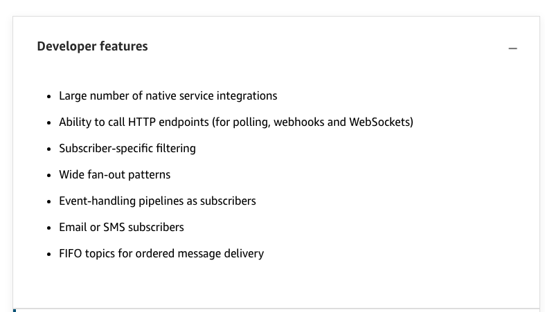
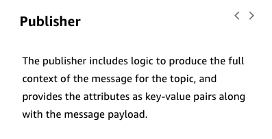
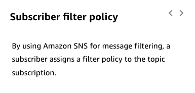

# 18

Created: 2023-09-23 21:06:00 -0600

Modified: 2023-10-22 17:25:56 -0600

---

Summary

This module provides an in-depth overview of Amazon Simple Notification Service (SNS), emphasizing its developer, security, and scale features, and how it facilitates the creation of a pub/sub model, allowing for multiple subscribers to a topic, each of different types, and enabling the publication of messages onto the topic. It also contrasts the use cases and features of SNS with Amazon EventBridge in building asynchronous, event-driven architectures.

Facts

- SNS operates on a pub/sub model where a defined topic can have multiple subscribers of different types.
- It offers extensive native service integrations, with many AWS services delivering messages to SNS.
- SNS allows calling HTTP endpoints and supports filtering, enabling the design of fan-out patterns where a topic can have a queue as a subscriber. HTTP endpoints can be one of the subscriber

- It supports various subscriber types including HTTP endpoints, email, SMS, and EventBridge, allowing for diverse event-handling pipelines.
- SNS provides FIFO topics for scenarios where the order of processing and exactly once processing is crucial.
- It features a four-phase retry policy, ensuring resilient communication with HTTP endpoints and high availability through durable storage of all messages received across multiple devices and locations.
- SNS supports server-side encryption and allows the establishment of private connections between the VPC and SNS, enhancing security and compliance.
- It logs the delivery status of messages, enabling users to monitor the success of message delivery to the subscribers on a topic.
- SNS allows for message filtering at the point of subscriber creation, enabling selective message reception based on attributes.
- It supports fan-out patterns, allowing a single message to be delivered to multiple queues, facilitating diverse application processing.
- EventBridge and SNS are pivotal for building asynchronous, event-driven architectures, with EventBridge having more sources and targets and better integration with SaaS applications, while SNS excels in supporting fan-out patterns and FIFO topics.
- EventBridge offers advanced routing rules and schema registry for data validation, and SNS is preferable for delivering SMS messages and calling endpoints, webhooks, and WebSocket patterns.
- SNS can serve as a dead-letter queue for asynchronous Lambda functions, providing a location to write failures and extending retry policy over days with smart logic for retrying delivery to subscribers.

{width="10.083333333333334in" height="4.8125in"}

{width="10.083333333333334in" height="5.8125in"}

{width="10.083333333333334in" height="4.614583333333333in"}

{width="8.354166666666666in" height="4.3125in"}

{width="8.1875in" height="6.291666666666667in"}

{width="8.104166666666666in" height="3.9166666666666665in"}

{width="10.083333333333334in" height="5.760416666666667in"}

![Choosing between Amazon EventBridge and Amazon SNS • Amazon EventBridge has native integration for more event sources and targets, and an increasing number of SaaS integrations. Amazon SNS does not. • The routing rules you can create in EventBridge are more advanced. However, it might be a little more work to set them up, compared to Amazon SNS. • EventBridge has a SchemaRegistry to standardize how your team writes events. Retention period of 24 hours • Amazon SNS is a good match for email and SMS subscriptions, also for use in workflows that use polling (for example, with webhooks or WebSockets patterns) • Amazon SNS FIFO topics are a good option when you need to preserve message ordering With Amazon SNS, you can have more consumers and lower latency than EventBridge, although both are designed for scaling asynchronous integrations Supports a wide fan-out and can act as a dead letter queue for Lambda functions • Retry policies extend over days ](../../../media/AWS-Developing-Serverless-Solutions-on-AWS-Module-5-18-image8.png){width="10.083333333333334in" height="6.822916666666667in"}

{width="10.083333333333334in" height="5.59375in"}

![Choosing between Amazon EventBridge and Amazon SNS • Amazon EventBridge has native integration for more event sources and targets, and an increasing number of SaaS integrations. Amazon SNS does not. • The routing rules you can create in EventBridge are more advanced. However, it might be a little more work to set them up, compared to Amazon SNS. • EventBridge has a SchemaRegistry to standardize how your team writes events. Retention period of 24 hours • Amazon SNS is a good match for email and SMS subscriptions, also for use in workflows that use polling (for example, with webhooks or WebSockets patterns) • Amazon SNS FIFO topics are a good option when you need to preserve message ordering With Amazon SNS, you can have more consumers and lower latency than EventBridge, although both are designed for scaling asynchronous integrations Supports a wide fan-out and can act as a dead letter queue for Lambda functions • Retry policies extend over days That wraps up using Amazon EventBridge and Amazon SNS to decouple components. ](../../../media/AWS-Developing-Serverless-Solutions-on-AWS-Module-5-18-image10.png){width="10.083333333333334in" height="8.729166666666666in"}

![Choosing between EventBridge and aws training and -y certification Amazon SNS EventBridge for SaaS integration and complex routing rules Integration with SaaS applications %Better integration with and more choices for sources and targets /Y¯More advanced routing rules but may take a bit more work to build • Schema registry to standardize how your team writes events • Retention period is 24 hours 0 Amaztyl Web C. Its Aff"ate-s All rese•.ed Amazon SNS for really wide fan- out and FIFO processing • • • Email and SMS subscribers Calling endpoints for polling, webhooks, and WebSocket patterns Option of FIFO topics to preserve message ordering Really wide fan-out Can act as a dead-letter queue for Lambda functions Retry policies extend over days ](../../../media/AWS-Developing-Serverless-Solutions-on-AWS-Module-5-18-image11.png){width="10.083333333333334in" height="5.8125in"}

