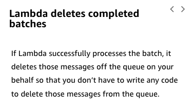

# 20

Created: 2023-09-24 11:04:08 -0600

Modified: 2023-10-22 17:26:08 -0600

---

Summary

The module delves into the integration of SQS (Simple Queue Service) with Lambda, emphasizing the asynchronous processing of messages, the significance of visibility timeouts, and the strategies to handle message failures and duplicates.

Facts

- SQS introduces a queuing mechanism where multiple customers can place orders, which are then processed asynchronously by workers.
- Lambda, when integrated with SQS, initiates with five polling processes to retrieve messages from the queue.
- The visibility timeout in SQS ensures a message is temporarily invisible to other consumers while being processed, preventing duplication.
- If a Lambda function fails to process a message, it retries until the batch succeeds or expires.
- SQS offers two types of queues: standard and FIFO (First In, First Out).
  - Standard queues might not preserve message order and can potentially process messages more than once.
  - FIFO queues guarantee message order and ensure a message is delivered only once, but have limited throughput.
- The visibility timeout on the queue should ideally be set to six times the function timeout.
- Redrive policies in SQS allow users to set a maximum number of times a message can be received before it's sent to a dead letter queue.
- Lambda functions can be configured to determine the batch size and function timeout.
- It's crucial to design applications for idempotency, ensuring that processing the same message multiple times doesn't cause issues.

![How Lambda manages an Amazon SQS queue as an event source You can use a Lambda function to process messages in an Amazon Simple Queue Service (Amazon SQS) queue. Lambda event source mappings support standard queues and first-in, first-out (FIFO) queues. With Amazon SQS, you can offload tasks from one component of your application by sending them to a queue and processing them asynchronously. Lambda polls the queue and invokes your Lambda function synchronously with an event that contains queue messages. Lambda reads messages in batches and invokes your function once for each batch. When your function successfully processes a batch, Lambda deletes its messages from the queue. The following example shows an event for a batch of two messages. To learn more, choose each hotspot. ](../../../media/AWS-Developing-Serverless-Solutions-on-AWS-Module-6-20-image1.png){width="5.0in" height="3.1354166666666665in"}

{width="3.9166666666666665in" height="4.6875in"}

{width="4.020833333333333in" height="2.7291666666666665in"}

{width="5.0in" height="2.2916666666666665in"}

{width="3.9166666666666665in" height="2.4375in"}

{width="3.9791666666666665in" height="2.8854166666666665in"}

{width="3.9166666666666665in" height="2.2604166666666665in"}

![Configuring Amazon SQS as an event source for Lambda You configure the parameters of the queue and lambda function based on your application requirements. To learn more, choose the appropriate tab. ON THE SQS QUEUE ON THE LAMBDA FUNCTION • Select queue type (standard or FIFO) - Choose a standard queue unless order of processing is important Select visibility timeout on the queue - Set the visibility timeout to at least six times the function time out Set redrive policy on the queue - Configure the dead-letter queue and choose a maximum receive count to handle spikes in traffic, but limit the frequency of bottlenecks ](../../../media/AWS-Developing-Serverless-Solutions-on-AWS-Module-6-20-image8.png){width="5.0in" height="3.5729166666666665in"}

{width="5.0in" height="2.0104166666666665in"}

![What you handle with Amazon SQS as an event source for Lambda aws training and -y certification What you handle On the queue Select queue type Eggrd or FIFO) Set visibility timeout on the queue Set redrive policy on the queue On the function Function batch size Function timeout Partial failures Duplicate messages 0 2025 Amazty•. Web Set-aces. Inc C. Its Affiliates All Best practices Choose a standard queue unless the order of processing is important. Set the visibility timeout to six times the function timeout. Configure the dead-letter queue and choose a maximum receive count to handle spikes in traffic, but limit the frequency of bottlenecks. Set the batch size higher for fast workloads and lower for long workloads. Set the function timeout to complete successfully under most circumstances. Include code to delete each record as it is processed. Design for idempotency. Include function code that prevents you from processing the same record twice. ](../../../media/AWS-Developing-Serverless-Solutions-on-AWS-Module-6-20-image10.png){width="5.0in" height="2.8541666666666665in"}

