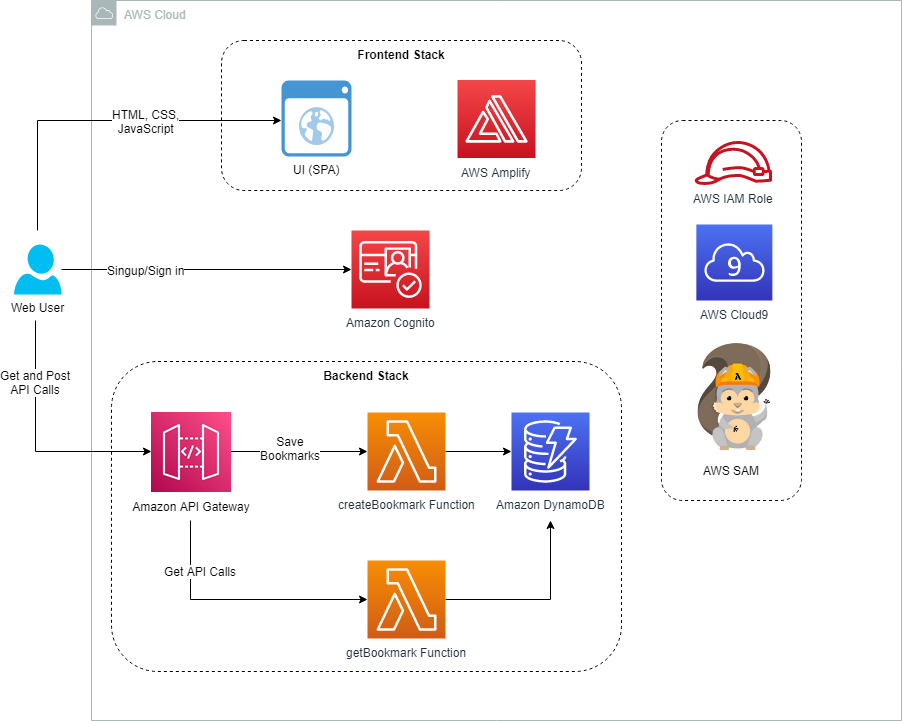
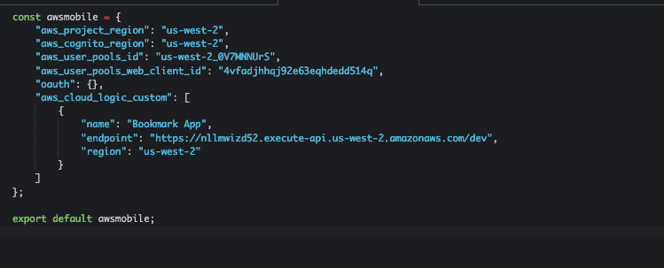

# Lab 1: Deploying a Simple Serverless Application | Self-Paced Labs

Created: 2023-10-08 05:04:56 -0600

Modified: 2023-10-08 11:04:59 -0600

---

Clipped from: <https://labs.skillbuilder.aws/sa/lab/arn%3Aaws%3Alearningcontent%3Aus-east-1%3A470679935125%3Ablueprintversion%2FILT-TF-200-SVDVSS-1%2Flab-1-Bookmarks%3A1.3.6-3f1c891d/en-US>

# Lab 1: Deploying a Simple Serverless Application

© 2023 Amazon Web Services, Inc. or its affiliates. All rights reserved. This work may not be reproduced or redistributed, in whole or in part, without prior written permission from Amazon Web Services, Inc. Commercial copying, lending, or selling is prohibited. All trademarks are the property of their owners.

Note: Do not include any personal, identifying, or confidential information into the lab environment. Information entered may be visible to others.

Corrections, feedback, or other questions? Contact us at *[AWS Training and Certification](https://support.aws.amazon.com/#/contacts/aws-training).*

## Overview

Your technical support team has a partially homegrown, highly customized ticketing system. Between development team members and tech support, you are often pointing people to links to help resolve issues, but there are no real strategies for managing the resources. You have a team knowledge base, which is maintained by the development managers, but new suggestions must be emailed to a shared mailbox for review before they are published. So submissions, reviews, and updates happen sporadically.

A recent hackathon produced a partial solution for saving resource links with relevant information. Your product manager has asked your team to build the first iteration of this application as an opportunity to address the business need while learning about and piloting a serverless architecture.

In this lab, you deploy the backend application and front-end application in various steps, and update the front-end configurations.

The following diagram shows the architecture components that have been or will be deployed in this lab.

{width="12.09375in" height="9.6875in"}

This lab uses the following software stack:

- AWS Amplify
- AWS Serverless Application Model (AWS SAM)
- Amazon Cognito
- Vue JavaScript framework
- AWS Cloud9
- Swagger API
- Amazon DynamoDB

**Objectives**

After completing this lab, you will be able to:

- Configure authentication through an Amazon Cognito user pool
- Deploy your backend code using AWS SAM
- View API documentation using the Swagger Editor
- Update your front-end configuration and run the build through AWS Cloud9 to test it prior to deployment
- Deploy your front-end application using Amplify

**Prerequisites**

This lab requires:

- Access to a notebook computer with Wi-Fi and Microsoft Windows, macOS X, or Linux (Ubuntu, SUSE, or Red Hat)
- For Microsoft Windows users, administrator access to the computer
- An internet browser such as Chrome, Firefox, or Internet Explorer 9 (previous versions of Internet Explorer are not supported)
- A text editor

**Note** The lab environment is not accessible using an iPad or tablet device, but you can use these devices to access the lab guide.

**Duration**

This lab requires approximately **60 minutes** to complete.

## Start lab

1.  To launch the lab, at the top of the page, choose Start lab.

You must wait for the provisioned AWS services to be ready before you can continue.

1.  To open the lab, choose Open Console.

You are automatically signed in to the AWS Management Console in a new web browser tab.

**Do not change the Region unless instructed.**

### Common sign-in errors

#### *Error: You must first sign out*

{width="12.09375in" height="2.625in"}

If you see the message, **You must first log out before logging into a different AWS account:**

- Choose the **click here** link.
- Close your **Amazon Web Services Sign In** web browser tab and return to your initial lab page.
- Choose Open Console again.

#### *Error: Choosing Start Lab has no effect*

In some cases, certain pop-up or script blocker web browser extensions might prevent the **Start Lab** button from working as intended. If you experience an issue starting the lab:

- Add the lab domain name to your pop-up or script blocker's allow list or turn it off.
- Refresh the page and try again.

## Task 1: Understanding key services and the environment setup

In this task, you look at the different AWS services that are used in this development. Take a few minutes to navigate the console for each service. Next, you download your source code, including both backend and front-end code, from an Amazon Simple Storage Service (Amazon S3) bucket to your AWS Cloud9 environment.

- **AWS Amplify** is a set of tools and services that enables mobile and front-end web developers to build secure, scalable full stack applications powered by AWS. Amplify includes an open-source framework with use-case-centric libraries and a powerful toolchain to create and add cloud-based features to your application, and a web-hosting service to deploy static web applications.
- **AWS SAM** is an open-source framework for building serverless applications. It provides shorthand syntax to express functions, APIs, databases, and event source mappings. With just a few lines per resource, you can define the application you want and model it using YAML. During deployment, AWS SAM transforms and expands the AWS SAM syntax into AWS CloudFormation syntax, enabling you to build serverless applications faster.
- **Amazon Cognito** lets you add user sign-up, sign-in, and access control to your web and mobile apps quickly and easily. Amazon Cognito scales to millions of users and supports sign-in with social identity providers, such as Facebook, Google, and Amazon, and enterprise identity providers via SAML 2.0.
- **Vue JavaScript framework** is a progressive framework for building user interfaces. Unlike other monolithic frameworks, Vue is designed to be incrementally adoptable. The core library focuses on the view layer only and is easy to pick up and integrate with other libraries or existing projects. Vue is also perfectly capable of powering sophisticated single-page applications when used in combination with modern tooling and supporting libraries.
- **AWS Cloud9** is a cloud-based integrated development environment (IDE) that lets you write, run, and debug your code with just a browser. It includes a code editor, debugger, and terminal. AWS Cloud9 makes it easy to write, run, and debug serverless applications. It pre-configures the development environment with all the SDKs, libraries, and plugins needed for serverless development.
- **Swagger API** is an open-source software framework backed by a large ecosystem of tools that help developers design, build, document, and consume RESTful web services. Swagger also allows you to understand and test your backend API specifically.
- **Amazon DynamoDB** is a key-value and document database that delivers single-digit millisecond performance at any scale. It's a fully managed, multi-Region, durable database with built-in security, backup and restore, and in-memory caching for internet-scale applications. DynamoDB can handle more than 10 trillion requests per day and can support peaks of more than 20 million requests per second.

To set up your environment, open the pre-provisioned AWS Cloud9 environment. From there, download and unzip your source code so that you can deploy the AWS SAM application in an upcoming task.

1.  At the top of the AWS Management Console, to the right of the Services menu, in the search bar, search for

Cloud9

and then choose that service from the list.

2.  Next to the **BookmarkAppDevEnv** environment listing, choose **Open** .

Within a few seconds, the AWS Cloud9 environment launches. Notice the Linux-style terminal window in the bottom pane.

**Note** If the browser is running in an incognito session, a pop-up window with an error message will be displayed when the Cloud9 instance is opened. Choose the **OK** button to continue. Browser in a non incognito mode is recommended.

1.  To download your source code, run the following commands:

cd ~/environment
wget <https://us-west-2-tcprod.s3-us-west-2.amazonaws.com/courses/ILT-TF-200-SVDVSS/v1.3.6.prod-35d9cd4e/lab-1-Bookmarks/scripts/app-code.zip>
unzip app-code.zip
cd app-code

1.  Run the commands below to add more disk space to your AWS Cloud9 environment.

- **Command:** Run the command below to add more disk space:

bash resize.sh 50

**Expected output:**

******************************
**** This is OUTPUT ONLY. ****
******************************

% Total % Received % Xferd Average Speed Time Time Time Current
Dload Upload Total Spent Left Speed
100 19 100 19 0 0 9500 0 --:--:-- --:--:-- --:--:-- 6333
{
"VolumeModification": {
"VolumeId": "vol-09d610b0cad0f2fc2",
"ModificationState": "modifying",
"TargetSize": 50,
"TargetIops": 150,
"TargetVolumeType": "gp2",
"TargetMultiAttachEnabled": false,
"OriginalSize": 10,
"OriginalIops": 100,
"OriginalVolumeType": "gp2",
"OriginalMultiAttachEnabled": false,
"Progress": 0,
"StartTime": "2022-11-07T16:49:48.000Z"
}
}
CHANGED: disk=/dev/nvme0n1 partition=1: start=4096 old: size=20967390,end=20971486 new: size=104853470,end=104857566
resize2fs 1.43.5 (04-Aug-2017)
Filesystem at /dev/nvme0n1p1 is mounted on /; on-line resizing required
old_desc_blocks = 1, new_desc_blocks = 4
The filesystem on /dev/nvme0n1p1 is now 13106683 (4k) blocks long.

**Note:** There is more information about the **resize.sh** script in the **Additional Resources** section at the end of this lab.

Keep the browser tab that's running the AWS Cloud9 IDE open because you will use it throughout this lab.

## Task 2: Setting up authentication with Amazon Cognito

In this task, you set up your Amazon Cognito user pool for authentication.

1.  At the top of the AWS Management Console, to the right of the Services menu, in the search bar, search for

Cognito

and then choose that service from the list.

2.  Choose Create user pool

**Note:** You may safely ignore the error message *[AccessDeniedException] Failed to fetch ACM certificates*.

3.  In the **Configure sign-in experience** step, complete the following settings for **Authentication providers**:

- **Provider types**: Cognito user pool
- **Cognito user pool sign-in options**: User Name
- Leave the remaining settings as is.

4.  Choose Next
5.  In the **Configure security requirements** step, complete the following settings:

- In the **Password policy** section,

- **Password policy mode**: Custom
- **Password requirements**: Deselect **Contains at least on special character** and **Contains at least one uppercase letter**

<!-- -->
- In the **Multi-factor authentication** section, select:

- **MFA enforcement**: No MFA

<!-- -->
- In the **User account recovery** section, select:

- **Delivery method for user account recovery messages**: Email only

<!-- -->
- Leave the remaining settings as is.

6.  Choose Next
7.  In the **Configure sign-up experience** step, complete the following settings:

- In the **Attribute verification and user account confirmation** section, under **Verifying attribute changes**:

- Deselect **Keep original attribute value active when an update is pending - Recommended**.

<!-- -->
- Leave the remaining settings as is.

8.  Choose Next
9.  In the **Configure message delivery** step, complete the following settings:

- Under **Email**, in the **Email provider** section, choose **Send email with Cognito**.
- Leave the remaining settings as is.

10. Choose Next
11. In the **Integrate your app** step, complete the following settings:

- In the **User pool name** section, enter

bookmark-app-userpool

for **User pool name**.

- In the **Initial app client** section, enter

AppClientForBookmarkUserPool

for **App client name**

- Leave the remaining settings as is.

12. Choose Next
13. Choose Create user pool
14. Select the user pool that you just created.
15. Navigate to the **User pool properties** tab.
16. In the **Lambda triggers** section, choose **Add Lambda trigger**.
17. In the **Add Lambda trigger** screen, scroll down the the **Lambda function** section.
18. For **Assign Lambda function**, from the drop-down options, select the Lambda function with **PresignupLambda** in the name.
19. Choose Add Lambda trigger

## Task 3: Deploying the backend application using AWS SAM

In this task, you run AWS Command Line Interface (AWS CLI) commands to deploy the backend code using AWS SAM.

The following are a few key AWS SAM CLI commands to know:

- **sam build:** Builds a serverless application and prepares it for subsequent steps in your workflow, such as locally testing the application or deploying it to the AWS Cloud
- **sam deploy:** Deploys an AWS SAM application
- **sam init:** Initializes a serverless application with an AWS SAM template

**Learn more** For more information about AWS SAM CLI commands, see [AWS SAM CLI Command Reference](https://docs.aws.amazon.com/serverless-application-model/latest/developerguide/serverless-sam-cli-command-reference.html).

1.  Go back to the AWS Cloud9 browser tab.
2.  On the left side of the AWS Cloud9 IDE, choose the dropdown arrow next to the **app-code** folder, and then the **backend** folder.
3.  Choose and open the **template.yaml** file.

This file contains the AWS SAM template that defines your application's AWS resources. Take a moment to scroll through and review the anatomy of the architecture.

1.  On the left side of the AWS Cloud9 IDE, choose the dropdown arrow next to the **src** folder, and then choose the dropdown arrow next to the **createBookmark** folder.
2.  Choose and open the **index.js** file to view the code within this file.

This file contains your actual Lambda handler logic for the **createBookmark** Lambda function. Review the other Lambda functions in the **deleteBookmark**, **getBookmark**, **listBookmarks**, and **updateBookmark** folders.

1.  Choose and open the **samconfig.toml** file.

This is the configuration file for the project. To replace *BUCKET_NAME*, *AWS_REGION* and *LAMBDA_ROLE_ARN* with actual values in the **samconfig.toml** file, you will run a set of CLI commands to update these values before deploying.

1.  In the AWS Cloud9 terminal, run the following AWS CLI and bash commands to update the values in the **samconfig.toml** file.

sudo yum -y install jq
cd ~/environment/app-code/backend
export BUCKET_NAME=$(aws s3api list-buckets --query "Buckets[?contains(Name, 'bookmark')].Name" --output text)
sed -Ei "s|<BUCKET_NAME>|${BUCKET_NAME}|g" samconfig.toml
export AWS_REGION=$(curl -s 169.254.169.254/latest/dynamic/instance-identity/document | jq -r '.region')
sed -Ei "s|<AWS_REGION>|${AWS_REGION}|g" samconfig.toml
export LAMBDA_ROLE_ARN=$(aws iam list-roles --query "Roles[?contains(RoleName, 'LambdaDeployment')].Arn" --output text)
sed -Ei "s|<LAMBDA_ROLE_ARN>|${LAMBDA_ROLE_ARN}|g" samconfig.toml
cd ..

**Note** This file is usually generated during the **sam deploy --guided** command, but for this lab, the prebuilt file is provided. This file contains the parameters of the Amazon S3 bucket from where the code is deployed, the role needed for AWS SAM to deploy, and the Region. The file contains the parameters for the CloudFormation stack to be deployed.

1.  In the AWS Cloud9 terminal, run the following command:

cd backend
sam deploy

This command deploys your application to the AWS Cloud. The command takes the deployment artifacts you build with the **sam build** command, packages and uploads them to an Amazon S3 bucket created by the AWS SAM CLI, and deploys the application using CloudFormation.

**Note** The command takes a minute or two to run.

**Learn more** The AWS SAM CLI comes preinstalled on Cloud9. For more information about installing the AWS SAM CLI, see <https://docs.aws.amazon.com/serverless-application-model/latest/developerguide/serverless-sam-cli-install-linux.html>.

You can see the output for the changeset. Notice the operations, in this case **+ Add**, and look under **ResourceType** to see the AWS resources about to be deployed.

The changeset is now being deployed. You can watch the sequence of events from your AWS Cloud9 instance and from CloudFormation.

1.  At the top of the AWS Management Console, to the right of the Services menu, in the search bar, search for

CloudFormation

and then choose that service from the list.

2.  Choose the **sam-bookmark-app** stack.

This is the stack that was deployed from your backend code in AWS Cloud9.

1.  To view the AWS resources that were created within this stack, choose the **Resources** tab.
2.  To open the DynamoDB resource, choose the **Physical ID** of the **bookmarksTable**.

This is the **bookmarksTable** table that was created when deploying your backend code via AWS SAM.

1.  Choose **Explore table items** at the top-right corner of the page.

Nothing is populated in the table yet because no bookmarks have been added.

1.  At the top of the AWS Management Console, to the right of the Services menu, in the search bar, search for

API Gateway

and then choose that service from the list.

2.  If you see the **new API Gateway console** experience is now available, click **Try out the new console**.

This is the **Bookmark App** API that was launched through the AWS SAM template.

1.  Choose the **Bookmark App**.
2.  On the left side of the page, choose **Stages**.
3.  In the **Stages** pane, choose **dev** stage.
4.  Click on **Stage actions**.
5.  Choose the **Export** tab.
6.  Choose options for **ExportAPI**:

- select **API Specification Type** : **Swagger**
- select **Extensions** : **Export with API Gateway extensions** and select the JSON or YAML option.

This saves the file to your local directory for you to open and view.

### View the API documentation using Swagger Editor

1.  Open the following link in a new browser tab: <https://editor.swagger.io/>
2.  Choose **File** and **Import file** to import the file that you just saved.

The right side of the console displays all deployed APIs.

1.  Expand each API to check the parameters and the functionality.

**Learn more** For more information about integrating Amazon API Gateway with Swagger, see [API Gateway Integration](https://app.swaggerhub.com/help/integrations/amazon-api-gateway).

## Task 4: Reviewing the front-end application code and updating the configuration file

Before deploying the bookmark application through Amplify, you can view the source code and test the front-end application from AWS Cloud9. You can also make changes to the code by reworking some of the source files within AWS Cloud9.
1.  Return to the Cloud9 IDE browser tab.
2.  To switch to your **frontend** directory and install packages and dependencies, run the following commands:

cd ../frontend
npm install

1.  To run the dev server, run the following command:

npm run dev

1.  At the top of the Cloud9 IDE, choose **Preview**.
2.  In the **Preview** dropdown, select **Preview Running Application**.

Within Cloud9, a new browser tab will pop up showing you a local version of the bookmark application.

1.  To stop the bookmark application from running, select the terminal window and press **Ctrl + C**.
2.  On the left side of the AWS Cloud9 IDE, choose the dropdown arrow next to the **frontend** folder, and then choose the dropdown arrow next to the **src** folder.
3.  Choose and open the **main.js** file to view the code. The following is an example.

import Vue from 'vue'
import App from './App'
import router from './router'
import store from './store'

import {
applyPolyfills,
defineCustomElements
} from '@aws-amplify/ui-components/loader';

import '@aws-amplify/ui-vue';
import Amplify from '@aws-amplify/core';
import { Auth } from '@aws-amplify/auth';
import awsmobile from './aws-exports';

Amplify.configure(awsmobile);

Auth.configure(awsmobile)

applyPolyfills().then(() => {
defineCustomElements(window);
});

Vue.config.productionTip = false

/* eslint-disable no-new */
new Vue({
el: '#app',
router,
store,
components: { App },
template: '<App/>'
})

Notice that the Vue framework has been imported along with **import { Auth } from '@aws-amplify/auth';**, which is used for Amazon Cognito authentication.

Next, you need to update the **aws-exports.js** file to add the Amazon Cognito user pool that was created earlier.

1.  Choose and open the **aws-exports.js** file.
2.  Copy and paste the following code block into the file:

const awsmobile = {
"aws_project_region": "<AWS_REGION>",
"aws_cognito_region": "<AWS_REGION>",
"aws_user_pools_id": "<COGNITO_USER_POOL_ID>",
"aws_user_pools_web_client_id": "<APP_CLIENT_ID>",
"oauth": {},
"aws_cloud_logic_custom": [
{
"name": "Bookmark App",
"endpoint": "<API_GATEWAY_URL>",
"region": "<AWS_REGION>"
}
]
};

export default awsmobile;

1.  In the AWS Cloud9 terminal, run the following AWS CLI and bash commands to replace the parameters with the actual values in the **aws-exports.js** file.

cd src
export API_GATEWAY_ID=$(aws apigateway get-rest-apis --query 'items[?name==`Bookmark App`].id' --output text)
export AWS_REGION=$(curl -s 169.254.169.254/latest/dynamic/instance-identity/document | jq -r '.region')
sed -Ei "s|<AWS_REGION>|${AWS_REGION}|g" aws-exports.js
export API_GATEWAY_URL=https://${API_GATEWAY_ID}.execute-api.${AWS_REGION}.amazonaws.com/dev
sed -Ei "s|<API_GATEWAY_URL>|${API_GATEWAY_URL}|g" aws-exports.js
export COGNITO_USER_POOL_ID=$(aws cognito-idp list-user-pools --query "UserPools[?contains(Name, 'bookmark-app-userpool')].Id" --max-results 1 --output text)
sed -Ei "s|<COGNITO_USER_POOL_ID>|${COGNITO_USER_POOL_ID}|g" aws-exports.js
export APP_CLIENT_ID=$(aws cognito-idp list-user-pool-clients --user-pool-id ${COGNITO_USER_POOL_ID} --query "UserPoolClients[?contains(ClientName, 'AppClientForBookmarkUserPool')].ClientId" --output text)
sed -Ei "s|<APP_CLIENT_ID>|${APP_CLIENT_ID}|g" aws-exports.js
cd ..

The changed file should look like the following image:

{width="12.09375in" height="4.9375in"}

**Note** The parameters provided in the **aws-exports.js** file enable the front-end of the application to connect to the backend. The URL provided is the backend URL for the application that was deployed through AWS SAM.

1.  To build the application for production, run the following command:

npm run build

Notice the **Build complete** message.

Next, you need to zip your build files so that you can then launch the application with Amplify.

1.  From the AWS Cloud9 terminal, run the following command:

cd dist
ls

This command switches you into the **dist** directory, which has the build assets from the previously run **build** command.

1.  To zip the contents of the build folder, run the following command:

zip -r app.zip *

1.  To upload the **app.zip** file to the pre-provisioned Amazon S3 bucket, run the following commands:

export BUCKET_NAME=$(aws s3api list-buckets --query "Buckets[?contains(Name, 'bookmark')].Name" --output text)
aws s3 cp app.zip s3://${BUCKET_NAME}

## Task 5: Deploying the bookmark application using Amplify

In this task, you deploy the bookmark application using the Amplify console.

1.  At the top of the AWS Management Console, to the right of the Services menu, in the search bar, search for

AWS Amplify

and then choose that service from the list.

2.  Scroll to the bottom and choose the Get started button under **Amplify Hosting**.
3.  Choose **Deploy without Git provider**, and then choose Continue
4.  For **Manual deploy**, configure the following information:

- **App name:** Enter

BookmarkApp

- **Environment name:** Enter

dev

- **Method:** Choose **Amazon S3**
- **Bucket:** Choose the bucket with the name **bookmarkbucket** in it
- **Zip file:** Select **app.zip** (When the **Bucket** is selected, this dropdown menu auto-populates.)

1.  Choose Save and deploy

That's it! You just deployed your front-end code to AWS via Amplify. You should see a green **Deployment successfully completed** bar in the middle of your page after a moment or two.

## Task 6: Testing the bookmark application

In this task, you test the bookmark application that was deployed in Amplify in the previous task. You start by creating an account, and then you add bookmarks to the application. Verify the addition by checking the DynamoDB table.

1.  From the Amplify console, choose the URL under **Domain**.

This opens the bookmark application.

1.  From the bookmark application page, choose **Create account**
2.  Fill in the fields with your information (remember the password must contain a number and be 8 characters in length), and choose CREATE ACCOUNT
3.  To add a bookmark, choose the plus icon at the top-right corner of the page.
4.  For **Add New Bookmark**, configure the following information:

- **Name:** Enter

aws

- **Description:** Enter

aws cloud training

- **Bookmark URL:** Enter

<https://www.aws.training/>

1.  Choose ADD BOOKMARK
2.  Add another bookmark of your choice.

When you add these bookmarks on the front end, DynamoDB adds this data to the **bookmarksTable** table.

1.  At the top of the AWS Management Console, to the right of the Services menu, in the search bar, search for

DynamoDB

and then choose that service from the list.

2.  On the left side of the page, choose **Tables**.
3.  Choose **bookmarksTable**.
4.  Choose **Explore table items** at the top-right corner of the page.

The bookmarks that you just added are listed in the **Items returned** section.

1.  Go back to the bookmark application browser tab, and choose the trash can icon to delete each of your bookmarks.

When the bookmarks are deleted, DynamoDB deletes this data from the **bookmarksTable** table.

1.  Go to the DynamoDB console browser tab.
2.  Choose **Run** to refresh the **Items returned** section.

You can see that the deleted bookmarks are no longer in the table.

## Conclusion

Congratulations! You now have successfully:

- Configured authentication through an Amazon Cognito user pool
- Deployed your backend code using AWS SAM
- Viewed API documentation using the Swagger Editor
- Updated your front-end configuration file and ran the build through AWS Cloud9 to test it prior to deployment
- Deployed your front-end application using Amplify

## End lab

Follow these steps to close the console and end your lab.

1.  Return to the **AWS Management Console**.
2.  At the upper-right corner of the page, choose **AWSLabsUser**, and then choose **Sign out**.
3.  Choose End lab and then confirm that you want to end your lab. For more information about AWS Training and Certification, see *<https://aws.amazon.com/training/>.*

*Your feedback is welcome and appreciated.*
*If you would like to share any feedback, suggestions, or corrections, please provide the details in our [AWS Training and Certification Contact Form](https://support.aws.amazon.com/#/contacts/aws-training).*

## Additional resources

- For more information about Swagger, see <https://swagger.io/tools/swagger-ui/>.
- For more information about the Vue JavaScript framework, see <https://vuejs.org/>.

