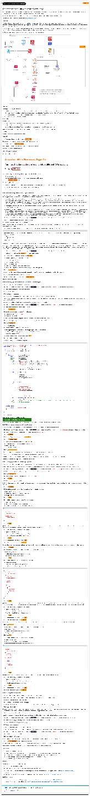

# Lab 2: Message Fan-Out with Amazon EventBridge | Self-Paced Labs

Created: 2023-09-25 07:34:47 -0600

Modified: 2023-10-08 11:10:38 -0600

---

Clipped from: <https://labs.skillbuilder.aws/sa/lab/arn%3Aaws%3Alearningcontent%3Aus-east-1%3A470679935125%3Ablueprintversion%2FILT-TF-200-SVDVSS-1%2Flab-2-EventBridge%3A1.3.4-f31b9e9d/en-US>

# Lab 2: Message Fan-Out with Amazon EventBridge

© 2023 Amazon Web Services, Inc. or its affiliates. All rights reserved. This work may not be reproduced or redistributed, in whole or in part, without prior written permission from Amazon Web Services, Inc. Commercial copying, lending, or selling is prohibited. All trademarks are the property of their owners.

Note: Do not include any personal, identifying, or confidential information into the lab environment. Information entered may be visible to others.

Corrections, feedback, or other questions? Contact us at *[AWS Training and Certification](https://support.aws.amazon.com/#/contacts/aws-training).*

## Overview

Now that you have verified your serverless proof of concept with the first iteration, you need to add the capability for sharing bookmarks with the team. To get the managers on board with your new application, you need to align to the existing knowledge base process. To get the team on board, your product manager has authorized a contest so that each new submission through the application enters the submitter into a drawing to win a prize.

In this lab, you add a new feature to the bookmark application to address the contest use case using Amazon EventBridge. When someone shares a bookmark, the bookmark application should automatically notify the mailbox that is being used to monitor submissions and enter the bookmark into the shareable bookmarks contest.

The following diagram shows the architecture components that have been or will be deployed in this lab.

{width="13.083333333333334in" height="13.65625in"}

**Objectives**

After completing this lab, you will be able to:

- Enable Amazon DynamoDB Streams as an event source for an AWS Lambda function that is invoked when new items are added to a DynamoDB table
- Configure an EventBridge event bus with a Lambda function as its event source and Lambda, Amazon Simple Notification Service (Amazon SNS), and Amazon CloudWatch as targets
- Configure EventBridge rules that route events to your targets based on the criteria that you specify
- Configure an SNS topic that notifies an email subscriber

**Prerequisites**

This lab requires:

- Access to a notebook computer with Wi-Fi and Microsoft Windows, macOS X, or Linux (Ubuntu, SUSE, or Red Hat)
- For Microsoft Windows users, administrator access to the computer
- An internet browser such as Chrome, Firefox, or Internet Explorer 9 (previous versions of Internet Explorer are not supported)

**Note** The lab environment is not accessible using an iPad or tablet device, but you can use these devices to access the lab guide.

**Duration**

This lab requires approximately **60 minutes** to complete.

## Start lab

1.  To launch the lab, at the top of the page, choose Start lab.

You must wait for the provisioned AWS services to be ready before you can continue.

1.  To open the lab, choose Open Console.

You are automatically signed in to the AWS Management Console in a new web browser tab.

**Do not change the Region unless instructed.**

### Common sign-in errors

#### *Error: You must first sign out*

{width="13.083333333333334in" height="2.8333333333333335in"}

If you see the message, **You must first log out before logging into a different AWS account:**

- Choose the **click here** link.
- Close your **Amazon Web Services Sign In** web browser tab and return to your initial lab page.
- Choose Open Console again.

#### *Error: Choosing Start Lab has no effect*

In some cases, certain pop-up or script blocker web browser extensions might prevent the **Start Lab** button from working as intended. If you experience an issue starting the lab:

- Add the lab domain name to your pop-up or script blocker's allow list or turn it off.
- Refresh the page and try again.

## Task 1: Understanding key services and application setup

In this task, you open the AWS Cloud9 integrated development environment (IDE) and download the application code. Once the code is unzipped, a startup script automates the launching of the front-end and backend application code. You then launch and deploy the application via the AWS Amplify console.

- **Amazon EventBridge** makes it easy to build event-driven applications because it takes care of event ingestion, delivery, security, authorization, and error handling for you. To achieve the promises of serverless technologies with event-driven architecture, such as being able to individually scale, operate, and evolve each service, the communication between the services must happen in a loosely coupled and reliable environment. Event-driven architecture is a fundamental approach for integrating independent systems or building up a set of loosely coupled systems that can operate, scale, and evolve independently and flexibly. In this lab, you use EventBridge to address the contest use case.
- **Amazon DynamoDB Streams** is an ordered flow of information about changes to items in a DynamoDB table. When you enable a stream on a table, DynamoDB captures information about every modification to data items in the table.
- **Amazon Simple Notification Service (Amazon SNS)** is a fully managed messaging service for both system-to-system and app-to-person communication. It enables you to communicate between systems through publish/subscribe (pub/sub) patterns that enable messaging between decoupled microservice applications or to communicate directly to users via SMS, mobile push, and email. The system-to-system pub/sub functionality provides topics for high-throughput, push-based, many-to-many messaging. Using SNS topics, your publisher systems can fan out messages to a large number of subscriber systems or customer endpoints, including Amazon Simple Queue Service (Amazon SQS) queues, Lambda functions, and HTTP and HTTPS, for parallel processing. The app-to-person messaging functionality enables you to send messages to users at scale using either a pub/sub pattern or direct-publish messages using a single API.

1.  At the top of the AWS Management Console, to the right of the Services menu, in the search bar, search for

Cloud9

and then choose that service from the list.

2.  Next to the **BookmarkAppDevEnv** environment listing, choose **Open** .

Within a few seconds, the AWS Cloud9 environment launches.

**Note** If the browser is running in an incognito session, a pop-up window with an error message will be displayed when the Cloud9 instance is opened. Choose the **OK** button to continue. Browser in a non incognito mode is recommended.

1.  In the AWS Cloud9 terminal, run the following commands. These commands download and run the startup script, which contains the application code:

wget <https://us-west-2-tcprod.s3-us-west-2.amazonaws.com/courses/ILT-TF-200-SVDVSS/v1.3.4.prod-360ecd52/lab-2-EventBridge/scripts/app-code.zip>
unzip app-code.zip
cd app-code
chmod +x resize.sh
chmod +x startupscript.sh
./startupscript.sh

**Note** The script takes a couple of minutes to run. Once it is finished, you will deploy your bookmark application through Amplify. **Be sure to let the script finish running before moving on to the next step.**

**What the script is doing:** This script modifies the **samconfig.toml** file within the backend portion of the application code. The script replaces values such as AWS Region, stack name, and role Amazon Resource Name (ARN). Next, the script updates the **aws-exports.js** file with the Amazon Cognito metadata that was launched in the lab's AWS CloudFormation template. The script then runs the build, deploys the bookmark application, and uploads the **app.zip** file to the **samserverless** bucket.

1.  At the top of the AWS Management Console, to the right of the Services menu, in the search bar, search for

AWS Amplify

and then choose that service from the list.

2.  Scroll to the bottom and choose the Get started button under **Amplify Hosting**.
3.  Choose **Deploy without Git provider**, and then choose Continue
4.  For **Manual deploy**, configure the following information:

- **App name:** Enter

BookmarkApp

- **Environment name:** Enter

dev

- **Method:** Select **Amazon S3**
- **Bucket:** Select the bucket name that includes **samserverless**
- **Zip file:** Select **app.zip** (When the **Bucket** is selected, this dropdown menu auto-populates.)

1.  Choose Save and deploy
2.  Once you see the message **Deployment successfully completed** in the Amplify console, choose the **Domain** URL to open the bookmark application.
3.  From the bookmark application page, choose **Create account**
4.  Fill in the fields with your information, and choose CREATE ACCOUNT

**Note** Leave this browser tab open.

## Task 2: Enabling DynamoDB Streams and setting up a Lambda trigger

In this task, you enable DynamoDB Streams on **bookmarksTable**.

1.  At the top of the AWS Management Console, to the right of the Services menu, in the search bar, search for

DynamoDB

and then choose that service from the list.

2.  On the left side of the DynamoDB dashboard, choose **Tables**.
3.  Choose **bookmarksTable**.
4.  Choose **Exports and streams** tab.
5.  Verify that the in the **DynamoDB stream details** section, the stream status is On, with a view type of *New and old images*.

DynamoDB Streams helps ensure that each stream record appears exactly once in the stream. Also, for each item that is modified in a DynamoDB table, the stream records appear in the same sequence as the actual modifications to the item.

Now, create the Lambda function that is invoked by the DynamoDB table and alerts the EventBridge event bus.

1.  At the top of the AWS Management Console, to the right of the Services menu, in the search bar, search for

Lambda

and then choose that service from the list.

2.  On the left side of the Lambda dashboard, choose **Functions**.
3.  Choose Create function
4.  On the **Create function** page, configure the following information:

- **Function name:** Enter

StreamTrigger

- **Runtime:** Select **Node.js 18.x**

1.  Under **Permissions**, expand the **Change default execution role** section, and then select **Use an existing role**.
2.  From the **Existing Role** dropdown menu, choose the role name that includes **EventBridgeLambdaRole**.
3.  Choose Create function
4.  Choose Add trigger
5.  On the **Add trigger** page, configure the following information:

- In the **Trigger configuration** section, from the **Select a trigger** dropdown menu, choose **DynamoDB**.
- In the **DynamoDB table** search box, select the table with **bookmarksTable** in the name.
- Decrease the **Batch size** to

5

1.  Leave the rest of the defaults the same, and then choose Add
2.  Choose the **Code** tab to bring up the function again.
3.  Delete the existing code and paste the following code:

import { EventBridgeClient, PutEventsCommand } from "@aws-sdk/client-eventbridge";
const client = new EventBridgeClient({});

export const handler = async (event) => {
console.log(JSON.stringify(event, null, 2));
try
{
for(let i=0; i< event.Records.length; i++) {
const record = event.Records[i];
console.log(record.eventID);
console.log(record.eventName);
if(record.eventName === 'INSERT' || record.eventName === 'MODIFY') {
console.log('DynamoDB Record: %j', record.dynamodb);
console.log('share flag:', record.dynamodb.NewImage.shared.BOOL);
console.log('contest value: ', record.dynamodb.NewImage.contest.S);

var pk = record.dynamodb.NewImage.id.S;
var sharedFlag = record.dynamodb.NewImage.shared.BOOL;
var contestValue = record.dynamodb.NewImage.contest.S;

const bookmarkDetails = {
id: pk,
shared: sharedFlag,
contest: contestValue,
payload: record.dynamodb.NewImage
};

const params = {
Entries: [
{
Source: 'DynamoDB Streams',
DetailType: 'Shared Bookmarks',
EventBusName: 'bookmarks-bus',
Detail: JSON.stringify(bookmarkDetails)
}
]
};
const put_command = new PutEventsCommand(params)
const response = await client.send(put_command);
console.log("response:", response);
//We can optimize the code by calling the putEvents outside of the loop with promise all option. where all the records
//will put in the bus in parallel.
}
}
} catch (error) {
throw new Error(JSON.stringify(error));
}

}

You should see a message that says **Expected output:**

Successfully updated the funcion StreamTrigger

This code sends updates to EventBridge only if there is an UPDATE or INSERT event, kicking off the next phase in the event-driven architecture.

## Task 3: Subscribing to bookmark contest notifications

In this task, you create and subscribe to an SNS topic that sends notifications to you and your manager when a bookmark has been shared.

1.  At the top of the AWS Management Console, to the right of the Services menu, in the search bar, search for

Simple Notification Service

and then choose that service from the list.

2.  On the right side of the page, in the **Create topic** box, for **Topic name**, enter

BookmarkTopic

.

3.  Choose Next step
4.  Confirm that **Type** is set to *Standard* and choose Create topic
5.  Choose Create subscription
6.  On the **Create subscription** page, configure the following information:

- **Topic ARN:** Confirm that it is the ARN with **BookmarkTopic** in the name
- **Protocol:** Select **Email**
- **Endpoint:** Enter a valid email address

1.  Choose Create subscription

After a few moments, you should receive an email to confirm the subscription. You must confirm the subscription to activate it.

1.  To confirm the subscription, choose the **Confirm subscription** link in the email that you receive.

**Note** For this scenario, this email address is considered the email address for the manager who will receive the notifications for the bookmarking contest.

You can move onto the next task as you await the Amazon SNS email confirmation.

## Task 4: Setting up an event bus and configuring rules

In this task, you create rules in EventBridge to attach to an event bus. This event bus receives events from a Lambda stream trigger and then matches them to the applicable rules.

Rules watch for specific types of events. When a matching event occurs, the event is routed to the targets that are associated with the rule. A rule can be associated with one or more targets.

1.  At the top of the AWS Management Console, to the right of the Services menu, in the search bar, search for

Amazon EventBridge

and then choose that service from the list.

2.  On the left side of the page, choose **Event buses** (you may need to first choose the menu icon to expand the pane).
3.  Choose Create event bus
4.  On the **Create event bus** page, in the **Name** field, enter

bookmarks-bus

5.  Choose Create
6.  On the left side of the page, choose **Rules**.

The first rule that you need to create is the **catch-all-rule**. This rule sends the event payload to Amazon CloudWatch Logs after being invoked by the **StreamTrigger** Lambda function and passing through the event bus.

1.  Choose Create rule
2.  On the **Define rule detail** page, in the **Rule detail** section, configure the following information:

- **Name:** Enter

catch-all-rule

.

- **Event bus:** Select **bookmarks-bus** from the dropdown menu.
- **Rule Type:** Select **Rule with an event pattern**.

1.  Choose Next
2.  In the **Build event pattern** page, configure the following information:

- **Event source:** Select **Other**.
- **Creation method:** Select **Custom pattern(JSON editor)**.
- In the **Event pattern** code box, copy and paste in the following code:

{
"source": [
"DynamoDB Streams"
],
"detail-type": [
"Shared Bookmarks"
]
}

**Note** EventBridge rules use event patterns to match AWS events on an event bus. When a pattern matches, the rule routes that event to a target. This event pattern is using DynamoDB Streams as the source and identifying the **Shared Bookmarks** value as the detail to invoke the CloudWatch catch-all log.

1.  In the **Select target(s)** page, configure the following information:

- **Target types:** Select **AWS service**
- **Select a target:** Select **CloudWatch log group** from the dropdown menu
- **Log Group:** Select **/aws/events/** and then enter

catch-all

1.  Choose Next
2.  In the **Configure tags - optional** page, choose Next
3.  In the **Review and create** page, choose Create rule

The next rule that you need to create is the **Notification rule**. When invoked, this rule sends a notification via Amazon SNS to the email address that you used earlier to register with the bookmarks site.

1.  Choose Create rule
2.  On the **Define rule detail** page, in the **Rule detail** section, configure the following information:

- **Name:** Enter

notify-rule

- **Event bus:** Select **bookmarks-bus** from the dropdown menu
- **Rule Type:** Select **Rule with an event pattern**

1.  Choose Next
2.  In the **Build event pattern** page, configure the following information:

- **Event source:** Select **Other**
- **Creation method:** Select **Custom pattern(JSON editor)**
- In the **Event pattern** code box, copy and paste in the following code:

{
"source": [
"DynamoDB Streams"
],
"detail-type": [
"Shared Bookmarks"
],
"detail": {
"shared": [
true
],
"contest": [
{
"anything-but": [
"Entering"
]
}
]
}
}

**Note** This event pattern is again using DynamoDB Streams as the source and **Shared Bookmarks** as the detail-type. The third level to this pattern is **detail: shared: true** along with **contest: anything-but:Entering**, which sends an Amazon SNS message when someone shares a bookmark. The condition without **Entering** will send only one message that the bookmark has been entered into the contest.

1.  In the **Select target(s)** page, configure the following information:

- **Target types:** Select **AWS service**
- **Select a target:** Select **SNS topic** from the dropdown menu
- **Topic:** Select **BookmarkTopic** from the dropdown menu

1.  Choose Next
2.  In the **Configure tags - optional** page, choose Next
3.  In the **Review and create** page, choose Create rule

The final rule that you need to create is the **contest-rule**. This rule invokes the **contest** Lambda function, which adds the relevant item into the **sam-bookmark-app-bookmarksTable**.

1.  Choose Create rule
2.  On the **Define rule detail** page, in the **Rule detail** section, configure the following information:

- **Name:** Enter

contest-rule

- **Event bus:** Select **bookmarks-bus** from the dropdown menu
- **Rule Type:** Select **Rule with an event pattern**

1.  Choose Next
2.  In the **Build event pattern** page, configure the following information:

- **Event source:** Select **Other**
- **Creation method:** Select **Custom pattern(JSON editor)**
- In the **Event pattern** code box, copy and paste in the following code:

{
"source": [
"DynamoDB Streams"
],
"detail-type": [
"Shared Bookmarks"
],
"detail": {
"shared": [
true
],
"contest": [
"Entering"
]
}
}

**Note** This event pattern uses the same structure and details but invokes the Lambda contest function instead of the Amazon SNS message.

1.  In the **Select target(s)** page, configure the following information:

- **Target types:** Select **AWS service**
- **Select a target:** Select **Lambda function** from the dropdown menu
- **Function:** Select **contest** from the dropdown menu.

1.  Choose Next
2.  In the **Configure tags - optional** page, choose Next
3.  In the **Review and create** page, choose Create rule

## Task 5: Testing EventBridge rules

In this task, you add and share bookmarks. This kicks off EventBridge and the corresponding rules.

**Note** Before continuing, make sure that you have confirmed your email registration and email subscriptions from earlier in the lab.

1.  Go to the browser tab with the bookmark application.
2.  Choose the plus **+** icon at the top-right corner of the page.
3.  On the **Add New Bookmark** page, add and share a bookmark of your choice. Make sure that the **Share Bookmark** toggle is set to **On**.
4.  Choose **ADD BOOKMARK**.

**Note** When a user shares a bookmark, the bookmark application navigates to the shared bookmark page that lists all of the bookmarks that have been shared. The bookmark application also updates the value of the **shared** column for that particular row from false to true in the **bookmarks-app-bookmarksTable** in DynamoDB.

1.  Check your email for the Amazon SNS notification.

**Note** Within the payload of the Amazon SNS email, you should see **"shared":true**. This email confirms that the SNS topic and **notify-rule** worked as intended.

1.  At the top of the AWS Management Console, to the right of the Services menu, in the search bar, search for

CloudWatch

and then choose that service from the list.

2.  On the left side of the page, choose **Log groups** (you may need to expand the **Logs** section to find this option).
3.  Locate and open the **/aws/events/catch-all** log group.
4.  Open the most recent **Log stream**.
5.  Next to the timestamp for the log stream, expand the message.

Here you can see important details from the catch-all rule that you created earlier, such as time, unique id of the user who added the bookmark, account ID, and username.

1.  At the top of the AWS Management Console, to the right of the Services menu, in the search bar, search for

DynamoDB

and then choose that service from the list.

2.  In the left navigation pane, choose **Tables**.
3.  Choose the **bookmarksTable** table.

This is the **bookmarksTable** table that was created when deploying your backend code via the AWS Serverless Application Model (AWS SAM).

1.  Choose **Explore table items** at the top-right corner of the page.

Here are the bookmarks that have been added. Notice the **shared** column, which shows either true or false, and the **contest** column, which shows **Entered**.

This information confirms that all three EventBridge rules worked and that the event-driven architecture was a success!

## Conclusion

Congratulations! You now have successfully:

- Enabled DynamoDB Streams as an event source for a Lambda function that is invoked when new items are added to a DynamoDB table
- Configured an EventBridge event bus with a Lambda function as its event source and Lambda, Amazon SNS, and CloudWatch as targets
- Configured EventBridge rules that route events to your targets based on the criteria that you specify
- Configured an SNS topic that notifies an email subscriber

## End lab

Follow these steps to close the console and end your lab.

1.  Return to the **AWS Management Console**.
2.  At the upper-right corner of the page, choose **AWSLabsUser**, and then choose **Sign out**.
3.  Choose End lab and then confirm that you want to end your lab. For more information about AWS Training and Certification, see *<https://aws.amazon.com/training/>.*

*Your feedback is welcome and appreciated.*
*If you would like to share any feedback, suggestions, or corrections, please provide the details in our [AWS Training and Certification Contact Form](https://support.aws.amazon.com/#/contacts/aws-training).*

## Additional resources

- For more information about EventBridge, see <https://pages.awscloud.com/Deep-Dive-on-Amazon-EventBridge_2019_0919-SRV_OD.html>.
- For more information about DynamoDB Streams, see <https://docs.aws.amazon.com/amazondynamodb/latest/developerguide/Streams.html>.

{width="1.5625in" height="13.083333333333334in"}

