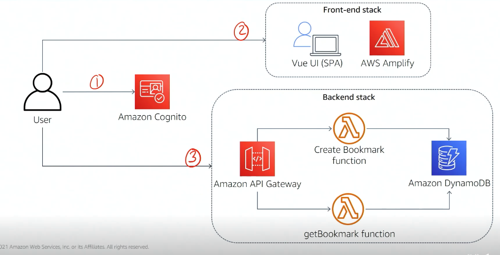

# Lab1 

Created: 2023-09-24 12:20:21 -0600

Modified: 2023-10-08 11:09:45 -0600

---

![Lab 1 application requirements Functional requirements aws training and ---y certification • Allow a user to create a profile, add a bookmark to a data store for their own access, and recall the bookmark from the application • Include a simple UI with sign-in functionality that team members can use to test the functionality without knowledge of the backend Technical requirements • Use the AWS serverless stack • Allow the front end to be deployed separately from the backend Developer tools • AWS Cloud9 IDE • AWS SAM and AWS SAM CLI • Amplify ](../../../media/AWS-Developing-Serverless-Solutions-on-AWS-Module-6-Lab1-image1.png){width="5.0in" height="2.6979166666666665in"}

{width="5.0in" height="2.1666666666666665in"}

{width="5.0in" height="2.5520833333333335in"}

{width="0.6458333333333334in" height="6.5in"}

