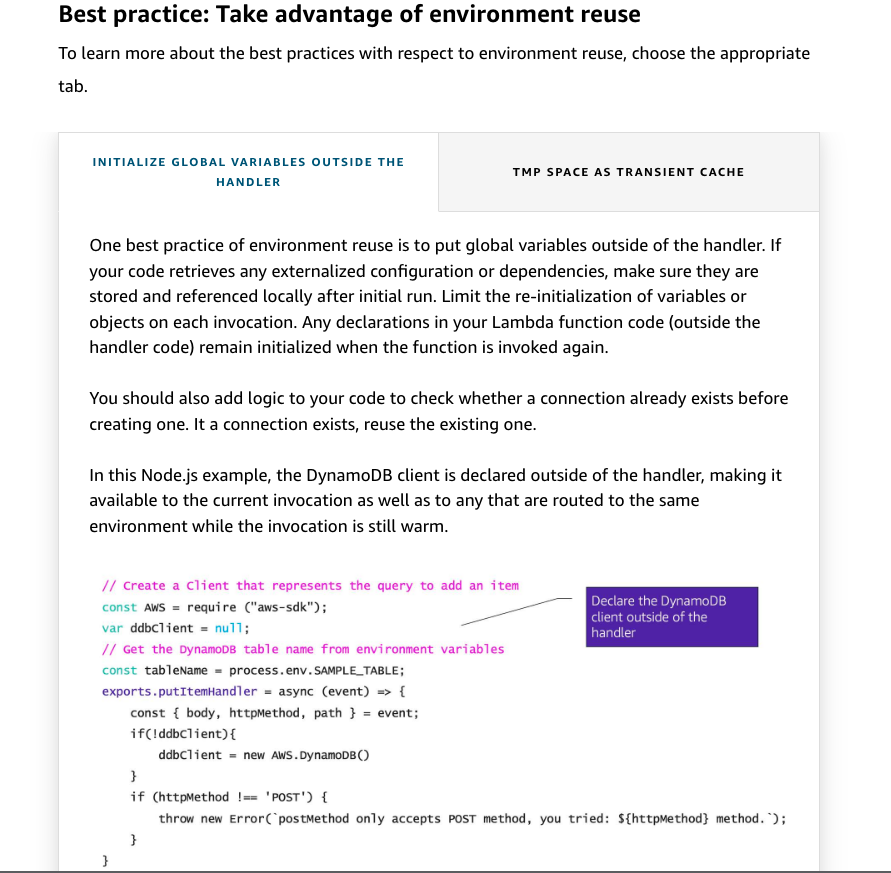

# 22

---

Summary

This module delves into best practices for writing efficient Lambda functions, emphasizing the Lambda lifecycle, environment reuse, error handling, and optimizing performance through techniques like provision concurrency.

Facts

- DynamoDB Streams and Kinesis Data Streams are integral to the Lambda lifecycle, with each stream having its unique characteristics.
- Lambda creates an on-demand ephemeral environment for each function invocation, with the first request being a "cold start" and subsequent requests being "warm starts."

![Init phase EXTENSION INIT RUNTIME INIT FUNCTION INIT INIT phase In this phase, Lambda creates or unfreezes an execution environment with the configured resources, downloads the code for the function and all layers, initializes any extensions, initializes the runtime, and then runs the function's initialization code (the code outside the main handler). The Init phase happens either during the first invocation, or before function invocations if you have enabled provisioned concurrency. The Init phase is split into three sub-phases: 1. Extension init - starts all extensions 2. Runtime init - bootstraps the runtime 3. Function init - runs the function's static code These sub-phases ensure that all extensions and the runtime complete their setup tasks before the function code runs. ](../../../media/AWS-Developing-Serverless-Solutions-on-AWS-Module-7---Lambda-22-image2.png)

- Environment reuse is a performance optimization technique, where global variables and code outside the handler run during a cold start, and are reused in subsequent warm starts.
- The temp directory in Lambda can be used as a cache, and its contents persist across warm starts.

- It's essential to ensure background processes or asynchronous tasks complete before returning from a Lambda function.

Check for background process .. Node js

3 ways

![Example: Check for background processes AWS = requi re ("aws-sdk") ; const ddbcl i ent = new AWS. DynamoDB() ; const let tables = ddbCIient.IistTab1es() ; aws training and certification Node.js options to check for completion // CALLBACKS function(err, data){ console. log (data. TableNames) }) // let tablespromi se = ddbcl ient. listTab1es() .promi se() ; tablespromi se. { console. log(data) }) // Async/Await getTabIes() async function let tableNames = await ddbc1ient.1istTab1es() .promi se(); console. log(tab1eNames); } consol e. log (tables) 0 2025 Amaaty•. Web Semces. ts Aff"ates All reserved ](../../../media/AWS-Developing-Serverless-Solutions-on-AWS-Module-7---Lambda-22-image5.png)

- Using a database proxy, like RDS proxy, can help manage connection pooling and prevent exhausting database connections.
- ![Best practice: Use a database proxy to manage connection pooling A database proxy can provide connection pooling in addition to other benefits. This allows your functions to interact with the Amazon Relational Database Service (Amazon RDS) proxy endpoint, and the proxy manages the incoming connections to the database as needed. This is much more efficient for functions where you anticipate high levels of concurrency. AWS offers database proxy on Amazon RDS MySQL and Postgres, as well as on Amazon Aurora. 1 Lambda Connection pooling Amazon ROS Proxy Using RDS Proxy, you can handle unpredictable surges in database traffic. Otherwise, these surges might cause issues due to oversubscribing connections or creating new connections at a fast rate. RDS Proxy establishes a database connection pool and reuses connections in this pool. This approach avoids the memory and CPU overhead of opening a new database connection each time. To protect the database against oversubscription, you can control the number of database connections that are created. ](../../../media/AWS-Developing-Serverless-Solutions-on-AWS-Module-7---Lambda-22-image7.png)

- State should be persisted externally, using services like DynamoDB, ElastiCache, S3, or EFS.
- 

- Minimizing the package size of a Lambda function can improve performance, especially during cold starts.
- 

- Elastic File System (EFS) can be mounted to Lambda for large and shared assets, providing a shared space accessible by both Lambda and EC2 instances.

- Provision concurrency in Lambda ensures a specified number of warm environments are always available, reducing cold start occurrences.

![I I -vocation requests AVVS Lambda • Cold start First request Create and initialize environment packages and dependencies /tmp Space Run Handler Next request • Warm start A cold start occurs when a new execution environment is required to run a Lambda function. When the Lambda service receives a request to run a function, the service first prepares an execution environment. During this step, the service downloads the code for the function, then creates the execution environment with the specified memory, runtime, and configuration. Once complete, Lambda runs any initialization code outside of the event handler before finally running the handler code. In a warm start, the Lambda service retains the environment instead of destroying it immediately. This allows the function to run again within the same execution environment. This saves time by not needing to initialize the environment. ](../../../media/AWS-Developing-Serverless-Solutions-on-AWS-Module-7---Lambda-22-image11.png)

![Concurrency is the number of requests that your function is serving at any given time. When your function is invoked, Lambda allocates an instance of it to process the event. When the function code finishes running, it can handle another request. If the function is invoked again while a request is still being processed, another instance is allocated, which increases the function's concurrency. The total concurrency for all of the functions in your account is subject to a per-region quota. By default, Lambda provides your account with a total concurrency limit of 1,000 across all functions in a region. Invocation requests Concurrency: ,AWS Lambda 4 ](../../../media/AWS-Developing-Serverless-Solutions-on-AWS-Module-7---Lambda-22-image12.png)

![Best practice: Minimize cold start times When you invoke a Lambda function, the invocation is routed to an execution environment to process the request. If the environment is not already initialized, the start-up time of the environment adds to latency. If a function has not been used for some time, if more concurrent invocations are required, or if you update a function, new environments are created. Creation of these environments can introduce latency for the invocations that are routed to a new environment. This latency is implied when using the term cold start. For most applications, this additional latency is not a problem. However, for some synchronous models, this latency can inhibit optimal performance. It is critical to understand latency requirements and try to optimize your function for peak performance. ](../../../media/AWS-Developing-Serverless-Solutions-on-AWS-Module-7---Lambda-22-image13.png)

![INITIALIZE GLOBAL VARIABLES OUTSIDE THE TMP SPACE AS TRANSIENT CACHE HANDLER Another way to take advantage of environment reuse is to add code to check whether the local cache has the data that you stored. Each invocation environment provides a small amount of disk space in the /tmp directory, which remains in the environment. This is a Node.js example where the function looks for config.json in the tmp directory. If this is a warm environment, the file does not need to be reloaded. If there is an error finding the file in the tmp directory, the function loads it. fs require('fs') const if (err) { console. error (err) var s3 = new AWS.S3(): ' utf8 Check the tmp space for a static file, and only fetch it if it doesn't already exist var params --- {Bucket: 'mypriyateconfigßucket' , Key: 'config.json'}•, var file - s3. geüject(params) . createReadStream(). pipe (fi 1 e) consol e. log (data) //TODO - parse the config data from the file ](../../../media/AWS-Developing-Serverless-Solutions-on-AWS-Module-7---Lambda-22-image16.png)

