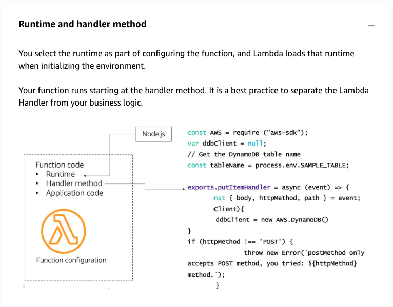

# 24

Created: 2023-09-24 21:49:30 -0600

Modified: 2023-10-22 17:26:23 -0600

---

Summary

The text provides insights into best practices for AWS Lambda function code, including choices of runtime, handler methods, application code, Lambda layers, external dependencies, SDK bundling, environment variables, and the importance of idempotent functions.

Facts

- Lambda functions require the selection of a runtime, such as Python, Node, .Net, or Java.
- The handler method is a pointer indicating which function within the code should execute.

- Code outside the handler method runs during the cold start, which can be utilized for caching and object construction.

- {width="5.0in" height="3.9027777777777777in"}

- Application code, once uploaded to Lambda, remains immutable until a new version is supplied.
- Lambda layers allow sharing of libraries or resources across multiple functions.
- Lambda layers can be used to store external dependencies, such as certificates for authentication.
- Bundling the AWS SDK in a layer provides control over its specific version.

- ![Lambda Layers Lambda layers were explicitly designed for reuse of application code. You can use a layer that matches the runtime of your function to attach reusable modules or libraries. A function can have a limited number of layers associated with it, but layers can be used across any of your functions. You need permissions to view and use the layer if it is not public. You can't run a layer on its own. A layer reduces your actual Lambda function deployment size, which speeds up your CI/CD cycle. For example, you might be able to reduce the size of a Lambda function from 10 MB to 2 MB. You can specify multiple runtimes for a layer. Note, the runtime is a tag rather than any check on the type of code that you include. For example, if you indicate that the runtime is Node.js, but it contains Python code, that layer will be available to your Python functions. However, the layer would fail when the function tries to run it. ](../../../media/AWS-Developing-Serverless-Solutions-on-AWS-Module-7---Lambda-24-image2.png){width="5.0in" height="3.1041666666666665in"}

- Environment variables can be used to pass parameters, like Dynamo table names, to avoid hardcoding.
- SAM templates in CloudFormation can set environment variables for Lambda functions, referencing resources like Dynamo tables.

![Environment variables You can use environment variables to store secrets securely and adjust your function's behavior without updating code. An environment variable is a pair of strings that are stored in a function's version-specific configuration. The underlying invocation environment for the runtime provides additional libraries as well as environment variables that you can access from your function code. You can also create your own environment variables to use in your code. When you publish a version, the environment variables are locked for that version along with other version-specific configurations. Function code Runtime Handler method Application code Environment variables Function configuration AWS require ("aws---sdk"); Con St var ddbclient null; // Get the DynamoDB table name tableName process. env. SAMPLE_TABLE; const exports .put1temHandIer async (event) { const { body, htt*ethod, path event; AWS. if ' POST') { throw new only accepts POST method, you tried: method. • ](../../../media/AWS-Developing-Serverless-Solutions-on-AWS-Module-7---Lambda-24-image3.png){width="5.0in" height="4.569444444444445in"}

- Writing idempotent functions ensures consistent outcomes even if the function is executed multiple times with the same parameters.
- Idempotent functions are crucial due to the "at least once delivery" nature of services like SQS.
- When consuming from an SQS queue, the event includes a message ID and a hash of the body contents, useful for de-duplicating messages.
- 

![Idempotency Idempotent functions account for: • At-least-once delivery Distributed logic Retry behaviors Every event source has some unique ID. MessagelD is a unique identifier that Amazon SQS generates. If you want to verify the uniqueness of the record on the SQS queue, you could use the messagelD attribute. Another scenario might be that you actually need to verify the uniqueness of the payload. For example, if an upstream producer sent the same record to Amazon SQS twice, each of those events would have a unique messagelD in Amazon SQS but would really be the same payload from your application's perspective. You can avoid processing the same payload twice using the md50fBody attribute in the Amazon SQS event. This field represents a unique hash of the payload. First-ln-First-Out (FIFO) queues have additional attributes in the event that are related to deduplication and sequencing to maintain record order and provide one-time-only delivery. You should still include code to prevent processing the same payload twice. Likewise, although FIFO SNS topics and all Kinesis data streams are designed to prevent duplicate records from being processed, scenarios exist that could create a situation where your Lambda function receives the same record. Always check for uniqueness of the event. ](../../../media/AWS-Developing-Serverless-Solutions-on-AWS-Module-7---Lambda-24-image4.png){width="5.0in" height="4.625in"}

!["Records": [ "messageld" : 059f36b4-87a3-44ab-83d2-661975830a7d" , "receiptHand1e": "AQEBwJnKyrHigwzj6rYigCgx1aS3SLyOa... " , "body": "Test message. " , "attributes". "ApproximateReceiveCount": "1" , "SentTimestaM': "1545082649183" , "senderld": "AIDAIENQZJOL023YVJ4V0" , "ApproximateFi • " 'i. 1545082649185" "messageAttributes": { } , "md50fB0dy": "e4e68fb7bdOe697aOae8f1bb342846b3" , "eventsour•ce" : "aws: sqs" , "eventsourceARN•': , "awsRegion": '"us-east-2" Unique per message on the SQS queue unique per event payload ](../../../media/AWS-Developing-Serverless-Solutions-on-AWS-Module-7---Lambda-24-image5.png){width="5.0in" height="2.4375in"}

