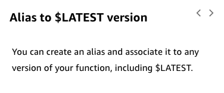
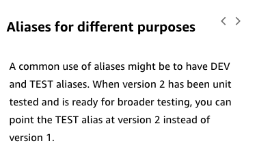

# 25

Created: 2023-09-24 21:49:34 -0600

Modified: 2023-10-22 17:26:26 -0600

---

Summary

The text delves into best practices for managing versions and aliases of AWS Lambda functions, emphasizing the utility of versions for rollbacks, the flexibility of aliases, and the potential for gradual deployments using routing configurations.

Facts

- Lambda functions can be versioned, capturing the function configuration, code, and events.
- The $LATEST reference points to the most recent version of a Lambda function.
- Lambda function ARNs can specify either $LATEST or a specific version.
- Versions can be useful for rollbacks without redeploying the function.
- Aliases act as pointers to specific versions or $LATEST.
- Aliases can be referenced in ARNs, offering flexibility in directing traffic to specific versions.
- Aliases support routing configurations, allowing for distribution of requests between different versions.
- Routing configurations can be used for gradual deployments, adjusting traffic distribution based on confidence in the new version's stability.

{width="5.0in" height="3.6458333333333335in"}

![You can use versions to manage the deployment of your functions. $LATEST represents the latest version of the lambda function. To learn more, navigate through the graphic. arn : aws: 1 ambda : aws- regi on : acct-i d: functi on : hel 1 oworl d : $LATEST Permissions • Resource-based policy Execution role Triggering events Event sources Function code Runtime Handler method Application code Environment variables Function configuration Memory Timeout Reserved and provisioned concurrency Runtime Lambda layers "Destinationconfig": { "onsuccess • nonpailure": Dead-letter ueue $LATEST Target resources A function version includes the triggers, permissions, configurations, and code When you create a function, there is only one version: $LATEST Two Amazon Resource Names (ARNs) are associated with the function: • Qualified ARN --- The function ARN with a version suffix • Unqualified ARN --- The function ARN without a version suffix ](../../../media/AWS-Developing-Serverless-Solutions-on-AWS-Module-7---Lambda-25-image2.png){width="5.0in" height="4.013888888888889in"}

{width="5.0in" height="4.333333333333333in"}

{width="3.9166666666666665in" height="1.625in"}

{width="3.9166666666666665in" height="2.4791666666666665in"}

{width="3.6041666666666665in" height="4.0625in"}

