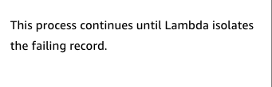
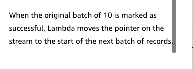

# 27

Created: 2023-09-24 22:13:14 -0600

Modified: 2023-10-22 17:26:43 -0600

---

Summary

The text delves into best practices and options for running, testing, and handling errors in AWS Lambda functions, emphasizing the importance of local testing, versioning, and understanding the nuances of different error types.

Facts

- Lambda functions can be tested directly in the AWS console using configured test events.
- Invocation errors occur when there's an issue invoking the function, such as malformed JSON.
- Throttling errors arise when the provisioned number of concurrent executions is exceeded.

![Types of errors There are two types of errors that might occur while running Lambda functions. To learn more, choose appropriate tab. INVOCATION ERRORS FUCNTION ERRORS An invocation error occurs when the Lambda service is unable to invoke your function. Two scenarios generate invocation errors: 1. The first scenario occurs when the event passed to Lambda by the event source has an issue. For example, the source doesn't have the proper permissions to invoke the function, the JSON is invalid, or the payload is too large. 2. The second scenario occurs when the Lambda service receives the event but cannot initiate an invocation of the function. The most common reason for this type of error is that not enough concurrency is available to start a new invocation environment, so Lambda throttles the request.lnvocation errors result in a 400- or 500-series error code. ](../../../media/AWS-Developing-Serverless-Solutions-on-AWS-Module-7---Lambda-27-image1.png){width="10.083333333333334in" height="7.135416666666667in"}

- Function errors are those that occur within the function's code but are still considered a successful invocation by the service.

{width="10.083333333333334in" height="4.239583333333333in"}

- Synchronous event sources, like API Gateway, return errors directly to the client.
- ![Handling invocation errors Lambda functions can be invoked by three types of source triggers. Error handling for each type of invocation source is different. To learn more, expand each of the three categories. Synchronous event sources Remember that with synchronous event sources, it's a request/response API call. The event source or the client that it is attached to must handle any error that occurs while invoking or running the function. For example, if API Gateway is being used to proxy a client request to the Lambda function, that client needs to handle the errors that come back. The AWS CLI and AWS SDK include backoff and retries by default, so take advantage of those to respond to errors. Client Amazon API Gateway AWS Lambda ](../../../media/AWS-Developing-Serverless-Solutions-on-AWS-Module-7---Lambda-27-image3.png){width="10.083333333333334in" height="9.78125in"}

- Asynchronous event sources, like SNS, handle errors differently, with options like dead-letter queues and OnFailure destinations.

![Asynchronous event sources Remember that with an asynchronous invoke, the event source that requests the invocation does not wait for the results of the function, but the event source is responsible for making sure that the request is handed off successfully. With asynchronous event sources, the client or invoking service is still responsible for dealing with most errors that prevent Lambda from invoking the function; for example, permissions issues or invalid JSON. If you are writing your own asynchronous event sources, you need to manage those types of errors and design retry mechanisms. Server-side errors can happen when the system responsible for the subscribed endpoint becomes unavailable or returns an exception that indicates it can't process a valid request from Amazon SNS. (The order is valid, but the cook is on a break.) Amazon SNS retries server-side errors based on the retry policy for the type of endpoint. When Lambda or another AWS managed endpoint is the subscriber, retries extend for a very long period, and the time increases between attempts. Lambda controls the frequency and backoff pattern of retries for this type of failure, but you can configure how long failed invocations are retried in the function configuration (up to 6 hours). If Lambda successfully invokes the function but your function throws an exception or doesn't complete, Lambda retries running the function up to two more times. You can set this retry value from 0-2 in the function configuration. You can send Lambda invocation failures that continue to fail beyond the duration you set, as well as function errors that exhaust your retry configuration, to an OnFailure destination or a dead-letter queue. ](../../../media/AWS-Developing-Serverless-Solutions-on-AWS-Module-7---Lambda-27-image4.png){width="10.083333333333334in" height="9.3125in"}

- 
- {width="10.083333333333334in" height="3.9270833333333335in"}
- Lambda manages errors for polling event sources, such as streams or queues.

- ![Polling With both streams and queues, records are produced upstream and added to the stream or queue. Lambda gets a batch of records off the queue or stream and then invokes the function synchronously with that batch. Generally speaking, Lambda owns the error handling between itself and the event source, and Lambda will keep trying a batch until it succeeds (by default) or the records expire. For these event sources, be particularly aware of queue and stream behaviors that indicate Lambda may be running into a high number of errors. With both queues and streams, you have some configuration options to modify the default error-handling behaviors to get failed records out of the way, and it is a best practice to use these. Event Source Mapping with Kinesis Stream Arnazon Kinesis data stream Fa i led-event Event s mappirz Lambda ](../../../media/AWS-Developing-Serverless-Solutions-on-AWS-Module-7---Lambda-27-image6.png){width="10.083333333333334in" height="10.520833333333334in"}
- For SQS queues, Lambda processes batches of records, and developers can handle record deletion.
- Dead-letter queues in SQS are populated based on maximum receives and message retention settings.
- 

![Lambda manages errors for polling event sources Stream or queue Batch of records Error handling configurations Keep trying until success or expiration AWS Lambda aws training and -y certification Lambda function • Queues: Handle partial failures in your code; configure redrive policy and dead- letter queue on the source queue • Streams: Configure maximum retries plus bisect batch on error or checkpointing, and configure an OnFailure destination 0 Amazon Web Se-n.•.ces. C' its Affiaate-s All r.hts 47 ](../../../media/AWS-Developing-Serverless-Solutions-on-AWS-Module-7---Lambda-27-image7.png){width="10.083333333333334in" height="5.6875in"}

- {width="7.5625in" height="5.416666666666667in"}

{width="7.645833333333333in" height="7.354166666666667in"}

- ![Handling partial failures with a queue It's a best practice to have your Lambda function code delete successfully processed records off of the queue as soon as processing is complete. Although Lambda manages the SQS queue, you have some options for configuring how long- erroring records are retried. You can limit the retention period on the queue itself. Messages are discarded if they remain on the queue beyond the time limit that you set. To learn more, choose each hotspot. Only failed records become visible Amazon SQS : 000? i000? C)OO: OOQ i 000, ± OOO' i 000 r ± ooo, Amazon SQS AWS Lambda Delete each record from the queue after processing it successfully ?000? 000? iooc? It is a best practice to configure a dead-letter queue with a "maximum receives" value, which limits how many times Lambda will retry a failing record. When a record hits the maximum receives value, it is sent to the dead-letter queue where you can perform offline analysis or another automated process on failed records. ](../../../media/AWS-Developing-Serverless-Solutions-on-AWS-Module-7---Lambda-27-image10.png){width="10.083333333333334in" height="10.510416666666666in"}

- ![It is a best practice to configure a dead-letter queue with a "maximum receives" value, which limits how many times Lambda will retry a failing record. When a record hits the maximum receives value, it is sent to the dead-letter queue where you can perform offline analysis or another (D '000 .poo_ automated process on failed records. To learn more, choose each hotspot. Set maximum receives on the dead-letter queue to limit the number Of retries Maximum receives 3 Dead-letter i 000? : 000? oooi ? OOQ o: 000: ooo: i000i iooo: All' AWS Lambda i 000 i 000} Amazon SQS queue rnazon SQS Message retention period ](../../../media/AWS-Developing-Serverless-Solutions-on-AWS-Module-7---Lambda-27-image11.png){width="10.083333333333334in" height="7.34375in"}

{width="7.833333333333333in" height="5.791666666666667in"}

For streams like Dynamo or Kinesis, bisecting batches and reporting batch item failures are options for error handling.

{width="7.770833333333333in" height="3.6458333333333335in"}

{width="8.041666666666666in" height="3.6875in"}

![Lambda splits the batch into two When the function returns an error, Lambda splits the batch into two and then sends them to your function separately. Lambda also resets the retry and max age values whenever it splits a batch. Now you have two batches of five. Lambda sends the first batch of five, and it fails, so the splitting process repeats. Lambda splits that failing batch, yielding a batch of two and a batch of three records. Lambda resets the retry and max age values and sends the first of tho two batches for processing. ](../../../media/AWS-Developing-Serverless-Solutions-on-AWS-Module-7---Lambda-27-image15.png){width="8.020833333333334in" height="9.3125in"}

{width="7.1875in" height="2.375in"}

{width="8.229166666666666in" height="8.708333333333334in"}

{width="8.104166666666666in" height="2.9791666666666665in"}

![Handling partial failures with a stream: BisectBatchOnFunctionError When the function returns an error, Lambda splits the batch into two and then sends them to your function separately, still maintaining record order. Lambda also resets the retry and max age values whenever it splits a batch. To learn more, choose each hotspot. Bi sectB tchOnFunctionError = True Maxi mumRetryAttempts = 2 Bisect failed Failed batch 000000000 AWS Lambda 000 000 esti nati onconfi g = SNS topic OnFailure destination Handling partial failures with a stream: Checkpointing When you set FunctionResponseType equal to Report Batch Item Failure, if a batch fails to process, only records after the last successful message are retried. This reduces duplicate processing and gives you more options for failure handling. If a failure occurs, Lambda prioritizes checkpointing, if enabled, over other mechanisms to minimize duplicate processing. ](../../../media/AWS-Developing-Serverless-Solutions-on-AWS-Module-7---Lambda-27-image19.png){width="10.083333333333334in" height="10.0625in"}

- Lambda functions can be versioned, and these versions or aliases can be referenced in services like API Gateway.
- Aliases can have routing configurations to distribute traffic between versions.
- SAM CLI offers local testing with simulated Lambda and API Gateway environments.
- Lambda functions have various configuration options, including permissions, timeouts, and memory settings.

