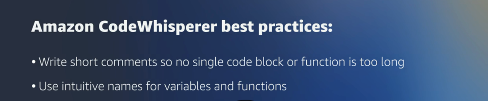

# 28

Created: 2023-09-24 22:15:08 -0600

Modified: 2023-10-22 17:26:47 -0600

---

Summary

Amazon CodeWhisperer is an AI-powered coding companion integrated into IDEs, offering real-time code suggestions, error detection, and security vulnerability recommendations, aiming to accelerate software development and enhance code quality.

Facts

- CodeWhisperer provides real-time coding suggestions as developers type in their IDE.
- It can generate single-line code or full-function suggestions based on comments or direct coding.
- Developers can describe tasks in natural language, and CodeWhisperer will recommend code snippets.
- It is optimized for general coding tasks and AWS services.
- CodeWhisperer can detect hard-to-find vulnerabilities and offer remediation suggestions.
- It aligns with security best practices, such as those by OWASP.
- The tool is available for free with an AWS Builder ID, without needing a credit card or AWS account.
- It integrates with the AWS toolkit in IDEs like PyCharm.
- CodeWhisperer uses context from code snippets, comments, cursor location, and open files to provide relevant suggestions.
- Developers are advised to review and modify CodeWhisperer's suggestions as needed.
- Short, task-specific comments yield better results from CodeWhisperer.
- Intuitive naming of code elements enhances the quality of suggestions.
- CodeWhisperer reduces boilerplate coding, allowing developers to focus on more complex tasks.
- It aids in improving application security by detecting and suggesting fixes for vulnerabilities.
- To use CodeWhisperer, developers should install the AWS toolkit in their IDE and sign in with an AWS Builder ID.

{width="10.083333333333334in" height="2.1770833333333335in"}

