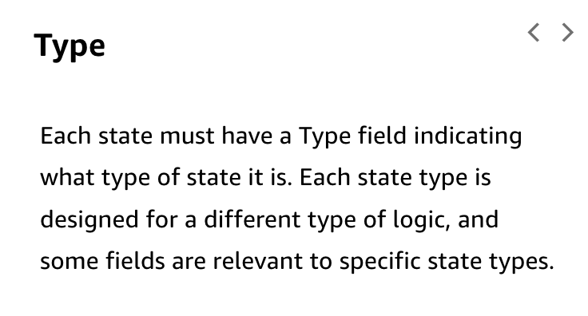

# 29

Created: 2023-09-24 21:48:49 -0600

Modified: 2023-10-22 17:26:55 -0600

---

Summary

Step Functions provide a means to orchestrate multi-step workflows in AWS, allowing for tasks, choices, parallel executions, and more, to streamline and simplify code execution and business processes.

Facts

- Step Functions address the need for multi-step workflows in coding and business processes.
- State machines in Step Functions represent workflows, transitioning from one state to another while passing message data.
- States can be tasks (running Lambda functions), choices (branching logic), or other types.
- Workflows can be visualized as graphs, with conditions and parallel executions.
- Step Functions allow developers to focus on business logic, simplifying code and making workflow updates easier.
- Workflows are defined using a JSON-based states language.
- Step Functions integrate with various AWS services, including Lambda and ECS.
- Choice states determine the next execution path based on conditions.
- Parallel states allow for concurrent execution of tasks, improving efficiency.
- Wait states introduce deliberate pauses in execution.
- Map states can iterate over arrays in JSON, executing tasks for each item.

{width="5.0in" height="1.5416666666666667in"}

{width="5.0in" height="4.458333333333333in"}

{width="5.0in" height="3.9166666666666665in"}

{width="5.0in" height="3.923611111111111in"}

{width="5.0in" height="3.2083333333333335in"}

{width="5.0in" height="3.8819444444444446in"}

- Input and output filtering allows for selective data passage between states.
- Direct service-to-service invocations are supported, with fallback to AWS SDK for unsupported services.
- Monitoring is facilitated through X-Ray and logging, aiding in debugging.
- Step Functions can be created and managed using the SAM (Serverless Application Model).
- Two workflow types exist: Standard (long-running, up to a year) and Express (short, up to 5 minutes).
- Standard workflows have an "Exactly Once" execution model, while Express workflows follow an "At Least Once" model.
- Express workflows are suitable for high-volume, short-duration tasks, while Standard workflows are ideal for longer processes.

![AWS Step Functions AWS Step Functions is a serverless orchestration service that lets you integrate with AWS Lambda functions and other AWS services to build business- critical applications. Through Step Functions' graphical console, you see your application's workflow as a series of event-driven steps. Step Functions is based on state machines and tasks. A state machine is a workflow. A task is a state in a workflow that represents a single unit of work that another AWS service performs. Each step in a workflow is a state. Following image demonstrates a step function workflow in the donut maker scenario: ](../../../media/AWS-Developing-Serverless-Solutions-on-AWS-Module-8-29-image7.png){width="5.0in" height="3.2222222222222223in"}

{width="5.0in" height="3.3333333333333335in"}{width="5.0in" height="4.326388888888889in"}

{width="5.0in" height="2.6875in"}{width="5.0in" height="2.7152777777777777in"}

{width="5.0in" height="3.048611111111111in"}{width="5.0in" height="2.6180555555555554in"}

![Waiting for a callback with task token within a Task state z.- Step Functions workflow Start Callback tasks provide a way to pause a workflow until a task token is returned. A task might need to wait for a human approval, integrate with a third party, or call legacy systems. For tasks like these, you can pause Step Functions indefinitely, and wait for an external process or workflow to complete. For these situations Step Functions allows you to pass a tasl< token to the AWS SDK service integrations, and also to some Optimized service integrations. The task will pause until it receives that task token back with a SendTaskSuccess or SendTaskFailure call. Prepare the dough Roll out the crust Pie type Peel apples Pit cherries Fill and cover pie Bake pie Head pie baker approval Box the pie End ](../../../media/AWS-Developing-Serverless-Solutions-on-AWS-Module-8-29-image14.png){width="5.0in" height="2.6666666666666665in"}

![Map states iterate on an input array Step Functions workflow Start "detai 1" . { ' "C16" , "ordered" : { "icing": "sprinkles", "quanti ty": 4 } , Fry the donuts { "ici ng": "chocolate", "quanti ty": 4 } , { "icing": "lemon", "quanti ty": 4 } , , Ice donuts Box the donuts End Often, the input into a step may be a list of items of a varying number. Use Map states to run the same steps for multiple entries of an array in the state input. For example, if you switch to the donut ordering state machine, you might use a Map state to have the "Ice donuts" function run for each input in the array for the customer's donut order. The same function runs for each item in your array using values from the individual array item. The Map state isn't complete until the function has iterated through all of the items in the array. Use the Map state to run a set of workflow steps for each item in a dataset. The Map state's iterations run in parallel, which makes it possible to process a dataset quickly. Map states can use a variety of input types, including a JSON array, a list of Amazon S3 objects, or a CSV file. ](../../../media/AWS-Developing-Serverless-Solutions-on-AWS-Module-8-29-image15.png){width="5.0in" height="3.4375in"}![Error handling with retry and catch Any state can encounter runtime errors. Errors can happen for various reasons, such as the following examples: • State machine definition issues (for example, no matching rule in a Choice state) • Task failures (for example, an exception in a AWS Lambda function) • Transient issues (for example, network partition events) By default, when a state reports an error, AWS Step Functions causes the execution to fail entirely. Task and Parallel states can have a field named Retry, whose value must be an array of objects known as retriers. An individual retrier represents a certain number of retries, usually at increasing time intervals. Task, Map and Parallel states can each have a field named Catch. This field's value must be an array of objects, known as catchers. ](../../../media/AWS-Developing-Serverless-Solutions-on-AWS-Module-8-29-image16.png){width="5.0in" height="3.326388888888889in"}

![Standard vs Express workflow When you create a state machine, you select a Type of either Standard or Express. Standard Workflows are ideal for long-running (up to one year), durable, and auditable workflows. Express Workflows are ideal for high-volume, event-processing workloads such as IOT data ingestion, streaming data processing and transformation, and mobile application backends. The default type for state machines is 'Standard'. Standard Long-running with access to visualization and full history in the console Asynchronous processing Exactly-once model Execution state is internally persisted on every state transition Ideal for long-running workflows with asynchronous tasks Express Short-running with access to results in CloudWatch Logs Synchronous option At-least-once model No internally persisted state for executions progress. Logic must be idempotent. Ideal for high-volume, event-processing workloads ](../../../media/AWS-Developing-Serverless-Solutions-on-AWS-Module-8-29-image17.png){width="5.0in" height="3.4444444444444446in"}![LAMBDA FUNCTION STATE MACHINE LAMBDAINVOKEPOLICY The Lambda function used in the application implements the Task state of the state machine in the demo. The Lambda function performs an increment on the input number. Following image shows the Lambda function reference in the SAM template and the corresponding definition in python. AWSTernp LateFo rmatVer5ion: Transform: AWS: Description: simple-step-function Resources: IncrementFunction: Type: AHS : : Serverless: : Function Properties: Codel_lri: inc renent/ Handler: app. lambda_handler Runt ime: python. g iiCountTo" : "Iterator": { "Number": a, "1sFinushed" : False ef lambda_handler(event, context): count _ to = event I "CountTa"] number = event ["Iterator "J ["NumbeNil return { "Number": number 1, " IsFinished": number 1 count_to ](../../../media/AWS-Developing-Serverless-Solutions-on-AWS-Module-8-29-image18.png){width="5.0in" height="4.430555555555555in"}

![LAMBDA FUNCTION STATE MACHINE LAMBDAINVOKEPOLICY Following image shows the implementation of the state machine in the SAM template and the corresponding state machine. Type: : Statdlachin properties: Policies; !Ret Increment Function Definition: StartAt: Increment States: Type: Task Resource: ! GetAtt IncrementFunctIon.Arn Next: Pau Resultpath: "$.lterator•• Pause: Type : it seconds: re 1sFinished IS Finished: Type; Choice Choices: --- Variable: ' 'S. Iterator. ISFiniShed" ISFiniShed BooleanFquals: Next: Finished Default: finished: t rue ](../../../media/AWS-Developing-Serverless-Solutions-on-AWS-Module-8-29-image19.png){width="5.0in" height="4.173611111111111in"}

![LAMBDA FUNCTION STATE MACHINE LAMBDAINVOKEPOLICY For the state machine defined in Step Function service to access the Lambda function, to have to assign a role or define a security policy to enable the access. In the demo, LambdalnvokePolicy is used for the purpose. Following image shows the LambdalnvokePolicy with partial ARN. LambdaInvokePolicy Gives permission to invoke an AWS Lambda function, alias, or version. "Statement": [ " Effect" : "Allow", "Action": C " lambda InvokeFunction" "Resource": { :partition} : lambda : SOWS: :Region} : : "functionNane": { "Ref": "FunctionName" ](../../../media/AWS-Developing-Serverless-Solutions-on-AWS-Module-8-29-image20.png){width="5.0in" height="4.569444444444445in"}

