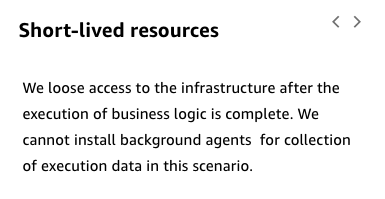
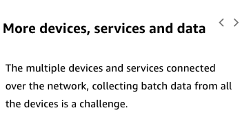
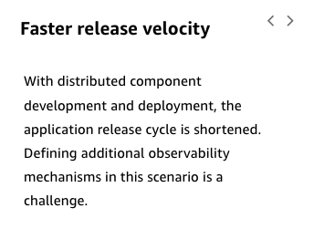
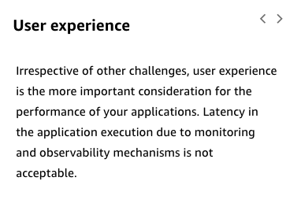
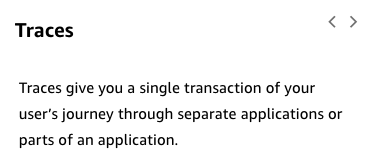

# 30

Created: 2023-09-24 21:48:58 -0600

Modified: 2023-10-22 17:27:03 -0600

---

Summary

Observability and monitoring are essential for understanding and ensuring the health of modern applications, with the three pillars of observability being logs, metrics, and tracing.

Facts

- Observability contrasts with traditional monitoring, focusing on visibility into the system's state.
- Traditional monitoring often involved remoting into servers and querying to identify failures.
- Modern applications have shifted from long-lived servers to short-lived resources, necessitating centralized logging.
- Increased data collection, faster release velocities, and user experience monitoring are now more prevalent in modern applications.
- Monitoring focuses on identifying failures by watching stack layers, primarily through metrics.
- Observability emphasizes understanding if an application behaves as expected, looking at customer experiences and trends.
- Logs are generated by applications, services, and operating systems, aiding in diagnosing issues.
- Metrics, produced by services and applications, can be used to set alarms and monitor trends.
- Tracing tracks a request through multiple services using a unique trace ID, helping correlate actions across services.
- Observability helps detect subtle issues, like a drop in successful sign-ins, which might not be flagged by traditional monitoring.
- Monitoring might identify explicit failures, while observability can highlight unexpected behaviors or trends.

{width="4.0in" height="2.076388888888889in"}

{width="3.7916666666666665in" height="1.9375in"}

{width="3.576388888888889in" height="2.6041666666666665in"}

{width="3.9791666666666665in" height="2.7291666666666665in"}

![Observability in serverless applications Monitoring in traditional applications has evolved into Observability in modern applications. Monitoring focused on identifying failures across the layers of your stack, whereas Observability reflects an approach to organizational culture and development practices that drive how you think about collecting and using data about your system to do more than monitor for failures. Observability extends traditional monitoring with approaches that address the kinds of questions you want to answer about your applications. Business metrics are sometimes an afterthought, only coming into play when someone in the business asks the question, and you need to figure out how to get the answers from the data you have. But if you build these needs into the application, you will have much more visibility into what's happening within your application. ](../../../media/AWS-Developing-Serverless-Solutions-on-AWS-Module-9-30-image5.png){width="5.0in" height="2.9166666666666665in"}

![Three pillars of Observability Observability extends traditional monitoring with approaches that address the kinds of questions you want to answer about your applications. Business metrics are sometimes an afterthought, only coming into play when someone in the business asks the question, and you have to figure out how to get the answers from the data you have. If you build in these needs when you're building the application, you'll have much more visibility into what's happening within your application. To learn more, choose each hotspot. ](../../../media/AWS-Developing-Serverless-Solutions-on-AWS-Module-9-30-image6.png){width="5.0in" height="2.076388888888889in"}

{width="3.9791666666666665in" height="1.9375in"}

{width="3.9166666666666665in" height="2.2569444444444446in"}

{width="3.8541666666666665in" height="1.75in"}

{width="5.0in" height="3.75in"}

