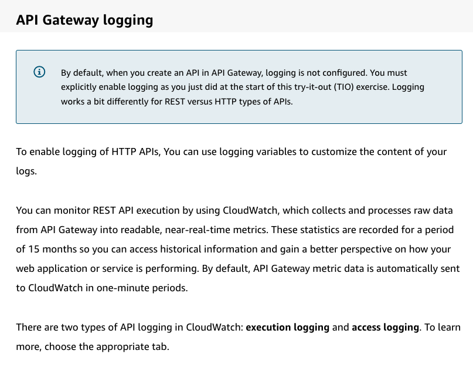

# 31CloudWatch 

Created: 2023-09-26 21:21:56 -0600

Modified: 2023-10-22 17:27:06 -0600

---

Summary

CloudWatch Logs is an AWS service that centralizes logging from various AWS services and applications, offering capabilities like querying with CloudWatch Logs Insights, generating metrics from logs, and ensuring secure and efficient log retention.

Facts

- CloudWatch Logs is a destination for many AWS services and user applications to send their logs.
- Users can query logs using CloudWatch Logs Insights.
- Logs can be filtered to create metrics, which can then be alarmed upon.
- An example use case involves creating metrics for 500 errors from web server logs.
- Logs can be exported for further querying in services like open search index.
- API Gateway, both REST and HTTP APIs, supports access logs similar to web server logs.
- Lambda functions write logs to CloudWatch Logs, capturing both service-generated entries and logs from user code.
- Logs from user code can be captured from stdout and stderr, making it easy to log from various programming languages.
- Structured logs, especially in JSON format, can be utilized better with CloudWatch Logs Insights.
- CloudWatch Logs Insights supports its own query syntax and recognizes certain log formats from AWS services.
- Users can set retention policies for logs, determining how long logs are stored.
- It's recommended to minimize log retention for development and test environments to save space.
- For security reasons, sensitive information like personal data or credit card numbers should be avoided in logs or be secured with strict policies.

![CloudWatch Logs You can use Amazon CloudWatch Logs to monitor, store, and access your log files from Amazon Elastic Compute Cloud (Amazon EC2) instances, AWS CloudTrail, Route 53, and other sources. CloudWatch Logs enables you to centralize the logs from all of your systems, applications, and AWS services that you use, in a single, highly scalable service. You can then easily view them, search them for specific error codes or patterns, filter them based on specific fields, or archive them securely for future analysis. CloudWatch Logs enables you to see all of your logs, regardless of their source, as a single and consistent flow of events ordered by time, and you can query them and sort them based on other dimensions, group them by specific fields, create custom computations with a powerful query language, and visualize log data in dashboards. ](../../../media/AWS-Developing-Serverless-Solutions-on-AWS-Module-9-31CloudWatch-image1.png){width="5.0in" height="3.25in"}

![Features of CloudWatch Logs Following are the features of CloudWatch Logs. To learn more, expand each of the six features. Query your log data You can use CloudWatch Logs Insights to interactively search and analyze your log data. You can perform queries to help you more efficiently and effectively respond to operational issues. CloudWatch Logs Insights includes a purpose-built query language with a few simple but powerful commands. Monitor logs from Amazon EC2 instances You can use CloudWatch Logs to monitor applications and systems using log data. For example, CloudWatch Logs can track the number of errors that occur in your application logs and send you a notification whenever the rate of errors exceeds a threshold you specify. CloudWatch Logs uses your log data for monitoring; so, no code changes are required. Monitor AWS CloudTrail logged events You can create alarms in CloudWatch and receive notifications of particular API activity as captured by CloudTrail and use the notification to perform troubleshooting. ](../../../media/AWS-Developing-Serverless-Solutions-on-AWS-Module-9-31CloudWatch-image2.png){width="5.0in" height="5.229166666666667in"}

![Log retention By default, logs are kept indefinitely and never expire. You can adjust the retention policy for each log group, keeping the indefinite retention, or choosing a retention period between 10 years and one day. Archive log data You can use CloudWatch Logs to store your log data in highly durable storage. The CloudWatch Logs agent makes it easy to quickly send both rotated and non-rotated log data off of a host and into the log service. You can then access the raw log data when you need it. Log Route53 DNS queries You can use CloudWatch Logs to log information about the DNS queries that Route 53 receives. ](../../../media/AWS-Developing-Serverless-Solutions-on-AWS-Module-9-31CloudWatch-image3.png){width="5.0in" height="4.020833333333333in"}

{width="5.0in" height="3.8645833333333335in"}

{width="5.0in" height="2.0416666666666665in"}

{width="5.0in" height="1.5416666666666667in"}

![Lambda logging Lambda logs all requests and results in a CloudWatch log group called /aws/lambda/<function name>. A one-to-one relationship exists between function and log group. The first time the function runs, the group is created. If you set up provisioned concurrency, the log group is created when you create the provisioned concurrency. The log group is the entity you would typically use for searching events within your Lambda logs. To learn more, choose each hotspot. cloudwatch > Log Groups > /aws/1ambda/FAQ > 2020/08/27/CSLATEST]05419d29f9014fc3b1634b1e9968ef28 19:35. Time 19: 35 19:35 : 32 19:35 : 32 32 19:35 19:35 Messag START 41c8dcfo-ff10-4d96-af2a-1ab5e346c937 version: SLATEST 41c8dcfO-ff10-4d96-af2a-1ab5e346c937 INFO 41csdcfo-ff10-4d96-af2a-1ab5e346c937 INFO END Requestld: 41c8dcfO-ffIO-4d96-af2a-Lab5e346c937 REPORT Requestld: 41c8dcfo-ff10-4d96-af2a-1abSe346c937 Duration: 64.40 ms Duration: 100 ms Memory size: 128 MB Max Memory Used: 68 MB Init Duration: START Requestld: a23cbea6-3053-4b51-8721-ff11aba24e33 version: SLATEST events Billed 162.85 The log group is made up of log streams identified by the date, function version, and a unique identifier. Lambda automatically creates new log streams within a group based on internal factors related to how invocations are allocated to environments and the timing of invocations. ](../../../media/AWS-Developing-Serverless-Solutions-on-AWS-Module-9-31CloudWatch-image7.png){width="5.0in" height="5.197916666666667in"}

{width="3.9791666666666665in" height="3.5729166666666665in"}

{width="3.7291666666666665in" height="2.7291666666666665in"}

{width="3.90625in" height="3.0625in"}

{width="3.9479166666666665in" height="2.6666666666666665in"}

