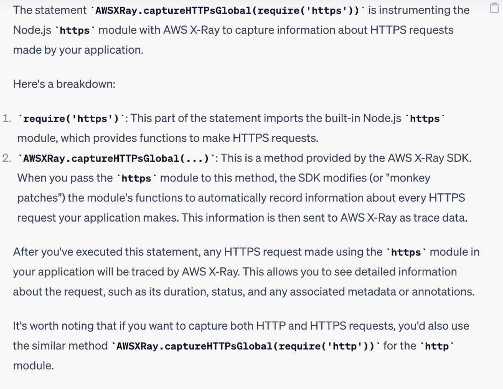
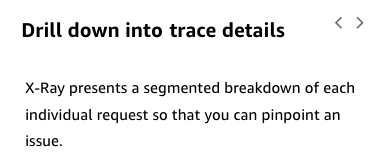
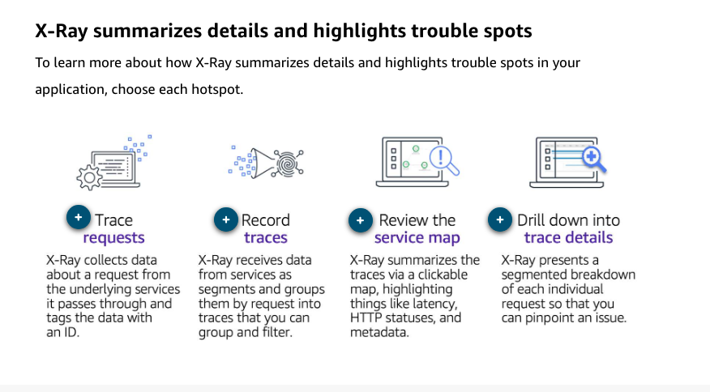

# 32

---

Summary

X-Ray is an AWS service designed to provide detailed tracing capabilities, allowing users to monitor and debug applications by visualizing and analyzing the path of requests through various services.

Facts

- X-Ray helps in tracing multiple requests that contribute to a single action in an application.
- For Lambda, users can enable active tracing with a single button, sending trace information to X-Ray.
- The X-Ray SDK can be incorporated to instrument specific parts of the application, such as SQL queries, HTTP requests, and AWS SDK usage.
- X-Ray provides visual detection of latency distribution, showing where delays occur in the application's processes.
- Users can filter and group requests by error type and other attributes.
- X-Ray collects data as segments and subsegments, detailing the interactions between services.
- A service map in X-Ray provides a graphical representation of interactions between services, like Lambda's communication with S3 or DynamoDB.
- Traces in X-Ray are broken down into segments (e.g., resource name) and subsegments (more granular timings).
- Users can add custom segments and subsegments to traces, and tools like AWS Powertools for Lambda can assist in this.
- Annotations and metadata can be included in traces. Annotations are indexed and searchable, while metadata provides additional context.
- The X-Ray SDK allows users to instrument specific libraries in their code, capturing requests and integrating them into the tracing system.

![AWS X-Ray is a service that collects data about requests that your application serves, and provides tools that you can use to view, filter, and gain insights into that data to identify issues and opportunities for optimization. AWS X-Ray helps developers analyze and debug production, distributed applications, such as those built using a microservices architecture. With X-Ray, you can understand how your application and its underlying services are performing to identify and troubleshoot the root cause of performance issues and errors. X-Ray provides an end-to-end view of requests as they travel through your application, and shows a map of your application's underlying components. AWS X-Ray receives data from services as segments. X-Ray then groups segments that have a common request into traces. X- Ray processes the traces to generate a service graph that provides a visual representation of your application. ](../../../media/AWS-Developing-Serverless-Solutions-on-AWS-Module-9-32-image2.png)

![Annotations An X-Ray annotation is system-defined or user-defined data associated with a segment. A segment can contain multiple annotations. System-defined annotations include data added to the segment by AWS services, whereas user-defined annotations are metadata added to a segment by a developer. For example, a segment created by your application can automatically be injected with region data for AWS service calls, whereas you might choose to add region data yourself for calls made to non-AWS services. Metadata Metadata are key-value pairs with values of any type, including objects and lists, but that are not indexed. Use metadata to record data you want to store in the trace but don't need to use for searching traces. ](../../../media/AWS-Developing-Serverless-Solutions-on-AWS-Module-9-32-image9.png)

The statement const AWSXRay = require('aws-xray-sdk') is a common JavaScript (specifically Node.js) line of code that imports the AWS X-Ray SDK module into your application.

