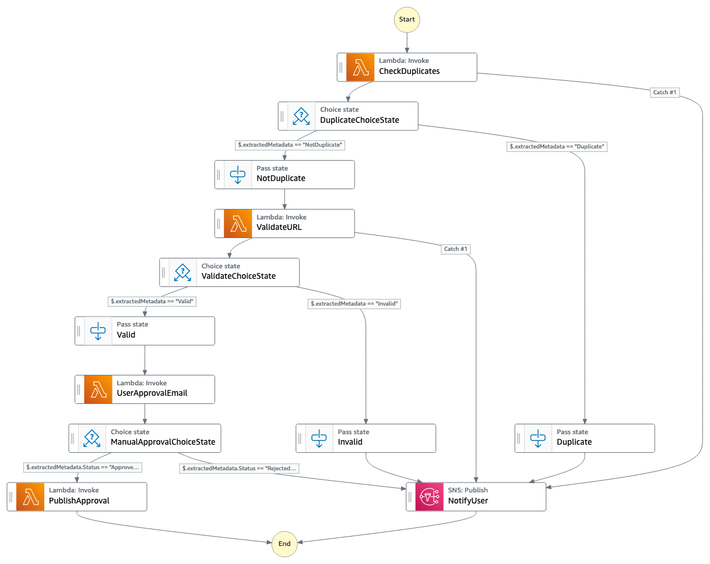
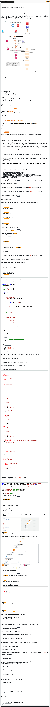

# Lab 3: Workflow Orchestration Using AWS Step Functions | Self-Paced Labs

Created: 2023-10-04 03:14:41 -0600

Modified: 2023-10-08 11:13:06 -0600

---

Clipped from: <https://labs.skillbuilder.aws/sa/lab/arn%3Aaws%3Alearningcontent%3Aus-east-1%3A470679935125%3Ablueprintversion%2FILT-TF-200-SVDVSS-1%2Flab-3-Step-Functions%3A1.3.4-199e53ce/en-US>

# Lab 3: Workflow Orchestration Using AWS Step Functions

© 2023 Amazon Web Services, Inc. or its affiliates. All rights reserved. This work may not be reproduced or redistributed, in whole or in part, without prior written permission from Amazon Web Services, Inc. Commercial copying, lending, or selling is prohibited. All trademarks are the property of their owners.

Note: Do not include any personal, identifying, or confidential information into the lab environment. Information entered may be visible to others.

Corrections, feedback, or other questions? Contact us at *[AWS Training and Certification](https://support.aws.amazon.com/#/contacts/aws-training).*

## Overview

You deployed your serverless bookmark application, and then updated it to support bookmark sharing, routing of requests to the shared mailbox, and a contest feature. The managers who review the knowledge base submissions recognize that submissions are going to increase a lot with the application, so they want you to scale their submissions process by automating as much of it as possible. As part of their manual review, the managers check to make sure the submission isn't a duplicate, validate the URL and make sure it meets eligibility requirements to be shared, and then publish the resource. Then, the managers let the submitter know whether or not the item was added. When the item is a duplicate or is invalid, the submitter does not get a contest entry for that item, so the managers need to inform the contest administrator of duplicates and bad submissions. Given the variety of sources and type of materials that might be shared, the managers still want to maintain a manual approval step so that they can review the material and make sure it follows practices and technologies that they want to promote.

In this lab, you use AWS Step Functions to incorporate a workflow to automatically evaluate and publish new submissions, while still including a manual approval step as part of the process.

The following architecture diagram shows the components that have been or will be deployed in this lab.

{width="13.083333333333334in" height="17.9375in"}

This lab uses the following software stack:

- AWS Amplify
- AWS Serverless Application Model (AWS SAM)
- Amazon Cognito
- Vue JavaScript framework
- AWS Cloud9
- Swagger API
- Amazon DynamoDB
- Amazon EventBridge
- Amazon Simple Notification Service (Amazon SNS)
- AWS Step Functions
- AWS Lambda
- Amazon CloudWatch
- Amazon API Gateway

**Objectives**

After completing this lab, you will be able to:

- Configure EventBridge to target a Step Functions workflow
- Use a Step Functions Standard Workflow to orchestrate tasks
- Use Lambda for tasks within a Step Functions state machine

**Prerequisites**

This lab requires:

- Access to a notebook computer with Wi-Fi and Microsoft Windows, macOS, or Linux (Ubuntu, SUSE, or Red Hat)
- For Microsoft Windows users, administrator access to the computer
- An internet browser such as Chrome, Firefox, or Internet Explorer 9 (previous versions of Internet Explorer are not supported)
- A text editor

**Note** The lab environment is not accessible using an iPad or tablet device, but you can use these devices to access the lab guide.

**Duration**

This lab requires approximately **60 minutes** to complete.

## Start lab

1.  To launch the lab, at the top of the page, choose Start lab.

You must wait for the provisioned AWS services to be ready before you can continue.

1.  To open the lab, choose Open Console.

You are automatically signed in to the AWS Management Console in a new web browser tab.

**Do not change the Region unless instructed.**

### Common sign-in errors

#### *Error: You must first sign out*

{width="13.083333333333334in" height="2.8333333333333335in"}

If you see the message, **You must first log out before logging into a different AWS account:**

- Choose the **click here** link.
- Close your **Amazon Web Services Sign In** web browser tab and return to your initial lab page.
- Choose Open Console again.

#### *Error: Choosing Start Lab has no effect*

In some cases, certain pop-up or script blocker web browser extensions might prevent the **Start Lab** button from working as intended. If you experience an issue starting the lab:

- Add the lab domain name to your pop-up or script blocker's allow list or turn it off.
- Refresh the page and try again.

## Task 1: Understanding key services and the environment setup

In this task, you look at the different AWS services that are used in this lab. The services include Step Functions and Amazon SNS.

- **AWS Step Functions** is a serverless function orchestrator that makes it easy to sequence Lambda functions and multiple AWS services into business-critical applications. Through its visual interface, you can create and run a series of checkpointed and event-driven workflows that maintain the application state. The output of one step acts as input to the next. Each step in your application runs in order, as defined by your business logic. Orchestrating a series of individual serverless applications, managing retries, and debugging failures can be challenging. As your distributed applications become more complex, the complexity of managing them also grows. Step Functions automatically manages error handling, retry logic, and state. With its built-in operational controls, Step Functions manages sequencing, error handling, retry logic, and state, removing a significant operational burden from your team.
- **Amazon Simple Notification Service (Amazon SNS)** is a fully managed messaging service for both system-to-system and app-to-person (A2P) communication. The service enables you to communicate between systems through publish/subscribe (pub/sub) patterns that enable messaging between decoupled microservice applications or to communicate directly to users via SMS, mobile push, and email. The system-to-system pub/sub functionality provides topics for high-throughput, push-based, many-to-many messaging. Using Amazon SNS topics, your publisher systems can fan out messages to a large number of subscriber systems or customer endpoints including Amazon Simple Queue Service (Amazon SQS) queues, Lambda functions, and HTTP/S, for parallel processing. The A2P messaging functionality enables you to send messages to users at scale using either a pub/sub pattern or direct-publish messages using a single API.

In this task, you use the AWS Cloud9 integrated development environment (IDE) and download the application code. The front-end and backend code combine the workflows and resources from Labs 1 and 2. The code also contains new Lambda functions, a new API Gateway endpoint, and an SNS topic for the manual approval of the bookmark publishing process.

After downloading the code, you launch and deploy the application via the Amplify console.

1.  At the top of the AWS Management Console, to the right of the Services menu, in the search bar, search for

Cloud9

and then choose that service from the list.

2.  Next to the **BookmarkAppDevEnv** environment listing, choose **Open** .

Within a few seconds, the AWS Cloud9 environment launches.

**Note** If the browser is running in an incognito session, a pop-up window with an error message will be displayed when the Cloud9 instance is opened. Choose the **OK** button to continue. Browser in a non incognito mode is recommended.

1.  In the terminal pane, run the following commands to download the application code and run the startup script:

wget <https://us-west-2-tcprod.s3-us-west-2.amazonaws.com/courses/ILT-TF-200-SVDVSS/v1.3.4.prod-0a2cd90d/lab-3-Step-Functions/scripts/app-code.zip>
unzip app-code.zip
cd app-code
chmod +x resize.sh
chmod +x startupscript.sh
./startupscript.sh

The script takes a couple of minutes to run. When it is finished, you will deploy your bookmark application through Amplify.

### What is the script doing?

- This script modifies the **samconfig.toml** file within the backend portion of the application code.
- The script replaces values such as AWS Region, stack name, and role Amazon Resource Name (ARN).
- The script then updates the **aws-exports.js file** with the Amazon Cognito metadata that was launched in the lab AWS CloudFormation template.
- As part of the AWS SAM deployment, a new API Gateway resource and a few Lambda functions are deployed. These functions are needed for the Step Functions workflow.
- The script then runs **npm build**, deploys the bookmark application, and uploads the **app.zip** file to the **samserverless** bucket.

### Review the resources that have been deployed

1.  Return to the AWS Management Console tab.
2.  At the top of the AWS Management Console, to the right of the Services menu, in the search bar, search for

Amazon EventBridge

and then choose that service from the list.

3.  In the left navigation pane, choose **Rules**.

**Note** To expand the left navigation pane, choose the menu icon ().

1.  From the **Event bus** dropdown menu, choose **bookmarks-bus**.

Review the rules that have been created under **bookmarks-bus**.

1.  At the top of the AWS Management Console, to the right of the Services menu, in the search bar, search for

Lambda

and then choose that service from the list.

Review the functions with **bookmark** in their names. These functions were deployed to create and share the bookmark URLs.

**Note** To review the code for a function, choose the name of the function, and scroll down to the **Code source** section.

1.  At the top of the AWS Management Console, to the right of the Services menu, in the search bar, search for

API Gateway

and then choose that service from the list.

2.  In the **APIs** list, choose the name of **Bookmark App**.
3.  In the **Resources** pane, under the **/approval** endpoint, choose **GET**.

This endpoint invokes a Lambda function that handles the human approval process.

1.  At the top of the AWS Management Console, to the right of the Services menu, in the search bar, search for

Simple Notification Service

and then choose that service from the list.

2.  In the left navigation pane, choose **Topics**.

Review the topics that have been deployed.

## Task 2: Creating SNS subscriptions, and deploying the bookmark application

In this task, you create subscriptions for the SNS topics, update the EventBridge rule to create CloudWatch logs, and deploy the front-end application using Amplify.

### Create subscriptions for the SNS topics

1.  In the Amazon SNS console, under **Topics**, choose the name of the **BookmarkTopic** topic.
2.  Choose Create subscription
3.  In the **Details** section, configure the following:

- **Protocol:** Choose **Email**
- **Endpoint:** Enter an email address where you can receive messages

1.  Choose Create subscription
2.  Check your email and confirm the subscription.

**Note** It may take a few minutes for the subscription confirmation to arrive. This subscription sends an email with the contents of a bookmark as it is entered in the contest.

1.  In the left navigation pane, choose **Topics**.
2.  Choose the name of the **ContestTopic** topic.
3.  Choose Create subscription
4.  In the **Details** section, configure the following:

- **Protocol:** Choose **Email**
- **Endpoint:** Enter an email address where you can receive messages

1.  Choose Create subscription
2.  Check your email and confirm the subscription.

**Note** It may take a few minutes for the subscription confirmation to arrive. This subscription sends an email with a link for human approval or rejection of a bookmark.

### Deploy the front-end application using Amplify

1.  At the top of the AWS Management Console, to the right of the Services menu, in the search bar, search for

AWS Amplify

and then choose that service from the list.

2.  Scroll to the bottom and choose the Get started button under **Amplify Hosting**.
3.  Under **Amplify Hosting**, choose Get started.
4.  Choose **Deploy without Git provider**, then choose Continue.
5.  On the **Manual deploy** page, configure the following information:

- **App name:** Enter

BookmarkApp

- **Environment name:** Enter

dev

- **Method:** Choose **Amazon S3**
- **Bucket:** Choose **xxxx-samserverless-xxxx**
- **Zip file:** Choose **app.zip**

1.  Choose Save and deploy

### Create a user, add and share a bookmark, and check the EventBridge rules

1.  When the deployment has successfully completed, choose the **Domain** URL in the middle of the Amplify console page.
2.  To create an account for the bookmark application, choose **Create account**
3.  Fill in the provided fields with your information and choose CREATE ACCOUNT
4.  To add a bookmark, choose the plus **+** icon at the top right of the page.
5.  Enter the **Name**, **Description**, and **Bookmark URL** of any website. Ensure the **Share Bookmark** toggle is set to **On**.
6.  Choose **ADD BOOKMARK**.

Now, check that the CloudWatch logs are configured for the **catch-all** EventBridge rule.

1.  Return to the AWS Management Console tab.
2.  At the top of the AWS Management Console, to the right of the Services menu, in the search bar, search for

CloudWatch

and then choose that service from the list.

3.  In the left navigation pane, choose **Log groups**.
4.  In the log groups list, choose the name of the **/aws/events/catch-all** log group.

Notice the log streams listed for this log group. This shows that logs are being generated for the **catch-all** EventBridge rule.

Check your email for an Amazon SNS notification with the details of the bookmark that you entered in the bookmark contest.

## Task 3: Deploying the Lambda functions for the Step Functions state machine

In this task, you create a Lambda function that the Step Functions state machine needs. You also review the remaining Lambda functions that were set up with the AWS SAM deploy process.

1.  At the top of the AWS Management Console, to the right of the Services menu, in the search bar, search for

Lambda

and then choose that service from the list.

2.  Choose Create function
3.  Choose **Author from scratch**, and configure the following:

- **Function name:** Enter

duplicateBookmarkCheck

- **Runtime:** Choose **Node.js 18.x**

1.  Expand **Change default execution role**, and configure:

- **Execution role:** Choose **Use an existing role**
- **Existing role:** Choose **LambdaDeploymentRole**

1.  Choose Create function
2.  Delete the existing code and paste the following code:

import { DynamoDBClient } from "@aws-sdk/client-dynamodb";
import { DynamoDBDocumentClient, QueryCommand, UpdateCommand } from "@aws-sdk/lib-dynamodb";

const dynamodb = new DynamoDBClient({});
const docClient = DynamoDBDocumentClient.from(dynamodb);

export const handler = async message => {
console.log(message);
let bookmark = message;
const bookmarkDetails = JSON.stringify(bookmark);
console.log("bookmarkDetails are "+bookmarkDetails);
const bookmarkItem = JSON.parse(bookmarkDetails);
console.log("bookmarkItem "+bookmarkItem);
console.log("url is "+bookmarkItem.detail.payload.bookmarkUrl.S);
var exists = false;
try{
if(message != null)
{
var params = {
TableName: process.env.TABLE_NAME,
IndexName: process.env.INDEX_NAME,
KeyConditionExpression: "bookmarkUrl = :keyurl",
ExpressionAttributeValues: {
":keyurl": bookmarkItem.detail.payload.bookmarkUrl.S
}
};
console.log("exists "+exists);
console.log(params);
var result = await docClient.send(new QueryCommand(params))
console.log("result is "+JSON.stringify(result.Items));
var data = JSON.parse(JSON.stringify(result.Items));

data.forEach(function(item) {
console.log("db username", item.username+" "+bookmarkItem.detail.payload.username.S);
if (item.username != bookmarkItem.detail.payload.username.S)
exists = true;
});

console.log(exists);
if (exists === true)
{
console.log("in here");
var updateParams = {
TableName: process.env.TABLE_NAME,
Key:{
"id": bookmarkItem.detail.payload.id.S
},
UpdateExpression: "set contest=:c",
ExpressionAttributeValues:{
":c": "duplicate"
},
ReturnValues:"UPDATED_NEW"
};
await docClient.send(new UpdateCommand(updateParams), function(err, data) {
if (err) {
console.log("Unable to update item. Error JSON:", JSON.stringify(err, null, 2));
}
else {
console.log("UpdateItem succeeded:", JSON.stringify(data, null, 2));
}
});
return "Duplicate";
}
}
}

catch(e){
console.log(e);
}
return "NotDuplicate";
};

You should see a message that says **Successfully updated the function duplicateBookmarkCheck.**

1.  Choose the **Configuration** tab to configure the environment variables.
2.  In the left navigation pane, choose **Environment variables**.
3.  In the **Environment variables** section, choose Edit
4.  In the **Edit environment variables** page, configure the following details:

- Choose Add environment variable

- **Key:** Enter

INDEX_NAME

- **Value:** Enter

bookmarkUrl-index

- Choose Add environment variable

- **Key:** Enter

TABLE_NAME

- **Value:** Enter

bookmarksTable

**Note** This Lambda function is the first function that runs as part of the Step Functions state machine. The function checks whether a new bookmark URL is a duplicate.

1.  In the breadcrumbs at the top left of the page, choose **Functions**.

Review the following functions, which are used in the Step Functions workflow:

- **validateURL:** This function validates if the user entered a valid URL.
- **userApprovalEmail:** This function generates a URL for human approval or rejection and notifies the **ContestTopic**.
- **userApproval:** This function gets the approve or reject value after the user chooses the URL generated from the **userApprovalEmail** function.
- **publishApproval:** If the URL is approved, this function updates the DynamoDB table with the approved value.

**Note** To see all of these functions, you may need to go to the second page of the functions list.

## Task 4: Setting up the state machine workflow invoked by the EventBridge rule

In this task, you set up a Step Functions state machine and an EventBridge rule. The EventBridge rule will invoke the state machine that you create.

1.  In the AWS Cloud9 IDE, choose the button and choose **New File**.
2.  Copy the following Step Functions definition into the **New File**.

{
"Comment": "Publish Rule workflow",
"StartAt": "CheckDuplicates",
"States": {
"CheckDuplicates": {
"Type": "Task",
"Resource": "<duplicateBookmarkCheckArn>",
"InputPath":"$",
"ResultPath":"$.extractedMetadata",
"Catch": [
{
"ErrorEquals": [ "States.ALL" ],
"Next": "NotifyUser"
}
],
"Next": "DuplicateChoiceState"
},
"DuplicateChoiceState": {
"Type": "Choice",
"Choices": [
{
"Variable": "$.extractedMetadata",
"StringEquals": "NotDuplicate",
"Next": "NotDuplicate"
},
{
"Variable": "$.extractedMetadata",
"StringEquals": "Duplicate",
"Next": "Duplicate"
}
]
},
"NotDuplicate": {
"Type": "Pass",
"Next": "ValidateURL"
},
"Duplicate": {
"Type": "Pass",
"Next": "NotifyUser"
},
"ValidateURL":{
"Type": "Task",
"Resource": "<validateURLArn>",
"InputPath":"$",
"ResultPath":"$.extractedMetadata",
"Catch": [
{
"ErrorEquals": [ "States.ALL" ],
"Next": "NotifyUser"
}
],
"Next": "ValidateChoiceState"
},
"ValidateChoiceState": {
"Type": "Choice",
"Choices": [
{
"Variable": "$.extractedMetadata",
"StringEquals": "Valid",
"Next": "Valid"
},
{
"Variable": "$.extractedMetadata",
"StringEquals": "Invalid",
"Next": "Invalid"
}
]
},
"Valid": {
"Type": "Pass",
"Next": "UserApprovalEmail"
},
"Invalid": {
"Type": "Pass",
"Next": "NotifyUser"
},
"UserApprovalEmail": {
"Type": "Task",
"Resource": "arn:aws:states:::lambda:invoke.waitForTaskToken",
"InputPath":"$",
"ResultPath":"$.extractedMetadata",
"Parameters": {
"FunctionName": "<userApprovalEmailArn>",
"Payload": {
"ExecutionContext.$": "$$",
"APIGatewayEndpoint": ""
}
},
"Next": "ManualApprovalChoiceState"
},
"ManualApprovalChoiceState": {
"Type": "Choice",
"Choices": [
{
"Variable": "$.extractedMetadata.Status",
"StringEquals": "Approved",
"Next": "PublishApproval"
},
{
"Variable": "$.extractedMetadata.Status",
"StringEquals": "Rejected",
"Next": "NotifyUser"
}
]
},
"PublishApproval":{
"Type": "Task",
"Resource": "<publishApprovalArn>",
"InputPath": "$",
"ResultPath": "$.extractedMetadata",
"End": true
},
"NotifyUser": {
"Type": "Task",
"Resource": "arn:aws:states:::sns:publish",
"InputPath": "$",
"Parameters": {
"TopicArn": "<ContestTopicArn>",
"Message.$": "$",
"MessageAttributes": {
"msg": {
"DataType": "String",
"StringValue": "additional instructions!"
}
}
},
"End": true
}
}
}

1.  At the top of the page, choose **File > Save** to save the file as

statemachine.json

in the **app-code** folder.

2.  Review the Step Functions definition and see how the Lambda functions and the other components are plugged in.
3.  In the AWS Cloud9 terminal, run the following AWS CLI and bash commands to replace the Lambda Function ARNs, the API Gateway Endpoint URL and the SNS Topic ARN in the above Step Functions definition.

export duplicateBookmarkCheckArn=$(aws lambda get-function --function-name duplicateBookmarkCheck | jq '.Configuration.FunctionArn' | tr -d '"')
export validateURLArn=$(aws lambda get-function --function-name validateURL | jq '.Configuration.FunctionArn' | tr -d '"')
export userApprovalEmailArn=$(aws lambda get-function --function-name userApprovalEmail | jq '.Configuration.FunctionArn' | tr -d '"')
export publishApprovalArn=$(aws lambda get-function --function-name publishApproval | jq '.Configuration.FunctionArn' | tr -d '"')
export API_GATEWAY_ID=$(aws apigateway get-rest-apis --query 'items[?name==`Bookmark App`].id' --output text)
export ContestTopicArn=$(aws sns list-topics | jq '.Topics[1].TopicArn' | tr -d '"')
sed -Ei "s|<duplicateBookmarkCheckArn>|${duplicateBookmarkCheckArn}|g" statemachine.json
sed -Ei "s|<validateURLArn>|${validateURLArn}|g" statemachine.json
sed -Ei "s|<userApprovalEmailArn>|${userApprovalEmailArn}|g" statemachine.json
sed -Ei "s|<publishApprovalArn>|${publishApprovalArn}|g" statemachine.json
sed -Ei "s|<API_GATEWAY_ID>|${API_GATEWAY_ID}|g" statemachine.json
sed -Ei "s|<ContestTopicArn>|${ContestTopicArn}|g" statemachine.json
export AWS_REGION=$(curl -s 169.254.169.254/latest/dynamic/instance-identity/document | jq -r '.region')
sed -Ei "s|<AWS_REGION>|${AWS_REGION}|g" statemachine.json

1.  At the top of the page, choose **File > Save** to save the file.
2.  At the top of the AWS Management Console, to the right of the Services menu, in the search bar, search for

Step Functions

and then choose that service from the list.

3.  In the left navigation pane, choose the menu icon (), and then choose **State machines**.
4.  Choose Create state machine
5.  In the **Choose a template** page, configure the following:

- Choose **Blank**
- Choose **Select**
- Choose **Config**

1.  In the **State machine configuration** page, configure the following:
2.  On the **Details** section, configure the following:

- **State machine name:** Enter

PublishStateMachine

- **Type:** Choose **Standard**

1.  In the **Permissions** section, configure the following:

- **Execution role:** Choose **EventBridgeStateMachineRole**

1.  At the top of the screen, choose **Code**.
2.  In the **Code** section on left, copy the Step Functions definition from the statemachine.json file and replace the sample code. You should see the code and the workflow diagram populated like the following image:

{width="13.083333333333334in" height="4.875in"}

You can also view the state machine in the Workflow studio.

1.  Choose Edit at the top most corner of the console.
2.  In the **Design** pane of the console, choose **Center** on the top to see the workflow in the middle pane of the console. It should look similar to the following image.

{width="13.083333333333334in" height="10.427083333333334in"}

1.  Choose **Exit** to return to the **PublishStateMachine** page.

The state machine setup is now complete. Now, create a new rule in EventBridge to invoke the new state machine.

1.  At the top of the AWS Management Console, to the right of the Services menu, in the search bar, search for

Amazon EventBridge

and then choose that service from the list.

2.  In the left navigation pane, choose **Rules**.
3.  Choose Create rule On the **Define rule detail** page, in the **Rule detail** section, configure the following information:

- **Name:** Enter

publish-rule

- **Event bus:** Select **bookmarks-bus** from the dropdown menu
- **Rule Type:** Select **Rule with an event pattern**

1.  Choose Next
2.  In the **Build event pattern** page, configure the following information:

- **Event source:** Select **Other**
- **Creation method:** Select **Custom pattern(JSON editor)**
- In the **Event pattern** code box, copy and paste in the following code:

{
"detail-type": [
"Shared Bookmarks"
],
"source": [
"DynamoDB Streams"
],
"detail": {
"shared": [
true
],
"contest": [
"Entered"
]
}
}

1.  Choose Next
2.  In the **Select target(s)** page, configure the following information:

- **Target types:** Select **AWS service**
- **Select a target:** Select **Step Functions state machine** from the dropdown menu
- **State machine:** Choose **PublishStateMachine**
- **Execution role:** Choose **Use existing role**
- Choose **EventBridgeStateMachineRole** from the dropdown menu

1.  Choose Next
2.  In the **Configure tags - optional** page, choose Next
3.  In the **Review and create** page, choose Create rule

## Task 5: Reviewing the deployment and running test cases using the application

In this task, you take a quick overview of all of the components that have been deployed so far. You then run a few test cases to test the Step Functions workflow and the EventBridge rule. Note the following:

- The backend and front end have been integrated for end-to-end testing.
- You created a Lambda function and a state machine manually.
- You reviewed the Lambda functions that the AWS SAM deploy process created for the Step Functions state machine workflow.
- You updated the state machine with the Lambda function ARNs, API Gateway endpoint, and SNS topic ARN.

1.  Open and log in to the bookmark application, if you are not already logged in.

### Test case 1: Add a new bookmark without the shared flag

In this test case, add a new *unshared* bookmark. Check the Step Functions state machine to see if it was invoked or not. Then, share the new bookmark and approve it.

1.  In the bookmark application, add a new bookmark with the **Share Bookmark** toggle set to **Off**. Make sure you enter a valid bookmark URL.
2.  At the top of the AWS Management Console, to the right of the Services menu, in the search bar, search for

Step Functions

and then choose that service from the list.

3.  Choose the name of the **PublishStateMachine** state machine.

No jobs are listed in the **Running** state because the unshared bookmark did not invoke the **PublishStateMachine** workflow.

### Test case 2: Add a new bookmark with the shared flag

In this test case, add a new *shared* bookmark. Then, approve the new bookmark.

1.  In the bookmark application, add a new bookmark with the **Share Bookmark** toggle set to **On**. Make sure you enter a valid bookmark URL.

This invokes the **PublishStateMachine** workflow.

1.  Return to the browser tab featuring the **AWS Management Console** with the **Step Functions** open.
2.  Refresh the screen to update the status of the **PublishStateMachine** state machine.
3.  Choose the name of the **Running** state.

Scroll down to the **Graph view** section, and review the state machine steps.

Because this is a new bookmark and no duplicates are found, the **duplicateBookmarkCheck** function sends a **NotDuplicate** message and invokes the **validateURL** function.

Because this is a valid URL, the **validateURL** function sends a **Valid** message and invokes the **userApprovalEmail** function.

1.  Check your email for approve and reject links from the **userApprovalEmail** function.
2.  Choose the approval URL, and check the Step Functions workflow.

Because you manually approved the URL, the **publishApproval** function is invoked, and the contest value in the DynamoDB table is updated to **Approved**.

### Test case 3: Add a bookmark with an invalid URL

In this test case, add a new *shared* bookmark that is *invalid*. Then, share the new bookmark.

1.  In the bookmark application, add a new bookmark URL **without** any of the generic top level domains (".edu" or ".gov" or ".com" or ".info" or ".mil" or ".net" or ".org") such as

aws.training

in the URL field. Make sure the **Share Bookmark** toggle is set to **On**.

This invokes the **PublishStateMachine** workflow.

1.  Return to the browser tab featuring the **AWS Management Console** with the **Step Functions** open.
2.  Choose the name of the **PublishStateMachine** state machine from the breadcrumbs trail near the top.
3.  Choose the name of the second state.

Scroll down to the **Graph view** section, and review the state machine steps.

Because this is a new bookmark and no duplicates are found, the **duplicateBookmarkCheck** function sends a **NotDuplicate** message and invokes the **validateURL** function.

Because this is *not* a valid URL, the **validateURL** function sends an **Invalid** message and invokes the **notifyUser** function.

### Test case 4: Add a duplicate bookmark as a different user

In this test case, add a *new* user account in the bookmark application. Then, add a *shared* bookmark that is a duplicate of a bookmark (URL) that another user added.

1.  In the bookmark application, create a second user account.
2.  Add a bookmark that is a duplicate of a bookmark that another user added. Make sure the **Share Bookmark** toggle is set to **On**.

**Note** Only the URL field value is checked for duplicate.

This invokes the **PublishStateMachine** workflow.

1.  Return to the browser tab featuring the **AWS Management Console** with the **Step Functions** open.
2.  Choose the name of the **PublishStateMachine** state machine.
3.  Choose the name of the most recently started state.

Scroll down to the **Graph view** section, and review the state machine steps.

Because this is a duplicate bookmark that was already shared, the **duplicateBookmarkCheck** function sends a **Duplicate** message and invokes the **notifyUser** function to send an email saying the bookmark is a duplicate.

**Note** If you have lab time remaining, run a few test cases for the human rejection process.

## Conclusion

Congratulations! You now have successfully:

- Configured EventBridge to target a Step Functions workflow
- Used a Step Functions Standard workflow to orchestrate tasks
- Used Lambda for tasks within a Step Functions state machine

## End lab

Follow these steps to close the console and end your lab.

1.  Return to the **AWS Management Console**.
2.  At the upper-right corner of the page, choose **AWSLabsUser**, and then choose **Sign out**.
3.  Choose End lab and then confirm that you want to end your lab. For more information about AWS Training and Certification, see *<https://aws.amazon.com/training/>.*

*Your feedback is welcome and appreciated.*
*If you would like to share any feedback, suggestions, or corrections, please provide the details in our [AWS Training and Certification Contact Form](https://support.aws.amazon.com/#/contacts/aws-training).*

## Additional resources

- For more information about asynchronous messaging for microservices, see <https://aws.amazon.com/blogs/compute/understanding-asynchronous-messaging-for-microservices/>.
- For more information about Step Functions, see <https://docs.aws.amazon.com/step-functions/latest/dg/welcome.html>.

{width="1.0416666666666667in" height="13.083333333333334in"}

