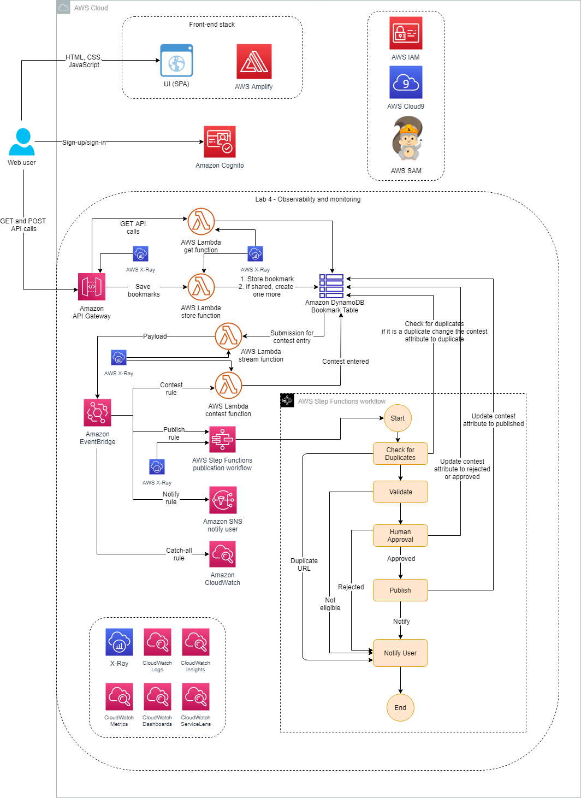
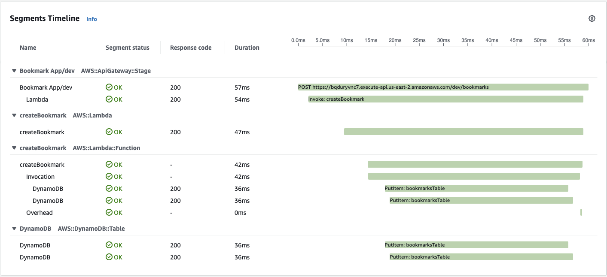
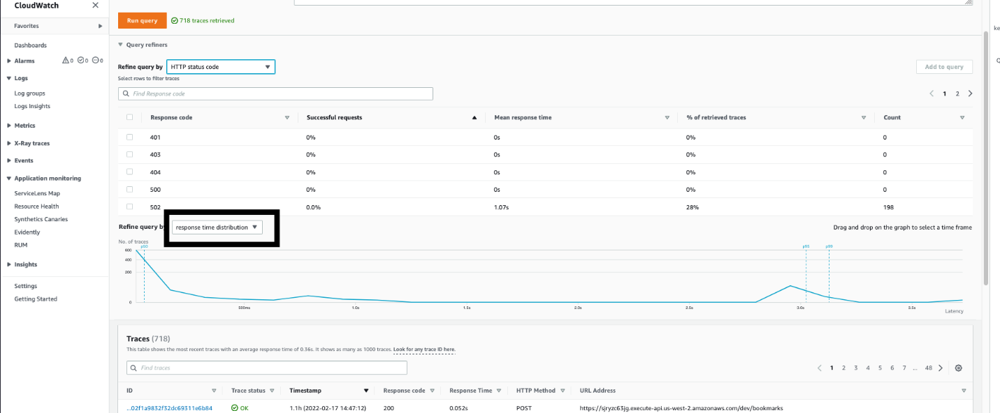
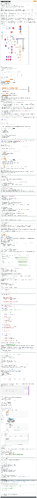

# Lab 4: Observability and Monitoring | Self-Paced Labs

---

Clipped from: <https://labs.skillbuilder.aws/sa/lab/arn%3Aaws%3Alearningcontent%3Aus-east-1%3A470679935125%3Ablueprintversion%2FILT-TF-200-SVDVSS-1%2Flab-4-ObservabilityMonitoring%3A1.3.4-cbff5747/en-US>

© 2023 Amazon Web Services, Inc. or its affiliates. All rights reserved. This work may not be reproduced or redistributed, in whole or in part, without prior written permission from Amazon Web Services, Inc. Commercial copying, lending, or selling is prohibited. All trademarks are the property of their owners.

Note: Do not include any personal, identifying, or confidential information into the lab environment. Information entered may be visible to others.

Corrections, feedback, or other questions? Contact us at *[AWS Training and Certification](https://support.aws.amazon.com/#/contacts/aws-training).*

## Overview

You now have a stable bookmarking application with the features you need to roll it out to the larger team. But, before it becomes your production version, you need to think about the operational data that you will need to know if it's working as expected and to understand how users are accessing it. You need to build observability into your application.

Before you go any further, you need to take a closer look at your code and the potential points of failure. Make sure your error handling is appropriate before you start getting higher levels of production traffic when this becomes the permanent way for sharing knowledge base links. After analyzing existing logs, you realize that you need to pay attention to how you are coding your logs, and you need more insights for better observability.

This lab focuses on observability and monitoring techniques to protect your systems from unforeseen events that have a negative impact. Observability in production is a requirement when you design complex systems.

This lab has prebuilt code that is meant to send errors and occasionally fail, allowing you to set up proper observability and monitoring services to handle these occasions. You will add AWS X-Ray tracing and work with Amazon CloudWatch to monitor and troubleshoot your application.

### Three pillars of observability

Logs, metrics, and distributed tracing are often known as the three pillars of observability. These are powerful tools that, if well understood, can unlock the ability to build better systems.

**Logs** provide valuable insights into how you measure your application health. Event logs are especially helpful in uncovering growing and unpredictable behaviors that components of a distributed system exhibit. Logs come in three forms: plaintext, structured, and binary.

**Metrics** are a numeric representation of data measured over intervals of time about the performance of your systems. You can configure and receive automatic alerts when certain metrics are met.

**Tracing** can provide visibility into both the path that a request traverses and the structure of a request. An event-driven or microservices architecture consists of many different distributed parts that must be monitored. Imagine a complex system consisting of multiple microservices, and an error occurs in one of the services in the call chain. Even if every microservice is logging properly and logs are consolidated in a central system, it can be difficult to find all relevant log messages.

The following architecture diagram shows the components that have been or will be deployed in this lab.

**Objectives**

After completing this lab, you will be able to:

- Update your code for better logs, applying logging best practices
- Use Amazon CloudWatch Logs and CloudWatch metrics to monitor application operations
- Use X-Ray and CloudWatch ServiceLens to troubleshoot application issues

**Prerequisites**

This lab requires:

- Access to a notebook computer with Wi-Fi and Microsoft Windows, macOS, or Linux (Ubuntu, SUSE, or Red Hat)
- For Microsoft Windows users, administrator access to the computer
- An Internet browser such as Chrome, Firefox, or Internet Explorer 9 (previous versions of Internet Explorer are not supported)
- A text editor

**Note** The lab environment is not accessible using an iPad or tablet device, but you can use these devices to access the lab guide.

**Duration**

This lab requires approximately **90 minutes** to complete.

## Start lab

1.  To launch the lab, at the top of the page, choose Start lab.

You must wait for the provisioned AWS services to be ready before you can continue.

1.  To open the lab, choose Open Console.

You are automatically signed in to the AWS Management Console in a new web browser tab.

**Do not change the Region unless instructed.**

### Common sign-in errors

#### *Error: You must first sign out*

If you see the message, **You must first log out before logging into a different AWS account:**

- Choose the **click here** link.
- Close your **Amazon Web Services Sign In** web browser tab and return to your initial lab page.
- Choose Open Console again.

#### *Error: Choosing Start Lab has no effect*

In some cases, certain pop-up or script blocker web browser extensions might prevent the **Start Lab** button from working as intended. If you experience an issue starting the lab:

- Add the lab domain name to your pop-up or script blocker's allow list or turn it off.
- Refresh the page and try again.

## Task 1: Looking at key services and setting up the app

In this task, you look at the different AWS services that you use in this lab. Take a few minutes to navigate the console for each service.

- **AWS X-Ray** helps developers analyze and debug production, distributed applications, such as those built using a microservices architecture. With X-Ray, you can understand how your application and its underlying services are performing to identify and troubleshoot the root cause of performance issues and errors. X-Ray provides an end-to-end view of requests as they travel through your application and shows a map of your application's underlying components. You can use X-Ray to analyze both applications in development and in production, from simple three-tier applications to complex microservices applications consisting of thousands of services.
- **Amazon CloudWatch Logs Insights** is a fully managed service that is designed to work at cloud scale with no setup or maintenance required. The service analyzes massive logs in seconds and gives you fast, interactive queries and visualizations. CloudWatch Logs Insights can handle any log format and autodiscovers fields from JSON logs.
- **Amazon CloudWatch ServiceLens** is a feature that enables you to visualize and analyze the health, performance, and availability of your applications in a single place. CloudWatch ServiceLens ties together CloudWatch metrics and logs, as well as traces from X-Ray, to give you a complete view of your applications and their dependencies. This enables you to quickly pinpoint performance bottlenecks, isolate root causes of application issues, and determine impacted users.

First, you launch the application by running a preprogrammed script in AWS Cloud9.

1.  At the top of the AWS Management Console, to the right of the Services menu, in the search bar, search for

Cloud9

and then choose that service from the list.

2.  Next to the **BookmarkAppDevEnv** environment listing, choose **Open** .

Within a few seconds, the AWS Cloud9 environment launches.

**Note** If the browser is running in an incognito session, a pop-up window with an error message will be displayed when the Cloud9 instance is opened. Choose the **OK** button to continue. Browser in a non incognito mode is recommended.

1.  From the terminal, run the following commands to download the startup script, download the application code, and run the startup script:

wget <https://us-west-2-tcprod.s3-us-west-2.amazonaws.com/courses/ILT-TF-200-SVDVSS/v1.3.4.prod-0a2cd90d/lab-4-ObservabilityMonitoring/scripts/app-code.zip>
unzip app-code.zip
cd app-code
chmod +x resize.sh
chmod +x startupscript.sh
./startupscript.sh

The script takes a couple of minutes to run.

### What is the script doing?

- This script modifies the **samconfig.toml** file within the backend portion of the application code.
- The script replaces values such as AWS Region, stack name, and role Amazon Resource Name (ARN).
- The script then updates the **aws-exports.js** file with the Amazon Cognito metadata that was launched in the lab AWS CloudFormation template.
- Then, the script runs **npm build**, deploys the bookmark application, and uploads the **app.zip** file to the **samserverless** Amazon Simple Storage Service (Amazon S3) bucket.

**Note** Keep this AWS Cloud9 browser tab open because you return to it later in the lab.

1.  At the top of the AWS Management Console, to the right of the Services menu, in the search bar, search for

API Gateway

and then choose that service from the list.

2.  Choose the **Bookmark App**.
3.  In the left navigation pane, choose **Stages**.
4.  In the **Stages** pane, choose the **dev** stage.

You see the API Gateway end point has been deployed successfully.

**Note** Keep this Amazon API Gateway page open.

1.  In the AWS Cloud9 IDE, choose the **>** arrow next to the **app-code** folder to expand it.
2.  Choose the **>** arrow next to the **test** folder to expand it.
3.  Open the **simple-post.yaml** file.
4.  In the AWS Cloud9 terminal, run the following AWS CLI and bash commands to replace *API_GATEWAY_URL* with the actual value in the **simple-post.yaml** file.

cd test
export API_GATEWAY_ID=$(aws apigateway get-rest-apis --query 'items[?name==`Bookmark App`].id' --output text) >> ~/environment/app-code/labVariables
export AWS_REGION=$(curl -s 169.254.169.254/latest/dynamic/instance-identity/document | jq -r '.region')
export API_GATEWAY_URL=https://${API_GATEWAY_ID}.execute-api.${AWS_REGION}.amazonaws.com/dev
sed -Ei "s|<API_GATEWAY_URL>|${API_GATEWAY_URL}|g" simple-post.yaml
cd ..

**Note** Keep the AWS Cloud9 page open.

## Task 2: Enabling X-Ray and CloudWatch

In this task, you enable X-Ray so that it collects data to analyze for errors. The bookmark application makes heavy use of API Gateway and AWS Lambda. To get full trace information, X-Ray must be enabled on both.

1.  Copy the **APIGatewayCLRole** value from the left side of the lab instructions.
2.  Return to the API Gateway browser and in the API Gateway console, at the bottom of the left navigation pane, choose **Settings**.
3.  In the **CloudWatch log role ARN** box, paste the **APIGatewayCLRole** value that you copied from the lab page.
4.  Choose Save
5.  In the left navigation pane, choose **Stages**.
6.  Within the **dev** stage editor, choose the **Logs/Tracing** tab.
7.  Under **CloudWatch Settings**, configure the following options:

- Set the **CloudWatch Logs** drop-down to **Errors Only**.
- Select **Enable Detailed CloudWatch Metrics**.

1.  Under **X-Ray Tracing**, select **Enable X-Ray Tracing**.
2.  Choose Save Changes
3.  At the top of the AWS Management Console, to the right of the Services menu, in the search bar, search for

Lambda

and then choose that service from the list.

4.  Under **Functions**, enter

createBookmark

in the filter box, and press ENTER.

5.  Choose the function with **createBookmark** in the **Function name**.
6.  Choose the **Configuration** tab and select **Monitoring and operations tools** in the left navigation pane.
7.  In the **Monitoring and operations tools** section, choose Edit
8.  Under **AWS X-Ray**, select **Active tracing**.
9.  Choose Save

Now any request that the API gets from the four deployed API Gateway methods injects the tracing header into the request. This then flows to the Lambda function and allows you to see where a request is being dropped or receiving an error.

**Note** Because this application uses several Lambda functions, X-Ray has been pre-enabled on the remaining application functions for you.

**Note** Keep this browser tab open because you return to it later in the lab.

## Task 3: Running the load test using Artillery

You start this task by using Artillery, which is a load-testing and functionality tool, along with Faker, a simple random data generator. You run the **simple-post.yaml** file from the **test** folder in AWS Cloud9, which starts adding random bookmarks and invoking the **createBookmark** function.

1.  Return to the AWS Cloud9 browser tab.
2.  Run the following code to install Artillery, install Faker, and run the script:

cd test
npm install artillery -g
npm install <faker@5.5.3>
artillery run simple-post.yaml

**Note** This script runs for 2 minutes, adding data through the API and then invoking the **createBookmark** Lambda function.

## Task 4: Coding for better logging

In this task, you review the results from running the Artillery load test while also learning how to optimize CloudWatch Logs Insights for improved logging by using various queries.

The **createBookmark** Lambda function code has been designed to produce errors around 10 percent of the time when adding bookmarks. This is normal for this lab scenario.

1.  Return to the browser tab with the **createBookmark** Lambda function.
2.  Choose the **Code** tab. In the **Code source** section, select **index.js**, open the context(right-click) menu and choose **Open**.
3.  Review the following three lines of code:

var AWSXRay = require('aws-xray-sdk');
var AWS = AWSXRay.captureAWS(require('aws-sdk'));
var dynamodb = AWSXRay.captureAWSClient(new AWS.DynamoDB());

**Note** You can instrument all AWS SDK clients by wrapping your **aws-sdk require** statement in a call to **AWSXRay.captureAWS**.

To instrument individual clients, wrap your AWS SDK client in a call to **AWSXRay.captureAWSClient**. For example, to instrument an Amazon DynamoDB client, you would change the following code:

var dynamodb = new AWS.Dynamodb();

to

var dynamodb = AWSXRay.captureAWSClient(new AWS.DynamoDB());

1.  Choose the **Monitor** tab.

In the **Metrics** tab you can view all of the CloudWatch metrics pertaining to this specific Lambda function.

1.  Refresh until you see some metrics begin to populate.
2.  Pause over each line for **Invocations**, **Duration**, and **Error count and success rate (%)**.
3.  Choose the **Logs** tab to view the **CloudWatch Logs Insights** section. Choose refresh.

Here you can gain a quick glimpse and easily filter for **Recent invocations** and **Most expensive invocations in GB-seconds**.

1.  Under **Recent invocations**, choose the icon for the most recent invocation to expand the details.

Here you can see some key log attributes that come by default through CloudWatch Logs Insights, such as **duration**, **maxMemoryUsed**, **memorySize**, **requestId**, and **xrayTraceId**.

1.  Under **Most expensive invocations**, choose the icon for the most recent invocation to expand the details.
2.  Choose the **Metrics** tab and refresh again to load and observe the rest of the data.
3.  Choose View CloudWatch logs
4.  In the left navigation pane, under **Logs**, choose **Logs Insights**.

Near the top of the page is the query editor. When you first open CloudWatch Logs Insights, this box contains a default query that returns the 20 most recent log events.

1.  From the **Select log group(s)** dropdown list, select **aws/lambda/createBookmark**.

When you select a log group, CloudWatch Logs Insights automatically detects fields in the data in the log group.

**Note** To see these discovered fields, select **Fields** on the right side of the page.

1.  In the query editor at the top of the page, leave the default query, which shows the 20 most recent log entries. Choose Run query
2.  Find and select an **ERROR Invoke Error** log event to view the details.

**Note** If the **ERROR Invoke Error** log event doesn't appear in the 20 most recent log entries, run the query with a value of **50**. The query would look like the following:

fields @timestamp, @message
| sort @timestamp desc
| limit 50

1.  At the top of the page, delete the code in the query editor. Copy and paste the following code into the query editor:

filter @type = "REPORT"
| fields @requestId, @billedDuration
| sort by @billedDuration desc

1.  Choose Run query

**Note** Every Lambda function invocation remits a log entry as the last line with the keyword REPORT. The REPORT line contains all of the standard fields and is present on every invoke.

This query tells CloudWatch Logs Insights to filter for the REPORT line only and then return two fields: **requestID** and **billedDuration**. Then, the results are sorted by **billedDuration**.

1.  Choose the **1** icon to expand and observe the details.
2.  Compare the **@billedDuration** to the **@duration**, and then compare **@maxMemoryUsed** to **@memorySize**.

You can see that **@maxMemoryUsed** is lower than the **@memorySize** provisioned for the Lambda function. This is a great starting point for learning more about how your function operates so you can better adjust it.

1.  At the top of the page, delete the code in the query editor. Copy and paste the following code into the query editor:

stats count(*) by @logStream
| limit 100

1.  Choose Run query
2.  Choose the **Visualization** tab.
3.  From the Line dropdown list, select **Bar**.

The results show the number of log events in the log group for each log stream.

**Note** When you run a query that uses the **stats** function to group the returned results by the values of one or more fields in the log entries, you can view the results as a bar chart, pie chart, line graph, or stacked area graph. These options help you more efficiently visualize trends in your logs.

**Learn more** For more sample queries for CloudWatch Logs, see [Sample Queries](https://docs.aws.amazon.com/AmazonCloudWatch/latest/logs/CWL_QuerySyntax-examples.html).

**Note** Keep this browser tab open because you return to it later in the lab.

## Task 5: Tracing and troubleshooting

Earlier in the lab, you enabled X-Ray tracing for API Gateway and the **createBookmark** Lambda function. Now, use X-Ray tracing to help diagnose why you are getting errors and fails within the **createBookmark** function.

1.  In the left navigation pane, under **X-Ray traces**, choose **Traces**.
2.  From the **Refine query by** Node dropdown list, select **HTTP status code**.
3.  From the filter at the top right , select **1h**.

Here you can see the percent of traces with 200 ok responses and 502 response errors.

1.  From the **Trace list**, choose one trace ID with a **200** response to open in a new browser tab.
2.  From the **Trace list**, choose one trace ID with a **502** response to open in a new browser tab.
3.  Choose the browser tab with the **502** response to view the timeline for this trace.

The **Timeline** view shows a hierarchy of segments and subsegments. The first entry in the list is the segment, which represents all of the data that the service recorded for a single request, as shown in the following image.

Below the segment are subsegments.

The X-Ray SDK automatically records subsegments when you use an instrumented AWS SDK, HTTP, or SQL client to make calls to external resources. You can also tell the SDK to record custom subsegments for any function or block of code.

1.  Choose each icon within the trace map to see the end-to-end path of this request.
2.  Below the timeline, choose the **Status** icon to view the segment details.

The **Overview** tab shows information about the request and response. Notice that **Error** is **false**, but **Fault** is **true**.

1.  Choose the **Resources** tab.

The **Resources** tab for a segment shows information about the AWS resources running your application and the X-Ray SDK.

1.  Choose the **Raw data** button.

Here you can access the raw trace data that the console uses to generate the timeline. This JSON document contains all of the segments and subsegments that make up the trace.

1.  Take a moment to review the trace data.
2.  Choose the browser tab where you opened the **200** response trace ID to view its timeline.
3.  Compare this successful request with the **502** request you just viewed.

You can see within the trace map that the end-to-end path was successful from the client to API Gateway and then to the **createBookmark** Lambda function, and finally populated the DynamoDB **bookmarksTable**.

1.  Select each segment and subsegment to view their details and compare what you see for this successful request.

**Note** Keep the CloudWatch console browser tab open because you return to it later in the lab.

## Task 6: Adding subsegment code

1.  Return to the browser tab with the **createBookmark** Lambda function.
2.  In the **Code source** section, the **index.js** file is already open.
3.  Find the line that says *//Call to the sub segment annotation code goes here*.
4.  Copy the following code and paste it over the line in the previous step to replace that line.

var segment = AWSXRay.getSegment();
await addSegment(segment,message);

1.  Find the line that says *//Placeholder for sub segment annotation code*.
2.  Copy the following code and paste it over the line in the previous step to replace that line.

const addSegment = (segment,message) => {

let bookmark = JSON.parse(message.body);
const f = async (subsegment) => {

subsegment.addAnnotation('uid',bookmark.id);
subsegment.addAnnotation('name',bookmark.name);
subsegment.addMetadata('bookmarkUrl', bookmark.bookmarkUrl);
subsegment.addMetadata('username', bookmark.username);

subsegment.close();
};
AWSXRay.captureAsyncFunc("adding annotations and metadata", f, segment);
};

After adding the code snippets, the **index.js** file should look like the following:

var AWSXRay = require('aws-xray-sdk');
var AWS = AWSXRay.captureAWS(require('aws-sdk'));
var dynamodb = AWSXRay.captureAWSClient(new AWS.DynamoDB());

exports.handler = async message => {
console.log(message);

//Fail the messages randomly to see those errors in X-Ray tracing. It's for testing only.
if(Math.random() < 0.3)
throw new Error('An unknown error occurred');

//Can you throw a different response code other than 200?

//Timeout failures about 10%
if(Math.random() < 0.2) {
await new Promise(resolve => setTimeout(resolve, 10000));
};

if (message.body) {
let bookmark = JSON.parse(message.body);
let params = {
TableName: process.env.TABLE_NAME,
Item: {
id: { S: bookmark.id },
bookmarkUrl: { S: bookmark.bookmarkUrl },
name: { S: bookmark.name },
description: { S: bookmark.description },
username: { S: bookmark.username },
shared: { BOOL: bookmark.shared }
}
};

var segment = AWSXRay.getSegment();
await addSegment(segment,message);

console.log(`Adding bookmark to table ${process.env.TABLE_NAME}`);
await dynamodb.putItem(params).promise();
console.log(`New bookmark added to the inventory`);
}

return {
statusCode: 200,
headers: {"Access-Control-Allow-Origin": '*'},
body: JSON.stringify({})
};
};

const addSegment = (segment,message) => {

let bookmark = JSON.parse(message.body);
const f = async (subsegment) => {

subsegment.addAnnotation('uid',bookmark.id);
subsegment.addAnnotation('name',bookmark.name);
subsegment.addMetadata('bookmarkUrl', bookmark.bookmarkUrl);
subsegment.addMetadata('username', bookmark.username);

subsegment.close();
};
AWSXRay.captureAsyncFunc("adding annotations and metadata", f, segment);
};

The code that you added is adding annotations and metadata to the subsegments that you just reviewed within X-Ray.

You see a message that says **Successfully updated the function createBookmark.**

**Annotations** are key-value pairs with string, number, or Boolean values. Annotations are indexed for use with filter expressions. Use annotations to record data that you want to use to group traces in the console or to call the **GetTraceSummaries** API.

**Metadata** are key-value pairs that can have values of any type, including objects and lists, but are not indexed for use with filter expressions. Use metadata to record additional data that you want stored in the trace but don't need to use with search.

**Learn more** For more information about adding annotations and metadata to segments with the X-Ray SDK for Node.js, see <https://docs.aws.amazon.com/xray/latest/devguide/xray-sdk-nodejs-segment.html>.

1.  Return to the browser tab with the AWS Cloud9 IDE.
2.  Run the Artillery script again by entering the following command:

artillery run simple-post.yaml

**Note** This script runs for 2 minutes, adding data through the API and then invoking the **createBookmark** function.

1.  Return to the CloudWatch browser tab.
2.  On the left side of the page, under **X-Ray traces**, choose **Traces**.
3.  From the **Refine query by**, Node dropdown list, select **HTTP staus code**.
4.  From the **Trace list**, select a trace ID with a **200** response.
5.  Choose the **Raw data** tab.
6.  Use the **Find** feature on your computer to find the word

uid

on the page.

Here you can see that annotations and metadata have now been added to this X-Ray trace.

## Task 7: Monitoring and visualization

Monitoring is an important part of maintaining the reliability, availability, and performance of your AWS solutions. In this task, you see what the X-Ray service map can offer and then switch into CloudWatch ServiceLens.

1.  On the CloudWatch console, under **X-Ray traces**, choose **Service map** on the left side of the page.

The service map page allows you to identify services where errors are occurring, connections with high latency, or traces for requests that were unsuccessful.

In the center of each node, the console shows the average response time and number of traces that it sent per minute during the chosen time range.

1.  Choose a service node and view requests for that node.

You can use the histogram to filter traces by duration and select status codes for which you want to view traces.

Note : For more information about histogram, see <https://docs.aws.amazon.com/xray/latest/devguide/xray-console-histograms.html>.

The service map indicates the health of each node by color. It is based on the ratio of successful calls to errors and faults:

- **Green** is for successful calls (200).
- **Red** is for server faults (500-series errors).
- **Yellow** is for client errors (400-series errors).
- **Purple** is for throttling errors (429 Too Many Requests).

This is shown in the following image.

Next, use CloudWatch ServiceLens, which gives you unified access to metrics, logs, traces, and canaries and enables performance monitoring from end user interaction to infrastructure layer insights.

1.  On the left side of the page, under **Application Monitoring**, choose **ServiceLens Map**.

The following image shows the Map view within the Service Map console.

1.  Choose a node to get a quick view of latency, errors, requests, and alarm summary.
2.  To see latency statistics for an edge connection, choose the lines between each node that represent these connections.
3.  Choose the **ApiGateway Stage** node to view its details.
4.  Choose View dashboard to see more detailed metrics.
5.  At the top of the page, choose the dropdown list where it shows **Bookmark App/dev**, and select the **createBookmark** function.

Notice the **Errors (4xx)** section.

1.  At the top right of the page, choose View on map
2.  Choose the **createBookmark** stage on the service map.
3.  At the top right of the page, choose View connections

This shows the incoming and outgoing connections for a node.

1.  Choose Back to full map
2.  At the top right of the page, choose List view to view the service map as a table.
3.  Select **createBookmark**, with the **Type** of **Lambda Function**.
4.  Choose View traces
5.  Under **Query refiners**, for **Refine query by**, select **HTTP status code** from the dropdown list.

1.  Navigate down the page to see the histogram representing the **response time distribution**.

1.  Under the **Traces** section, select a trace ID from the list.

Here you can view the details for this specific trace.

## Challenge task

For this challenge task, you troubleshoot the **createBookmark** function code to see if you can identify what is causing the 502 errors. To test to see if the code is working properly, you re-run the Artillery script and check X-Ray for errors.

1.  Return to the browser tab with the **createBookmark** Lambda function.
2.  In the **Code source** section, the **index.js** file is already open.

Analyze the code to determine what you can change to fix the errors. Then, update the code.

1.  Once you have updated the code, choose Deploy to save your changes.

If you have successfully updated the code, you will see a message that says **Successfully updated the function createBookmark.**

1.  Return to the tab with the AWS Cloud9 IDE.
2.  Run the Artillery script again by entering the following:

artillery run simple-post.yaml

**Note** This script runs for 2 minutes, adding data through the API and then invoking the **createBookmark** function.

1.  Return to the X-Ray browser tab.
2.  On the left side of the page, under **X-Ray traces**, choose **Traces**.
3.  From the **Refine query by** Node dropdown list, select **HTTP status code**.
4.  Make sure the filter at the top right is set to **5m**.

If the code has been updated correctly, you should see only **200** responses populating.

**Tip** The section of code that you need to modify is toward the top of the function code.

Review the [Solution](https://labs.skillbuilder.aws/sa/lab/arn:aws:learningcontent:us-east-1:470679935125:blueprintversion/ILT-TF-200-SVDVSS-1/lab-4-ObservabilityMonitoring:1.3.4-cbff5747/en-US#solution-1) if you have any problems.

## Conclusion

Congratulations! You have successfully:

- Updated your code for better logs, applying logging best practices
- Used CloudWatch Logs and CloudWatch metrics to monitor application operations
- Used X-Ray and CloudWatch ServiceLens to troubleshoot application issues

## End lab

Follow these steps to close the console and end your lab.

1.  Return to the **AWS Management Console**.
2.  At the upper-right corner of the page, choose **AWSLabsUser**, and then choose **Sign out**.
3.  Choose End lab and then confirm that you want to end your lab. For more information about AWS Training and Certification, see *<https://aws.amazon.com/training/>.*

*Your feedback is welcome and appreciated.*
*If you would like to share any feedback, suggestions, or corrections, please provide the details in our [AWS Training and Certification Contact Form](https://support.aws.amazon.com/#/contacts/aws-training).*

## Additional resources

- For more information about CloudWatch and X-Ray, see <https://aws.amazon.com/blogs/devops/using-amazon-cloudwatch-and-amazon-sns-to-notify-when-aws-x-ray-detects-elevated-levels-of-latency-errors-and-faults-in-your-application/>.
- For more information about adding annotations, see [https://docs.aws.amazon.com/xray/latest/devguide/xray-sdk-nodejs-segment.html/](https://docs.aws.amazon.com/xray/latest/devguide/xray-sdk-nodejs-segment.html).

## Solution

Delete or comment out the following block of code to get the **createBookmark** function to work successfully.

//Fail the messages randomly to see those errors in X-Ray tracing. It's for testing only.
if(Math.random() < 0.3)
throw new Error('An unknown error occurred');

//Can you throw a different response code other than 200?

//Timeout failures about 10%
if(Math.random() < 0.2) {
await new Promise(resolve => setTimeout(resolve, 10000));
};

