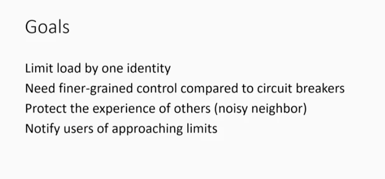

# Throttling

Created: 2019-11-03 23:14:09 -0600

Modified: 2019-12-13 12:08:07 -0600

---

<https://youtu.be/yVnVY2HPVsI>

23 minute

Goals

Limited load by identity. ~~Someone get bill? Running and it does all crazy stuff or~~ this happen a lot internal, somebody let's say one days write a new tool to query the system for some piece of information. Everybody said it is cool I need it as well.

They start running this tool somebody get running on their desktop on their desk. They start adding all bodies, tools to query work item whatever they doing. Pretty soon, the tool make this query running like mad and one identity consuming outside amount of resource. Could be CPU... We want to be able to react that and not let that case other people problem. ~~So mentioned that is also more fine grain than Circular break. It's target toward goal of resource utilizationis to target and limit the offender not the people. As mentioned before, it isnoisyneighbor problem kind of common term for~~

If You are able to use way too much of the system,muti-Tenant system that's mean your experience is coming at the expense of somebody else. That's bad so we want to prevent that.

We also need let people know when you hit the limit and when did you approaching the limit. What's the limit. how did you deal this with the user. We need be flexible enough to be able to response range issues.

Usage

There are two may mechanisms here, delay and blocking. The first thing you want to do is delay. Blocking can be done very cool. If I start blocking you, everything you call just fail. That is rough. Sometimes is necessary but I would start with delay if that is enough. To kind slow things done. It is key to help people understand if you get throttled, why are you get throttled.

~~In the system, you can see the code you can see what's going on.~~

**Supports**

~~How get this things work, resources uli is actually quite complex. It is complex because we have a lot of dependcies. Part of course, teh big depend is database. So for example I want to be able to try database CPU time. There are some windows of time you want to look at it. For how much give user consumption in your system. As mentioned before, there are two kind of pieces, delay and blocking~~

**Features**

So to do this, we want to you as a caller to understand when you get close to the limit when are you being blocked. If you are writing a tools the tools can react to it

~~This is key to help people understand if you are getting throttling why you get throttling~~

And in the end, there is general concept resiliency about bad pressure.

If I make a call to service the service is struggling or whatever. If the service sendback a information to you that the service need back off. This is bad pressure. This pressure being pushed back to client. if the client is intelligent react to it. Again we are talking about friendly client. We are not talking about abuse it is not dos

Anything else. But the client is well

?? Maybe something you wroten

You can look at the header to take action and you can look at the code to takeaaction. You might back off you might pause your call whatever.

The other thing with throttling is that it is highly configurable.We need able to do the throttling for the work tracking, version control releases management and code search. Those they are very differently. What expensive for work item tracking. It is expensive necessary for version control. It is complete things is going on some has affect the throttling.

**To react of the client**

we give you the response head: if the client make a call, make a risk call, the service we let the client know if the client isin danger in throttling or are you being in throttling; you can look at the header see what is going on.

The service going to tell you: Hi I delay you this much. If you go on beyond the limit I will block you;

provide the client if information allows the client reactintelligibly.

And if you flat -out a block. I will give a code you know that. I will give you 429. Azure and other system do the same thing. We will give you 429 and let you know if failed，it is why it failed. It was because request is wrong , maybe the request has bad parameters.

**Throttling -- delaying vs blocking**

As mentioned before, two mechanism here: delay and blocking

Delay allowed us to split out the load if we can simple slow down. That is might be enough. If you go the tool or somebody maybe use for your tool you wrote , the way you did not expect if we just slow down it still success. We just split out the load. Sometimes is enough some is not.

Sometimes is enough piles up that we just have to start blocking.

~~How did you do it~~

~~Since so much stuff pending on service. You keep track who use CPU, It's really partial call by this user. this common has been happing in last 5 minutes and that consumers 90% CPU~~

~~We need neither delay maybe?? to block if come too bad~~

~~It's ability to ??tracbi?? This is usage to partial call, partial identity . It's really key because it go after the ??~~

~~~~

{width="10.083333333333334in" height="4.75in"}

{width="10.083333333333334in" height="4.4375in"}

{width="10.083333333333334in" height="5.447916666666667in"}

