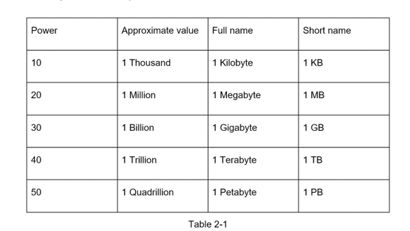

# 1 kb  = 1000 byte

Created: 2017-05-06 16:02:39 -0600

Modified: 2025-05-05 13:57:38 -0600

---

1 kb = 1000 byte

1 byte = 8 bits

1 megabyte = 1000 kb

1 gigabyte = 1000 mb

1 M = 1 million = 1,000,000

1 billion = 1 G

1 million user per day =12 qps ( 12 request per second)

{width="5.0in" height="2.8125in"}

