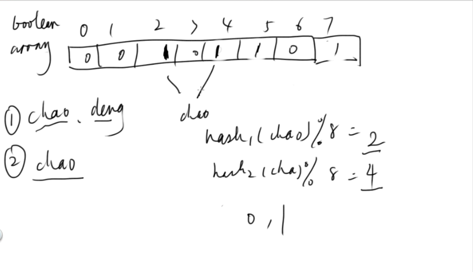
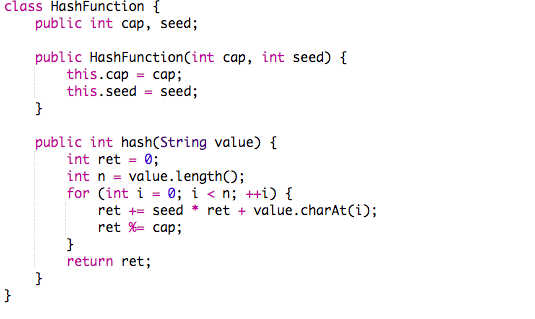

# Bloom Filter 

Created: 2017-06-11 16:35:44 -0600

Modified: 2021-01-23 00:06:35 -0600

---

whether an element is present in a set

can help us find out whether the key in the hashtable or not

A large bit vector

represents the set. An element is added to the set by computing 'n' hash functions of the element and setting the corresponding bits. An element is deemed to be in the set

if the bits at all 'n' of the element's hash locations are set.

The disadvantage to using a bloom filter for the URL seen test is that each false positive will cause the URL not to be added to the frontier, and therefore the document

will never be downloaded. The chance of a false positive can be reduced by making the bit vector larger.

that means "chao deng" may in the set

if 2 or 4 is 0 menas "chao deng" 100% not in the set.

use mutil hash function

{width="4.104166666666667in" height="2.361111111111111in"}

{width="12.0625in" height="0.9930555555555556in"}

判断 int n 的 bloom filter, 比 string 简单

{width="4.104166666666667in" height="2.451388888888889in"}

![public class StandardBloomFilter { public BitSet bits; public int k; public List<HashFunction» hashFunc; public StandardBloomFi1ter(int k) { // initialize your data structure here this. k k hashFunc new for (int i hashFunc.add(nen HashFunction(1ØOØØØ + i, bits - - new BitSet(1ØØOØØ + k); public void add(String word) { // Write your code here for (int i int position hashFunc bi ts. set(position) ; public boolean contains(String word) { // Write your code here for (int i int position hashFunc.getCi).hash(word); if (!bits.get(position)) return false; return true; ](../media/Basic-Bloom-Filter-image4.png){width="4.104166666666667in" height="3.6805555555555554in"}

{width="0.4166666666666667in" height="0.6388888888888888in"}{width="0.5in" height="0.7708333333333334in"}{width="0.5416666666666666in" height="0.8402777777777778in"}{width="0.3055555555555556in" height="1.0138888888888888in"}{width="0.4861111111111111in" height="0.2638888888888889in"}{width="0.3958333333333333in" height="0.6458333333333334in"}{width="0.625in" height="0.6666666666666666in"}{width="0.4166666666666667in" height="0.5625in"}{width="1.0in" height="0.875in"}

