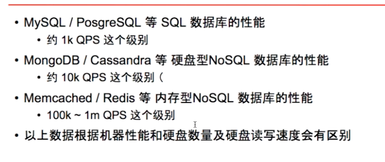
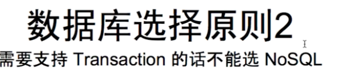
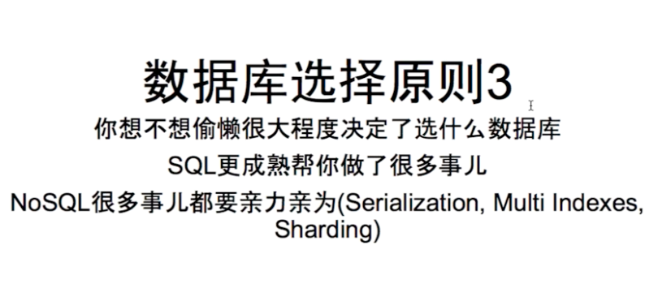
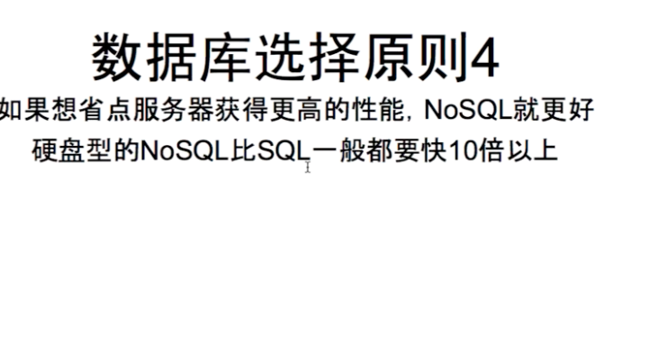
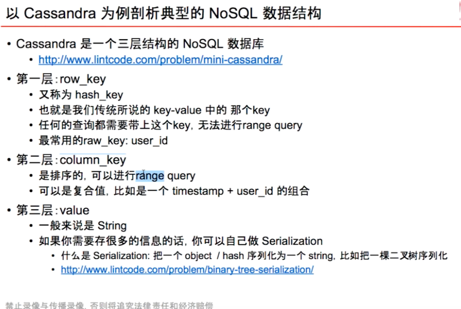
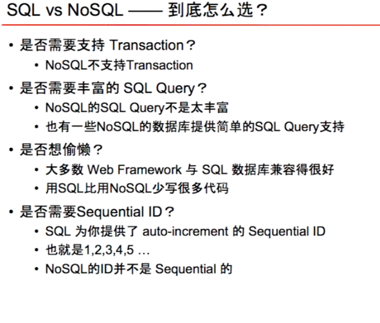
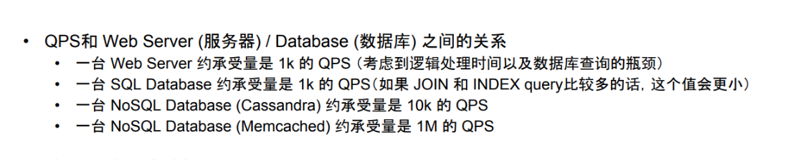
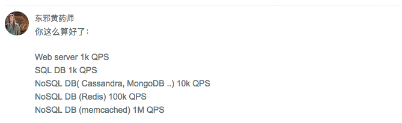

# Database 

---

from message :

For a write heavy system with a lot of data, traditional database usually don`t perform well. Every write is not just an append to a table but also an update to multiple index which might require locking and so it might affect with reads and other writes.

Compare SQL and no SQL

For example, if we want to build a database for resume application

For SQL databse: we need server table,

User table

User id, first name, last name, company id , school id

Company table

School table

But if you store the information to the no sql table such as the document table:

Key will be the user id and value will be whole information about the user like xml or json format

Should: ..

Company..

The benefit of document database is easily to read, don`t need join multiple table like sql database

Disadvantage is not easy to change the data and we need load the entire document even you just need small part

