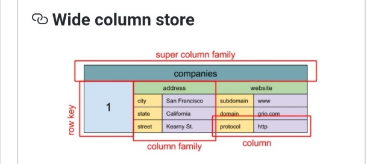

# How to chose data store

Created: 2018-09-27 23:15:50 -0600

Modified: 2020-01-06 15:07:53 -0600

---

<https://docs.microsoft.com/bs-latn-ba/azure/architecture/guide/technology-choices/data-store-overview#column-family-databases>

skip Big compute and

1. 

Relational database

Has row and columns

An RDBMS is very useful when strong consistency guarantees are important --- where all changes are atomic, and transactions always leave the data in a consistent state.

However, the underlying structures do not lend themselves to scaling out by distributing storage and processing across machines.

Also, information stored in an RDBMS, must be put into a relational structure by following the normalization process.

**Key/value stores**

is often backed by memory or SSD.

A key/value store is essentially a large hash table.

Key/value stores are highly optimized for applications performing simple lookups, but are less suitable for systems that need to query data across different key/value stores.

A single key/value store can be extremely scalable, as the data store can easily distribute data across multiple nodes on separate machines.

**Documentdatabase**

A document store is centered around documents (XML, JSON, binary, etc)

It is schemaless

A single document may contain information that would be spread across several relational tables in an RDBMS.

The application can retrieve documents by using the document key.

Many document databases support in-place updates, enabling an application to modify the values of specific fields in a document without rewriting the entire document.

Read and write operations over multiple fields in a single document are usually atomic.

**Graph databases**

A graph database stores two types of information, nodes and edges. You can think of nodes as entities. Edges which specify the relationships between nodes.

Both nodes and edges can have properties that provide information about that node or edge, similar to columns in a table.

Edges can also have a direction indicating the nature of the relationship.

The purpose of a graph database is to allow an application to efficiently perform queries that traverse the network of nodes and edges, and to analyze the relationships between entities.

The following diagram shows an organization's personnel database structured as a graph. The entities are employees and departments, and the edges indicate reporting relationships and the department in which employees work.

~~This structure makes it straightforward to perform queries such as "Find all employees who report directly or indirectly to Sarah" or "Who works in the same department as John?"~~

~~For large graphs with lots of entities and relationships, you can perform very complex analyses very quickly.~~

~~Many graph databases provide a query language that you can use to traverse a network of relationships efficiently.~~

**Column-family databases**

A column-family database organizes data into rows and columns.

~~In its simplest form, a column-family database can appear very similar to a relational database, at least conceptually.~~

~~The real power of a column-family database lies in its denormalized approach to structuring sparse data.~~

You can think of a column-family database as holding tabular data with rows and columns, but the columns are divided into groups known as column families.

Within a column family, new columns can be added dynamically, and rows can be sparse (that is, a row doesn't need to have a value for every column).

~~The following diagram shows an example with two column families, Identity and Contact Info. The data for a single entity has the same row key in each column-family.~~

Unlike a key/value store or a document database, most column-family databases store data in key order, rather than by computing a hash.

Many implementations allow you to create indexes over specific columns in a column-family. Indexes let you retrieve data by columns value, rather than row key.

~~Read and write operations for a row are usually atomic with a single column-family, although some implementations provide atomicity across the entire row, spanning multiple column-families.~~

{width="2.7708333333333335in" height="1.1666666666666667in"}

{width="2.7708333333333335in" height="1.2395833333333333in"}

Data analytics

Data analytics stores provide massively parallel solutions for ingesting, storing, and analyzing data.

This data is distributed across multiple servers using a share-nothing architecture to maximize scalability and minimize dependencies.

The data is unlikely to be static, so these stores must be able to handle large quantities of information, arriving in a variety of formats from multiple streams, while continuing to process new queries.

Relevant Azure services:

SQL Data Warehouse

Azure Data Lake

Search Engine Databases

A search engine database supports the ability to search for information held in external data stores and services. A search engine database can be used to index massive volumes of data and provide near real-time access to these indexes. Although search engine databases are commonly thought of as being synonymous with the web, many large-scale systems use them to provide structured and ad-hoc search capabilities on top of their own databases.

The key characteristics of a search engine database are the ability to store and index information very quickly, and provide fast response times for search requests. Indexes can be multi-dimensional and may support free-text searches across large volumes of text data. Indexing can be performed using a pull model, triggered by the search engine database, or using a push model, initiated by external application code.

Searching can be exact or fuzzy. A fuzzy search finds documents that match a set of terms and calculates how closely they match. Some search engines also support linguistic analysis that can return matches based on synonyms, genre expansions (for example, matching dogs to pets), and stemming (matching words with the same root).

Relevant Azure service:Azure Search

Time Series Databases

Time series data is a set of values organized by time, and a time series database is a database that is optimized for this type of data. Time series databases must support a very high number of writes, as they typically collect large amounts of data in real time from a large number of sources. Updates are rare, and deletes are often done as bulk operations. Although the records written to a time-series database are generally small, there are often a large number of records, and total data size can grow rapidly.

Time series databases are good for storing telemetry data. Scenarios include IoT sensors or application/system counters.

Relevant Azure service:Time Series Insights

**Object storage**

Object storage is optimized for storing and retrieving large binary objects (images, files, video and audio streams, large application data objects and documents, virtual machine disk images). Objects in these store types are composed of the stored data, some metadata, and a unique ID for accessing the object. Object stores enables the management of extremely large amounts of unstructured data.

Relevant Azure service:Blob Storage

Shared files

Sometimes, using simple flat files can be the most effective means of storing and retrieving information. Using file shares enables files to be accessed across a network. Given appropriate security and concurrent access control mechanisms, sharing data in this way can enable distributed services to provide highly scalable data access for performing basic, low-level operations such as simple read and write requests.

Relevant Azure service: File Storage

{width="0.22916666666666666in" height="0.22916666666666666in"}

