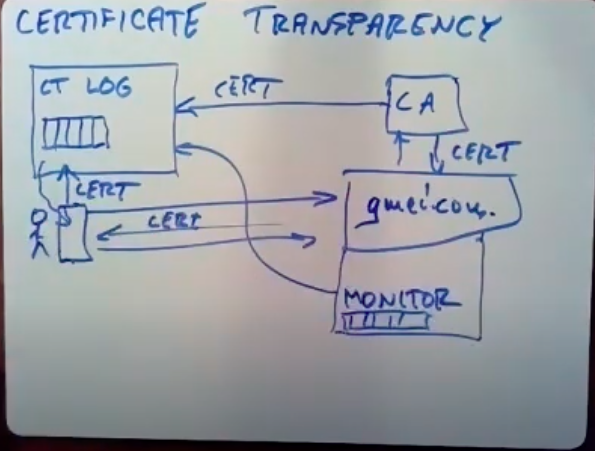

# Lecture 18: Fork Consistency, Certificate Transparency

Created: 2020-07-09 10:51:32 -0600

Modified: 2020-10-22 15:40:48 -0600

---

certificate transparency do doing is ensuring that all parties see the same information about certificates that's a real consistency issue

I want to start with the situation on the web with web security at any rate as it existed before 1995, before certificates so this is for 1995 and in particular there was a there was a kind of attack in those days that people were worried about called a man-in-the-middle attacks this is man in middle and this is a name for a class of attacks style of attack so you know the set up in those days is you have the internet and you have people running

browsers sitting with our computer ,attached to the Internet anyone sitting in front of my computer I want to talk to a specific server exposing

what I want to do is talk to gmail.com right and ordinarily I would you know maybe contact the DNS system I would as a user I maybe type gmail.com ,I wanted to talk to ~~name Li~~ gmail.com , my browser would talk to DNS servers say what's gmail.com, it would reply with a IP address I connected that IP address, and you know I need to authenticate myself so I'd probably type my password to Gmail to Gmail's website and then Gmail would show me my email without some kind of story for security, this system is actually quite easy to attack and turn out to be easy to attack and the one style of attack is that what's called a

man-in-the-middle attack where some evil person sets up a another web server that serves pages that look just like Gmail web servers like the last for your login and password right, and then the attacker would maybe intercept my DNS packets or just guess when I would have sent a DNS packet and come up with a fake reply that instead of providing the real IP

address , ~~the real gmail.com server would provide the email address of ma of the attackers fake computer~~ and then the user's browser instead of talking to Gmail would actually unknown to them be talking to the attackers computer, the attackers computer would provide a web page looks just like a login page, user types the login name and a password and now the attackers computer can forward that to the real Gmail login for you of course you don't know that you know get your current inbox back to the attackers computer which presumably records ~~it along with~~ your password and then sends your inbox or whatever to the browser ~~and this allows a you know if you can execute this kind of man-in-the-middle attack the attackers computer can record your password record your email ,before certificates on SSL and HTTPS there was really no defense against this~~

this is the attack in the mid-90s people came up with certificates with SSL or it's also called TLS it's what the protocol the security protocol that you're using when you use HTTPS links

~~and here the game was that~~ Gmail.com was gonna have a public/private key pair

so we'd have a private key that only Gmail knows ,sitting in its server and then when your the user you connect somewhere you ask to connect to Gmail you know and in order to verify that you're really talking to Gmail ,the users going to demand Gmail prove that

it really owns Gmail is private key well of course, where does your browser find out Gmail

is private key from your Gmail public key which is what you need to check that

it really has the private key

there's also this notion of certificate authorities and certificates ,so there'd be a certificate authority when Gmail set up its server, Gmail would contact the certificate authority may be on the phone or by email or something and say look you know I want a certificate for

the DNS name gmail.com, and the certificate authority would sort of try to verify that oh yes whoever's asking for certificate really owns that name, it really is Google or whoever owns gmail.com, if so the certificate authority would provide a certificate

back to gmail.com which basically what a certificate contains is the name of the web server, the web servers public key and a signature over this certificate made with the certificate authorities private key, so this is sort of a self-contained assertion, checkable by checking the signature an assertion by the certificate authority that the public key of gmail.com, gmail.com would just keep a copy of the certificate

if you connect to gmail.com server with HTTPS the first thing it does is sends you back this certificate, at this point is just a certificate right now of course ,since gmail.com is willing to give it to anybody it's the certificate, itself is not at all private, it's quite public, and then the browser would send some information like a random number for example to the server and ask it to sign it with its private key and then the browser can check using the public key in the certificate that the random number is random number was really signed by the private key that's associated with the public key in the certificate, and therefore that whoever it's talking to is really the entity that the certificate authority believes is gmail.com

the reason why this makes man-in-the-middle attacks much harder is that you know you can set up a rogue server that looks just like Gmail.com and maybe can even hack the DNS system indeed you still can, if you're sufficiently clever powerful hack the DNS system to tell people's browsers that oh they should go to your server instead of gmail.com, but

once somebody's browser contacts your server, you're not presumably going to be able

to produce a certificate that says but you can produce Gmail certificate, but then Gmail certificate as Gmail's public key your server doesn't have, their private key so you can

sign the challenge the browser sent you ,and presumably since you're not the real

Google and not the real Gmail, you're not going to be able to persuade a certificate authority to give you a certificate associating gmail.com with your public key ~~that unit~~ and so this certificate scheme made man-in-the-middle attacks quite a bit harder and you know indeed they are

why we need certification transparency

there's some kind of things that go wrong it was originally imagined that there would just be a couple of trustworthy certificate authorities who would do a good job of checking that request really came from who they claimed to come from that, if somebody asked for a certificate for gmail.com that this certificate authorities would indeed actually verified that the request came from the owner gmail.com, and not hand out certificates to random

people for gmail.com , but you know for just X.COM that's very hard to have a certificate authority reliably able to say this request really came from the person who really does own

the DNS name X.COM, the a worse problem is that while originally they were envisioned there'd be only a few certificate authority, there are now literally hundreds of certificate authorities out there, and any certificate authority can generate a certificate for any name

indeed may want to you're allowed to change certificate authorities if you're a website owner you can change certificate authority to whoever you like ,so there's no sense in which certificate authorities have limits on their powers ,they can, any certificate authority can produce any certificate and now browsers have you know there's a couple hundred

certificate authorities and that means that each browser has built into it ~~like Chrome or Firefox or something has built into it~~ a list of the public keys of all the certificate ,~~all couple hundred sort good authorities, and if any of them has signed a certificate produced by web~~

~~server, certificates acceptable~~ , the result of this is that there have been multiple incidents of certificate authorities producing bogus certificates that is producing certificates that said they were certificate for Google or Gmail or some other real company, but were actually issued to someone totally else absolutely, not issued certificate for one of Google's names but not issued to Google, issued to someone else like and you know sometimes this happens just by mistake because superior Authority doesn't realize that they're doing the wrong thing and sometimes it's actually quite malicious have been incidents of bogus certificates for real websites like Google issued to totally the wrong people and those certificates have been abused

[how to fix the certificate authority system itself]{.mark} to prevent them because there's so many certificate authorities and they really you just can't expect that they're going to be completely reliable, so what can we do about this one possibility would be to have a single online database of all valid certificates, maybe you could imagine the browser would contact the global valid certificate database and ask and says this really is certificate or is a bogus certificate issued by a certificate authority

the problem is as many problems with that approach one is it's still not clear how you can how anybody can distinguish valid correctly issued certificates from bogus certificates because typically you just don't know who the proper owner of DNS names, it is furthermore you need to allow certificate owners to change certificate authorities or renew their certificates or they may lose their private key and need a new certificate

to replace their older ,because using a new public/private key pair so

people's certificates change all the time and finally even if technically or were possible to distinguish correct certificates from bogus ones,

there's no entity that everybody would trust to do it you know everybody in the world those you know the Chinese

Iranians the Americans you know there's

not any one outfit that they all trust

and that's the root reason why there's

so many certificate authorities so we

really can't you really can't expect

there to be a single clearing house that

accurately distinguishes between valid

and invalid certificates ,however what

certificate authority certificate

transparency doing is doing is

essentially try not do the best that

it's possible to do you know the longest

step it can towards a database of the

holid trustworthy certificates so now

[I'm gonna give an overview of the general strategy of certificate transparency]{.mark}

the style of certificate transparency is that it's an audit system, because it's so hard to impossible to just decide does this person own a name . A certificate transparency isn't a building a system that prevents bad things from happening which would require you to be able to detect right away that as certificate was bogus instead certificate transparency is going to enable audit that is it'll it's a system to cause all the information to be public, so that it can be inspected by people who care, maybe people it'll still allow people to issue bogus certificates, but it's gonna insure those certificates are public and that everybody can see them including whoever it is that owns the name that the name that's in the bogus

certificate

so this fixes the problem with the pre certificate transparency system where certificate authorities could issue bogus certificates and no one would ever know and they could even give them to victim ,a few victim browsers who would be tricked by them and still because

certificates ~~aren't~~ are generally public, they could somebody could a certificate authority could issue a bogus certificate for anybody for Google or Microsoft and Google Microsoft might never realize it , and the incidents that have come to light, have generally been discovered only by accident not because they were sort of foredoomed to be discovered, so instead of relying on accidental discovery of bogus certificates, certificate transparency, it's going to sort of force them into the light where they is much easier to notice them, again so it has a sort of audit flavor or nada not a prevention flavor

[okay so the basic structure]{.mark} again we have gmail.com or some other service that wants a certificate as usual, they're gonna ask someone of the hundreds of CAS for a certificate when the cert web servers first set up, so we're gonna ask a certificate and the certificate authority is gonna send this certificate back to the web server because of course is the web server that gives a certificate to the browser and at the same time though the certificate

authority is going to send a copy of the certificate or equivalent information to a sort

Transparency log server ,there's gonna the real system there's multiple independent certificate transparently log servers, i can assume there's just one, so this is some service that you know we don't have turns out, we're not gonna have to trust the certificate

authorities gonna send it certificate to this certificate log service which has been maintaining a log of all issued certificates or all ones that certificate authorities have told it

about when it gets a new certificate, it's gonna append it to its log ,so this you know might have millions of certificates in it

after a while now when the browser and some human wants to talk to a website, they you know they talk did set up an HTTPS connection to Gmail, Gmail sends them a certificate back and the browser's gonna send that certificate to the certificate log server, see is this certificate in the log, there's log servers gonna say yes or no is their certificate in the log now ,and if it is then the browser will go ahead and use it

now the fact that it's in the log you know doesn't mean it's not bogus because any certificate authority that are malicious or badly run any certificate, authority can insert a certificate into the log system and therefore perhaps trick users into using it ,so for so far we haven't built a system that prevents abuse ,however it is the case that no browser will use a certificate unless it's in the log so at the same time gmail is going to run up with the CT system calls a monitor and for now well just assume that there's a monitor associated with every website, so this monitor periodically also talks to the certificate, log servers an asset please give me a copy of your log or really you know please give me a copy of whatever new has been added to your long since I last asked and that means that the monitor is going to build up, it's going to be aware of every single certificate

that's going to be enough that's in the log and but also because the monitor is associated with Gmail the monitor knows what Gmail's correct certificate is so if some rogue certificate authority issues a certificate for Gmail it's not the one that Gmail itself asked for then Gmail's monitor will stumble across it in the certificate log because Gmail's monitor knows Gmail's correct certificate ,now of course the rogue certificate authority doesn't have to send its certificate to the certificate log system, but in that case when browsers you know maybe accidentally connect to the attackers web server and the attacker would swipe server gives them the bogus certificate if they haven't put it in the log then the

browser won't believe it and will abort the connection it's not because it's not in the log,

~~so the log sort of forces~~ because browsers require certificates being a log the log forces all certificates to be public where they can be audited and checked by monitors who know what the proper certificates our . Some monitors are run by big companies and

companies know their own certificates, some monitors are run by certificate authorities on behalf of their customers and again those certificate authorities know what certificates they've issued to their customers and they can at least alert their customers ,if they see a

certificate they didn't issue for one of their customers names, in addition there's some totally third-party monitor systems where you give the third-party monitor your names and yours and your valid certificates and it checks for expected certificates for your names

{width="5.0in" height="3.7777777777777777in"}

~~alright this is the overall scheme but it depends very much on browsers seeing the very same log contents that monitors see and but remember we were up against this problem that we're not sure that we can trust any component in this system, so indeed we found this certificate authorities some of them are malicious or have employees who can't be trusted or are sloppy and don't follow the rules, so we're going to assume we have to~~

~~assume that the same will be true the certificate log servers that some of them will be malicious, some of them may conspire with rogue certificate authorities and intentionally try to help them issue bogus certificates ,some of them may be sloppy some of them may~~

~~be legitimate but maybe some of their employees or are corruptible you pay~~

~~them being a bribe so I'll do something funny to the log delete something or add~~

~~something to it so what~~ [we need to build is a log that]{.mark} ~~even though the log operator may be not cooperating not trustworthy, we can still be sure or at least know if it's not the case~~

[that browsers are seeing the same log contest as monitors]{.mark} ~~so if our browser uses a certificate that was in the log the monitor who owns that name will~~

~~eventually see it so what we need to do is~~

we need to build a log system that is append-only so that it can't show a certificate to a browser then delete it before monitors see it, so append-only, no Forks in the sense that we don't want the log system to basically keep two logs one of which it shows two browsers and one of which shows two monitors, so we need no Forks and we need untrusted we can't be sure that the certificate servers are correct so just to back up a bit the

~~critical properties we need for the log system so larger than just a log servers~~

[prevent deletion]{.mark}

~~but~~ the entire system of the log servers plus the various checks is we have to prevent deletion that is we need the logs to be append only, because if a log server could delete items out of its log, then they could effectively show a bogus certificate to a browser ,claimants in the log and maybe in the log at that time the browser uses it, but then maybe

this certificate server could delete that certificate from its log, so that by

the time the monitor's came to look at the log, the bogus certificate wouldn't

be there so we need to have a system that either prevents deletion or at least detects if deletion occurred

we also have to prevent what's called equivocation, or not' we have to prevent Forks or

equivalently equivocation, so you know it's maybe the certificate log servers could be implementing append-only logs ,but if it implemented two different append- only logs and showed one two browsers and show the other append-only log two monitors then we could be in a position where we showed the browser's contains the bogus certificate, but the log we showed a monitors doesn't doesn't contain the bogus certificate, so we have to rule out equivocation too,

all without trusting the

servers so how can we do this now we're

getting into the kind of details that

the last of the assignments was talking

about

[Detail]{.mark}

(27:00)

the first step is this thing called a Merkel tree ,and this is something that's sort of that the log servers are expected to build on top of the log, so the idea is that there's the

actual log itself which is a sequence of certificates ,~~you know certificate 1~~

~~certificate 2 ...~~ presumably in the order, that a certificate to be added to the system and the prime millions, ~~I'm just going to assume there's a couple, now it's gonna~~

~~turn out you know~~ we don't want to have the browser's have to download the whole log and, so we need tools to so that we can allow the logging system to basically send trustworthy summaries or unambiguous summaries of what's in the log to the browsers

~~I'll talk in a bit about it exactly what those summaries are used for ,but the basic scheme is that the log servers are gonna use cryptographic hashes to sort of hash up the complete set of records that are in the log can produce a single cryptographic hash~~ ,which is typically

about 256 bits long ,so the cryptographic hash summarizes the contents of the log and the way that's done is that the is as a basically a tree structure of pairs over hash, always hashing together pairs of numbers ,at the zeroth of the level so I'm gonna write each for a hash, each one of the log entries has a hash, so we're gonna have sort of at the base level, we have the hash of each log entry, each certificate and then we're going to hash up peers so that the next level (level 1) we're gonna have a hash of this (c1,c2) and concatenated with this and a hash of this (c3,c4 ) concatenated with this, these two hashes and then at the top level sort of we're we're overdoing is hashing these two the concatenation of these two hashes and this single hash ,here is a unambiguous sort of stand-in for the complete log one of the properties of these cryptographic hashes like sha-256 (sth)

is that it's not feasible to find two inputs to the hash function that produce the same output and that means if you tell somebody the output of the hash function, there's only one input, you're ever going to be able to find that produce that output, so if the log server

does hash up in this way, the contents of its logs only this sequence of these log

records will ever be able to produce that hash or guaranteed effectively that the log server is not going to be able to find some other log that produces the same final tree hash as this sequence of log entries

Merkel tree this is the sort of tree hash that summarizes the entire log at the top of the Merkel tree ,there's will actually call it a signed tree head because in fact the log servers take this hash, this at the top of the tree and sign it with their private key and give that to clients, to browsers and monitors and the fact that they've signed it means that they can't

disavow it later ,~~that was really them and produced it so that's you know just to be able to catch lying log servers and~~ ,~~so the point here is that once a log server has revealed a particular sign tree head to a browser or monitor its committed to some specific log contents because it won't be able to ever produce a different log contents to produce the~~

~~same hash, so you hashes are really function as kind of commitments~~

[how to add records to the log for arbitrary numbers of records]{.mark}, I'm just going to assume that the log always grows by factors of 2, which is impractical but makes it easier to explain, so that means that as certificate authorities send in new certificates to add to the log, the log server will wait until it has as many new records as it has old records and then produce another tree head and the way ,it does that is it's gonna in order to extend the log the log servers going to wait off as another 4 records and ,then it's gonna hash them pairwise just as before, and then it'll produce a new tree head that is the hash of the

concatenation of these two hashes and this is the new tree head for the new expanded log ~~and so that means as time goes on and a log server this log grows longer and longer, it produces sort of higher and higher a sequence of higher and higher tree heads as the logarithms~~

(36)

okay so this is the structure that we're

expecting log servers to maintain of

course who knows what they're actually

doing especially if they're malicious

but the protocol the certificate

transparency protocol sort of is written

you know as if the log server was was

actually doing this all right so what do

we need to do but do the point of this

Merkle trees is to use them to force log

servers to prove certain things about

the logs that they can about the log

that they're maintaining we're going to

want to know what those those proofs

look like the first kind of

is what I'll call a proof of inclusion

and this is what a

NEADS when it when it wants to find out

if a certificate that has just been

given by a web server if that

certificate is really in the law it's

gonna ask the certificate it's gonna ask

the log server look here's a certificate

you know is it an is it in your log and

the certificate server is gonna send

back a proof of actually not just that

the certificate is in the log but

actually where it is what its position

is in the log and of course the browser

wants this proof because it doesn't want

to use the certificate if it's not in

the log because if it's not I'm along

then monitors won't see it and there's

no / - no protection against their

certificate being bogus and it needs to

be a proof because we we can't afford to

let this log server a malicious log

forever change its mind we don't want to

take the log servers word for it because

then they might a malicious log server

might say yes and this proof is gonna

help us catch it you know if a log

server does lie these proofs are gonna

help us catch the fact that the log

servers lied and produce evidence that

the log server is malicious and should

be ignored from now on is that sort of

the ultimate sanction against the log

servers is that the browser's actually

have a list of acceptable log servers

and these proofs would be part of the

evidence to cause one of the log servers

to be taken out of the log if it was

malicious okay so we need a proof we

want the log server to produce a proof

that a given certificate is in its log

so actually the first step is that the

browser asks the log server for the

current sign tree head so what the

browser's really asking is is this

certificate in the log that summarized

by this current by this sign tree head

and the log server may lie about the

sign tree head right the browser asks it

for the current sign tree head and then

for a proof that the certificate is in

the log the log server could lie about

the sign tree headband will deal about

that we'll consider that later but for

now let's assume that the the browser

has the correct sign tree head and is

demanding a proof okay so for simplicity

I'm just gonna explain how to do this

for a log with two records and it turns

out that extending that to a log with

with other more higher power of two

records is relatively easy um so the

browser actually has a particular sign

tree head let's suppose the correct log

that sits under that sign tree head is

the two LM in log a B for particular

certificates a and B and that means that

the correct

Merkle tree for that it securely is at

the bottom as the hashes of a and B and

then the sign tree head is actually the

hash of a hash of a concatenated with a

hash would be so let's suppose this is

the sign tree head that the certificate

that the log server actually gave to the

client of course the client doesn't this

client only knows this value this is

final hash value doesn't actually know

what is in the log the proof if the if

the browser asked for a proof that a is

in the log then the proof that the log

server can return is simply the proof

for a is a in the log is simply eizan in

the log and the hash of the other

element in the log so zero and the hash

of b

and that is enough information for a to

convince itself that for sorry for the

client to convince itself that a really

is at position zero because it can take

it knows the certificate is interested

in it can hash it part of the proof was

the hash of the other element in this

lowest level hash so the browser can

that now knows H a and H B you can hash

them together can execute this hash and

see if the result is the same as the

sine tree head that it happens and if it

is then that means that the certificate

log is actually produce a valid proof

that certificate a is at position B

that's a sorry it's a position zero in

the log summarized by this sign tree

head and it turns out that in larger

larger logs you know if you're looking

for if you need a proof that a is really

here all you need is the sequence of

hashes of the other branch of each hash

up to the sign tree head that you have

so in a for element log if you if you

need a proof that a is position zero you

need this hash units then you need this

hash and if the lock is bigger you know

eight elements then you also need this

hash assuming that you have the signed

tree hit so you can take the element you

know and hash it together with each of

these other hashes see if it's equal to

the sign tree head okay so if the

browser asks is supposing the browser

asks whether X is in the log at position

zero well X isn't in the log right so

hopefully there's no easy way for the

log server to produce the proof that X

is in the log in position zero but

suppose the log servers wants to lie and

it's in the position where it already

exposed a sign tree head for log that

contain a and then B browser doesn't

know was a and B doesn't know what's in

the log and the log server wants to

trick the client into the browser into

thinking that it's really

at position zero well it turns out that

in order to do that the for this small

log the certificate server has to

produce for some why it needs to find a

why that if it takes it's hash one

concatenated with X you know so this is

that's that it's equal to the sign tree

head right because the client we're

assuming the client already has to sign

tree head we need to find a some number

here that when hashed together with the

hash of X that the clients asking about

produces that same sign tree hit well we

know the sign tree head or the

assumption is assigned tree it was

actually for some other log right

because we're trying to rule out the

possibility that the log server can give

you a sign tree head for one log but

that convince you that something else is

in that log that's not there so the sign

tree had really was produced by from the

hashes of the records that really were

in the log and now we need and since you

know X is definitely different from a

that means the hash of X is different

from the hash of a and that means that

the log server needs to find two

different inputs to the hash function

that produced the same output and the

Assumption widely believed to be true

for practical purposes is that that's

not possible for cryptographic hashes

therefore the cent sign tree head was

produced by hashing up one log that it

will not be possible to find these sort

of other hash values that would be

required to produce a proof that some

other element was in the log that wasn't

really there

any questions about this about anything

[Music]

interesting a nice thing about this is

that the proofs are the proofs consist

of just the sort of other hashes on the

way up to the root if there's n

certificates there's only log in other

hashes and so the proofs are reasonably

concise in particular that are much much

smaller than the full log and since you

know every browser that needs to connect

to a website he's going to need one of

these proofs it's good if they're small

okay well this was whole discussion was

assuming that the sign tree had the

theum

or had was the correct sign tree head if

the but no there's no immediate reason

to believe that the log server would

have given if the logs are is malicious

and it wants to trick a client you know

why would it give the client the correct

see sign tree head why doesn't it give

it just me giving the sign tree head for

the bogus log that it wants to trick the

client into using so we have to be

prepared for the possibility that the

log server has cooked up I just

completely different log for the browser

that's not like anybody else's log and

it just contains the bogus certificates

that a malicious log server wants to

trick this client into believing so what

do we do about that well it turns out

that this is at least in the first

instance this is totally possible

you know usually what's gonna happen

usually the way this will play out is

that we'd have some browser that was you

know seeing the correct logs until some

point in time when when somebody wanted

to attack it and you know you want the

browser student be able to use all the

websites that it's ordinarily seeing

plus a sort of different log with bogus

certificates that the log server wants

to trick just that client just that

victim browser into using so now this is

a fork fork attack or more broadly

equivocation and the reason why people

call this kind of attack

a fork attack is that if we just never

mind the Merkel tree for a moment if we

just consider the log usually the log

already has you know millions of

certificates in it and everybody's seen

the beginning part of the log then at

some point in time we want to attack we

want to persuade our victim to use some

bogus certificate B but we don't want to

show B to anybody else certainly not to

the monitor so we're gonna sort of cook

up this other log the sort of continues

as usual and contains new submissions

but definitely doesn't contain the bogus

certificate B and you know what this

looks like is a fork because both the

sort of main log that monitors are shown

is kind of off on one fork and then this

vlog we're cooking up especially to

trick a victim is a different fork this

is the construction that the malicious

log server would have to produce if it

wants to trick a browser into using a

bogus certificate and again these are

possible it's possible to do this at

least briefly in with certificate

authority the sift a fit transparency

luckily though is not the end of the

story and certificate authority contains

some tools that allow it to make Forks

much more difficult so the basic scheme

is that this isn't this is the way the

certificate authority sort of intended

to work all certificate transparency is

intended to work but doesn't quite

what's going on here is that the the the

monitors and people are not being

attacked or gonna see a a sign tree

particular sign tree head let's say

science we hit one of course is gonna

change as the log extends and the victim

we know must see some other sign tree

head because this is a signed tree hit

that is hashed over this

certificates guaranteed to be different

from the sign tree heads this is the

militia service showing two monitors

if only the browsers and monitors could

compare notes they would maybe instantly

realize that they were seeing different

trees and all it takes is comparing you

know if we play our cards right all it

takes is comparing the sign tree had its

they've gotten from the log server to

realize wait a minute we're seeing

different logs now something's terribly

wrong so the critical thing we need to

do is have have the different

participants in the system be able to

compare sign tree heads and the

certificate transparency has a provision

for this called gossip and the way it's

intended to works that browsers well the

details don't really matter but what it

really amounts to is that all the

participants sort of drop off the recent

sign tree heads they've seen into a big

pool that they all inspect to try to

figure out if there's inconsistent sign

tree heads that clearly indicate

divergent logs that have for it so we're

going to gossip which really means

exchange

I'm sign tree heads and compare it turns

out that current certificate

transparency implementations don't do

this but they ought to and they'll

figure it out at some point

all right okay so the question is given

to sign tree heads how do we decide if

they're evidence that the log has been

forked the thing that makes this hard is

that even if a log hasn't been forked as

it's depended to new sign tree heads

will become current so you know maybe

sign tree head one was the legitimate so

he had a vlog at this point of then some

more certificates are added and sign

tree head 3 becomes the correct head of

the law and then signed tree head for

etc so really what this gossip

comparison least to do is distinguish

situations where one sign tree head is

really describes a prefix a log that's a

prefix of the log described by another

sign tree head because this is the

legitimate situation where you have the

two these two sign tree heads are

different but the second one really does

subsume the first one we want to

distinguish that from two signed tree as

that are different where neither

describes a log that's a prefix of the

other one's log one tell these two cases

apart this telling that situation apart

is the purpose of the consistency proof

the log or Merkel consistency proof that

the reading is talked about so this is

the

la consistency proof

you

so the game here is that we're given to

sign tree heads H 1 and H 2 and we're

asking is h 1s log prefix really it's

not these are - these are hashes so it's

really asking about the log that the

hashes represent and you know we're

hoping the answer is yes and if the

answer's no that means that the log

servers Fork Dustin is hiding something

from one party or the other okay well it

turns out that um as we as I mentioned

before the as the Merkel tree as the log

grows the Merkel tree also grows and

what we see is a sequence of signs of

tree heads each one as a log doubles in

size each one has its as its left thing

let me draw in the actual hash functions

of this hash function is hashing up two

things the result of this hash function

is one of the inputs to the next sign

tree head the result of this hash

function is one of the inputs to the

next sign tree head I know we get this

kind of tree of life sign tree heads all

right and I need to sign tree heads if

they're legitimate you know if each one

is log is a prefix of H 2 that means

that maybe this one's H 1 and this one's

H 2 and they're gonna have this

relationship thing you know if each one

is a piece of H 2 then they must have

this relationship where each 2 was

produced by taking each one hashing it

with some other thing and maybe hashing

that with some other thing until we get

to the point where we find H 2 and with

means is that if a browser or monitor

challenges a log a log server to prove

that each one's log is really a prefix

of h2s log what the log server has to

produce is this sequence of other the

other side of each of the Hat sign tree

head hashes on the way from h1 to h2 and

this is the proof and then again you

know this is reminiscent of the

inclusion proofs then to check the proof

you need to take each one hash it with

the first other thing you know hash that

along with the second other things that

you get to the last one of these and

that had better be equal to h2 if it is

it's a proof that h2 is a suffix of each

one otherwise the log servers evidently

tried to fork you and again you know the

basis of this is that there's no other

you know h2 really isn't as supposing h1

isn't a prefix of h2 there's no way that

uh since h2 was created from some actual

log that's not the same as h1 there's no

way that the log server could cook up

these values that are required to cause

the hashes this sort of repeated hash of

h1 to equal H to H do really encompass

ooming that the cryptographic hash does

prevent you from binding to different

inputs that produce the same out

alright ok so this is the log

consistency proof okay so the question

is who usually challenges the log server

so I'll actually talk about that in a

minute but it turns out that um both

browsers and monitors

well Luke browsers and monitors

challenge the log server you it's

actually usually the browser's

challenging the log server that's the

most important thing but there's two

points in time at which you need to

challenge the log server to produce

these proofs and I'll talk about both of

them all right okay actually so the

first place at which one point at which

these proofs are used as for gossip as

part of gossip as I outlined and the the

scheme that's intended for gossip is

that browsers will periodically talk to

some central repository of some set of

central repositories and just contribute

to a pool of sign tree heads the sign

tree hits the recently seen from the log

server and the browsers were also

periodically pull out random elements of

sign tree heads that other browsers have

seen just Brandon they pulled them out

of the pool and it'll be multiple of

these collects these pools run by

different people so that if one of them

is cheating that will be proof against

that and then the browser will for

whatever just any random sign tree has

it apples out of the pool it will ask

the log server to produce the logs

insistency proof for that pair of sign

tree heads and you know if nobody's

cheating design it should always be easy

for the log server to produce you know

any consistency proof that's demanded of

it but if it's for somebody suppose it

the log server is for somebody and given

them a sign tree had this really

describes a totally different log or

even a long the difference in one

element from the logs that everybody

else is seeing eventually that browser

will contribute that's that sign tree

head to the pool the gossip pool then

eventually somebody else

we'll pull that sign tray head out of

the pool and ask for a proof for you

know some other sign tree had that

presumably is on a different Fork and

then the log server will not be able to

produce the proof and I'm since they're

signed since the scientist or signed by

the log server that's just absolute

proof that the log server has forked two

of its clients presumably with intent

reveal a bogus certificate to one of

them and hide it from the other okay but

there's actually another place where it

turns out you need the these consistency

proves not just during gossip but

actually also during the ordinary

operation of the browsers so the the

difficulty is that suppose you know

suppose the browser is it's kind of

seeing consistent version of the log is

the same as everybody else but then log

server wants to trick it into using this

bogus certificate so the log server

sends it a signed tree you know makes

signed RIA that's different from

everybody else that refers to a you know

malicious log that contains this bad

certificate preferred video since it

doesn't want other people to notice

certainly doesn't want you know the

monitors to notice you know cooks up

this other log that is what everybody

else is seeing all right so now the you

know the browser checks and sees you

know I asked for inclusion proof and the

inclusion that log server will be able

to produce the inclusion proof because

this sign tree had that the browser has

really does refer to this bad log the

browser will go ahead and use this bogus

certificate and maybe get tricked and

give away the user's password

you know who knows what but depending on

the details of other browsers work we're

at risk of the next time the browser

which it doesn't realize anything's gone

wrong talks to the log server the log

server might then say you know there's a

new log with a bunch of new stuff on it

and here is the sign tree

of the current log why don't you switch

my to use that as your sign tree hit and

so now if that were allowed to happen

then the browser's now would completely

lost the evidence that anything went

wrong because now the browser is using

the same trees everybody else no it's

going to contribute this sign tree head

to the gossip pool it's all gonna look

good and we had this sort of brief evil

tree that was evil log that was revealed

evil log Fork but if the browser's are

willing to accept a new sign tree head

then we can basically have the browser

forget about so we want what we want is

this what we want is for if a browser if

the log service shows a particular log

to the browser that the browser that

they can't trick the browser into

switching away from that log that is

that we want to be able to enforce that

the browser sees only strict extensions

to the log that it's seen already and

doesn't simply get switched to a log

that is not compatible with the log the

browser seen before it's the property

that we're looking for it's actually

called for consistency and with any

first two is that if the browser's been

forked onto a different fork from other

people then they must stay on that fork

in it it should never be able to switch

to the main fork and the reason for that

is we want to preserve you need to

preserve this bad sign tree head and its

successors so that when the browser

participates in the gossip protocol it's

contributing sign tree heads that nobody

else has and that cannot be proved to be

compatible using the log consistency

proof okay so how do we achieve for

consistency well um it's actually easy

with the tools we have now every time

the log server tells a browser oh here's

a new sign tree head for a longer log

the browser will require the will not

accept the new sign tree head until the

log server has has produced a log

consistency proof that the new sign tree

head describes a suffix of the old sign

tree that is that the log of the old

sign tree has a prefix of the log of the

new sign tree and of course if a log

server is as forked the browser and it's

keeping the browser on that same Fork it

can produce the proofs but of course you

know it's digging its grave even deeper

because I'm as producing more and more

sign tree heads for a which will

eventually be caught by the gossip

protocol whereas if the blog server

tries to cause the browser to switch to

a sign tree head that describes the same

log everybody else has been seeing the

browser will demand a consistency proof

and the log server will not be able to

produce it because deed the log

described by the first sign tree head is

not a prefix of the log described by the

second sign tree

okay okay so the system these these log

consistency proofs provide for

consistency and for consistency plus

gossiping and that requiring this log

consistency proves for the science found

by gossiping

I'm the two of them together make it

likely that all the participants or

seeing the same log and that if they're

not seeing the same log they'll be able

to detect that fact by the failure of a

log consistency proof

any questions

okay so that how many log service are

there that is a great question

so I describe the system as if there was

just one log server it turns out in the

real system there's lots of log servers

at least dozens so this is a deployed

system which you can programmed in that

is actually used by Chrome and I think

Safari there are at least dozens of

these log servers and when certificate

and certificate authorities are actually

required by chrome to submit all their

certificates to the to the log servers

to multiple log servers the different

log servers don't actually keep

identical logs the convention is that a

certificate authority will submit a new

certificate to save you know a couple

maybe five different log servers and

actually in the certificate information

that a website tells your browser it

includes the identities of log servers

of the certificate transparency log

servers that have the certificate in

their log so your browser knows which

log servers to talk to and the reason

why there's more than one of them is of

course some of them may go bad some of

them may turn out to be malicious or go

out of business or who knows what and in

that case you still want to have a

couple more to fall back on they don't

have to be identical because they don't

as long as the certificate is in at

least one log that's you know as far as

anybody knows is trustworthy that's

sufficient because you know the issue

here

not really necessarily the fact that the

log had the certificate in it because

that's not proof that the certificate is

good all we're looking for is log

servers that aren't forking the monitors

and browsers that use them so it's

enough for a certificate to be in even a

single log server that's not forking

people because then the monitors are

guaranteed to see it because the

monitors check all the log servers so if

a bogus certificate shows up even even a

single log server the monitors will

eventually notice because all the

monitors look at all the log servers

that the browsers are willing to accept

all right another question what prevents

a log server from going down and issuing

bogus certificates before they get

caught you know nothing actually if

you're willing to that's definitely a

defect in the system that at least for a

while you can

malicious log server contributing bogus

certificates so if you have a

certificate authority that's become

malicious and this issuing bogus

certificates they look correct but

they're bogus and a log server then that

that's willing to serve these it's

willing to put these certificates in the

log and of course they all are then at

least for a while browsers will be

willing to use them the thing is though

that the you know they will be caught

and this is the system is its intent is

to improve the situation in the priests

or to make a transparency system if

somebody was issuing bogus certificates

and browsers were being tricked into

using them you might never find out ever

in the certificate transparency world

you may not find out right away and so

some some people may use them but then

relatively quickly you know a few days

or something the monitors will start to

notice that there's bad certificates in

the logs and somebody will go and track

it down and figure out who is malicious

or who is making mistakes

yeah so I guess a certificate a

certificate transparency law could

refuse to talk to the monitors yeah I'm

not sure I think ultimately the if you

know we're now treading into a kind of

non-technical region you know what to do

if there's evidence that something's

gone wrong this is actually quite hard

because much of the time is something

seems to go wrong even bogus

certificates often often the reason it's

just somebody made a mistake it was a

legitimate mistake you know somebody

blew it and it's not evidence of malice

is just that somebody made a mistake I

think what would happen if a monitor was

misbehaving in almost any way like not

answering requests if it was doing

consistently people notice and either

ask them to shape up or take them out of

the list

stop using them the browser vendors

would take that logs her out of a list

of acceptable log servers after a while

but yeah there's like a gray area of bad

behavior that's not bad enough to the

warrant being taken out of the

acceptable list I think of a log server

has been found to work the question is

what if the log server has been found

before what happens then I think I think

what would happen is the people who were

run you know the people who the browser

vendors would talk to the log server and

ask them the people running the log

server and ask them what happened and if

they came up with a convincing

explanation that they didn't made a

mistake you know which maybe they

couldn't maybe I don't know they their

machine crashes it loses part of their

log they restart you know starting from

a prefix of the log and start growing a

different log if it seems like a mistake

honest mistake then well it was a

mistake but if it if the log server

operators can't provide a convincing

explanation of what happened then I

think the browser vendors would just

delete them from the list of acceptable

klog servers okay but these are you know

these are sort of problems with the

system because you can you know the

definitions of like who owns a name or

what acceptable but you know whether

it's okay for your server to be down or

not these are very hard to pin down

properties you know I think the system

is not full you could definitely get

away with bad behavior at least for a

while but the hope is that there's

strong enough auditing here that if some

certificate authority or log server was

persistently badly behaved that people

would notice the monitors would notice

they may not do anything for a while but

eventually they would decide that you

know you're either too much of a pain or

to malicious to be part of the system

and delete you from the browser lists of

course they split the browser vendors in

a position of quite strong power so Wow

the system is in general pretty

decentralized yeah there can be lots of

certificate authorities and lots of

certificate transparency log servers

there's only a handful of browser

vendors and that there because they

maintain the lists of acceptable

certificate authorities and log servers

they do have a lot of power and you know

it's the way it is unfortunately okay so

things to take away from a certificate

transparency design so one thing is the

key property it has super important is

just that everyone sees the same log

even if some of the parties are

malicious either everyone sees the same

long or they can accumulate evidence

from failed proofs that something's

funny is going on and because both

browsers who are using those

certificates and the owners of the DNS

names who are running monitors see the

same log because of these proofs

the monitors can detect problems and

therefore the browser's even though the

browsers can't actually detect bogus

certificates they can at least be

confident that there if there's bogus

certificates out there that monitors

will detect them and possibly put them

on revocation lists actually that's

something I didn't mention if if there's

evidence of a monitor spots what must be

a bogus certificate like MIT sees

somebody they don't know about being

issued a certificate for MIT did you it

turns out there's a pre-existing

revocation service that you can put bad

certificates on that the browser's check

so if a monitor sees a bogus certificate

it can actually be effectively disabled

by putting it on in the revocation

certificate revocation system that's not

part of certificate transparency it's

been around for a long time okay so the

key property is everyone sees the same

log of certificates another thing to

take away from this is that if you can't

figure out a way to prevent bad behavior

maybe you can build something these

usable that relies on auditing instead

of preventing that is can detect bad

things after the fact that might be good

enough it's often much easier than

preventing the bad things some technical

ideas are here in this this work one is

this idea of equivocation that I'm a big

danger is the possibility that a

malicious server will sort of provide

split views one viewed one set of people

another view to another set of people

it's usually called a fork or

equivocation it's an important kind of

attack another property this for

consistency property it turns out it's

often valuable to when you're worried

about Forks to build a system that

forces the malicious server once it has

formed somebody to keep them on that

fork so it can't erase evidence by

erasing a fork I'm the final technical

trick is the notion of gossiping in

order to detect for because it's

actually gen if the participants don't

communicate with each other it's

actually typically not possible to

notice that there has been a fork so if

you want to detect Forks there has to be

one way or another

some kind of gossip some kind of

communication between the parties so

they can compare notes and detect forks

and we'll see most of these things again

next week when we look at Bitcoin and

that's all I had to say

{width="0.22916666666666666in" height="0.5833333333333334in"}

{width="0.22916666666666666in" height="0.5833333333333334in"}

