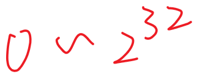
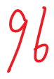

# Range of int or ID

---

If int is 4 Bytes

And is signed the range should be

for unsigned

4 billion

4 bytes id

2 to 40 th power : 1,099,511,627,776 1 trillion

5 bytes ID

short integer will 16 bit = 2 bytes

long integer will 32 bit = 4 bytes

