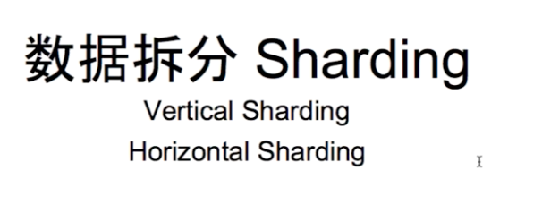

# Sharding  or Partitioning

---

if there are too many writing or reading for athe email table

<https://www.educative.io/courses/grokking-the-system-design-interview/mEN8lJXV1LA>

**Horizontal partitioning:** In this scheme, we put different rows into different tables.

**Vertical Partitioning:** In this scheme, we divide our data to store tables related to a specific feature in their own server

Vertical partitioning is straightforward to implement and has a low impact on the application. The main problem with this approach is that if our application experiences additional growth, then it may be necessary to further partition a feature specific DB across various servers (e.g. it would not be possible for a single server to handle all the metadata queries for 10 billion photos by 140 million users).

