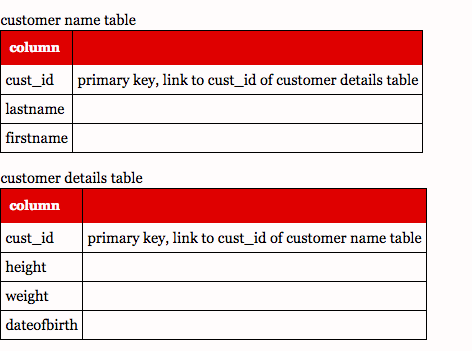
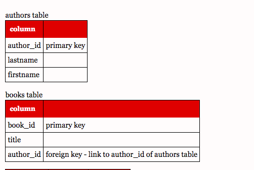
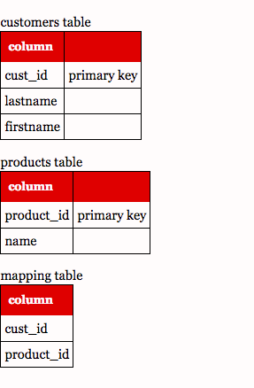

# one to one, many to one and many to many

Created: 2017-05-07 17:17:48 -0600

Modified: 2017-05-07 17:22:23 -0600

---

{width="4.90625in" height="3.65625in"}

{width="5.0in" height="3.3541666666666665in"}

{width="2.9791666666666665in" height="4.5625in"}

