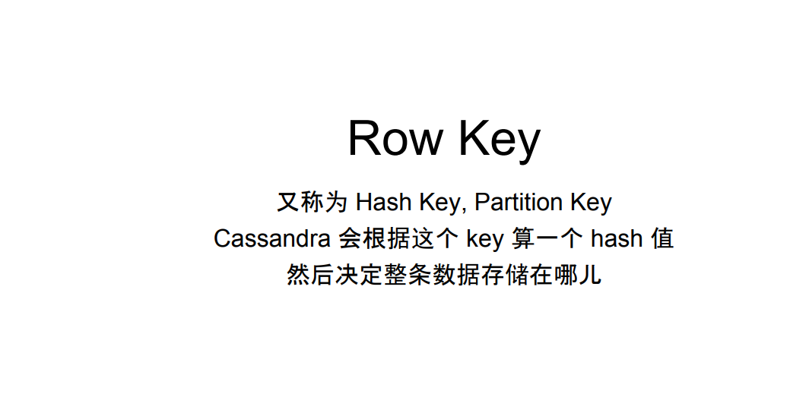

# Cassandra  9chapter

Created: 2017-09-24 17:23:15 -0600

Modified: 2017-09-24 17:26:28 -0600

---

{width="5.0in" height="2.6354166666666665in"}

{width="5.0in" height="2.59375in"}

{width="5.0in" height="2.3333333333333335in"}

{width="5.0in" height="1.21875in"}

{width="5.0in" height="2.53125in"}

{width="5.0in" height="2.4895833333333335in"}

