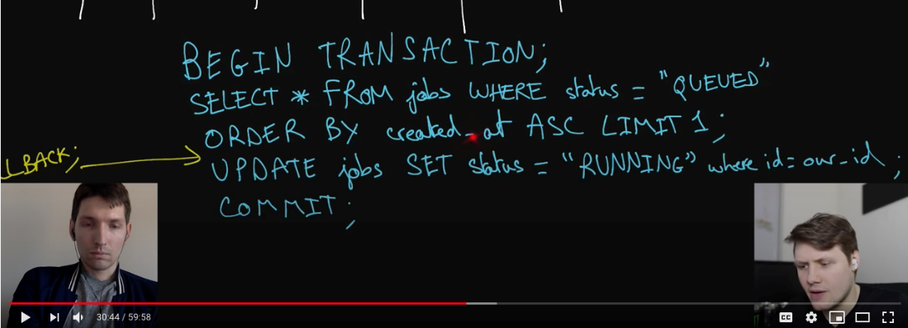

# Code deployment system 

---

[Google Systems Design Interview With An Ex-Googler](https://www.youtube.com/watch?v=q0KGYwNbf-0&t=3s)

interviewer: I want you to design a global and fast code deployment system

a global and fast code deployment system

From past experience with code deployment systems a code deployment

system [can have a few different things going on]{.mark} first of all a code deployment

system might involve like 1. building code into you know binaries, like pieces of

data the compiled code, 2. [it might involve]{.mark} testing code [these two things might]{.mark}

[happen]{.mark} when you're submitting code for code review, when you are actually

merging that code into some central code base, when you're in the process of

deploying the code so my question is [what part of the deployment pipeline are]{.mark}

[we actually building here]{.mark} are we doing both building and testing are we doing

something else

so I'd like you to design a system that takes the code, builds it into a binary as you said and deploys the result globally in an efficient way, and in a way that's also scalable

but that being said I don't want you to worry about any of the testing for this code we can assume that's already covered

clarify again what part of the software development lifecycle so to speak is this happening at like is this when code has been merged into the central code base

yeah so once the code is merged to either a master branch or the trunk, the repository, we want engineers to be able to like three UI ~~or CLI~~ we want them to be able to trigger build and then trigger a deployment for that build, and so the code you can assume is already reviewed and ready to ship to production.

but so to clarify you are not designing the system that handles submitting code and reviewing that code

okay so, basically what we're doing is we're taking code that is presumably shippable, and we are trying to ship it to production by sending it to all of our application servers around the world

[let me write that down]{.mark} actually let me write these two things down we are number one building code, and then no 2 we are deploying that code

I guess my next question has to do with what you just said or what I just tend to that here the global thing, the global aspect of this system , [are we like the machines that we are deploying this code to are they located ,all over the world or are they located only in some parts of the]{.mark}

[world]{.mark}

right so I'd like [you to design a system that scales to the entire world,]{.mark} but so for I guess simplicity's sake we can just assume there's five or ten different regions with hundreds of

thousands of machines sprout throughout those five or ten region

okay so I'll put five to ten five to ten regions ,globally and oh you said that

they can be biggest basically spread out across the world

then we have hundreds of thousands, okay so hundred K's of machines that were deploying this code

[I guess this is an internal system because we are we're doing this on behalf of the of the company or of the engineers]{.mark}

interviewer : it is an internal system only the engineers they're deploying code will actually be interacting with it

[okay does that mean that as far as availability is concerned? like do we are we okay with failures in the deployments ? how long do we want these deployment to take, and the reason I'm asking this is because like you know , when we deal with internal systems sometimes we were ok with a little bit less availability than the external systems, but I just want to make sure]{.mark}

so even though it's an internal system, is this kind of a special case as far as they go

interviewer: ok we still want to have these in availability specifically because a lot

of outages in large companies ,most outages I would even say are resolved by

fixing the bug and rolling forward or rolling back a particular deployment and so that the system that you're designing has to be available in order to kind of be used as a response to certain outages

in terms of the build pipeline, I want like I'd like every build to eventually reach a terminal state so either failed or succeeded and then once in terms of timing once a build is done

we want that to be shippable to all machines within 30 minutes

[ok within 30 minutes so just to clarify with regards to the availability are we still okay]{.mark}

[with something like you know two to three nines of availability meaning]{.mark}

[anywhere between half a day and three days of downtime per year or are we]{.mark}

[shooting for something a little bit more you know extremely highly available system]{.mark}

truly for this question let's just say two to three nines is perfectly

[fine okay then the reason I'm asking this business is because I want]{.mark}

[to make sure to know if I have to optimize for that way]{.mark}

as we'll see when we get into the actual implementation of the design but I'll write that down then: two to three nines of availability and, we said 30 minutes for a deploy

here just to confirm it's basically the entire process of taking code building it into a binary ,and deploying it to the hundreds of thousands of machines across the ten regions that's or take 30 minutes

[I guess the final couple of questions that I have here are, how often are we going to]{.mark}

[be deploying code]{.mark} and [how big are these binaries that we're gonna be getting,]{.mark}

[how big are they gonna be like, what's the biggest size we could have for one]{.mark}

right so you can imagine that a large company, you're gonna have a lot of different

engineering teams working on say, hundreds of different services or web applications and they'll be building and deploying things in total thousands of times a day, and the final builds depending on what it is could reach up to 10 gigabytes for this particular

system okay however so that being said I don't want you to worry about what language these apps are written in or how they're compiled you can just assume, that like the internal process for building a binary is kind of taken care of, and your whole system can be agnostic to the specific technology that you're building

okay so that actually simplifies part of the building of the binaries a little bit, but you said we are gonna be deploying though 10,000 times per day , I say deploy

I'm really also counting the building of the code and then you said that we might have files that are up to 10 gigabytes okay

so I think I have a general idea of what system we're designing here what I've written down basically are the main like system requirements or system restrictions

[to be honest I think that we can we can design this system in two main parts, because the two things that we mentioned at the beginning get building code and deploying code ,these actually seem like the two clear parts of the system, the two subsystems of the system, so I'm actually thinking of approaching this problem ,like that by first designing the system to build the code and then designing the system to deploy the code ,does that seem like a sensible strategy]{.mark}

yeah let's let's get to the part 1 Building Code

[so I'm trying to think first of all to maybe I guess this is one more question I should ask trying to get a clearer sense of how this system is gonna to actually flow]{.mark}

is the idea that engineers write code they commit code to the code base ,so you have a commit that might have like a SHA or something that points to it (the changes) and these commits once they get merged into master or their commits that we're gonna use to, actually you know build into binaries ,is that the idea

(**SHA**" stands for Simple Hashing Algorithm. The checksum is the result of combining all the changes in the**commit**and feeding them to an algorithm that generates these 40-character strings. A checksum uniquely identifies a**commit)**

you can refer to a specific version of the code that you're building through the SHA that commit

I think then the idea that I have for building the code is, some kind of queuing mechanism

where you have commits that come in, as engineers are pushing code up and merging it into the master branch, and as these commits come in, you create what I'm gonna call like jobs, a job of building the code out of the commit, and or building the binary rather

the idea is yeah you queue these jobs one after another ,and then you've, got you know a set of servers which I like to call a pool of workers that are gonna take these jobs off the queue , in a queue is know first-in first-out, the first commit to get into the queue is gonna be the first job related to it that builds the code, ~~and gets taken by some server that gets built into a binary~~ , and then you have the binary

~~this kind of makes sense, yeah but so where once that binary is built on the worker, yeah would you just leave it there like what what do you know what to do with that~~

no the idea would be like once you've got a binary ,that's built and store it into storage and you're gonna want these binaries for a long time ,it's not forever so you store them in storage I'm thinking a blob store, like Google Cloud Storage , would be good because a binary is just like this opaque blob of data, I think it very sensible a database for that, but

yeah you would basically store the binary in a blob store

~~okay so that's for final storage , now I do have another question about your queue ,so I think a queue makes perfect sense, queue it should be kind of first-come, first-served, if possible someone triggers a build first should get it running first , but that being said how do you plan on implementing the queue itself , what is backing your that like queue data structure that you're talking about~~

yeah so I guess just to get a clear picture of what I'm doing here, because I've got an idea

that's popping in my mind, but I'm not sure if it's if it's maybe a little bit too trivial or too naive but let me just write down this system

so give myself a bit of space we've got this queue here right, and I'll draw this as a directed

arrow for the sake of the example, [but you've got this queue and you've got a bunch of servers right that take jobs off the queue, and the server's then you run these jobs they build the code into binaries, and then they store the binaries and to let's say you know one blob source is gonna be GCS Google Cloud Storage , just because I'm familiar with this one]{.mark}

that would be the system now how the queue is structured or is

implemented rather I guess like the idea that comes to mind at first is just to do this very simply you know implement a queue just ~~as you would in an axle code like an encoding interview for instance you have a data structure~~ that you store in memory on some server and you have your jobs stored in that queue in memory

the only thing about that is that like if your server goes down you lose all the state for all your all of your jobs and from past experience , with code deployment systems typically we want if you want to have all historical builds or jobs like what their status is you don't want to lose that state right

let me actually add that as a requirement, okay we do want to persist kind of the historical statuses of all the builds that we've had and the fervor for potentially a very long time, ~~so memories is definitely not the kind of medium we want for that~~

~~ok so then in that case this makes sense and it confirms the doubts that I had and ,then you know the idea of like trying to optimize this in memory queue structure seems not correct so~~

I'm thinking that we might be able to use a sql database for the queue, because we want

persistent storages, we want that that queue or the past jobs to always be there and I'm thinking a sql database , if you take a sql table, write a table could actually be our queue like a the table, could represent for to where every job is stored in that table, so every record, every row in the table is a job, and you would take jobs off the queue by looking at the table, and doing some sort of logic to find which one should be de-queue next

~~okay make sense um yeah so let's dive a little deeper in that, all right sql, can you give me an idea as to what the table will actually look like ,what columns that table would have and as well as what each column would represent, and how you use these you know DQ~~

~~operation sure~~

we've got the queue , you've got servers or workers that are taking stuff off the queue and storing ends ,[yes maybe by the way I'll add just a few arrows here to show that]{.mark} they're storing the binaries in Google file system, but if we look if we zoom into this queue ,this is actually a sql database or a sql table ,an actual table

table would be called let's say jobs, okay cuz it stores all the jobs, maybe you could be called like job queue and, the idea is let's see we would have what types of columns what we have is we want to store the some name for the job , right this might be like the some auto-generated ID, that would be maybe the first column

so let me actually write that down, let me start writing that down

we have a bunch of columns and the every row is a job the, 1. first one is ID this is the job name this is some arbitrary name 2. then we've got I guess we are creating binaries out of these jobs ,so we need these binaries to be referenceable, and we need these binaries I think you know we're gonna store them in in GFS, they're gonna have a name so we'll have a [name]{.mark} here for the binaries, and 3. this might be something that we specifically like create based on some pattern or some rules that we might have 4. that we want is we're definitely gonna want it like the time at which the job was created, ~~this would be based off of like if we want to design our system such that it pulls any commits that has been like or it creates a job out of any commit that has just been merged in the master branch~~

5.then we could have a commit SHA stored in one column and 6.we could have the create the creation time or created at a time a timestamp, . 7.in one of the in another column that would be basically the time when that code was submitted to master branch does that make sense, yeah or the time at which the build was

where the build was and queued , yes or the time when the build was there and, ~~so I guess here the idea would be um we would put you know commit, so I'll just write SHA and here then I would put created at created at and this would be a time stamp in SQL, and the~~

8, final column because I do we do need another column which is it might be the most important one would be the status of the jobs, because we're dealing with these jobs that we're trying to create binaries out of code, and at the beginning you said we want a clear end state, if code has been successfully built or SHA unsuccessfully built yeah,

so yeah we basically need a status, so I'm gonna put this here as a status and I think this should be like an enum, where we can have you know succeeded we can have failed, we can have I would have, we need to have running to know if the job is running, and this would be for our servers, our workers to know if they have to like can they can they DQ this job right

yeah they don't want to thank you it and then finally

there would be a queue status like is the job like they're available but not running ,and certainly not succeeded or failed and I guess like are there any are there any other statuses

now the more that I think of it looking at this table is that we not only have the queue very very clearly structured here, we've got this table of jobs right, but the way the queue mechanism comes into comes to fruition, so to speak once you look at

the "created at column" and "status column" , if they could see if a job is queued not running not succeeded, not failed ,but queued and has the oldest created at time stamped, meaning is the first job ,~~the first queued job of all the stored queue jobs to,~~

~~have been~~ added to the queue, ~~to the table sure~~, then that's the next that's that we want one of our workers to take DQ and start building

given the fact that you're gonna have multiple workers, do you like how do you plan on having this queue data structure be concurrency safer, your solution right now to use SQL good given the concurrency

you're saying basically you have let's say a hundred workers at once, and I guess we'll look we'll try to estimate maybe a bit later, like how many workers, we would need but let's say we have a hundred workers that are all looking for a job to DQ and to just our building in this database ,[the fact that it's the SQL database, it would basically have acid transactions ACID transactions, are key here acid transactions are gonna be key to having or hundreds of workers be able to go into this database and perform updates or reads in this database all at once without worrying about concurrency issues, because transactions would be executed as if they were you know sequential, and there would be no like problems, there if you want like maybe I should explain like my concept]{.mark}

write the SQL query

I just want to get an idea of the basics sure okay so just to clarify my idea is the way that these workers actually DQ stuff off , the off the queue or out of the table, so to speak they take jobs out of the table, they don't actually take them out of the table they don't delete

them from the table, but they take them from the table is with transactions

the idea would be the you know a single worker performs a transaction, that gets all of the all of the jobs that are currently queued meaning not running not failed not succeeded the oldest one, that was created like I just said before, and they update it to running

you know my SQL is a little bit rusty so I hope that I won't make mistakes

I'm a little bit scared if this is gonna be like too much load on the database, but what I'm thinking is we could actually index this database on or this table rather on the "status" and on the "created at" columns does that make sense

just mentioned the load thing I do is, so these workers like when exactly are they executing this DQ operation?

the workers they whenever they're building code, they're building the code, but they are no longer interacting with a table right when they are free, that's when they want to

find jobs let's assume that we had a hundred workers

[( again I'm not sure that's actually accurate ,so maybe after this or ask her we finished like this simple design, we can try to estimate how many workers we would have)]{.mark}

but if we do have a hundred right, you know every 5 seconds they're trying to go to this table and they're trying to perform that transaction, that means that per second you would have 20 of these transactions happening ,you know 20 reads, potentially 20 updates and that's really in the worst case when they're all like cutting it at once, maybe there are no jobs right now available, no jobs that have been queued , so they keep doing that

that's very handleable for a SQL database

Interviewer: I do have one question about this okay I don't think you've addressed ,the really bad failure case of failure like you have a worker that's currently building the code, and power goes off or it shuts down or I guess Network partitioned that job will remain in a running state basically forever, you have nothing that's monitoring the running jobs to make sure that they eventually finish

yeah so yeah okay I

see what you mean so you're B you're

basically saying like if you have a

worker that is currently building code

but something something something fails

not in building the code the building

code status didn't

we get changed to failed its the server

the worker that died yeah okay so that

is a problem because we don't want is

what would happen I guess here you would

have a job that would be running

perpetually right yeah yeah yeah we

don't know it would just be lost we we

don't really know the status because the

worker just died in the middle of it and

when you get to a large enough scale and

even if you have a hundred workers and

say the builds take like 15 minutes yeah

that has that's gonna happen pretty

frequently so we need to really take

that into account

okay well so in that case the ,first thing that comes to mind is like some sort of health check that you want to perform, to use for you mentioned the word monitoring, ~~if you're trying to monitor the status ,I'm here and I'm not having about the job status, I'm talking about the building status ,the workers status,~~ you want to perform some kind o health check ~~now the thing is who is performing the health check, like you don't want the workers themselves to be checking up on each other, because like what if they all died what if you know half of them died you're not gonna have a stable, like this doesn't seem optimal~~

so I'm actually thinking that you have a fully auxiliary service like a completely separate service, a separate service that okay checks, on the servers, basically like a couple of other servers here that are continuously you know ,checking up on or workers to see you like if they're healthy

interviwer:how would that interact with your with your actual queue, because those workers are those that auxillary service needs to somehow change the state of the queue, because otherwise the job, just the jobs with your stock

I'm thinking is maybe maybe we the workers continuously send their current health status they send a heartbeat, you know like hey I'm still alive ~~and this one only when you are~~

~~running code so rent it but when they~~

~~are not running code running running a~~

~~job when they are building ok um they~~

~~send a heartbeat and where would you I~~

~~guess you could send the heartbeat~~

you can actually like expand the table here, you could have another column that has

last heartbeats I'll call it um last heart beat , this is last heartbeat ok and the idea

is this like your workers here ,they Eve a DQ a job off the queue ,they start running code ~~so when they're not running ,the solvers are not running code, when you're not running the~~

~~job, but they aren't you performing these heartbeats or we're not thinking about these health checks,~~ but when they are running a job they start performing these health check-ups by sending hard beats to the queue ,so basically like they I'll put them like in dotted lines, but they send hard beats to the queue, to the jobs table, let's say I don't know every

we said a job takes how long 15 minutes on average or at most then every 3 to 5 minutes you know, ~~if you and you couldn't change that according to how you want your system~~ and so they send it last heartbeat which we store it's basically an update to the database, you update it in the row of the job that the worker is running

this service (health check service) here ,we don't actually monitoring the workers you actually monitored, you continuously pull the job table and you checked like :hey when

was the last heartbeat, I guess what do you do you get all the jobs that are running not those failed, job not succeeded, not queued, all the running job you checked the last heartbeat and if the worker for that job has not sent a heartbeat in, but you know past a certain period of time so basically like let's say if the heartbeat is every 3 to 5 minutes, then every ten minutes you double the heartbeat ,maybe because you need a margin of error

they cannot expect the heartbeat to come exactly at the second every time

the query will be

(select all from jobs where the status is running you do a little thing where the last heartbeat is less than you know like the current time , you know two or three heartbeat

durations ,for the margin of error ,and yeah if you found one then you updated back to queue, that it does goes back to the queue, and since it still has the created at timestamp

that's like whatever the original timestamp )

38''

let's try to estimate how many workers were actually going to be needing here

so I gave some numbers earlier thousands of builds and on average 15 minutes of build so how many workers is that going

to look like for us

yeah so thousands of builds per day, can we can we ask me like 5,000 10,000

yeah let's say 5,000 okay so in middle, we said a worker can do takes roughly 15 minutes for a buildable yeah

for builds an hour so there are 24 hours in a day, 96 so let's round it up to 100 builds a day, th

single worker could do right so a hundred builds per day per worker per

like estimating that every build takes as long as possible which is roughly 15 minutes so then we do 5,000 divided by 100 so have 50 so actually I think the hundred be a hundred before the under the estimation of a hundred workers before

it wasn't so do keep in mind though that the number 5,000 build today it's

not uniformly distributed ,right you're gonna have ups and valleys there,

because you're thinking back to like your past experiences that I've had with code deployment systems if you had a large tech company, you're gonna have certain hours of the day like in the early afternoon Mountainview time for instance ,if we're talking about Google where you have the majority of the engineer is like running through you somemain code and running builds so writing job

[so yeah I think that the point here to make is that this design here is super horizontally scalable we have we start with 50 workers on average, but if we need more workers during peak hours we just add more workers ,if we need fewer during off-peak hours just remove more workers or remove workers and also we can even scale this vertically]{.mark}, if need

be like if we can get more powerful machines to have that build time go down from 15 minutes to 10 minutes, then great, but the horizontal scalability is like the key thing here

~~we have we have the binary right yep what do you what do you do once the actual like internal build step finishes, that command that compilation finishes~~

yeah so so the 15 minutes elapse here, roughly speaking and we have

successfully built the binary ~~we said~~

~~that we don't care about the~~

~~implementation details like how to build~~

~~the binary how to how to compile the~~

~~code right yeah okay~~

an~~d I guess so sorry interested - super quick tangent because see ,we're getting to the point where we store in in our blob store in GFS here, but because before we get to that do we have to worry because we are dealing with source code , we have the saw of the~~

commits that we are building and yeah

we're gonna have to download that source

code let's say we have 50 no case with

50 workers even a 100 workers at once I

have to download every build you know

like what did we say 100 builds per day

per worker or 5,000 builds this fine

that's gonna be really fast to download

the source code so I'm not super worried

about that yeah and even if you have a

lot of source code right like those

really large companies usually the

version control systems will allow you

to get incremental patches so each

worker could for example clone the

entire source code when it comes up and

then just before I rebuild it just

applies the incremental patches

okay so

that that's like not that's not all an

issue okay but then but then to your

question that you were asking you for

yes I'm sorry for that tangent but you -

the first question is like once we're

done with that since we clearly this is

no longer a problem

we can store the succeeded build or the succeeded binary into our blob store inside GFS, and once that's done because you know there might be an issue with the blob store so we

don't want to eager we update the table, but once it is successful we've written

to the blob store then we can update the status to succeeded and we're done at that point

yeah cool yeah that's exactly what I was

looking for that watering is is actually

important yeah waiting for the you know

a successful bill to not have been

persisted yes yeah

interviewer: I do have another question we so I mentioned earlier we have five to ten regions right now but you only really mentioned a single blob store or a single bucket of GCS, how does that story change when you take into account the fact that that those builds will have to be eventually deployed worldwide

so let's see because you're basically saying we don't we might not want to have a single blob store that is catering to all regions because that would be that would be like if we've got hundreds of thousands of machines all trying to like download the same file from the blob store, that would be suboptimal

it's not really feasible for a single blob store in a single reagent to serve everything , so I think this is where we start to spill into that second part of the system that I would, that I mentioned the deployment system, I guess it's kind of like a bridge between the building

and the deployment

~~I think that for so we should take advantage of the fact that, we have these regions because we're catering to a lot of machines globally, but at least we have these regions that we can maybe use to basically split up our system to make it has smaller subsystems so what I'm thinking is we can actually have regional clusters, like regional systems~~

~~in the sense regional subsystems that are gonna handle the final part of deployment and~~

the idea with that is that if we have regional clusters, we could have actually regional

buckets like regional GCS buckets which are [basically the idea is like you replicate the binary that you have in your main blob store here ,you replicate it across all the regions]{.mark} that have their own special blob store or buckets that's catering to them, ~~and then you have a better system from that point of view does that make~~

~~sense yeah because you would be like if, we have ten regions you'd be replicating that build ten times yes to the ten~~

~~regions and~~ then these regions would these regional buckets would serve their own regions, examine with there are hundreds of thousands of machines ,~~exactly so so just to try it out if the~~

~~idea would be you have one two three~~

~~let's go with five four now four five~~

~~five regions these are all the regional~~

~~buckets or regional blob stores whatever~~

~~you want to call them and I guess let me~~

~~think~~

~~when you we said here~~ we only want to update the table when the write to the

main blob store like succeeds, I don't think we need to do that for the others, in other words like we don't want workers to be blocked because of replicating data from this blob store to all the other regional buckets, so main blob store succeeds the worker is released ,so to speak to the worker can update the table and then go back to running another job ,and then we have some asynchronous replication here between you know this main blob store and all of the regional buckets

~~yeah that's what I would do and then I~~

~~am thinking that you know once you do~~

~~then you start to get ready for the~~

~~deployment system and so here are you~~

~~okay if I move forward with the~~

interviewer: ~~deployment system I'm so~~ there is one more thing I guess a requirement I didn't mention before, but we'd like to only allow deployments of builds that have already been replicated everywhere are to all of these regional buckets how would you enforce that, how do you actually figure out, how do you keep track of which region has or which build is already replicated and which one isn't yet?

~~is the is the idea behind that that if you have some kind of like internal UI, user interface where an engineer can deploy a build you know, they press a button and deploy~~

~~you want that build to actually be deployable to all the regions, if they're all relying on their regional bucket is that the idea?~~

yep yeah yeah um

well so this is where maybe now I'm

having second thoughts like maybe maybe

it doesn't make sense to have our

workers um you know wait for all the but

no cuz then their workers get stuck like

we do want this we want this part of the

system to be optimized we don't want our

workers yeah yeah what would you have

yeah we don't want our workers -

we don't want our workers to be in charge of like the replication status so to speak

of the build , I feel like a separate system might work better,

we could just have a completely separate service, I'll write it all right it may be like in blue

rectangles ~~it really doesn't differentiate~~ ,[it and this service basically checks the replication status of the binary, it's like this service ,the service basically pulls the main blob store and says hey yeah I see a new binary in there, let me check continuously all of the regional buckets see if they have that binary and until they do that binary is not ready to be deployed or that build is not ready to be deployed]{.mark} , but ~~once I've aggregated the binaries or seen rather that~~ the binary has been replicated across all regions, then I you know we're ready the build is deployable, so this would be this would basically be pulling all of the

regional buckets and it would be storing in a database, I have a database down here and this database would be you have the build name and replication status

~~we can know so the user the engineer or the UI can know whether a build is actually deployable, because it was replicated or not exactly, and then and then the UI can you know depending on how you want to build that either you I can literally rely on an API that uses this database the UI can either so just builds that deployed or it can show all builds and gray out the ones that aren't deployable at you can do this~~

interviewer: I think we can move on to I know you're eager to ,we can move on to how things actually get deployed

talking about that a second ago so let's see an engineer presses a button, ~~they press a button again see thinking back to experiences~~ I've had with code deployment systems sometimes you will have a button that literally allows you to deploy build, what happens there you will you suddenly want in basically less than 120 minutes, because we said the

build takes 15 minutes the replication, here takes five minutes maybe so, in about 10 minutes you want that build, which is essentially a 10 gigabyte file to be replicate, or not replicated to be downloaded to be spread to ~~thousand roots nodes of thousands so where may be entering~~ millions of machines, if we've got 10 regions,

~~so we can't we can't just do like a naive thing where the machines you know hundreds of machines even if we've divided our regional clusters with their own buckets that serve the~~

~~machines you can't have a hundred machines downloading one by one a 10 gigabyte file even on the best network or 100,000 machines you~~

~~yeah hundred thousand that's yeah so so it seems unreasonable it seems unreasonable so~~

I guess my thought here is that this seems to lend itself perfectly to peer to peer network where you have the machines like ~~you of your~~ hundreds of thousands of machines, they are all they all pertain to a region, right they are all so sort of part of a regional cluster and all the machines in one regional cluster our peers and peer to peer network, and through the peer-to-peer network they can actually download this time to you by binary or these multiple 10 gigabyte binaries ,repeatedly throughout the day ,very fast this will speed up our system, much faster and will actually be able to reach that 30 minute mark

is that yeah yeah yeah peer to peer is is exactly the

right solution here and it is how large

companies end up doing it okay but so

now

interviewer: can you walk me through what happens when an engineer presses deploy build be one let's say there's a build called be one deploy B1, globally what what exactly happens that triggers all these machines in those clusters to download the binary and run

~~I'm gonna just add a few things to this design here or to the drawing of the designer for each regional cluster, and I'm grouping them by these um these buckets here these regional buckets, we've got a bunch of machines and these are gonna be peers in some peer to peer~~

you've got some engineer in let's say you know Mountain View the west coast or wherever in your company that's pressing a button on the UI, so let's say the UI is here this is the

button that they press and maybe this goes to a server that kind of like triggers everything ,triggers the whole deployment ,you suddenly want all of these peers to know that they can start downloading a binary , then another engineer immediately presses another button to start another deployment , right as you might have with multiple builds,

one after the other I'm thinking like what might make the most sense here is

like a structure or a design where you have a single at any given point in time

[you had a target build,]{.mark} ~~you have a kind of a goal state right where you say okay I press build b12~~

~~deploy build b1 is now the target state~~

~~it is now~~

the target build and either goal state the goals yes and its appear in the peer-to-peer network where a machine sees that they immediately say okay I have a new goal state this is not the current build that I'm running or that I've downloaded last or whatever, so I need to start downloading it from the peer-to-peer network

the only thing

is here yeah it's like do we want this

to happen this can't happen like you

says we've been taking advantage of this

whole regional architecture we don't

want this to be we don't want this goal

state to only live on one server you

know here globally so I think we should

make use of the of the regional

architecture that we've designed and and

design it using that so the idea would

be okay engineer presses a button right

yeah this updates the goal state and

okay the goal State what do you where do

you keep the goal state yeah I love

let's see we're talking literally a key value pair that sure current build b1, so I think we can have actually you know our system probably has some configuration in place ,writes our system, here probably has [we can have a key value store that stores this configuration]{.mark} for our system as a whole or parts of our system and here one of the configuration parameters would be the build version, so here we can have a key value store like ~~at CD or~~ zookeeper that stores our configurations

it all right in blue to represent the key value store and here you have build version B underscore v for build version, which points to let's say b1 and, if the engineer press is another button for b2 then this gets updated to b2, but

then look at the idea just as I just mentioned about like taking advantage of the regional stuff , you probably have a key value store at the regional level, so every KVS for key value stores, hoping KVS every region has a KVS, KBS's are actually pulling the global key value store and they watch for changes to B1, one like here let's say they're all on build b1 and suddenly this gets updated to B2, right yeah they are all pulling this key value

store, pulling let's say every five seconds or every one minute or whatever and they

see oh there's been a change so they update themselves to now have build b2 ,and then all the peers at the regional level or all the machines, the end machines ,the target machines they when they finished downloading a build, when they're kind of like at steady-state so to speak ,they pull their own regional KV store and, they look if the kV score holds a build that's different than the one that they're currently running or that they've last downloaded or what have you and if they see a change ,then they start the peer-to-peer network ~~that's funny~~

~~idiomatic~~ they start downloading the file the binary through the peer-to-peer network and yeah there you go that can be done like repeatedly throughout the day yeah

like I said before I do think that I'm pretty satisfied with this design because I think that it's

scalable and it's kind of flexible like here with our workers we said it was very horizontally scalable

I'm sure that here we can take advantage even further of our regional architecture so yeah

yeah this is definitely great thanks

Clement okay awesome thank you so much

so that's the full interview if you made

it this far you're probably either

preparing for your systems design

interviews in which case best of luck

checkout systems expert i/o if you

haven't already or maybe you just find

this really interesting

in which case awesome I hope you did

find it interesting and with that don't

forget to smash the like button

subscribe to the channel if you haven't

already and I'll see you in the next

video

