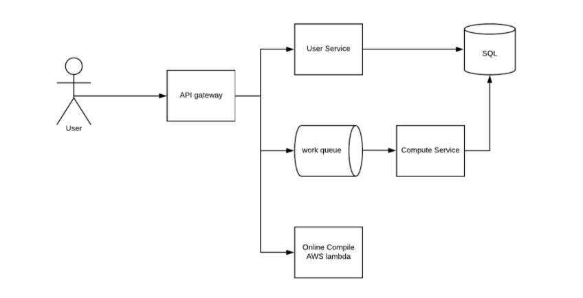

# Leetcode 

Created: 2020-12-01 13:07:34 -0600

Modified: 2020-12-29 23:46:02 -0600

---

{width="10.083333333333334in" height="5.197916666666667in"}

{width="10.083333333333334in" height="9.114583333333334in"}

![Database User table: SQL Id uuid User scott Creation 214145 password hashed Membership expiration 12435 payment Credit card Additional metadata Location, github link, linkedin etc Need a session table Submission table: (Sql row size is 8kb. Code can't be store directly here) Mongo document size is 16MB, better not store the state [runtime stats with the code. Id User Sub Code sess Id mit ts id langu age proble STATE m id 124 uuid 214 Codei Java Java d Runtime metrics Run time I memory consumption • State could be one of {submitted, running, success, error, aborted} ](../../media/Example-Leetcode-Leetcode-image3.png){width="10.083333333333334in" height="6.416666666666667in"}

{width="10.083333333333334in" height="3.0729166666666665in"}

static content to CDN or blob storage and put those spereratley into different region

DNS load balance will rediretct to different request to different region

API load balance will direct the request base one the path base

we will store the question to sql database and add the cache for low latency

when user submit a solution, service will do the sercurity check first, make sure the code dones't access any databse resoure or do any sql injection..

push that code to message queue, on the other side there are shold a cluster of worker wait there, subscribe the topic and run the code in the computer service

after get the resut, worker will update the sumbittion table and update result the page

notice: 1. Sql each column row <8k, each message should <20k

we also a rate limit one the client side and API service site to make sure user cannot re-submit the code too often

the code execution service should be in the different docker node

