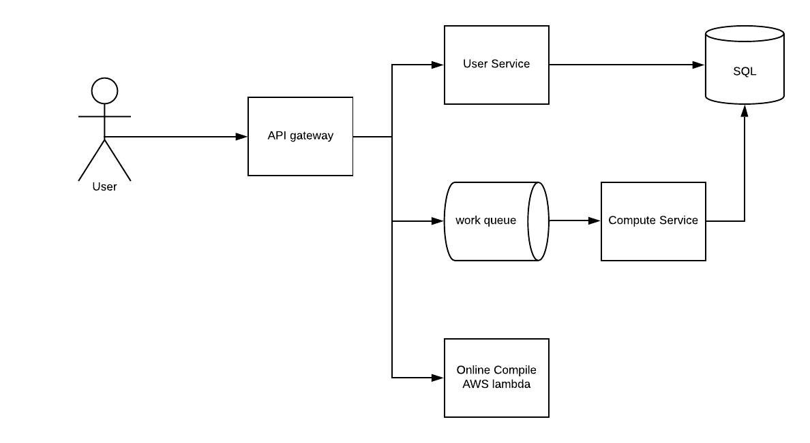

# Summary 

Created: 2020-12-02 11:34:30 -0600

Modified: 2021-01-21 18:24:29 -0600

---

Design Leetcode

- User could view a list of problems
- User could select language of his choice and submit code
- User receive proper error code upon failures
- User could define the input cases and expected outcomes.
- User could view past submissions
- User could view runtime distribution
- New! User could debug the code in the console.

10 mins: Business (Use Cases)/common sense

10 mins: Constraints

10 mins: Architecture

10 mins: API Design

10 mins: DB choice

10 mins: Data model

Conflicts in the system design articles:

- Fundamental not working
- A working solution but may not be optimal

Goal:

- High scalable in scale
- High available

Not in discussion:

- Server side oAuth2
- Server side throttle
- Comments

Constraints:

- Capped at 200ms / 200MB
- [CPU bounded system.]{.mark} For this system, all the heavy part is on the CPU
- 100k daily users
- 10 submission per user
- 1m submission / day ( 1m* 10) -> 200,000s computing time per day (0.2s *10m/86300 ) = 3 dockers/VM. Considering peak to normal ratio as 3 then, we need 6 - 9 dockers during peak time.

Architecture

{width="12.4375in" height="6.833333333333333in"}

For API gateway

All requests go through API gateway, API gateway will do rate limiting and OAuth checks. It will also load balance the requests to the same services.

- No single point of failure, all modules have > 2 nodes.

- User service and Compute service are stateless. Should able to add or reduce node base on the request

- API gateway may contain active user token. If the API gateway or in memory database is down, users may be forced to re login. Token lookup could be done as a look aside in-memory database as well(redis or memcache).

API gateway has a backup gateway, if the activity gateway down, the backup gateway will replace the old gateway

- [Online compile]{.mark} is just submitting complete code including wrapper code to a serverless node, like AWS lambda. However this could be done by webassembly and compute in the browser instead. (don't need update database, just tell user this code has complier error or not, when user submit the code, code should compiler and run in the docker/VM )

[can complier other code to web assembly code and run this web assembly code directly, in Brower IDE]{.mark}

- [The data is very much smaller compared to other services]{.mark} we defined in the past, using a SQL with backup should address all the requirements.

- Compute service is the heavy lifting part (submit code, run code) , using worker pool and async processing to decouple with work load bursts. [Put a limit on code size]{.mark} and whole customized code could be put in the message(<20k max message size)

After push the code to work queue, the client will get a submission id

And client will Let user 10 or 15 second check service for the result

- User service could be further broken down to micro services. For simplicity, we keep it as one for now.

- Security check is critical for the site. No file / database / network / socket access should be granted for any user submitted code. Output size should be capped at a certain threshold. Zip bomb? -- a zip file only 5 or 6 k and once unzip, it will increase to 5 or 6 G

- Service logging / metrics / error stack will be needed to monitor the performance.

How to return the result to user

1.  Let user 10 or 15 second check service for the result
2.  HTTP Long polling, service will push the result to user

API

**getProblems(user_token, session_id)**

Return a list of problems titles with markers done or not.

**submitCode(user_token, problem_id, code, language_id, session_id)**

Once code submitted, a submission_id will be returned, the client will poll the result periodically to get the status.

1.  The user submits the source-code to the server (program.cs, main.cpp etc)
2.  The server compiles the code. If it is a compiled language.
3.  The server runs the binary file / interpret source file for N times, where N is the number of tests for each problem. Then it compares the output with the correct output for that specific test case.
4.  [The run is capped at 200ms and 50 MB, further security check may be needed.]{.mark}
5.  The code is run in docker to provide better security, if docker is down, k8s could orchestrate and bring up a new docker node.

**getSubmissions(user_token, optional<problem_id>, session_id)**

Return a submission for a particular problem or all submissions on the website.

**getRuntimeDistribution(user_token, language_id, submission_id)**

Return a distribution of the runtime.

Database

[User table:]{.mark} SQL

| Id | User | Creation | password | Membership expiration | payment | Additional metadata |
|-------|-------|-----------|------------|---------------|-----------|------------|
| uuid | scott | 214145 | hashed | 12435 | Credit card | Location, github link, linkedin etc |

Need a session table

[Submission table:]{.mark} ([Sql row size is 8kb]{.mark}. Code can't be store directly here)

Code can store in object database S3 and Mongo

Better not store the code in the filesystem directly

Mongo document size is 16MB, better not store the state /runtime stats with the code in Mongo

| Id | User Id | Submit ts | Code | sess id | language | problem_id | STATE | Runtime metrics |
|----|------|--------|--------|------|----------|-----------|--------|-------------|
|  | uuid | 214 | Codeid | Java | Java | 124 |  | Run time / memory consumption |

- State could be one of {submitted, running, success, error, aborted}
- Runtime stats could be generated by a separate process periodically.

[Problem table:]{.mark}

| Id | creator | Creation | title | description | Input & output | Additional metadata |
|-------|----------|-----------|---------|--------------|----------|--------------|
| uuid | scott | 214145 | Linked list | [Description id]{.mark} | Io id | Accepted, submission id. |

Input & output, code and problem description store in either document db or object db.

