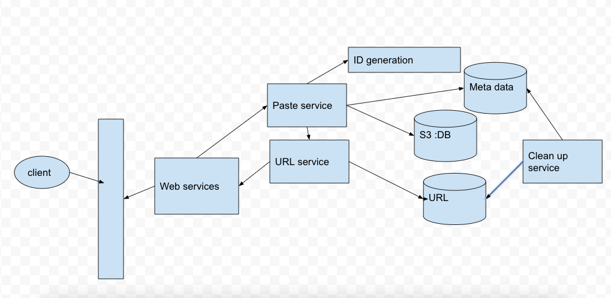

# Designing Pastebin

Created: 2021-01-31 23:43:19 -0600

Modified: 2021-02-01 17:56:49 -0600

---

1.  Function

Users should be able to upload or "paste" their data and get a unique URL to access it.

Users will only be able to upload text.

Data and links will expire after a specific timespan automatically; users should also be able to specify expiration time.

2.  Non function

High available

Low latency

Post paste

API

addPaste( apikey, raw data, create time ,expire_date)

Getpaste(apikey, url)

Need shorted url ?

Database schema

User table:

User id ..

[Paste table :]{.mark}

short URL(reverse order) --- sharding

Paste id --- sort key

User id ---

Expiration_time

Last_update_time

{width="5.0in" height="2.4375in"}

